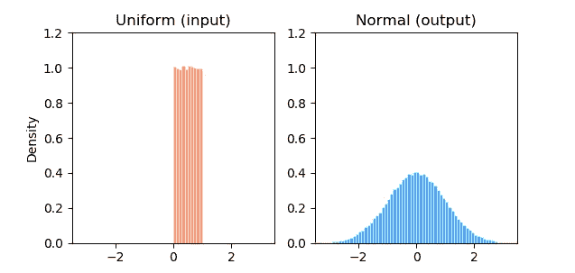
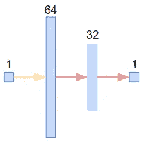
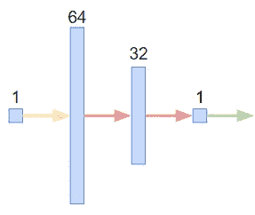
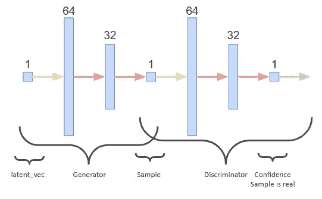
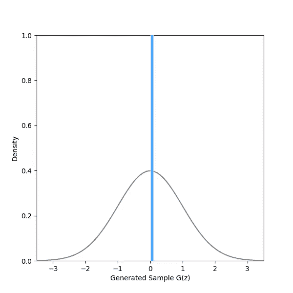
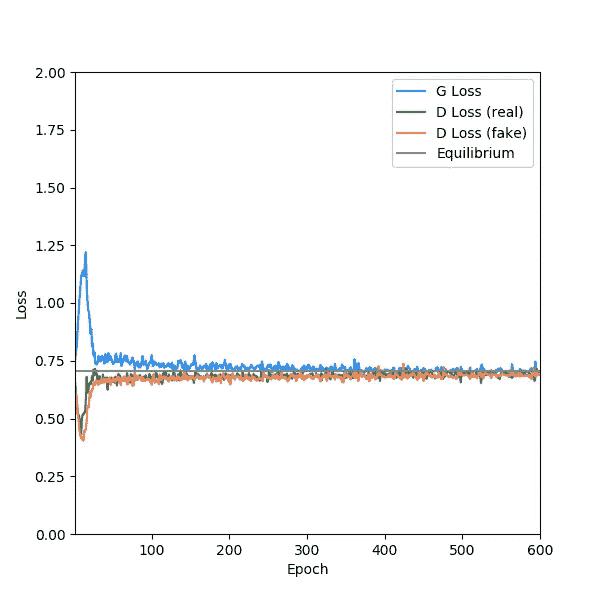

# PyTorch 和 GANs:微型教程

> 原文：<https://towardsdatascience.com/pytorch-and-gans-a-micro-tutorial-804855817a6b?source=collection_archive---------28----------------------->

## 在 PyTorch 建造最简单的 GANs


图片来源: [Pixabay](https://pixabay.com/photos/lamp-oil-lamp-nostalgia-old-2903830/)

在[tensor flow](/training-a-gan-to-sample-from-the-normal-distribution-4095a11e78de)/[Keras](/this-will-change-the-way-you-look-at-gans-9992af250454)中花了很长时间[制作](/autoencoding-generative-adversarial-networks-16082512b583) [GANs](/why-do-gans-need-so-much-noise-1eae6c0fb177) [。太久了，说实话，因为改变很难。这需要一些说服，但我最终咬紧牙关，并交换到 PyTorch。不幸的是，我遇到的大多数 PyTorch GAN 教程都过于复杂，更多地关注 GAN 理论而不是应用，或者奇怪地不和谐。为了补救这一点，我写了这个用 PyTorch 制作香草 GAN 的微型教程，重点是 PyTorch。代码本身可以在这里](/gans-and-inefficient-mappings-f185fdd62a78)[获得](https://github.com/ConorLazarou/pytorch-generative-models/blob/master/GAN/vanilla_GAN/vanilla_GAN.py)(注意 github 代码和本教程中的 gists 略有不同)。我建议在两个窗口中打开本教程，一个窗口显示代码，另一个窗口显示解释。

# 要求

1.  Python 3.7 以上版本。再低的话，你就要重构 f 弦了。
2.  PyTorch 1.5 不确定怎么安装？这可能会有所帮助。
3.  你十七八分钟的时间。如果你够聪明的话，可以少到 12 个。

# 手头的任务

> 创建一个函数 G: Z → X 其中 Z~U(0，1)和 X~N(0，1)。

用英语来说，就是“在给定[均匀](https://en.wikipedia.org/wiki/Uniform_distribution_(continuous))随机噪声作为输入的情况下，生成一个近似于[正态](https://en.wikipedia.org/wiki/Normal_distribution)分布的 GAN”。这意味着 GAN 的输入将是一个单一的数字，输出也是如此。注意，为了简单起见，我们将使用数据生成函数，而不是训练数据集。



图 1:输入“噪声”(左图)和目标输出样本(右图)的分布。

# 让我们开始吧

确保您已经安装了 Python 的正确版本，并安装 PyTorch。然后，创建一个新文件`vanilla_GAN.py`，并添加以下导入:

```
import torch
from torch import nn
import torch.optim as optim
```

我们的 GAN 脚本将有三个组件:一个生成器网络、一个鉴别器网络和 GAN 本身，它容纳并训练这两个网络。让我们从发电机开始:

# 发电机

将以下内容添加到您的脚本中:

我们的生成器类继承自 PyTorch 的`nn.Module`类，它是神经网络模块的基类。简而言之，它告诉 PyTorch“这是一个神经网络”。我们的生成器类有两个方法:

## 发电机。__init__

初始化对象。首先，使用`super`调用`nn.Module` `__init__`方法。然后，它创建子模块(即层)并将它们作为实例变量分配。其中包括:

*   具有输入宽度`latent_dim`和输出宽度 64 的线性(即全连接，即密集)层。
*   具有输入宽度 64 和输出宽度 32 的线性层。
*   输入宽度为 32、输出宽度为 1 的线性图层。
*   LeakyReLU 激活。
*   指定的输出激活。

因为这些模块作为实例变量保存到从`nn.Module`继承的类中，PyTorch 能够在训练网络时跟踪它们；稍后会详细介绍。

## 发电机.前进

`forward`方法对于任何从`nn.Module`继承的类都是必不可少的，因为它定义了网络的结构。PyTorch 使用一个*运行定义*框架，这意味着神经网络的计算图是在你将简单计算链接在一起时自动构建的。都很有 Pythonic 的味道。在我们的`forward`方法中，我们遍历生成器的模块，并将它们应用于前一个模块的输出，返回最终输出。当你运行网络时(例如:`prediction = network(data)`),`forward`方法被调用来计算输出。

## 发电机向后

没有。PyTorch 使用[自动识别](https://pytorch.org/tutorials/beginner/blitz/autograd_tutorial.html)；当您运行`forward`方法时，PyTorch 自动跟踪计算图形，因此*您不必告诉它如何反向传播梯度。这在实践中是什么样的？继续读。*



图 2:生成器架构。输入(潜在)维度为 1，内部全连接层的维度为 64 和 32，输出(样本)维度为 1。泄漏 ReLU 激活应用于两个内层(红色箭头)。没有激活功能应用于输出。

# 鉴别器

将以下内容添加到您的脚本中:

我们的鉴别器对象将与我们的生成器几乎相同，但是查看该类，您可能会注意到两个不同之处。首先，网络已经参数化，并稍微进行了重构，以使其更加灵活。第二，输出函数已经固定为`Sigmoid`，因为鉴别器将负责将样本分类为真实(1)或生成(0)。

## 鉴别器。__init__

鉴别器`__init__` 方法做三件事。同样，它使用`super`调用`nn.Module`和`__init__`方法。然后，它将输入维度保存为对象变量。最后，它调用`_init_layers`方法。作为参数，`__init__` 接受一个输入维度和一个名为`layers`的整数列表，它描述了 nn 的宽度。线性模块，包括输出层。

## 鉴别器。_ 初始化 _ 层

该方法实例化网络模块。这个方法的主体可以放在`__init__`中，但是我发现将对象初始化样板文件从模块构建代码中分离出来会更干净，尤其是随着网络复杂性的增加。该方法迭代`layers`参数，并实例化一个适当大小的`nn.Linear`模块列表，以及每个内部层之后的泄漏 ReLU 激活和最后一层之后的 Sigmoid 激活。这些模块存储在一个`ModuleList`对象中，该对象的功能类似于一个常规的 Python 列表，只是 PyTorch 在训练网络时将它识别为一个模块列表。还有一个`ModuleDict`类服务于同样的目的，但是功能类似于 Python 字典；稍后将详细介绍这些内容。

## 鉴别器.转发

`forward`方法与其在生成器中的对等方法功能相同。然而，由于我们将模块保存为一个列表，我们可以简单地遍历该列表，依次应用每个模块。



图 3:我们将最终使用的鉴别器架构，input_dim=1，layers=[64，32，1]。它与发生器相同，只是它使用 Sigmoid 作为其输出激活函数，此处用绿色箭头表示。

# 香草甘

将以下内容添加到您的脚本中:

我们的 VanillaGAN 类包含生成器和鉴别器对象，并处理它们的训练。

## 香草甘。__init__

作为输入，VanillaGAN 构造函数接受:

*   生成器对象。
*   鉴别器对象。
*   噪声函数。这是用于对潜在向量 Z 进行采样的函数，我们的生成器会将其映射到生成的样本 x。该函数必须接受一个整数`num`作为输入，并返回一个形状为`(num, latent_dim)`的 2D 火炬张量。
*   数据函数。这是我们的生成器要学习的功能。这个函数必须接受一个整数`num`作为输入，并返回一个形状为`(num, data_dim)`的 2D 火炬张量，其中`data_dim`是我们试图生成的数据的维度，我们的鉴别器的`input_dim`。
*   可选，训练迷你批次大小。
*   可选地，设备。这可以是`cpu`或者`cuda`如果你想用 GPU 的话。
*   可选地，发生器和鉴别器的学习率。

在适当的情况下，这些参数被保存为实例变量。

GAN 的目标是[二进制交叉熵损失](/understanding-binary-cross-entropy-log-loss-a-visual-explanation-a3ac6025181a) ( `nn.BCELoss`)，我们将其实例化并指定为对象变量`criterion`。

我们的 GAN 使用两个优化器，一个用于生成器，一个用于鉴别器。让我们分解生成器的优化器，一个`[Adam](https://en.wikipedia.org/wiki/Stochastic_gradient_descent#Adam)`实例。给定梯度，优化器管理神经网络参数的更新。为了做到这一点，优化器需要知道它应该关注哪些参数；在这种情况下，那就是`discriminator.parameters()`。几分钟前我告诉过你

> PyTorch 能够在训练网络时跟踪[模块]。

因为 Discriminator 对象继承自`nn.Module`，所以它继承了`parameters`方法，该方法返回所有模块中的所有可训练参数，设置为 Discriminator 的实例变量(这就是为什么我们必须使用`nn.ModuleList`而不是 Python 列表，以便 PyTorch 知道检查每个元素的参数)。优化器还被赋予一个特定的学习率和 beta 参数，这些参数对 GANs 很有效。生成器的优化器以同样的方式工作，只是它跟踪生成器的参数，并使用稍小的学习速率。

最后，我们存储一个 1 的列向量和一个 0 的列向量作为训练的类标签，这样我们就不用重复地重新实例化它们了。

## VanillaGAN.generate_samples

这是一个从生成器中获取随机样本的辅助函数。在没有任何参数的情况下调用，它生成`batch_size`个样本。这可以通过指定`num`参数来产生`num`样本，或者通过为其提供包含指定潜在向量的 2D PyTorch 张量来覆盖。上下文管理器告诉 PyTorch 不要在这里跟踪梯度，减少计算量。

## 香草根. train_step_generator

该函数在生成器上执行一个训练步骤，并以浮点形式返回损失。除了鉴别器训练步骤之外，这也是算法的关键，因此让我们一行一行地来看一下:

```
self.generator.zero_grad()
```

清除渐变。PyTorch 最酷的地方在于，随着网络的使用，梯度会在每个参数中自动累积。然而，我们通常希望在优化器的每个步骤之间清除这些梯度；`zero_grad`方法就是这么做的。

```
latent_vec = self.noise_fn(self.batch_size)
```

来自噪声生成函数的样本`batch_size`潜在向量。简单。

```
generated = self.generator(latent_vec)
```

将潜在向量送入生成器，并将生成的样本作为输出(此处称为`generator.forward`方法)。记住，PyTorch 是*由 run* 定义的，所以这是构建生成器计算图的地方。

```
classifications = self.discriminator(generated)
```

将生成的样本输入鉴别器，并获得它对每个样本都是真实的信心。记住，鉴别器试图将这些样本归类为假的(0)，而生成器试图欺骗它认为它们是真的(1)。正如上一行一样，这是构建鉴别器计算图的地方，因为它被给定生成的样本`generated`作为输入，所以这个计算图被固定在生成器计算图的末端。

```
loss = self.criterion(classifications, self.target_ones)
```

计算发电机的损耗。我们的损失函数是二进制交叉熵，因此计算每个`batch_size`样本的损失并平均为单个值。`loss`是一个 PyTorch 张量，其中只有一个值，所以它仍然连接到完整的计算图。

```
loss.backward()
```

这就是奇迹发生的地方。或者更确切地说，这是声望发生的地方，因为魔术一直在无形中发生。这里，`backward`方法为计算图中的每个参数 x 计算梯度 d_loss/d_x。

```
self.optim_g.step()
```

应用优化器的一个步骤，将每个参数向下渐变。如果你以前在 Keras 中构建过 GAN，你可能对设置`my_network.trainable = False`很熟悉。PyTorch 的优势之一是您不必为此烦恼，因为`optim_g`被告知只关心我们的生成器参数。

```
return loss.item()
```

退回损失。我们将把这些存储在一个列表中，以便以后可视化。然而，重要的是我们使用`item`方法将它作为浮点数返回，**而不是作为 PyTorch 张量**。这是因为，如果我们在一个列表中保存一个对张量对象的引用，Python 也将保留整个计算图。这是对内存的极大浪费，所以我们需要确保只保留我们需要的东西(值)，以便 Python 的垃圾收集器可以清理其余的。

## vanillagan . train _ step _ discriminator

像前面的方法一样，`train_step_discriminator`为鉴别器执行一个训练步骤。让我们一行一行地浏览一下:

```
self.discriminator.zero_grad()
```

你知道这个！

```
# real samples
real_samples = self.data_fn(self.batch_size)
pred_real = self.discriminator(real_samples)
loss_real = self.criterion(pred_real, self.target_ones)
```

从目标函数中抽取一些真实的样本，让鉴别者确信它们是真实的(鉴别者想要最大化这个！)，并计算损失。这与生成器的训练步骤非常相似。

```
# generated samples
latent_vec = self.noise_fn(self.batch_size)
with torch.no_grad():
    fake_samples = self.generator(latent_vec)
pred_fake = self.discriminator(fake_samples)
loss_fake = self.criterion(pred_fake, self.target_zeros)
```

从生成器中采样一些生成的样本，让鉴别器确信它们是真实的(鉴别器想要最小化这一点！)，并计算损失。因为我们在这里训练鉴别器，我们不关心生成器中的梯度，因此我们使用`no_grad`上下文管理器。或者，你可以放弃`no_grad`，代之以行`pred_fake = self.discriminator(fake_samples.detach())`，然后在事后将`fake_samples`从生成器的计算图中分离出来，但是为什么要首先计算它呢？

```
# combine
loss = (loss_real + loss_fake) / 2
```

对真实样本和生成样本的计算图进行平均。是的，真的是这样。这是整个脚本中我最喜欢的一行，因为 PyTorch 能够使用简单的 Python 算法将计算图的两个阶段结合起来。

```
loss.backward()
self.optim_d.step()
return loss_real.item(), loss_fake.item()
```

计算梯度，应用梯度下降的一个步骤，并返回损失。

## VanillaGAN.train_step

该方法仅应用鉴别器的一个训练步骤和生成器的一个步骤，将损失作为元组返回。



图 4:整体 GAN 架构

# 把所有的放在一起

将以下内容添加到您的脚本中:

`main`函数非常简单明了，但是为了完整起见，让我们一起来看一下。

*   我们导入`time`是因为对神经网络训练计时通常是个好主意。
*   我们将有 600 个纪元，每个纪元有 10 个批次；批处理和历元在这里是不必要的，因为我们使用的是 true 函数而不是 dataset，但是为了方便起见，我们还是坚持这个约定。
*   我们实例化生成器和鉴别器。记住，我们必须指定鉴频器的层宽。
*   我们将噪声函数定义为[0，1]中的随机均匀值，表示为列向量。我们将设备指定为“cpu ”,但如果设置好了，也可以是“CUDA”。注意，如果您在这里使用 cuda，请将其用于目标函数和 VanillaGAN。
*   我们将目标函数定义为表示为列向量的随机、正常(0，1)值。同样，我们将设备指定为“cpu”。
*   我们实例化香草醛。
*   我们设置列表来跟踪损失并运行训练循环，在每个时期后打印训练统计数据。

就是这样！恭喜，你在 PyTorch 写了你的第一篇 GAN。我没有包括可视化代码，但下面是每个训练步骤后学习到的分布 G 的样子:



图 vanilla GAN 学习在 600 个时期内从 U(0，1)输入产生 N(0，1)个样本的动画。蓝色条是描述分布的直方图，灰色曲线是目标分布。

这是每个时期的损失:



图 6:培训过程中的各种损失。

# 结束语

因为本教程是关于在 PyTorch 中构建 GAN 类和训练循环的，所以很少考虑实际的网络架构。没有使用现代的“GAN hacks ”,因此最终分布只是粗略地类似于真正的标准正态分布。如果你有兴趣学习更多关于 GANs 的知识，试着调整超参数和模块；结果与你的预期相符吗？

我们通常无法访问真正的生成数据的发行版(如果可以，我们就不需要 GAN 了！).在本教程的后续教程中，我们将实现一个卷积 GAN，它使用真实的目标数据集而不是函数。

所有未引用的图片都是我自己的。请随意使用它们，但请引用❤️的这篇文章

[](https://github.com/ConorLazarou/pytorch-generative-models/blob/master/GAN/vanilla_GAN/vanilla_GAN.py) [## ConorLazarou/py torch-生成模型

### VanillaGAN——py torch 中实现的最简单的 GAN

github.com](https://github.com/ConorLazarou/pytorch-generative-models/blob/master/GAN/vanilla_GAN/vanilla_GAN.py)