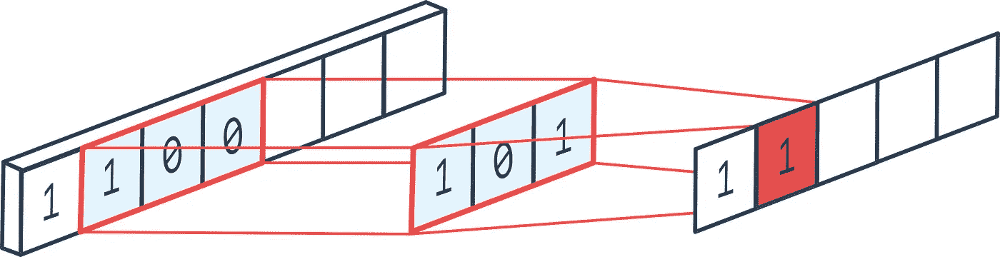
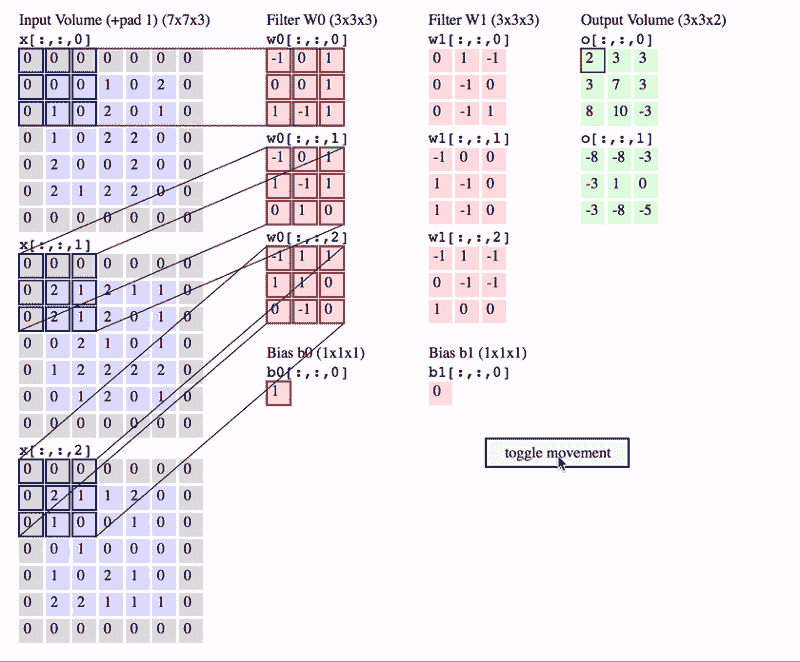

# Pytorch【基础】CNN 简介

> 原文：<https://towardsdatascience.com/pytorch-basics-how-to-train-your-neural-net-intro-to-cnn-26a14c2ea29?source=collection_archive---------1----------------------->


如何训练你的神经网络[图片[0]]

## [如何训练你的神经网络](https://towardsdatascience.com/tagged/akshaj-wields-pytorch)

## 这篇博文将带你了解 PyTorch 中不同类型的 CNN 操作。

在这篇博文中，我们将使用`torch.nn`实现 1D 和 2D 卷积。

# 什么是 CNN？

卷积神经网络是一种主要用于图像处理应用的神经网络。CNN 的其他应用包括音频、时间序列和 NLP 等序列数据。卷积是 CNN 的主要组成部分之一。术语卷积是指两个函数的数学组合产生第三个函数。它融合了两组信息。

我们不会在这里讨论很多理论。关于这一点，网上有很多精彩的材料。

# CNN 运作的类型

CNN 主要用于围绕图像、音频、视频、文本和时间序列建模的应用。有 3 种卷积运算。

*   **1D 卷积** —主要用于文本或音频等连续输入的场合。
*   **2D 卷积** —主要用于输入为图像的情况。
*   **3D 卷积** —主要用于 3D 医学成像或检测视频中的事件。这超出了这篇博文的范围。我们将只关注前两个。

## 1D 输入的 1D 卷积

滤波器沿一维滑动以产生输出。以下图表摘自[这个 Stackoverflow 答案](https://stackoverflow.com/questions/42883547/intuitive-understanding-of-1d-2d-and-3d-convolutions-in-convolutional-neural-n)。


1D 输入的 1D 卷积[图像[1] [信用点](https://stackoverflow.com/a/44628011/9193380)

## 2D 输入的 1D 卷积


2D 输入的 1D 卷积[图像[2] [信用点](https://stackoverflow.com/a/44628011/9193380)

## 2D 输入的 2D 卷积


2D 输入的 2D 卷积[图像[3] [信用点](https://stackoverflow.com/a/44628011/9193380)

查看这个 [Stackoverflow 回答](https://stackoverflow.com/questions/42883547/intuitive-understanding-of-1d-2d-and-3d-convolutions-in-convolutional-neural-n)以获得更多关于不同类型的 CNN 操作的信息。

# 几个关键术语

术语解释了 2D 卷积和 2D 输入即。图像，因为我找不到 1D 卷积的相关可视化。所有的可视化都是从[到这里](/applied-deep-learning-part-4-convolutional-neural-networks-584bc134c1e2)的。

## 卷积运算

要计算卷积运算后的输出维度，我们可以使用以下公式。


卷积输出公式[图像[4]]

内核/滤波器滑过输入信号，如下所示。你可以看到**滤波器**(绿色方块)滑过我们的**输入**(蓝色方块)，卷积的总和进入**特征图**(红色方块)。


卷积运算[图像[5]]

## 过滤器/内核

使用滤波器对输入图像执行卷积。卷积的输出被称为特征图。


过滤器[图像[6]]

在 CNN 术语中，3×3 矩阵被称为“**滤波器**”或“内核”或“特征检测器”，通过在图像上滑动滤波器并计算点积而形成的矩阵被称为“卷积特征”或“激活图”或“**特征图**”。重要的是要注意，过滤器充当来自原始输入图像的特征检测器。

> 更多过滤器=更多特征地图=更多特征。

过滤器只不过是一个数字矩阵。以下是不同类型的过滤器—


不同类型的过滤器[图片[7]]

## 进展

*步幅*指定我们在每一步移动卷积滤波器的程度。


步幅为 1[图片[8]]

如果我们想减少感受野之间的重叠，我们可以有更大的进展。这也使得生成的特征地图更小，因为我们跳过了潜在的位置。下图演示了步幅为 2。请注意，特征图变小了。


步幅为 2[图片[9]]

## 填料

这里我们保留了更多的边界信息，也保留了图像的大小。


填充[Image [10]]

我们看到特征映射的大小小于输入，因为卷积滤波器需要包含在输入中。如果我们想要保持相同的维度，我们可以使用*填充*用零包围输入。

## 联营

我们应用池来降低维度。


最大池[Image [11]]

*   汇集减少了输入的大小，并使特征尺寸更小。
*   由于空间尺寸减小，网络中的参数数量减少。这有助于防止过度拟合。
*   池化使网络对图像中的失真具有鲁棒性，因为我们采用了集合(最大值、总和、平均值等)。)的像素值。

# 导入库

```
import numpy as npimport torch
import torch.nn as nn
import torch.optim as optim
from torch.utils.data import Dataset, DataLoader
```

# 输入数据

首先，我们定义几个输入张量，我们将在这篇博文中使用它们。

`input_1d`是 1 维浮点张量。`input_2d`是一个二维浮点张量。`input_2d_img`是一个表示图像的三维浮动张量。

```
input_1d = torch.tensor([1, 2, 3, 4, 5, 6, 7, 8, 9, 10], dtype = torch.float)input_2d = torch.tensor([[1, 2, 3, 4, 5], [6, 7, 8, 9, 10]], dtype = torch.float)input_2d_img = torch.tensor([[[1, 2, 3, 4, 5, 6, 7, 8, 9, 10], [1, 2, 3, 4, 5, 6, 7, 8, 9, 10], [1, 2, 3, 4, 5, 6, 7, 8, 9, 10]], [[1, 2, 3, 4, 5, 6, 7, 8, 9, 10], [1, 2, 3, 4, 5, 6, 7, 8, 9, 10], [1, 2, 3, 4, 5, 6, 7, 8, 9, 10]], [[1, 2, 3, 4, 5, 6, 7, 8, 9, 10], [1, 2, 3, 4, 5, 6, 7, 8, 9, 10], [1, 2, 3, 4, 5, 6, 7, 8, 9, 10]]], dtype = torch.float) ###################### OUTPUT ######################Input 1D:input_1d.shape:  torch.Size([10])input_1d: 
 tensor([ 1.,  2.,  3.,  4.,  5.,  6.,  7.,  8.,  9., 10.])
====================================================================Input 2D:input_2d.shape:  torch.Size([2, 5])input_2d:
 tensor([[ 1.,  2.,  3.,  4.,  5.],
        [ 6.,  7.,  8.,  9., 10.]])
====================================================================input_2d_img:input_2d_img.shape:  torch.Size([3, 3, 10])input_2d_img:
 tensor([[[ 1.,  2.,  3.,  4.,  5.,  6.,  7.,  8.,  9., 10.],
         [ 1.,  2.,  3.,  4.,  5.,  6.,  7.,  8.,  9., 10.],
         [ 1.,  2.,  3.,  4.,  5.,  6.,  7.,  8.,  9., 10.]], [[ 1.,  2.,  3.,  4.,  5.,  6.,  7.,  8.,  9., 10.],
         [ 1.,  2.,  3.,  4.,  5.,  6.,  7.,  8.,  9., 10.],
         [ 1.,  2.,  3.,  4.,  5.,  6.,  7.,  8.,  9., 10.]], [[ 1.,  2.,  3.,  4.,  5.,  6.,  7.,  8.,  9., 10.],
         [ 1.,  2.,  3.,  4.,  5.,  6.,  7.,  8.,  9., 10.],
         [ 1.,  2.,  3.,  4.,  5.,  6.,  7.,  8.,  9., 10.]]])
```

# 1D 卷积

`nn.Conv1d()`对输入应用 1D 卷积。`nn.Conv1d()`期望输入是`[batch_size, input_channels, signal_length]`的形状。

您可以在官方 [PyTorch 文档](https://pytorch.org/docs/stable/nn.html#conv1d)中查看完整的参数列表。所需的参数是—

*   **in _ channels**(*python:int*)—输入信号的通道数。这应该等于输入张量中的通道数。
*   **out _ channels**(*python:int*)—卷积产生的通道数。
*   **kernel _ Size**(*python:int 或 tuple* ) —卷积内核的大小。

## Conv1d —输入 1d



Conv1d-Input1d 示例[图像[12] [信用点](https://peltarion.com/knowledge-center/documentation/modeling-view/build-an-ai-model/blocks/1d-convolution-block)

输入是由 10 个数字组成的 1D 信号。我们将把它转换成大小为[1，1，10]的张量。

```
input_1d = input_1d.unsqueeze(0).unsqueeze(0)
input_1d.shape ###################### OUTPUT ######################torch.Size([1, 1, 10])
```

CNN 输出带`**out_channels=1**`、`**kernel_size=3**` 和`**stride=1**`。

```
cnn1d_1 = nn.Conv1d(in_channels=1, out_channels=1, kernel_size=3, stride=1)print("cnn1d_1: \n")
print(cnn1d_1(input_1d).shape, "\n")
print(cnn1d_1(input_1d)) ###################### OUTPUT ######################cnn1d_1: torch.Size([1, 1, 8]) tensor([[[-1.2353, -1.4051, -1.5749, -1.7447, -1.9145, -2.0843, -2.2541, -2.4239]]], grad_fn=<SqueezeBackward1>)
```

CNN 用`**out_channels=1**`、`**kernel_size=3**` 和`**stride=2**`输出。

```
cnn1d_2 = nn.Conv1d(in_channels=1, out_channels=1, kernel_size=3, stride=2)print("cnn1d_2: \n")
print(cnn1d_2(input_1d).shape, "\n")
print(cnn1d_2(input_1d)) ###################### OUTPUT ######################cnn1d_2: torch.Size([1, 1, 4]) tensor([[[0.5107, 0.3528, 0.1948, 0.0368]]], grad_fn=<SqueezeBackward1>)
```

带`**out_channels=1**`、`**kernel_size=2**` 和`**stride=1**`的 CNN 输出。

```
cnn1d_3 = nn.Conv1d(in_channels=1, out_channels=1, kernel_size=2, stride=1)print("cnn1d_3: \n")
print(cnn1d_3(input_1d).shape, "\n")
print(cnn1d_3(input_1d)) ###################### OUTPUT ######################cnn1d_3: torch.Size([1, 1, 9]) tensor([[[0.0978, 0.2221, 0.3465, 0.4708, 0.5952, 0.7196, 0.8439, 0.9683, 1.0926]]], grad_fn=<SqueezeBackward1>)
```

CNN 用`**out_channels=5**`、`**kernel_size=3**` 和`**stride=2**`输出。

```
cnn1d_4 = nn.Conv1d(in_channels=1, out_channels=5, kernel_size=3, stride=1)print("cnn1d_4: \n")
print(cnn1d_4(input_1d).shape, "\n")
print(cnn1d_4(input_1d)) ###################### OUTPUT ######################cnn1d_4: torch.Size([1, 5, 8]) tensor([[[-1.8410e+00, -2.8884e+00, -3.9358e+00, -4.9832e+00, -6.0307e+00,-7.0781e+00, -8.1255e+00, -9.1729e+00],
         [-4.6073e-02, -3.4436e-02, -2.2799e-02, -1.1162e-02,  4.7439e-04,1.2111e-02,  2.3748e-02,  3.5385e-02],
         [-1.5541e+00, -1.8505e+00, -2.1469e+00, -2.4433e+00, -2.7397e+00, -3.0361e+00, -3.3325e+00, -3.6289e+00],
         [ 6.6593e-01,  1.2362e+00,  1.8066e+00,  2.3769e+00,  2.9472e+00, 3.5175e+00,  4.0878e+00,  4.6581e+00],
         [ 2.0414e-01,  6.0421e-01,  1.0043e+00,  1.4044e+00,  1.8044e+00,2.2045e+00,  2.6046e+00,  3.0046e+00]]], 
grad_fn=<SqueezeBackward1>)
```

## Conv1d —输入 2d

要对 2d 输入信号应用 1D 卷积，我们可以执行以下操作。首先，我们定义大小为[1，2，5]的输入张量，其中`batch_size = 1`、`input_channels = 2`和`signal_length = 5`。

```
input_2d = input_2d.unsqueeze(0)
input_2d.shape ###################### OUTPUT ######################torch.Size([1, 2, 5])
```

CNN 输出有`**in_channels=2**`、`**out_channels=1**`、`**kernel_size=3**`、`**stride=1**`。

```
cnn1d_5 = nn.Conv1d(in_channels=2, out_channels=1, kernel_size=3, stride=1)print("cnn1d_5: \n")
print(cnn1d_5(input_2d).shape, "\n")
print(cnn1d_5(input_2d)) ###################### OUTPUT ######################cnn1d_5: torch.Size([1, 1, 3]) tensor([[[-6.6836, -7.6893, -8.6950]]], grad_fn=<SqueezeBackward1>)
```

CNN 输出有`**in_channels=2**`、`**out_channels=1**`、`**kernel_size=3**`、`**stride=2**`。

```
cnn1d_6 = nn.Conv1d(in_channels=2, out_channels=1, kernel_size=3, stride=2)print("cnn1d_6: \n")
print(cnn1d_6(input_2d).shape, "\n")
print(cnn1d_6(input_2d)) ###################### OUTPUT ######################cnn1d_6: torch.Size([1, 1, 2]) tensor([[[-3.4744, -3.7142]]], grad_fn=<SqueezeBackward1>)
```

CNN 输出有`**in_channels=2**`、`**out_channels=1**`、`**kernel_size=2**`、`**stride=1**`。

```
cnn1d_7 = nn.Conv1d(in_channels=2, out_channels=1, kernel_size=2, stride=1)print("cnn1d_7: \n")
print(cnn1d_7(input_2d).shape, "\n")
print(cnn1d_7(input_2d)) ###################### OUTPUT ######################cnn1d_7: torch.Size([1, 1, 4]) tensor([[[0.5619, 0.6910, 0.8201, 0.9492]]], grad_fn=<SqueezeBackward1>)
```

CNN 输出有`**in_channels=2**`、`**out_channels=5**`、`**kernel_size=3**`、`**stride=1**`。

```
cnn1d_8 = nn.Conv1d(in_channels=2, out_channels=5, kernel_size=3, stride=1)print("cnn1d_8: \n")
print(cnn1d_8(input_2d).shape, "\n")
print(cnn1d_8(input_2d)) ###################### OUTPUT ######################cnn1d_8: torch.Size([1, 5, 3]) tensor([[[ 1.5024,  2.4199,  3.3373],
         [ 0.2980, -0.0873, -0.4727],
         [ 1.5443,  1.7086,  1.8729],
         [ 2.6177,  3.2974,  3.9772],
         [-2.5145, -2.2906, -2.0668]]], grad_fn=<SqueezeBackward1>)
```

# 2D 卷积

`nn.Conv2d()`对输入应用 2D 卷积。`nn.Conv2d()`期望输入为`[batch_size, input_channels, input_height, input_width]`的形状。

您可以在官方 [PyTorch 文档](https://pytorch.org/docs/stable/nn.html#torch.nn.Conv2d)中查看完整的参数列表。所需的参数是—

*   **in _ channels**(*python:int*)—2d 输入(如图像)中的通道数。
*   **out _ channels**(*python:int*)—卷积产生的通道数。
*   **kernel _ Size**(*python:int 或 tuple* ) —卷积内核的大小

## Conv2d —输入 2d



与 3 个通道卷积[图像[13] [信用点](https://cs231n.github.io/convolutional-networks/)

要对 2d 输入信号(例如图像)应用 2D 卷积，我们可以执行以下操作。首先，我们定义大小为[1，3，3，10]的输入张量，其中有`batch_size = 1`、`input_channels = 3`、`input_height = 3`和`input_width = 10`。

```
input_2d_img = input_2d_img.unsqueeze(0)
input_2d_img.shape ###################### OUTPUT ######################torch.Size([1, 3, 3, 10])
```

CNN 输出有`**in_channels=3**`、`**out_channels=1**`、`**kernel_size=3**`、`**stride=1**`。

```
cnn2d_1 = nn.Conv2d(in_channels=3, out_channels=1, kernel_size=3, stride=1)print("cnn2d_1: \n")
print(cnn2d_1(input_2d_img).shape, "\n")
print(cnn2d_1(input_2d_img)) ###################### OUTPUT ######################cnn2d_1: torch.Size([1, 1, 1, 8]) tensor([[[[-1.0716, -1.5742, -2.0768, -2.5793, -3.0819, -3.5844, -4.0870,-4.5896]]]], grad_fn=<MkldnnConvolutionBackward>)
```

CNN 输出有`**in_channels=3**`、`**out_channels=1**`、`**kernel_size=3**`、`**stride=2**`。

```
cnn2d_2 = nn.Conv2d(in_channels=3, out_channels=1, kernel_size=3, stride=2)print("cnn2d_2: \n")
print(cnn2d_2(input_2d_img).shape, "\n")
print(cnn2d_2(input_2d_img)) ###################### OUTPUT ######################cnn2d_2: torch.Size([1, 1, 1, 4]) tensor([[[[-0.7407, -1.2801, -1.8195, -2.3590]]]],
       grad_fn=<MkldnnConvolutionBackward>)
```

CNN 输出有`**in_channels=3**`、`**out_channels=1**`、`**kernel_size=2**`、`**stride=1**`。

```
cnn2d_3 = nn.Conv2d(in_channels=3, out_channels=1, kernel_size=2, stride=1)print("cnn2d_3: \n")
print(cnn2d_3(input_2d_img).shape, "\n")
print(cnn2d_3(input_2d_img)) ###################### OUTPUT ######################cnn2d_3: torch.Size([1, 1, 2, 9]) tensor([[[[-0.8046, -1.5066, -2.2086, -2.9107, -3.6127, -4.3147, -5.0167, -5.7188, -6.4208],
          [-0.8046, -1.5066, -2.2086, -2.9107, -3.6127, -4.3147, -5.0167,-5.7188, -6.4208]]]], grad_fn=<MkldnnConvolutionBackward>)
```

CNN 输出有`**in_channels=3**`、`**out_channels=5**`、`**kernel_size=3**`、`**stride=1**`。

```
cnn2d_4 = nn.Conv2d(in_channels=3, out_channels=5, kernel_size=3, stride=1)print("cnn2d_4: \n")
print(cnn2d_4(input_2d_img).shape, "\n")
print(cnn2d_4(input_2d_img)) ###################### OUTPUT ######################cnn2d_4: torch.Size([1, 5, 1, 8]) tensor([[[[-2.0868e+00, -2.7669e+00, -3.4470e+00, -4.1271e+00, -4.8072e+00, -5.4873e+00, -6.1673e+00, -6.8474e+00]], [[-4.5052e-01, -5.5917e-01, -6.6783e-01, -7.7648e-01, -8.8514e-01, -9.9380e-01, -1.1025e+00, -1.2111e+00]], [[ 6.6228e-01,  8.3826e-01,  1.0142e+00,  1.1902e+00,  1.3662e+00,1.5422e+00,  1.7181e+00,  1.8941e+00]], [[-5.4425e-01, -1.2149e+00, -1.8855e+00, -2.5561e+00, -3.2267e+00, -3.8973e+00, -4.5679e+00, -5.2385e+00]], [[ 2.0564e-01,  1.6357e-01,  1.2150e-01,  7.9434e-02,  3.7365e-02, -4.7036e-03, -4.6773e-02, -8.8842e-02]]]],
       grad_fn=<MkldnnConvolutionBackward>)
```

感谢您的阅读。欢迎提出建议和建设性的批评。:)你可以在 [LinkedIn](https://www.linkedin.com/in/akshajverma7/) 和[Twitter](https://twitter.com/theairbend3r)上找到我。

你也可以在这里查看我的其他博客。

[](https://www.buymeacoffee.com/theairbend3r)