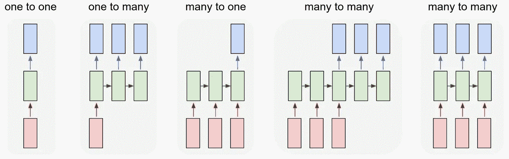
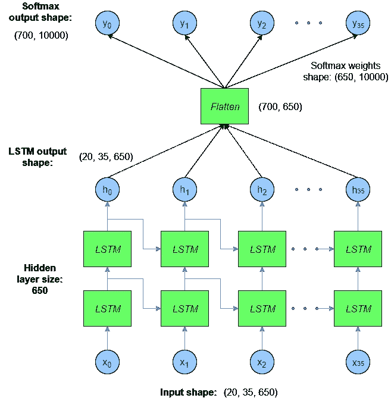
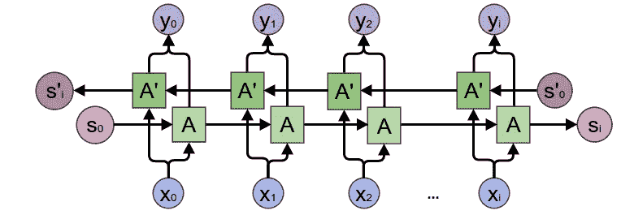

# Pytorch【基础】—RNN 简介

> 原文：<https://towardsdatascience.com/pytorch-basics-how-to-train-your-neural-net-intro-to-rnn-cb6ebc594677?source=collection_archive---------0----------------------->


如何训练你的神经网络[图片[0]]

## [如何训练你的神经网络](https://towardsdatascience.com/tagged/akshaj-wields-pytorch)

## 这篇博文将带你了解 PyTorch 中不同类型的 RNN 操作。

这篇博文通过预测一个数字序列，带您了解 PyTorch 中普通 rnn、堆叠 rnn、双向 rnn 和堆叠双向 rnn 的实现。


RNN 迷因[图片[1]]

# 导入库

```
import numpy as np

import torch
import torch.nn as nn
import torch.optim as optim
from torch.utils.data import Dataset, DataLoader
```

# rnn 的类型

rnn 主要用于时序数据，如时间序列或 NLP。有多种不同类型的 rnn 用于不同的应用。



不同类型的 RNNs 图片[2]]

对于时间序列-

*   预测-多对多或多对一
*   分类-多对一

对于 NLP -

*   文本分类:多对一
*   文本生成:多对多
*   机器翻译:多对多
*   命名实体识别:多对多
*   图像字幕:一对多

## 堆叠 rnn

为了获得更好的性能，我们经常将 rnn 堆叠在一起。



堆叠 RNNs[图像[3]]

## 双向 RNN

双向 RNN 基本上使用 2 个 RNN，其中输入序列按正常顺序馈送到 1 个 RNN，反向馈送到另一个 RNN。



双向 RNNs [Image [4]]

# 输入数据

这里的数据是:

> **【1，2，3，4，5，6，7，8，9，10，11，12，13，14，15，16，17，18，19，20】**

我们把它分成 4 批，序列长度= 5。

> [[1，2，3，4，5]，T15，[6，7，8，9，10]，
> ，[11，12，13，14，15]，T17，[16，17，18，19，20]]

**批量大小** = 4
**序列长度** = 5
**输入大小** = 1(因为，只有一维)

在我们的例子中，我们查看 5 (seq_len)的前一个值来预测接下来的 2 个值。

```
data = torch.Tensor([1, 2, 3, 4, 5, 6, 7, 8, 9, 10, 11, 12, 13, 14, 15, 16, 17, 18, 19, 20])print("Data: ", data.shape, "\n\n", data)###################### OUTPUT ###################### Data:
 tensor([ 1.,  2.,  3.,  4.,  5.,  6.,  7.,  8.,  9., 10., 11., 12., 13., 14., 15., 16., 17., 18., 19., 20.]) Data Shape: 
 torch.Size([20])
```

# 香草 RNN

```
# Number of features used as input. (Number of columns)
INPUT_SIZE = 1# Number of previous time stamps taken into account.
SEQ_LENGTH = 5# Number of features in last hidden state ie. number of output time-
# steps to predict.See image below for more clarity.
HIDDEN_SIZE = 2# Number of stacked rnn layers.
NUM_LAYERS = 1# We have total of 20 rows in our input. 
# We divide the input into 4 batches where each batch has only 1
# row. Each row corresponds to a sequence of length 5\. 
BATCH_SIZE = 4
```

## 投入

`torch.nn.RNN`有两个输入- `input`和`h_0` ie。t=0 时的输入序列和隐藏层。如果我们不初始化隐藏层，它将被 PyTorch 自动初始化为全零。

*   `**input**`是输入网络的序列。它的大小应该是`(seq_len, batch, input_size)`。如果`batch_first=True`，则输入大小为`(batch, seq_len, input_size)`。
*   `**h_0**`是网络的初始隐藏状态。它的大小为`(num_layers * num_directions, batch, input_size)`，其中`num_layers`是堆叠 rnn 的数量。`num_directions` =双向 rnn 为 2，否则为 1。

## 输出

`torch.nn.RNN`有两个输出- `out`和`hidden`。

*   `**out**`是来自最后一个 RNN 层的所有时间步长的 RNN 的输出。它的大小和`(seq_len, batch, num_directions * hidden_size)`差不多。如果`batch_first=True`，则输出大小为`(batch, seq_len, num_directions * hidden_size)`。
*   `**h_n**`是所有 RNN 层的最后一个时间步长的隐藏值。它的尺寸是`(num_layers * num_directions, batch, hidden_size)`。`h_n`不受`batch_first=True`影响。 [Github 问题](https://github.com/pytorch/pytorch/issues/4145)。

下图解释得更清楚。这里的`batch=1`。该图是一个 LSTM，它有两个隐藏参数`(h, c)`。RNN 和 GRU 都只有`h`。


RNN 输入输出【图片[5] [信用点】](https://stackoverflow.com/a/48305882/9193380)

> 重申一下—
> 
> `***out***` *是 RNN 的* ***输出*** *从* ***到*** *从* ***最后一个 RNN 层*** *。* `***h_n***` *是将* ***隐藏*** *的值从* ***最后一步*******的所有 RNN 图层*** *。**

```
*# Initialize the RNN.
rnn = nn.RNN(input_size=INPUT_SIZE, hidden_size=HIDDEN_SIZE, num_layers = 1, batch_first=True)# input size : (batch, seq_len, input_size)
inputs = data.view(BATCH_SIZE, SEQ_LENGTH, INPUT_SIZE)# out shape = (batch, seq_len, num_directions * hidden_size)
# h_n shape  = (num_layers * num_directions, batch, hidden_size)
out, h_n = rnn(inputs)*
```

*`**input**`形状= `[4, 5, 1]`
`**out**`形状= `[4, 5, 2]`
`**h_n**`形状= `[1, 4, 2]`*

*在`**input**`中，我们有 4 个批次作为输出，因为我们设置了`BATCH_SIZE=4`。每批包含 5 行，因为出了`SEQ_LENGTH = 5`。我们只使用一个特征作为输入`INPUT_SIZE = 1`。*

*在`**out**`中，我们从所有 4 个批次中获取值，其中时间步数(seq_len)为 5，预测数为 2。对于每一批，我们预测 2 个输出。*

*在`**h_n**`中，我们从单个 RNN 层的最后一个时间步长的 4 个批次中的每一个批次中获取值。*

```
*print('Input: ', inputs.shape, '\n', inputs)
print('\nOutput: ', out.shape, '\n', out)
print('\nHidden: ', h_n.shape, '\n', h_n) ###################### OUTPUT ######################Input:  torch.Size([4, 5, 1]) 
 tensor([[[ 1.],
         [ 2.],
         [ 3.],
         [ 4.],
         [ 5.]],

        [[ 6.],
         [ 7.],
         [ 8.],
         [ 9.],
         [10.]],

        [[11.],
         [12.],
         [13.],
         [14.],
         [15.]],

        [[16.],
         [17.],
         [18.],
         [19.],
         [20.]]])

Output:  torch.Size([4, 5, 2]) 
 tensor([[[-0.0819,  0.8100],
         [-0.4311,  0.9332],
         [-0.3162,  0.9748],
         [-0.3979,  0.9875],
         [-0.3675,  0.9944]],

        [[-0.1081,  0.9953],
         [-0.5145,  0.9986],
         [-0.3269,  0.9995],
         [-0.4254,  0.9997],
         [-0.3820,  0.9999]],

        [[-0.1342,  0.9999],
         [-0.5245,  1.0000],
         [-0.3458,  1.0000],
         [-0.4382,  1.0000],
         [-0.3982,  1.0000]],

        [[-0.1601,  1.0000],
         [-0.5328,  1.0000],
         [-0.3648,  1.0000],
         [-0.4506,  1.0000],
         [-0.4143,  1.0000]]], grad_fn=<TransposeBackward1>)

Hidden:  torch.Size([1, 4, 2]) 
 tensor([[[-0.3675,  0.9944],
         [-0.3820,  0.9999],
         [-0.3982,  1.0000],
         [-0.4143,  1.0000]]], grad_fn=<StackBackward>)*
```

*在上面的输出中，注意每批`out`中的最后一行出现在`h_n`中。*

*   *`out`是每批最后一个 RNN 层所有时间步的输出值。*
*   *`h_n`是每批所有 RNN 层在最后一个时间步的隐藏值。*

# *堆叠 RNN*

*如果我改变`num_layers = 3`，我们将有 3 个 RNN 层堆叠在一起。看看下面的例子中`out`和`h_n`张量是如何变化的。*

*我们现在在`h_n`张量中有 3 个批次。最后一批包含`out`张量中每批的结束行。*

```
*# Initialize the RNN.
rnn = nn.RNN(input_size=INPUT_SIZE, hidden_size=HIDDEN_SIZE, num_layers = 3, batch_first=True)# input size : (batch_size , seq_len, input_size)
inputs = data.view(BATCH_SIZE, SEQ_LENGTH, INPUT_SIZE)# out shape = (batch, seq_len, num_directions * hidden_size)
# h_n shape  = (num_layers * num_directions, batch, hidden_size)
out, h_n = rnn(inputs)*
```

*`**input**`形状= `[4, 5, 1]`
`**out**`形状= `[4, 5, 2]`
`**h_n**`形状= `[3, 4, 2]`*

*在`**input**`中，我们有 4 个批次作为输出，因为我们设置了`BATCH_SIZE=4`。每批包含 5 行，因为 out `SEQ_LENGTH = 5`。我们只使用一个特征作为输入`INPUT_SIZE = 1`。*

*在`**out**`中，我们从所有 4 个批次中获取值，其中时间步长数(seq_len)为 5，预测数为 2。对于每一批，我们预测 2 个输出。*

*在`**h_n**`中，我们从 3 个堆叠的 RNN 层的最后时间步的 4 个批次中的每一个中获得值。*

```
*print('Input: ', inputs.shape, '\n', inputs)
print('\nOutput: ', out.shape, '\n', out)
print('\nHidden: ', h_n.shape, '\n', h_n) ###################### OUTPUT ######################Input:  torch.Size([4, 5, 1]) 
 tensor([[[ 1.],
         [ 2.],
         [ 3.],
         [ 4.],
         [ 5.]],

        [[ 6.],
         [ 7.],
         [ 8.],
         [ 9.],
         [10.]],

        [[11.],
         [12.],
         [13.],
         [14.],
         [15.]],

        [[16.],
         [17.],
         [18.],
         [19.],
         [20.]]])

Output:  torch.Size([4, 5, 2]) 
 tensor([[[ 0.3144, -0.7527],
         [-0.0597, -0.6038],
         [ 0.0896, -0.7646],
         [ 0.0608, -0.6358],
         [ 0.1084, -0.6783]],

        [[ 0.4442, -0.6350],
         [ 0.0949, -0.3948],
         [ 0.2715, -0.5962],
         [ 0.1819, -0.4580],
         [ 0.2529, -0.5213]],

        [[ 0.4907, -0.5688],
         [ 0.1671, -0.2976],
         [ 0.3462, -0.4922],
         [ 0.2388, -0.3768],
         [ 0.3078, -0.4418]],

        [[ 0.5041, -0.5466],
         [ 0.1883, -0.2675],
         [ 0.3684, -0.4576],
         [ 0.2572, -0.3502],
         [ 0.3238, -0.4167]]], grad_fn=<TransposeBackward1>)

Hidden:  torch.Size([3, 4, 2]) 
 tensor([[[-0.6480, -0.4044],
         [-0.8912, -0.7801],
         [-0.9808, -0.9366],
         [-0.9975, -0.9836]],

        [[-0.7848, -0.0118],
         [-0.8707, -0.1721],
         [-0.8955, -0.2411],
         [-0.9016, -0.2605]],

        [[ 0.1084, -0.6783],
         [ 0.2529, -0.5213],
         [ 0.3078, -0.4418],
         [ 0.3238, -0.4167]]], grad_fn=<StackBackward>)*
```

# *双向 RNN*

*对于双向 RNN，我们设置了`bidirectional=True`。*

```
*rnn = nn.RNN(input_size=INPUT_SIZE, hidden_size=HIDDEN_SIZE, batch_first=True, num_layers = 1, bidirectional = True)# input size : (batch_size , seq_len, input_size)
inputs = data.view(BATCH_SIZE, SEQ_LENGTH, INPUT_SIZE)# out shape = (batch, seq_len, num_directions * hidden_size)
# h_n shape  = (num_layers * num_directions, batch, hidden_size)
out, h_n = rnn(inputs)*
```

*`**input**`形状= `[4, 5, 1]`
`**out**`形状= `[4, 5, 4]`
`**h_n**`形状= `[2, 4, 2]`*

*在`**input**`中，我们有 4 个批次作为输出，因为我们设置了`BATCH_SIZE=4`。每批包含 5 行，因为 out `SEQ_LENGTH = 5`。我们只使用一个特征作为输入`INPUT_SIZE = 1`。*

*在`**out**`中，我们从所有 4 个批次中获取值，其中时间步长数(seq_len)为 5，预测数为 2。对于每一批，我们预测 2 个输出。因为这是一个双向 RNN，我们得到了 2 组预测。因此，形状是`[4, 5, 4]`而不是`[4, 5, 2]`(我们在上述的单向 RNN 的情况下观察到的*)。**

*在`**h_n**`中，我们从单个 RNN 层的最后时间步的 4 个批次中的每一个批次中获取值。因为这是一个双向 RNN，我们得到了 2 组预测。因此，形状是`[2, 4, 2]`而不是`[1, 4, 2]`(我们在以上单向 RNN 的情况下观察到的*)。**

```
*print('Input: ', inputs.shape, '\n', inputs)
print('\nOutput: ', out.shape, '\n', out)
print('\nHidden: ', h_n.shape, '\n', h_n) ###################### OUTPUT ######################Input:  torch.Size([4, 5, 1]) 
 tensor([[[ 1.],
         [ 2.],
         [ 3.],
         [ 4.],
         [ 5.]],

        [[ 6.],
         [ 7.],
         [ 8.],
         [ 9.],
         [10.]],

        [[11.],
         [12.],
         [13.],
         [14.],
         [15.]],

        [[16.],
         [17.],
         [18.],
         [19.],
         [20.]]])

Output:  torch.Size([4, 5, 4]) 
 tensor([[[ 0.2184,  0.4086,  0.6418, -0.1677],
         [-0.0222, -0.0095,  0.8794, -0.4927],
         [-0.6716, -0.2802,  0.9585, -0.7248],
         [-0.9387, -0.4152,  0.9846, -0.8646],
         [-0.9841, -0.6164,  0.9789, -0.9192]],

        [[-0.9813, -0.8829,  0.9979, -0.9721],
         [-0.9986, -0.8902,  0.9992, -0.9877],
         [-0.9995, -0.9449,  0.9997, -0.9946],
         [-0.9998, -0.9729,  0.9999, -0.9977],
         [-0.9999, -0.9868,  0.9998, -0.9987]],

        [[-0.9999, -0.9968,  1.0000, -0.9996],
         [-1.0000, -0.9969,  1.0000, -0.9998],
         [-1.0000, -0.9985,  1.0000, -0.9999],
         [-1.0000, -0.9993,  1.0000, -1.0000],
         [-1.0000, -0.9997,  1.0000, -1.0000]],

        [[-1.0000, -0.9999,  1.0000, -1.0000],
         [-1.0000, -0.9999,  1.0000, -1.0000],
         [-1.0000, -1.0000,  1.0000, -1.0000],
         [-1.0000, -1.0000,  1.0000, -1.0000],
         [-1.0000, -1.0000,  1.0000, -1.0000]]], grad_fn=<TransposeBackward1>)

Hidden:  torch.Size([2, 4, 2]) 
 tensor([[[-0.9841, -0.6164],
         [-0.9999, -0.9868],
         [-1.0000, -0.9997],
         [-1.0000, -1.0000]],

        [[ 0.6418, -0.1677],
         [ 0.9979, -0.9721],
         [ 1.0000, -0.9996],
         [ 1.0000, -1.0000]]], grad_fn=<StackBackward>)*
```

*现在让我们试着更详细地理解输出。根据文档，为了分离方向(向前和向后)，我们可以做以下事情-*

*   *`out.view(seq_len, batch, num_directions, hidden_size)`向前和向后分别为方向 0 和 1。请记住，如果您使用了`batch_first=True`，那么它将是`out.view(batch, seq_len, num_directions, hidden_size)`。*
*   *`h_n.view(num_layers, num_directions, batch, hidden_size)`向前和向后分别为方向 0 和 1。*

## *BiRNN 分离`**out**`*

*让我们重塑 BiRNN 的输出，使用`out.view(batch, seq_len, num_directions, hidden_size)`来分离前向和后向值。*

```
*out_reshaped = out.view(BATCH_SIZE, SEQ_LENGTH, 2, HIDDEN_SIZE)print("Shape of the output after directions are separated: ", out_reshaped.shape) ###################### OUTPUT ######################Shape of the output after directions are separated:  torch.Size([4, 5, 2, 2])*
```

*现在的形状是— `(batch, seq_len, num_directions, hidden_size)`。*

*`num_directions`是二次元。为了获得前向和后向输出，我们可以做以下事情*

*   *out_forward = `(batch, seq_len, 0, hidden_size)`*
*   *out_backward = `(batch, seq_len, 1, hidden_size)`*

```
*out_forward = out_reshaped[:, :, 0, :]
out_backward = out_reshaped[:, :, 1, :]print("Forward output: ", out_forward.shape, "\n", out_forward)
print("\n\nBackward output: ", out_backward.shape, "\n", out_backward) ###################### OUTPUT ######################Forward output:  torch.Size([4, 5, 2]) 
 tensor([[[ 0.2184,  0.4086],
         [-0.0222, -0.0095],
         [-0.6716, -0.2802],
         [-0.9387, -0.4152],
         [-0.9841, -0.6164]],

        [[-0.9813, -0.8829],
         [-0.9986, -0.8902],
         [-0.9995, -0.9449],
         [-0.9998, -0.9729],
         [-0.9999, -0.9868]],

        [[-0.9999, -0.9968],
         [-1.0000, -0.9969],
         [-1.0000, -0.9985],
         [-1.0000, -0.9993],
         [-1.0000, -0.9997]],

        [[-1.0000, -0.9999],
         [-1.0000, -0.9999],
         [-1.0000, -1.0000],
         [-1.0000, -1.0000],
         [-1.0000, -1.0000]]], grad_fn=<SliceBackward>)

Backward output:  torch.Size([4, 5, 2]) 
 tensor([[[ 0.6418, -0.1677],
         [ 0.8794, -0.4927],
         [ 0.9585, -0.7248],
         [ 0.9846, -0.8646],
         [ 0.9789, -0.9192]],

        [[ 0.9979, -0.9721],
         [ 0.9992, -0.9877],
         [ 0.9997, -0.9946],
         [ 0.9999, -0.9977],
         [ 0.9998, -0.9987]],

        [[ 1.0000, -0.9996],
         [ 1.0000, -0.9998],
         [ 1.0000, -0.9999],
         [ 1.0000, -1.0000],
         [ 1.0000, -1.0000]],

        [[ 1.0000, -1.0000],
         [ 1.0000, -1.0000],
         [ 1.0000, -1.0000],
         [ 1.0000, -1.0000],
         [ 1.0000, -1.0000]]], grad_fn=<SliceBackward>)*
```

## *BiRNN 分离的`h_n`*

*让我们用`h_n.view(num_layers, num_directions, batch, hidden_size)`重塑隐藏的 BiRNN 来分离向前和向后的值。*

```
*h_n_reshaped = h_n.view(1, 2, BATCH_SIZE, HIDDEN_SIZE)print("Shape of the hidden after directions are separated: ", h_n_reshaped.shape) ###################### OUTPUT ######################Shape of the hidden after directions are separated:  torch.Size([1, 2, 4, 2])*
```

*现在的形状是— `(num_layers, num_directions, batch, hidden_size)`。*

*`num_directions`是第一维度。要获得向前和向后隐藏，我们可以做以下事情-*

*   *hidden_forward = `(num_layers, 0, batch, hidden_size)`*
*   *hidden_backward = `(num_layers, 1, batch, hidden_size)`*

```
*h_n_forward = h_n_reshaped[:, 0, :, :]
h_n_backward = h_n_reshaped[:, 1, :, :]print("Forward h_n: ", h_n_forward.shape, "\n", h_n_forward)
print("\n\nBackward h_n: ", h_n_backward.shape, "\n", h_n_backward) ###################### OUTPUT ######################Forward h_n:  torch.Size([1, 4, 2]) 
 tensor([[[-0.9841, -0.6164],
         [-0.9999, -0.9868],
         [-1.0000, -0.9997],
         [-1.0000, -1.0000]]], grad_fn=<SliceBackward>)

Backward h_n:  torch.Size([1, 4, 2]) 
 tensor([[[ 0.6418, -0.1677],
         [ 0.9979, -0.9721],
         [ 1.0000, -0.9996],
         [ 1.0000, -1.0000]]], grad_fn=<SliceBackward>)*
```

# *堆叠双向 RNN*

*对于堆叠式双向 RNN，我们设置`bidirectional=True`和`num_layers` = 3。*

```
*rnn = nn.RNN(input_size=INPUT_SIZE, hidden_size=HIDDEN_SIZE, batch_first=True, num_layers = 3, bidirectional = True)# input size : (batch_size , seq_len, input_size)
inputs = data.view(BATCH_SIZE, SEQ_LENGTH, INPUT_SIZE)# out shape = (batch, seq_len, num_directions * hidden_size)
# h_n shape  = (num_layers * num_directions, batch, hidden_size)
out, h_n = rnn(inputs)*
```

*`**input**`形状= `[4, 5, 1]`
`**out**`形状= `[4, 5, 4]`
`**h_n**`形状= `[6, 4, 2]`*

*在`**input**`中，我们有 4 个批次作为输出，因为我们设置了`BATCH_SIZE=4`。每批包含 5 行，因为 out `SEQ_LENGTH = 5`。我们仅使用单一特征作为输入`INPUT_SIZE = 1`。*

*在`**out**`中，我们从所有 4 个批次中获取值，其中时间步长数(seq_len)为 5，预测数为 2。对于每一批，我们预测 2 个输出。因为这是一个双向 RNN，我们得到了 2 组预测。因此，形状是`[4, 5, 4]`而不是`[4, 5, 2]`(我们在上方的堆叠单向 RNN 的情况下观察到的*)。**

*在`**h_n**`中，我们从单个 RNN 层的最后时间步的 4 个批次中的每一个批次中获取值。因为这是一个双向 RNN，我们得到了 2 组预测。因此，形状是`[6, 4, 2]`而不是`[3, 4, 2]`(我们在上方的堆叠单向 RNN 的情况下观察到的*)。**

```
*print('Input: ', inputs.shape, '\n', inputs)
print('\nOutput: ', out.shape, '\n', out)
print('\nHidden: ', h_n.shape, '\n', h_n) ###################### OUTPUT ######################Input:  torch.Size([4, 5, 1]) 
 tensor([[[ 1.],
         [ 2.],
         [ 3.],
         [ 4.],
         [ 5.]],

        [[ 6.],
         [ 7.],
         [ 8.],
         [ 9.],
         [10.]],

        [[11.],
         [12.],
         [13.],
         [14.],
         [15.]],

        [[16.],
         [17.],
         [18.],
         [19.],
         [20.]]])

Output:  torch.Size([4, 5, 4]) 
 tensor([[[-0.4175, -0.6278, -0.0101, -0.4025],
         [ 0.1271, -0.5579,  0.2162, -0.4832],
         [-0.2557, -0.6714,  0.3084, -0.4927],
         [ 0.0556, -0.6295,  0.3194, -0.4467],
         [-0.1510, -0.6863,  0.3917, -0.6299]],

        [[-0.4311, -0.6939, -0.2381, -0.6894],
         [ 0.1423, -0.5335, -0.0872, -0.6471],
         [-0.2943, -0.6468,  0.0076, -0.6274],
         [ 0.0392, -0.5691,  0.0595, -0.5576],
         [-0.2070, -0.6238,  0.2187, -0.6570]],

        [[-0.4458, -0.6581, -0.6259, -0.8299],
         [ 0.0999, -0.4501, -0.5715, -0.8090],
         [-0.3441, -0.5669, -0.4723, -0.7729],
         [-0.0133, -0.4705, -0.3131, -0.6745],
         [-0.2617, -0.5444,  0.0042, -0.6820]],

        [[-0.4556, -0.6330, -0.7035, -0.8531],
         [ 0.0780, -0.4118, -0.6690, -0.8358],
         [-0.3608, -0.5393, -0.5730, -0.7989],
         [-0.0285, -0.4442, -0.3958, -0.6973],
         [-0.2739, -0.5259, -0.0447, -0.6868]]], grad_fn=<TransposeBackward1>)

Hidden:  torch.Size([6, 4, 2]) 
 tensor([[[ 0.9455,  0.5653],
         [ 0.9986, -0.1385],
         [ 1.0000, -0.7900],
         [ 1.0000, -0.9272]],

        [[ 0.1570,  0.2765],
         [ 0.9959,  0.9972],
         [ 1.0000,  1.0000],
         [ 1.0000,  1.0000]],

        [[-0.6463,  0.5301],
         [-0.5393,  0.6556],
         [-0.4089,  0.7277],
         [-0.3732,  0.7372]],

        [[ 0.0474, -0.5973],
         [ 0.0082, -0.9715],
         [-0.1373, -0.9681],
         [-0.2362, -0.9658]],

        [[-0.1510, -0.6863],
         [-0.2070, -0.6238],
         [-0.2617, -0.5444],
         [-0.2739, -0.5259]],

        [[-0.0101, -0.4025],
         [-0.2381, -0.6894],
         [-0.6259, -0.8299],
         [-0.7035, -0.8531]]], grad_fn=<StackBackward>)*
```

*现在让我们试着更详细地理解输出。根据文档，为了分离方向(向前和向后)，我们可以做以下事情-*

*   *`out.view(seq_len, batch, num_directions, hidden_size)`向前和向后分别为方向 0 和 1。请记住，如果您使用了`batch_first=True`，那么它将是`out.view(batch, seq_len, num_directions, hidden_size)`。*
*   *`h_n.view(num_layers, num_directions, batch, hidden_size)`向前和向后分别为方向 0 和 1。*

## *堆叠 BiRNN 分离`out`*

*让我们使用`out.view(batch, seq_len, num_directions, hidden_size)`对堆叠的 BiRNN 输出进行整形，以分离出正向和反向值。*

```
*out_reshaped = out.view(BATCH_SIZE, SEQ_LENGTH, 2, HIDDEN_SIZE)print("Shape of the output after directions are separated: ", out_reshaped.shape) ###################### OUTPUT ######################Shape of the output after directions are separated:  torch.Size([4, 5, 2, 2])*
```

*现在的形状是— `(batch, seq_len, num_directions, hidden_size)`。*

*`num_directions`是二次元。为了获得前向和后向输出，我们可以做以下事情*

*   *out_forward = `(batch, seq_len, 0, hidden_size)`*
*   *out_backward = `(batch, seq_len, 1, hidden_size)`*

```
*out_forward = out_reshaped[:, :, 0, :]
out_backward = out_reshaped[:, :, 1, :]print("Forward output: ", out_forward.shape, "\n", out_forward)
print("\n\nBackward output: ", out_backward.shape, "\n", out_backward) ###################### OUTPUT ######################Forward output:  torch.Size([4, 5, 2]) 
 tensor([[[-0.4175, -0.6278],
         [ 0.1271, -0.5579],
         [-0.2557, -0.6714],
         [ 0.0556, -0.6295],
         [-0.1510, -0.6863]],

        [[-0.4311, -0.6939],
         [ 0.1423, -0.5335],
         [-0.2943, -0.6468],
         [ 0.0392, -0.5691],
         [-0.2070, -0.6238]],

        [[-0.4458, -0.6581],
         [ 0.0999, -0.4501],
         [-0.3441, -0.5669],
         [-0.0133, -0.4705],
         [-0.2617, -0.5444]],

        [[-0.4556, -0.6330],
         [ 0.0780, -0.4118],
         [-0.3608, -0.5393],
         [-0.0285, -0.4442],
         [-0.2739, -0.5259]]], grad_fn=<SliceBackward>)

Backward output:  torch.Size([4, 5, 2]) 
 tensor([[[-0.0101, -0.4025],
         [ 0.2162, -0.4832],
         [ 0.3084, -0.4927],
         [ 0.3194, -0.4467],
         [ 0.3917, -0.6299]],

        [[-0.2381, -0.6894],
         [-0.0872, -0.6471],
         [ 0.0076, -0.6274],
         [ 0.0595, -0.5576],
         [ 0.2187, -0.6570]],

        [[-0.6259, -0.8299],
         [-0.5715, -0.8090],
         [-0.4723, -0.7729],
         [-0.3131, -0.6745],
         [ 0.0042, -0.6820]],

        [[-0.7035, -0.8531],
         [-0.6690, -0.8358],
         [-0.5730, -0.7989],
         [-0.3958, -0.6973],
         [-0.0447, -0.6868]]], grad_fn=<SliceBackward>)*
```

## *堆叠 BiRNN 分离`h_n`*

*让我们使用`h_n.view(num_layers, num_directions, batch, hidden_size)`将堆叠的 BiRNN 隐藏起来，以分离出向前和向后的值。*

```
*h_n_reshaped = h_n.view(3, 2, BATCH_SIZE, HIDDEN_SIZE)print("Shape of the hidden after directions are separated: ", h_n_reshaped.shape)###################### OUTPUT ######################Shape of the hidden after directions are separated:  torch.Size([3, 2, 4, 2])*
```

*现在的形状是— `(num_layers, num_directions, batch, hidden_size)`。*

*`num_directions`是第一维度。要获得向前和向后隐藏，我们可以做以下事情-*

*   *hidden_forward = `(num_layers, 0, batch, hidden_size)`*
*   *hidden_backward = `(num_layers, 1, batch, hidden_size)`*

```
*h_n_forward = h_n_reshaped[:, 0, :, :]
h_n_backward = h_n_reshaped[:, 1, :, :]print("Forward h_n: ", h_n_forward.shape, "\n", h_n_forward)
print("\n\nBackward h_n: ", h_n_backward.shape, "\n", h_n_backward) ###################### OUTPUT ######################Forward h_n:  torch.Size([3, 4, 2]) 
 tensor([[[ 0.9455,  0.5653],
         [ 0.9986, -0.1385],
         [ 1.0000, -0.7900],
         [ 1.0000, -0.9272]],

        [[-0.6463,  0.5301],
         [-0.5393,  0.6556],
         [-0.4089,  0.7277],
         [-0.3732,  0.7372]],

        [[-0.1510, -0.6863],
         [-0.2070, -0.6238],
         [-0.2617, -0.5444],
         [-0.2739, -0.5259]]], grad_fn=<SliceBackward>)

Backward h_n:  torch.Size([3, 4, 2]) 
 tensor([[[ 0.1570,  0.2765],
         [ 0.9959,  0.9972],
         [ 1.0000,  1.0000],
         [ 1.0000,  1.0000]],

        [[ 0.0474, -0.5973],
         [ 0.0082, -0.9715],
         [-0.1373, -0.9681],
         [-0.2362, -0.9658]],

        [[-0.0101, -0.4025],
         [-0.2381, -0.6894],
         [-0.6259, -0.8299],
         [-0.7035, -0.8531]]], grad_fn=<SliceBackward>)*
```

*感谢您的阅读。欢迎提出建议和建设性的批评。:)*你可以在 [LinkedIn](https://www.linkedin.com/in/akshajverma7/) 和 [Twitter](https://twitter.com/theairbend3r) 上找到我。如果你喜欢这个，看看我的其他博客。**

*[](https://www.buymeacoffee.com/theairbend3r)*