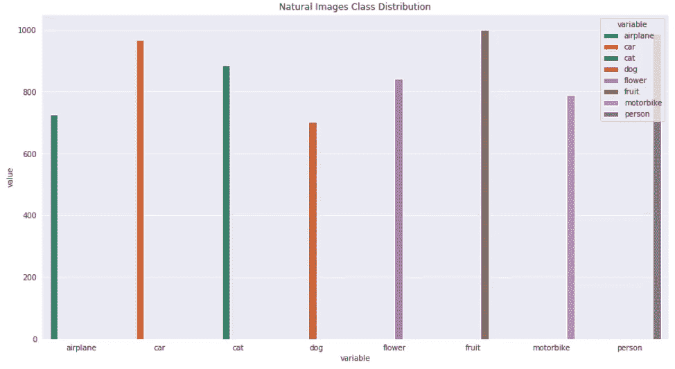
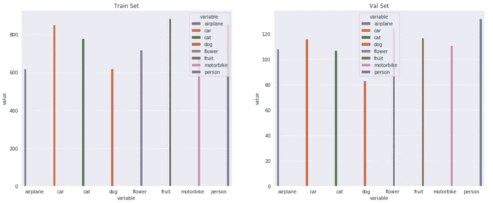
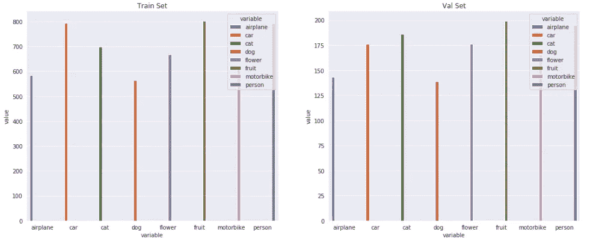

# py torch[基础知识] —取样取样器

> 原文：<https://towardsdatascience.com/pytorch-basics-sampling-samplers-2a0f29f0bf2a?source=collection_archive---------4----------------------->


如何训练你的神经网络[图片[0]]

## [如何训练你的神经网络](https://medium.com/tag/akshaj-wields-pytorch)

本笔记本将带您了解使用 PyTorch 对[自然图像](https://www.kaggle.com/prasunroy/natural-images)数据执行`random_split`、`SubsetRandomSampler`和`WeightedRandomSampler`的过程。

# 导入库

```
import numpy as np
import pandas as pd
import seaborn as sns
from tqdm.notebook import tqdm
import matplotlib.pyplot as plt import torch
import torchvision
import torch.nn as nn
import torch.optim as optim
import torch.nn.functional as F
from torchvision import transforms, utils, datasets
from torch.utils.data import Dataset, DataLoader, random_split, SubsetRandomSampler, WeightedRandomSampler
```

设置随机种子。

```
np.random.seed(0)
torch.manual_seed(0)
```

设置`Seaborn`样式。

```
%matplotlib inline
sns.set_style('darkgrid')
```

# 定义数据路径

设置数据集的根目录。

```
root_dir = "../../data/computer_vision/image_classification/natural-images/"
print("The data lies here =>", root_dir) ###################### OUTPUT ######################We're using => cpu
The data lies here => ../../data/computer_vision/image_classification/natural-images/
```

# 定义转换

将图像裁剪为`(224, 224)`大小，并将它们转换为张量。

```
image_transforms = {
    "train": transforms.Compose([
        transforms.Resize((224, 224)),
        transforms.ToTensor()
    ])
}
```

# 初始化数据集

使用`ImageFolder`，我们将创建我们的数据集。对于这篇博文，我们将只使用 train 文件夹。

```
natural_img_dataset = datasets.ImageFolder(
                              root = root_dir,
                              transform = image_transforms["train"]
                       )natural_img_dataset
```

# 类别<=> ID 映射

`.class_to_idx`方法返回数据集中的类映射标签。

```
natural_img_dataset.class_to_idx###################### OUTPUT ######################{'airplane': 0,
 'car': 1,
 'cat': 2,
 'dog': 3,
 'flower': 4,
 'fruit': 5,
 'motorbike': 6,
 'person': 7}
```

我们将创建一个名为`idx2class`的字典，它是 PyTorch 中`class_to_idx`方法的逆方法。

```
idx2class = {v: k for k, v in natural_img_dataset.class_to_idx.items()}idx2class ###################### OUTPUT ######################{0: 'airplane',
 1: 'car',
 2: 'cat',
 3: 'dog',
 4: 'flower',
 5: 'fruit',
 6: 'motorbike',
 7: 'person'}
```

# 观察班级分布

为了观察 dataset 对象中不同类的分布，我们创建了一个名为`get_class_distribution()`的函数。该函数将数据集作为输入参数，并返回一个字典，其中包含 dataset 对象中所有类的计数。

1.  为此，我们首先初始化我们的`count_dict`，其中所有的类计数都是 0。
2.  然后我们迭代数据集对象来提取类标签。dataset 对象包含元组(x，y)形式的元素。因此，我们需要从元组中提取位置 1 的项。
3.  然后我们使用`idx2class`从类 id 中获取类名。
4.  最后，我们为相关的 class-key 将`count_dict`中的计数更新 1。

```
def get_class_distribution(dataset_obj):
    count_dict = {k:0 for k,v in dataset_obj.class_to_idx.items()}

    for element in dataset_obj:
        y_lbl = element[1]
        y_lbl = idx2class[y_lbl]
        count_dict[y_lbl] += 1

    return count_dictprint("Distribution of classes: \n", get_class_distribution(natural_img_dataset)) ###################### OUTPUT ######################Distribution of classes: 
 {'airplane': 727, 'car': 968, 'cat': 885, 'dog': 702, 'flower': 843, 'fruit': 1000, 'motorbike': 788, 'person': 986}
```

为了绘制我们的字典，我们使用 Seaborn 库。我们首先将字典转换成数据帧，然后将其融化。最后，我们使用函数`sns.barplot()`来构建我们的情节。

```
plt.figure(figsize=(15,8))sns.barplot(data = pd.DataFrame.from_dict([get_class_distribution(natural_img_dataset)]).melt(), x = "variable", y="value", hue="variable").set_title('Natural Images Class Distribution')
```



类别分布[图片[1]]

从上图中，我们观察到这些类是不平衡的。

# 随机 _ 分割

`random_split(dataset, lengths)`直接作用于数据集。该函数需要两个输入参数。第一个参数是数据集。第二个是一组长度。如果我们想把数据集分成两部分，我们将提供一个包含两个数字的元组。这些数字是分割后相应数据集的大小。

我们的数据集有 6899 张图片。如果我们想把它分成大小为(6000，899)的两部分( *train/test，train/val* )，我们就把随机分割称为`random_split(6000, 899)`。

让我们将数据集分成训练集和赋值集。

```
train_dataset, val_dataset = random_split(natural_img_dataset, (6000, 899))
```

将数据传递给数据加载器。

```
train_loader = DataLoader(dataset=train_dataset, shuffle=True, batch_size=1)val_loader = DataLoader(dataset=val_dataset, shuffle=False, batch_size=1)print("Length of the train_loader:", len(train_loader))
print("Length of the val_loader:", len(val_loader)) ###################### OUTPUT ######################Length of the train_loader: 6000
Length of the val_loader: 899
```

注意，我们使用了一个`batch_size = 1`。如果我们增加`batch_size`，图像的数量会相同，但是火车/val 装载器的长度会改变。

让我们看看 train 和 val 加载器中的类分布。

```
def get_class_distribution_loaders(dataloader_obj, dataset_obj):
    count_dict = {k:0 for k,v in dataset_obj.class_to_idx.items()}

    for _,j in dataloader_obj:
        y_idx = j.item()
        y_lbl = idx2class[y_idx]
        count_dict[str(y_lbl)] += 1

    return count_dict
```

让我们构建情节。

```
fig, axes = plt.subplots(nrows=1, ncols=2, figsize=(18,7))sns.barplot(data = pd.DataFrame.from_dict([get_class_distribution_loaders(train_loader, natural_img_dataset)]).melt(), x = "variable", y="value", hue="variable",  ax=axes[0]).set_title('Train Set')sns.barplot(data = pd.DataFrame.from_dict([get_class_distribution_loaders(val_loader, natural_img_dataset)]).melt(), x = "variable", y="value", hue="variable",  ax=axes[1]).set_title('Val Set')
```



random_split 后的类分布[Image [2]]

# 水下取样器

`SubsetRandomSampler(indices)`将数据的索引作为输入。

我们首先创建我们的采样器，然后将它传递给我们的数据加载器。

1.  创建索引列表。
2.  打乱索引。
3.  根据列车价值百分比拆分指数。
4.  创造`SubsetRandomSampler`。

创建从 0 到数据集长度的索引列表。

```
dataset_size = len(natural_img_dataset)
dataset_indices = list(range(dataset_size))
```

使用`np.shuffle`打乱索引列表。

```
np.random.shuffle(dataset_indices)
```

创建拆分索引。我们选择拆分索引为数据集大小的 20% (0.2)。

```
val_split_index = int(np.floor(0.2 * dataset_size))
```

将列表切片以获得 2 个索引列表，一个用于训练，另一个用于测试。

> `*0*`*-*-`*val_split_index*`-*-*-`*n*`-*。*
> 
> 列车=> `val_split_index`至`n`
> 
> Val => `0`至`val_split_index`

```
train_idx, val_idx = dataset_indices[val_split_index:], dataset_indices[:val_split_index]
```

最后，创建采样器。

```
train_sampler = SubsetRandomSampler(train_idx)val_sampler = SubsetRandomSampler(val_idx)
```

现在，我们将把采样器传递给我们的数据加载器。请注意，当您使用`SubsetRandomSampler`时，不能使用`shuffle=True`。

```
train_loader = DataLoader(dataset=natural_img_dataset, shuffle=False, batch_size=1, sampler=train_sampler)val_loader = DataLoader(dataset=natural_img_dataset, shuffle=False, batch_size=1, sampler=val_sampler)
```

现在，我们将在数据加载器中绘制类分布。

```
fig, axes = plt.subplots(nrows=1, ncols=2, figsize=(18,7))sns.barplot(data = pd.DataFrame.from_dict([get_class_distribution_loaders(train_loader, natural_img_dataset)]).melt(), x = "variable", y="value", hue="variable",  ax=axes[0]).set_title('Train Set')sns.barplot(data = pd.DataFrame.from_dict([get_class_distribution_loaders(val_loader, natural_img_dataset)]).melt(), x = "variable", y="value", hue="variable",  ax=axes[1]).set_title('Val Set')
```



SubsetRandomSampler 之后的类分布[Image [3]]

正如我们所观察到的，验证集中每类的样本数与训练集中的样本数成正比。

# 加权随机取样器

与`random_split`和`SubsetRandomSampler`不同，`WeightedRandomSampler`用于确保每批看到所有类别的比例数量。

1.  获取所有目标类。
2.  获取类权重。类别权重是每个类别中项目数量的倒数。
3.  获得每个目标样品的相应重量。

获取目标类列表并洗牌。

```
target_list = torch.tensor(natural_img_dataset.targets)
```

获取类计数，并通过取其倒数来计算权重/类。

```
class_count = [i for i in get_class_distribution(natural_img_dataset).values()]class_weights = 1./torch.tensor(class_count, dtype=torch.float) class_weights ###################### OUTPUT ######################tensor([0.0014, 0.0010, 0.0011, 0.0014, 0.0012, 0.0010, 0.0013, 0.0010])
```

将每一类的权重分配给所有样本。

```
class_weights_all = class_weights[target_list]class_weights_all ###################### OUTPUT ######################tensor([0.0010, 0.0012, 0.0014,  ..., 0.0010, 0.0014, 0.0010])
```

将`weight`和`number of samples`传递给`WeightedRandomSampler`。

```
weighted_sampler = WeightedRandomSampler(
    weights=class_weights_all,
    num_samples=len(class_weights_all),
    replacement=True
)
```

将取样器传递给数据加载器。

```
train_loader = DataLoader(dataset=natural_img_dataset, shuffle=False, batch_size=8, sampler=weighted_sampler)
```

这就是了。您现在可以使用您的数据加载器来训练您的神经网络模型！

感谢您的阅读。欢迎提出建议和建设性的批评。:)

这篇博文是“如何训练你的神经网络”系列的一部分。你可以在这里找到[系列](https://towardsdatascience.com/tagged/akshaj-wields-pytorch) **。**

你可以在 [LinkedIn](https://www.linkedin.com/in/akshajverma7/) 和 [Twitter](https://twitter.com/theairbend3r) 找到我。如果你喜欢这个，看看我的其他[博客](https://medium.com/@theairbend3r)。

[](https://www.buymeacoffee.com/theairbend3r)