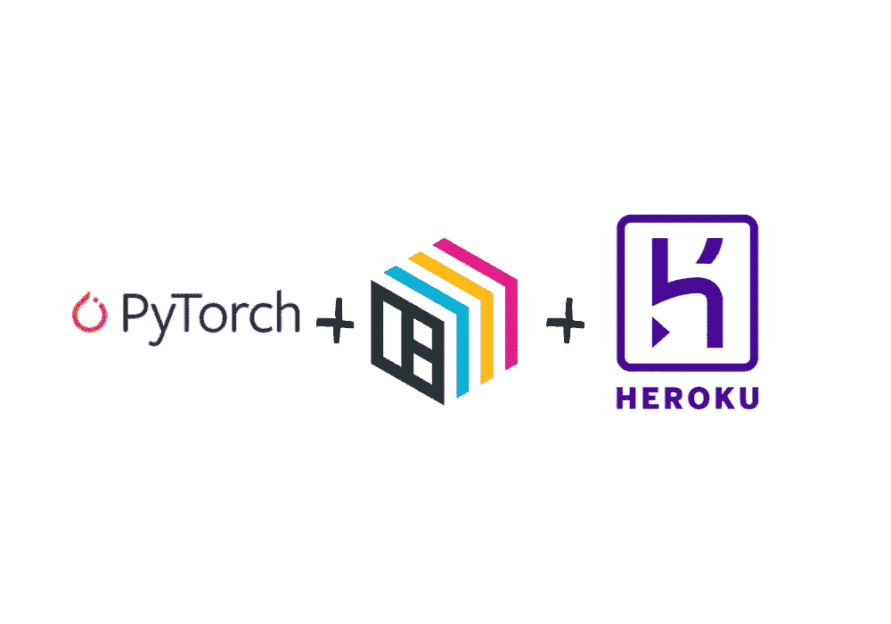

# PyTorch + BentoML + Heroku:简单的堆栈

> 原文：<https://towardsdatascience.com/pytorch-bentoml-heroku-the-simple-stack-65196aad181c?source=collection_archive---------30----------------------->



来源:我

## 以及如何训练和部署一个 ML 模型到产品中。

# 介绍

> “做简单的东西需要很多努力”

老实说，我对极简设计很着迷。它们既实用又有自己的美丽。这就是我如此热爱 UNIX 哲学的原因。它谈到了创建漂亮的工具，做一件事，做得很好，并与其他程序无缝地工作。一个设计良好的软件工具可以帮助你在创建产品时走得更远，并带来编程的艺术，我觉得这些工具接近于干净的设计，使得使用这些工具进行开发非常有趣和令人满意。

简单的工具也易于学习和教授，因为您可以从上到下地了解正在发生的事情。这就是为什么我使用这些工具向你展示如何制作深度学习模型，并将其放在云上供每个人使用。在本教程中，我们将应用迁移学习来训练 PyTorch 模型，如果给定一幅图像，它可以分辨出是蚂蚁还是蜜蜂。这是一个简单的模型，取自[官方 Pytorch 教程](https://pytorch.org/tutorials/beginner/transfer_learning_tutorial.html)。然后，我们将使用 BentoML 获取我们训练的模型，将其打包到一个容器中，并为其创建一个 API 端点。最后，我们将使用 Heroku(一个托管应用程序的云平台)来部署我们的模型，以便其他人可以使用它。

我不能深入到每一步，但我会确保你了解基本知识，这样，如果出现问题，你将能够找到自己的解决方案。

***注意:*** *有一个附带的*[*GitHub repo*](https://github.com/jjmachan/resnet-bentoml)*里面有本教程的所有代码，请下载并跟随。*

让我们开始吧！

# 在 PyTorch 中训练模型。

我假设您熟悉 PyTorch，并使用它训练过模型。如果没有，可以看看这些很棒的教程，更好地了解 Pytorch 端发生了什么。

1.  [py torch 60min Blitz](https://pytorch.org/tutorials/beginner/deep_learning_60min_blitz.html)——非常适合那些了解 ML 并且之前使用过另一个框架的人。
2.  Pytorch Zero to All——全面的 py torch 教程。
3.  里奇的《不可思议的 PyTorch》-一份其他令人敬畏的 py torch 资源列表。

培训是脚本化的，即使你没有编写 PyTorch，你也可以逃脱，但是我强烈建议你查看一下提到的资源。

正如我前面提到的，这一部分是建立在 PyTorch 关于迁移学习的官方教程之上的。基本上，我们采用在 ImageNet 数据集上预先训练的 ResNet 模型，并修改最后几层，以便它可以区分蚂蚁或蜜蜂的图片。

为了训练一个模型，我们需要数据。Pytorch 开发人员使用这个数据集进行训练。您可以下载、提取数据集并将其重命名为数据，也可以运行 get_data.sh 脚本来执行相同的操作

```
$ sh get_data.sh
```

现在我们可以训练模型了。我写了一个脚本来加载数据，定义模型并训练它。它是基于 PyTorch 教程的，所以请查看该教程以获得有关步骤的详细解释。奔跑

```
$ python train.py
```

这将在 GPU(或 CPU，如果它不可用)上运行脚本 25 个时期。该脚本将训练模型，并将其作为检查点保存在 saved_models 文件夹中。在 GPU 上训练大约需要 10 分钟，在 CPU 上需要 30 分钟。如果你没有 GPU，减少历元的数量。

训练后，脚本将询问您是否要将模型保存到便当中。暂时跳过这一步。

# 使用便当包装和上菜

BentoML 是一个帮助您为 ML 模型构建生产就绪的 API 端点的工具。所有的 ML 框架都被支持，像 TF，Keras，Pytorch，Scikit-learn 等等。它仍然相对较新，正在积极开发中，尽管当前的 API 对于生产使用来说已经足够稳定。因为这是一个新工具，我会告诉你更多。

## 核心概念

因此，BentoML 的主要思想是帮助数据科学团队更快地提供预测服务，同时根据 DevOps 的最佳实践轻松测试和部署模型。它几乎就像是您的模型的包装器，创建了一个 API 端点，使其更容易部署。以下是使用 BentoML 创建任何预测服务时需要用到的重要概念。

这是构建预测服务的基类，我们编写的所有服务都继承了这个类的所有属性。我们定义特定于 API 的属性，如端点期望什么类型的数据，依赖关系是什么，模型如何处理我们从端点获得的数据等等。简而言之，所有关于如何创建端点和打包模型的信息都是从这个类的属性中推断出来的。

**模型工件:**工件是经过训练的模型，使用 bento 打包。BentoML 支持不同的 ML 框架，这些框架将以它们自己的方式处理。模型工件根据对应于所使用的 ML 框架选择的工件自动处理序列化和反序列化。关于支持的工件的完整列表，请查看[文档](https://docs.bentoml.org/en/latest/api/artifacts.html)

**处理程序:**这些处理程序指定模型期望的数据类型。我可以是 JSON，熊猫数据帧，张量流张量，图像等。在[文件](https://docs.bentoml.org/en/latest/api/handlers.html)中给出了处理者的完整列表

**保存 BentoService:** 这就是神奇的地方。“便当”这个词来自日语，它是一个包装良好的饭盒，里面有各种不同的食物，如米饭、鸡肉、鱼、泡菜等，都整齐地装在一个盒子里，这完美地表示了便当。事实上，这基本上就是便当的全部功能。它会根据你的便当服务将你的模型打包成集装箱，准备好提供给全世界消费。

将模型保存在便当中

现在模型被装箱并保存到 saved_path 中。记下路径，因为我们将使用它为模型服务。现在我们可以检查我们通过在 bento 提供的开发环境中服务模型而创建的服务。现在您可以通过调用`saveToBento.py`脚本来保存模型。

```
$ python saveToBento.py *checkpoint_file*
```

这将打包并保存由训练脚本创建的检查点。训练脚本还有一个提示，询问您是否要在每次训练后保存。

你所要做的就是跑

```
$ bentoml serve IrisClassifier:latest
```

或者如果您知道 saved_path

```
$ bentoml serve *saved_path*
```

# 在 Heroku 上托管

Heroku 是一个云平台，让你不用太担心基础设施的细节就能交付你的应用。这是一个很棒的工具，因为它能让你做你喜欢的事情，也就是开发你的应用程序，Heroku 负责为数百万用户提供服务。

BentoML 目前没有对 Heroku 的内置支持(将在下一个版本中推出！)但只要稍加调整，我们就能实现它。BentoML 将我们的模型打包到 docker 容器中，我们可以使用 Heroku 的容器注册表部署 docker 容器。

首先，确保您安装了 Heroku-cli 和 Docker，并且您已经登录到 heroku-cli。现在导航到$saved_path，bento 在这里打包了我们的模型。就像我说的，它已经是集装箱化的了，但是 Heroku 要求我们对 Dockerfile 做一些修改，以便使用它的集装箱注册。

在此之前，先说一下 docker。Docker 可以轻松打包你的应用程序及其所有依赖项，这样它就可以轻松地在不同的系统中运行，而无需设置和环境。这使得开发人员非常容易，因为他们可以确保他们在开发系统中编写的应用程序将在生产系统中运行，而无需额外的设置，因为 docker 将所有这些依赖项打包到其中。这基本上定义了在 docker 文件中设置环境所需的所有步骤。该文件包含设置和运行应用程序的所有说明。此外，需要注意的是，这款应用并不能直接在你的设备上运行。它运行在 Linux 容器上，这些容器位于主机系统的 Linux 内核之上，并在它自己的隔离环境中运行应用程序。要了解更多关于 docker 的信息，请查看这个令人敬畏的博客。

回到我们的例子，如果您检查$saved_path 中的 Dockerfile，我们可以看到它公开了端口 5000。这是为了让我们的服务器 Gunicorn 监听来自这个端口的请求。另一方面，Heroku 要求使用其容器注册中心部署的容器监听 Heroku 设置的端口。使用环境变量$PORT 将端口号传递给它。所以我们的脚本必须在$PORT 而不是 5000 上运行我们的服务器。

为此，我们将最后一个 CMD 命令从

```
CMD ["bentoml serve-gunicorn /bento $FLAGS"]
```

到

```
CMD bentoml serve-gunicorn /bento --port $PORT
```

另外，注释掉 EXPOSE 5000 和 ENTRYPOINT 来处理 Heroku。最终的 docker 文件将是这样的

现在让我们在我们的系统上运行它，检查是否一切正常。首先，通过运行以下命令构建 docker 映像

```
$ docker build . -t resnet_heroku
```

这将用标记名 resnet_heroku 构建图像。现在运行 docker 容器

```
docker run -p 5000:5000 -e PORT=5000 resnet_heroku
```

*   -p 将我们的 5000 端口绑定到容器的端口
*   -e 将环境变量$PORT 传递给 docker

转到 localhost:5000 并检查是否一切正常。如果很棒，就推给 Heroku 吧！

使用以下命令首次登录 Heroku 的容器注册表

```
$ heroku container:login
```

Heroku 将所有内容存储为应用程序，以创建 Heroku 应用程序运行

```
heroku create -a *app_name*
```

现在，您可以构建 BentoService 并将其推送到您的 Heroku 应用程序。

```
$ heroku container:push web --app *app_name*
```

并发布应用程序

```
$ heroku container:release web --app *app_name*
```

恭喜你刚刚向全世界发布了你的第一个 ML API！让我们试一试。从互联网上下载任何显示蚂蚁和蜜蜂的图片，并使用 curl 将其传递给 API。

```
$ curl POST https://ant-bee-classifier.herokuapp.com/predict -H "Content-Type: image/*" --data-binary @image.jpg -v
```

这将从 API 中输出结果。如果没有，并且出现了问题，尝试通过运行以下命令来检查日志

```
$ heroku logs --tail -a *app_name*
```

# 结论

至此，您已经学会了使用“简单堆栈”来训练和推动一个模型进入生产。这对于简单的设置来说是完美的，这样你就可以用最少的工作把你的 ML 模型放到世界上。