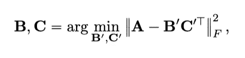
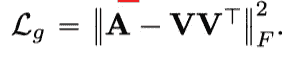
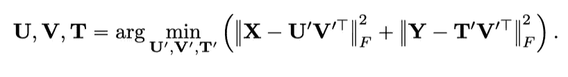

# 矩阵分解的 PyTorch 实现

> 原文：<https://towardsdatascience.com/pytorch-implementation-of-matrix-factorization-391bfc003e43?source=collection_archive---------21----------------------->

## 用 Python 从头开始实现矩阵分解

尼克·希利尔在 [Unsplash](https://unsplash.com?utm_source=medium&utm_medium=referral) 上的照片

# 什么是矩阵分解

矩阵分解(MF)(例如，概率矩阵分解和非负矩阵分解)技术已经成为许多现实场景的关键，包括图形表示和推荐系统(RecSys)，因为它们是发现数据背后隐藏属性的强大模型。更具体地说，非负矩阵分解(NNMF)是多元分析和线性代数中的一组模型，其中矩阵 A(维数 B*C)被分解为 B(维数 B*d)和 C(维数 C*d)

矩阵分解公式

其中 F 表示 Frobenius 范数。

矩阵分解背后的思想是在一个低维的潜在空间中表示用户和项目。广泛应用于推荐系统和降维中。尽管有许多 Python 库可以执行矩阵分解，但从头构建算法可能有助于理解基础知识。此外，有许多复杂的情况时，矩阵分解库不能处理。在这篇文章中，我将展示如何在 PyTorch 中用不同的用例实现矩阵分解，这些用例是**普通 MF 库不能很好执行的**。

# 示例 1:

**图形表示:**

给定一个图 G = (E，V)，V 是节点的集合，E 是边的集合。G 的邻接矩阵用 V * V 矩阵 a 表示，其中如果节点 Vi 与节点 Vj 之间有边 E，则 Xij = 1，否则 Xij =0。按照前面的公式，我们可以通过最小化损耗将节点 V 表示成 V * d 矩阵

示例 1 损失公式

在这种情况下，我们将矩阵分解成一个单一的矩阵，这通常是大多数库不支持的。为了解决这个问题，我们使用 PyTorch 构建一个只有一层的神经网络模型，并将 SGD 优化器应用于反向传播梯度。损失函数可以用神经网络来表示。ms loss(reduction = ' sum ')，即 Frobenius 范数和。重要的是要确保分解矩阵和矩阵的乘积没有非正值，因为非负矩阵分解(NNMF)。您可以应用 torch Threshold(0，0)函数将每个历元中的所有负值标记为 0，或者添加一个 Relu 输出图层。

# 代码实现:

# **例 2:**

**带有电影标签的用户电影记录系统:**

在现实应用中，处理 RecSys 中的冷启动问题非常重要，因为每天都有新电影问世。用户电影 RecSys 不能很好地处理这个问题，因为没有用户以前看过新电影。这是 MF 技术的变体，通过结合电影标签的信息来缓解冷启动问题。

给定用户 U、电影 V 和电影标签 t 的集合。设 X 是 U*V 矩阵，表示评级项目的用户历史，其中如果第 I 个用户 Ui 没有对第 j 部电影 Vj 进行评级，则 Xij = 0，否则 Xij =(0，5)表示 Ui 对电影 Vj 的评级范围从 1 到 5。设 Y 是表示电影标签信息 T*V 矩阵，其中如果电影 Vj 用 Ti 标记，则 Yij = 1，否则 Yij = 0。因此，您可以将用户 U、电影 V 和标签 T 表示为 U、V 和 T，其中

示例 2 损失公式

在这种情况下，我们正在进行乘法矩阵分解，并使总和的总损失最小化。这也很难用普通的 MF 库来实现。然而，使用 PyTorch，我们只需要重新定义损失函数。

# 代码实现:

感谢您的阅读，我期待听到您的问题和想法。如果你想了解更多关于数据科学和云计算的知识，可以在 [**Linkedin**](https://www.linkedin.com/in/andrewngai9255/) **上找我。**

照片由[阿尔方斯·莫拉莱斯](https://unsplash.com/@alfonsmc10?utm_source=medium&utm_medium=referral)在 [Unsplash](https://unsplash.com?utm_source=medium&utm_medium=referral) 上拍摄

*参考*

*https://developers . Google . com/machine-learning/recommendation/collaborative/matrix*

*https://en . Wikipedia . org/wiki/Matrix _ factorization _(recommender _ systems)#:~:text = Matrix % 20 factorization % 20 is % 20a % 20 class，two % 20 lower % 20 dimensionality % 20 rectangular % 20 matrices。*