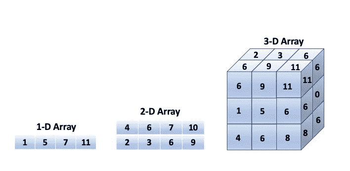
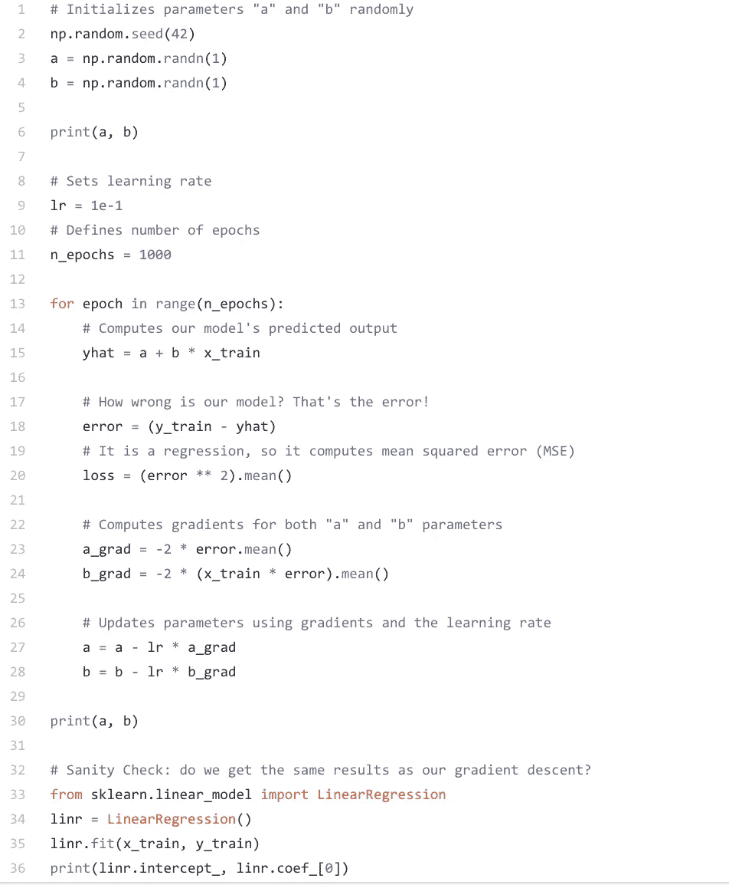
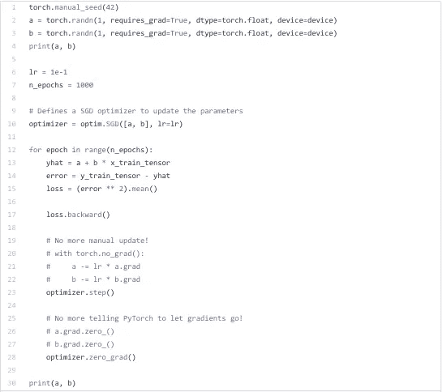

# Python 中的 PyTorch

> 原文：<https://towardsdatascience.com/pytorch-in-python-77ab9fab1b39?source=collection_archive---------39----------------------->

对深度学习和人工智能感兴趣？PyTorch 是一个基于 Python 的计算库，它使用图形处理单元的能力。当谈到深度学习研究平台时，它受到许多人的青睐。这里有一些关于 PyTorch 和一些可能的真实应用程序的见解。

照片由 [Maximalfocus](https://unsplash.com/@maximalfocus?utm_source=unsplash&utm_medium=referral&utm_content=creditCopyText) 在 [Unsplash](https://unsplash.com/s/photos/neural-network?utm_source=unsplash&utm_medium=referral&utm_content=creditCopyText) 上拍摄

首先，让我从解释 PyTorch 将如何对您有用开始。PyTorch 有许多不同的用途，但主要用于替代 NumPy 使用 GPU 的能力，以及提供灵活性和速度的深度学习研究平台。

# 机器学习/深度学习

人工智能本质上是构建智能机器，这些机器能够执行通常需要人类智能才能完成的任务。它包括机器学习和深度学习。机器学习为计算机系统提供了从经验中学习和改进的能力，但无需显式编程，即开发可以自行访问数据并从中学习的计算机程序。深度学习是机器学习、算法和神经网络的子集，其灵感来自人类从大量数据中学习。深度学习算法重复执行一项任务，并在每次迭代中进行调整，以提高结果的成功程度。术语“深度学习”指的是神经网络中能够进行学习的深层。深度学习的一个流行例子是虚拟助手，如 Siri 或 Alexa，它们从你使用的语音和语言中学习，以更好地提高性能。你可能听说过谷歌的人工智能，用于增强人的能力。请看一下[的关于页面**这里**。](https://ai.google/about/)

> “谷歌的使命是组织世界上的信息，并使其普遍可用和有用。人工智能正在以令人兴奋的新方式帮助我们做到这一点，为我们的用户、客户和世界解决问题。”

# 入门指南

说到使用 PyTorch，我建议从学习 Python 编程语言和面向对象编程的基础开始。面向对象编程提供了一种结构化程序的方法，将属性和行为捆绑到对象中。一个对象可以代表一个人，其属性包括姓名和年龄，行为包括走路和跳舞。和往常一样，最好看一下文档，以获得函数及其参数的参考，您可以在这里找到**。**

**当谈到创建模型时，比如下面的线性回归模型，你需要掌握张量，以便在深度学习中使用。张量是线性代数中使用的一种数据结构类型。你可以用张量计算算术运算，就像用向量和矩阵一样。假设您正在使用如下所示的 NumPy 数组。**

****

**作者图片**

**最右边的三维数组是一个张量。标量有零维，向量有一维，矩阵有二维，张量有三维或更多维。然而，向量和矩阵也是张量，任何东西不是标量就是张量。这些是用于数据的张量，它们也可以用作可训练参数。用作可训练参数或权重的张量需要计算其梯度。PyTorch 支持 GPU 加速张量计算来解决此类问题。它通过许多不同的包来做到这一点，如自动签名、动态计算图、优化器、损失计算和模型。**

1.  ****亲笔签名**:一个自动微分包，让我们能够忽略偏导数和链式法则。它会为我们计算所有的梯度。**
2.  ****动态** **计算图**:深度学习框架维护一个计算图，显示需要执行的计算顺序。能够使用动态图是一件大事，因为不同的框架(如 Tensorflow 和 Theano)只允许您创建静态图。这意味着在运行模型之前，您必须定义整个图形。在 PyTorch 中，您可以在运行时定义或调整您的图形。**
3.  ****优化算法**:获取我们想要更新的参数、期望的学习率，并使用其 *step()方法执行这些更新。*这通常通过使用计算的梯度手动更新参数来完成。这对于只有几个变量的情况来说还不算太糟，但是对于多个参数来说肯定会变得更加困难。**
4.  ****损失计算** : PyTorch 包括许多损失函数，因为下面的例子是一个回归，我们将使用 MSE(均方差)损失来计算给定预测和标签的损失。**
5.  ****模型**:py torch 中的模型用继承自**模块**类的 **Python 类**来表示。`***__init__(self)***`*:**定义了组成模型的不同部分——在我们的例子中，有两个参数， **a** 和 **b** 。***

***线性回归是一种非常常用的预测分析形式。它用于显示或预测两个变量之间的关系，方法是检查一组预测变量，看它们是否能成功预测因变量的结果。此外，通过帮助确定哪些变量特别是结果变量的重要预测因素。这是一个来自《走向数据科学》的线性回归模型的例子。***

******

***图片来自丹尼尔·戈多伊/走向数据科学***

***为了训练一个模型，有两个初始化步骤**:*****

***参数/权重的随机初始化(我们只有两个， *a* 和 *b* ) —第 3 行和第 4 行；***

***超参数的初始化(在我们的例子中，只有*学习率*和*周期数* ) —第 9 行和第 11 行；***

***确保*始终初始化您的随机种子*，以确保结果的**再现性**。***

*****对于每个时期**，有**四个训练步骤**:***

***计算模型的预测—这是**正向传递** —第 15 行；***

***使用*预测*和*标签*以及手头任务的适当**损失函数**计算损失——第 18 行和第 20 行；***

***计算每个参数的**梯度**——第 23 行和第 24 行；***

*****更新**参数—第 27 行和第 28 行***

***现在来看看使用 PyTorch 的众多好处之一。下面的代码创建了一个随机梯度下降优化器来更新 a 和 b 参数。由于优化器接受学习率和参数，它将简单地用 *step()* 方法执行更新。***

******

***图片来自丹尼尔·戈多伊/走向数据科学***

***戈多伊特区(2020 年 6 月 2 日)。通过示例了解 PyTorch:分步教程。检索自[*https://towardsdatascience . com/understanding-py torch-with-a-a-a-example-a-step-tutorial-81 fc 5 f 8 C4 E8 e*](/understanding-pytorch-with-an-example-a-step-by-step-tutorial-81fc5f8c4e8e)***

# ***结论***

***虽然不使用 PyTorch 也能完成上述任务，但该库将为您提供更快、更直观的体验。这是可能的，因为 PyTorch 的框架开销很小。当与 NVIDIA 或英特尔 MKL 等加速库集成时，它可以快速处理小型和大型神经网络。除了速度更快和用户友好之外，由于为 GPU 编写的自定义内存分配器，它在内存使用方面非常高效。总的来说，这是一个非常有用的 Python 包***

## ***参考资料:***

***美国首都戈多伊(2020 年 6 月 2 日)。通过示例了解 PyTorch:分步教程。检索自[*https://towards data science . com/understanding-py torch-with-a-a-a-a-example-a-step-tutorial-81 fc 5 f 8 C4 E8 e*](/understanding-pytorch-with-an-example-a-step-by-step-tutorial-81fc5f8c4e8e)***

****布朗利，J. (2019 年 12 月 5 日)。NumPy 机器学习张量的温和介绍。检索自*[*https://machine learning mastery . com/introduction-to-tensors-for-machine-learning/*](https://machinelearningmastery.com/introduction-to-tensors-for-machine-learning/)***

****佩雷斯，C. E. (2019 年 3 月 1 日)。PyTorch，动态计算图和模块化深度学习。检索自*[*https://medium . com/intuition machine/py torch-dynamic-computational-graphs-and-modular-deep-learning-7e 7 f 89 f 18d 1*](https://medium.com/intuitionmachine/pytorch-dynamic-computational-graphs-and-modular-deep-learning-7e7f89f18d1)***

****真正的蟒蛇。(2020 年 5 月 22 日)。Python 3 中的面向对象编程(OOP)。检索自*[*https://real python . com/python 3-面向对象编程/# what-is-object-oriented-programming-OOP*](https://realpython.com/python3-object-oriented-programming/#what-is-object-oriented-programming-oop)***

****Shetty，s .，Shetty，s .，Gall，r .，Lobo，s .，Davis，v .，Sunith ShettyData Science。(2018 年 9 月 20 日)。PyTorch 是什么，它是如何工作的？检索自*[*https://hub . packtpub . com/what-is-py torch-and-how-do-it-work/*](https://hub.packtpub.com/what-is-pytorch-and-how-does-it-work/)***