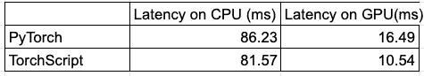
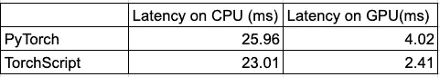

# PyTorch JIT 和 TorchScript

> 原文：<https://towardsdatascience.com/pytorch-jit-and-torchscript-c2a77bac0fff?source=collection_archive---------1----------------------->

## PyTorch 模型的生产之路


[来源](https://unsplash.com/photos/D-FI-GHZeVc?utm_source=unsplash&utm_medium=referral&utm_content=creditShareLink)

我们都喜欢 PyTorch 的动态性和易用性。但是当涉及到部署时，这些品质不如性能和可移植性那样令人满意。

在过去，部署需要迁移到不同的框架。从研究到生产的转变需要两个拥有不同技能的独立团队来实现。随着 TorchScript 的引入，这一过程发生了变化。

PyTorch 旨在通过 TorchScript 创建一个从研究到生产的统一框架。TorchScript 会将您的 PyTorch 模块作为输入，并将其转换为适合生产的格式。

它将更快地运行您的模型，并且独立于 Python 运行时。

# PyTorch 生态系统

PyTorch 支持两种不同的模式来处理研究和生产环境。

首先是 ***急切模式。*** 它是为了更快的原型制作、训练和实验而建造的。

其次是 ***脚本模式。*** 它专注于生产用例。它有两个组件 ***PyTorch JIT*** 和***torch script****。*

## 为什么我们需要脚本模式？

一句话，它摆脱了 Python 的 GIL 和对 Python 运行时的依赖。一个微妙的解释如下

1.  ***可移植性***
    *可移植性*允许模型部署在多线程推理服务器、手机和汽车中，这对于 Python 来说是很困难的。为了实现这一点，PyTorch 模型需要与任何特定的运行时解耦。
2.  ***性能***
    PyTorch JIT 是一款针对 PyTorch 的优化 JIT 编译器。它使用运行时信息来优化 TorchScript 模块。它可以自动优化，如层融合，量化，稀疏化。

# 脚本模式

脚本模式创建 PyTorch Eager 模块的中间表示(IR)(通过`torch.jit.trace/torch.jit.script`)。IR 经过内部优化，并在运行时利用 PyTorch JIT 编译。PyTorch JIT 编译器使用运行时信息来优化 IR。这个 IR 与 Python 运行时是分离的。

脚本模式通过利用 PyTorch JIT 和 TorchScript 来工作。

## PyTorch JIT 是什么？

PyTorch JIT 是一个为 PyTorch 程序优化的编译器。

1.  它是一个轻量级的线程安全解释器
2.  支持易于编写的自定义转换
3.  这不仅仅是为了推断，因为它有自动差异支持

## TorchScript 是什么？

TorchScript 是 Python 语言的静态高性能子集，专门用于 ML 应用程序。它支持

1.  复杂的控制流
2.  公共数据结构
3.  用户定义的类

我们已经介绍了 PyTorch JIT、TorchScript 和脚本模式。
我们讨论了它们是什么，以及我们为什么需要它们？在下面的片段中，我们将了解如何使用它们？

脚本模式由`torch.jit.trace`或`torch.jit.script`调用。

## JIT 跟踪

`torch.jit.trace`取一个数据实例和你训练好的 eager 模块作为输入。tracer 运行提供的模块并记录执行的张量运算。这段录音被转换成一个 TorchScript 模块。

> *跳到示例 1，查看它的运行情况*

它可以重用现有的 eager 模型代码，并且可以处理几乎任何具有独占 torch 张量/操作的程序。

它的主要缺点是省略了所有的控制流、数据结构和 python 结构。它也可以在没有任何警告的情况下产生不忠实的陈述。总是检查它的 IR，看它是否正确地解析了 PyTorch 模型的结构。

## JIT 脚本

`torch.jit.script`允许你直接将代码写入 TorchScript。它更加冗长，但是更加通用，稍加调整就可以支持大多数 PyTorch 模型。

与跟踪模式相反，你只需要将你的模型/模块的一个实例传递给`torch.jit.script.`，而不需要数据样本。

> *跳到实例 2 的实际应用*

它保留了控制流和其他 python 结构，看起来更像 Python。它对列表/字典有一流的支持。

它省略了常量值，并且需要类型转换。如果没有提供类型，则默认为张量

对于一次会议来说，这是太多的理论了，让我们转到代码上，看看运行中的跟踪/脚本。

# 例子 1:伯特

BERT(来自变压器的双向编码器表示)是由谷歌人工智能的研究人员开发的。在下面的例子中，我们利用了 HuggingFace 提供的 transformer 库中的 BERT。

该示例分为 3 个部分

*   第 1 部分
    初始化 BERT 模型/记号化器，并创建一个用于推理的样本数据

第 1 部分:实例化 BERT/Tokenizers

*   第 2 部分:
    为 CPU/GPU 上的推理准备 PyTorch 模型。

> 模型/数据应该在同一设备上，以便进行训练/推理。`cuda()`将模型/数据从 CPU 传输到 GPU。

第 2 部分:在 CPU/GPU 上对 PyTorch 模型进行基准测试

*   步骤 3:
    准备 TorchScript 模块，以便在 CPU/GPU 上进行推理

第 3 部分:CPU/GPU 上 TorchScript 模块的基准测试



伯特的 PyTorch vs TorchScript

在 CPU 上运行时间相似，但在 GPU 上 TorchScript 明显优于 PyTorch。

TorchScript 创建 PyTorch 模型的 IR，可以在运行时由 PyTorch JIT 进行优化编译。可以使用`traced_model.code`查看该红外图像。

# 示例 2: ResNet

ResNet 是残差网络的缩写，是一种经典的神经网络，用作许多计算机视觉任务的主干。这款车型是 2015 年 ImageNet 挑战赛的冠军。

以下示例有两个部分

*   示例 1.1 / 1.2:
    PyTorch ResNet 在 CPU/GPU 上的初始化和推理
*   示例 2.1/2.2: `torch.jit.script`CPU/GPU 上的初始化和推理

PyTorch 和脚本的 ResNet 示例

TorchScript 明显优于 PyTorch 在 GPU 上的实现。



PyTorch vs 的 TorchScript

# 辅助部件

## 如何保存/加载 TorchScript 模块？

TorchScript 将模块保存/加载为归档格式。这个档案是模型的独立表示，可以加载到一个完全独立的进程中。

*   保存模块`torch.jit.save(traced_model,’traced_bert.pt’)`
*   加载模块`loaded = torch.jit.load('traced_bert.pt')`

## 如何查看 TorchScript 捕捉到的 PyTorch IR？

*   示例 1:使用`traced_model.code`查看 PyTorch IR
    跳过这一步，因为它非常冗长
*   示例 2:使用`script_cell_gpu.code`查看 PyTorch IR

```
def forward(self,
    input: Tensor) -> Tensor:
  _0 = self.fc
  _1 = self.avgpool
  _2 = self.layer4
  _3 = self.layer3
  _4 = self.layer2
  _5 = self.layer1
  _6 = self.maxpool
  _7 = self.relu
  _8 = (self.bn1).forward((self.conv1).forward(input, ), )
  _9 = (_5).forward((_6).forward((_7).forward(_8, ), ), )
  _10 = (_2).forward((_3).forward((_4).forward(_9, ), ), )
  input0 = torch.flatten((_1).forward(_10, ), 1, -1)
  return (_0).forward(input0, )
```

## 结合跟踪和脚本

torch.jit.trace 和 torch.jit.script 可以结合起来弥补各自的不足。看这个[官方举例](https://pytorch.org/tutorials/beginner/Intro_to_TorchScript_tutorial.html#mixing-scripting-and-tracing)。他们通过内嵌代码来做到这一点。

## 其他好处

除了改进推理时间，使用 TorchScript 还有其他好处

*   TorchScript 将您的模型从任何运行时环境中分离出来。它摆脱了 Python 的 GIL，这是多线程推理的一个主要瓶颈。
*   TorchScript 专注于整个程序的优化。
*   TorchScript 自动优化神经网络中的常见模式，以改善延迟和吞吐量。
*   TorchScript 模块可以导出到各种环境中，从 C++服务器到移动设备。

# 摘要

这个博客引入了脚本模式。从功能上来说，脚本模式提供了将您的研究模型投入生产的工具，同时仍然处于 PyTorch 生态系统中。

重申一下，这是模型开发和部署的典型路径。

*   步骤 0:开发你的模型，最好是在 PyTorch 渴望模式下
*   步骤 1:在 PyTorch 模型上使用`torch.jit.trace`或/和`torch.jit.script`创建 TorchScript 模块
*   步骤 2:使用这种格式的`torch.jit.save/torch.jit.load.`将这些模块转移到生产环境中，它们可以在从服务器到边缘设备的任何地方运行
*   步骤 3:使用 PyTorch JIT 编译器在推理时优化这些程序，以最小的努力享受更快的推理。

# 参考

1.  [Torchscript + PyTorch JIT](https://www.youtube.com/watch?v=2awmrMRf0dA)
2.  [从研究到生产](https://www.youtube.com/watch?v=St3gdHJzic0)
3.  [PyTorch 文档](https://pytorch.org/tutorials/beginner/Intro_to_TorchScript_tutorial.html#saving-and-loading-models)
4.  [为变压器模型使用 TorchScript】](https://huggingface.co/transformers/serialization.html)