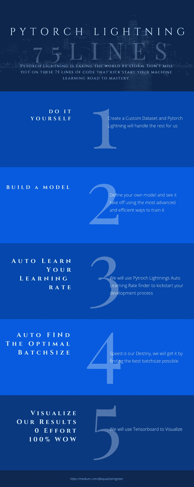

# Pytorch 闪电机器学习零到英雄 75 行代码

> 原文：<https://towardsdatascience.com/pytorch-lightning-machine-learning-zero-to-hero-in-75-lines-of-code-7892f3ba83c0?source=collection_archive---------12----------------------->

## Pytorch 闪电正席卷全球。不要错过这 75 行代码，它们开启了你掌握机器学习的道路。我们将涵盖提前停止、自动批量缩放、自动学习率查找、动态批量大小、Pytorch 中的数据集、保存您的模型和可视化。都在 75 行以下。



我们的掌握之路，作者图片

# 基础知识

Pytorch Lightning 具有显著减少开发时间的特性。一旦你理解了基础知识，你的效率就会神奇地提高。在引擎盖下，闪电仍然是 Pytorch，但更容易和更快地工作。你不必担心大多数事情。坐下来放松，闪电开始工作了。

> 注意:我将在本文中展示基于 CPU 的代码，但会在本文的底部添加一个基于 GPU 的版本(微小的差异)

进口和基础

正如我们所看到的，我们简单地导入了所有很酷的特性，我们已经准备好了。一旦我们使用了它，我们将逐一查看它们

# 1.数据集

我们现在将定义我们自己的数据集，Lightning 从那里处理它。我们也可以从互联网上加载一个，但是知道如何将我们自己的数据放入模型是关键！

9 行，这基本上还是普通的 Pytorch。dataset 是 PyTorch 的一个类，它允许我们利用许多好处。我们要做的就是让我们的类继承“数据集”。一个数据集类至少需要这三个方法。

今天我们将构建一个非常简单的模型，它将学习预测所有输入元素的总和是否大于 0，或者是 0 和 0。最终，我们返回一个元组(特征，标签),这样 Lightning 就可以完成它的工作。

__len__: Pytorch 想知道数据集中有多少样本。self.dataset.size()返回我们表的维度(42，21000)[0]取元组的 42 our，这是我们的长度。

2.模型

让游戏开始吧。我们现在将定义一个非常简单但功能强大的模型！Lightning 中的一个模型需要继承“LightningModule”。为了让 Lightning 模型工作，我们至少需要定义 __init__()、forward()、train_dataloader()和 training_step()函数。我们甚至还会定义一些比宙斯本人更耀眼的特性。

# 我们的模型

__init__():这里我们基本上只是定义了一个线性层模型，每个模型有 2048 个节点，我们将在后面的步骤中使用它们。此外，我们定义了 self.lr 和 self.batch_size，以便稍后使用 Lightning 自动学习特性。是的，你没听错，我们将在训练时学习它们！

forward():这是我们模型的核心和灵魂。在这里，我们定义了信息如何流经我们的模型。我们基本上只是按顺序调用我们的层，并在最后做一个简单的整形以保持一致。基本上，这里的输入是我们的电子表格中的一行，然后通过我们的管道，最终输出将在 0 和 1 之间。

configure_optimizer:我们定义了一个 adam 优化器，这是帮助我们学习的东西。我们使学习速度可调，这样我们也可以学习那个

train_dataloader():这个函数必须返回一个数据加载器。数据加载器是一个帮助 Pytorch 将训练样本输入模型的对象，它处理使用的批量大小并节省大量代码。我们简单地抛出我们在 1 中定义的数据集。并说我们将生成 43210 个样本。啊，生活有时会比在隔离区无聊更简单。

接下来的 for 函数对我们来说基本上是一点重复的工作。我们定义了一个损失函数，这样亚当就知道优化什么。验证数据加载器与我们刚刚编程的是同一个东西，它帮助我们简单地获得一个好的比较集，这样我们就可以稍后实现早期停止。剩下的只是为我们超级酷的可视化汇总统计数据。

3.自动学习你的学习速度

恭喜你，最后一段代码将是你的奖励。我们将定义一个简单的 main 函数来启动杀手管道。

# 我们的主要

让我们一起来！首先，我们使用了很酷的函数 seed_everything(42 ),这将极大地帮助我们提高运行的可重复性。虽然它不能使机器学习完全可预测，但它肯定有助于消除大多数随机性。

在这个例子中，我们将使用我们的 CPU，所以我们不需要启动我们的机器。但是用 GPU 运行它也一样容易，我会把 GPU 代码留在最下面(4 行不同)

早期停止是避免过度拟合的一个很好的机制。通过这个简单的调用，我们可以监控验证损失。一旦训练损失和验证损失出现分歧，模型将停止训练。我们可以假设我们既没有过拟合也没有欠拟合机器学习中的两个主要问题。

在我们将模型投射到 CPU 上之后，我们就可以启动我们的训练器了！这基本上是所有的，我们现在可以开始学习和适应我们的模型。在这之后，我们简单地保存我们的模型，我们就完成了。让我们来看看这两个节省时间的功能，我爱这两个功能胜过我心爱的猫，它们可以让我每周节省一整天的工作时间。

培训过程

**提前停止**


正如我们可以看到在大约 21 个时期的早期停止命中，这是进一步训练不能进一步减少验证损失的点。培训师只需停在那里并选择该型号。

## 自动学习你的学习速度

这可能是迄今为止发现的最有用的机器学习功能之一。不再需要调整学习速度，不再需要网格搜索，一切尽在掌握。那么它是如何工作的呢？我们只需打开训练器中的“auto_lr_find = True”标志，就可以开始了。这基本上做什么它测试几个学习率，并检查哪一个是国王。它通过测试选择的批次的损失减少了多少来做到这一点。要了解更多细节，我可以推荐优秀的论文“[训练神经网络的循环学习率](https://arxiv.org/abs/1506.01186)”或者更简单、更实用的解释，https://github.com/davidtvs/pytorch-lr-finder非常直接地解释了一个非常相似的过程。

## 学习率是习得的

4.自动学习您的批量大小


另一个可以节省大量思考能力的杀手锏。当我在一个有几个不同类型的集群上工作时，它帮助我计算出 GPU 可以运行多少个批处理，这是一个天赐的发明。要打开它，我们只需设置“auto_scale_batch_size=True”。

# 危险警告:当您同时运行自动批处理和自动学习率时，这些过程将花费很长时间(但它会工作)。所以首先找到理想的批量，然后使用学习率查找器。

了解批量大小

在进行任何训练之前，自动批量缩放会自动尝试找到适合内存的最大批量。虽然这个简单的例子不会让我们碰到天花板，但是一旦你运行了你的严肃模型，这个收敛会非常快。


5.形象化

还有一件事。我们在这 75 行中编码的内容足以用 tensorboard 进行简单的可视化。运行代码后，将创建一个名为 lightning_logs 的文件夹，并使用我们的运行结果进行填充。我们所要做的就是运行带有 logdir 标志的 tensorboard 命令，我们就可以很好地分析我们所做的事情了！

# 如我们所见，我们记录了验证损失和培训损失。我们只是通过将它返回到 validation_step/training_step 函数中来实现这一点。这些图是用 X 轴上的批次绘制的，我们可以通过在 validation_epoch_end 函数中只返回各时期的聚合值来改变这一点。

结论

```
tensorboard --logdir=lightning_logs/
```


我们看到了生活是多么简单。Pytorch Lightning 可能是最简单的功能模块之一。虽然我们没有涵盖所有功能，但我们从我的角度看了最重要的功能。另外值得一提的是半精度训练、多 GPU 支持以及各种日志记录和数据集缩减功能。

# 你现在有技能和知识来训练你的第一个模型，用你翅膀下的闪电速度运载。请确保继续关注我，了解您的机器学习模型和管道中更多的生产力和性能技巧。

如果你喜欢这篇文章，我会很高兴在 Twitter 或 LinkedIn 上联系你。

一定要看看我的 [YouTube](https://www.youtube.com/channel/UCHD5o0P16usdF00-ZQVcFog?view_as=subscriber) 频道，我每周都会在那里发布新视频。

完整代码

Make sure to check out my [YouTube](https://www.youtube.com/channel/UCHD5o0P16usdF00-ZQVcFog?view_as=subscriber) channel, where I will be publishing new videos every week.


# Full Code