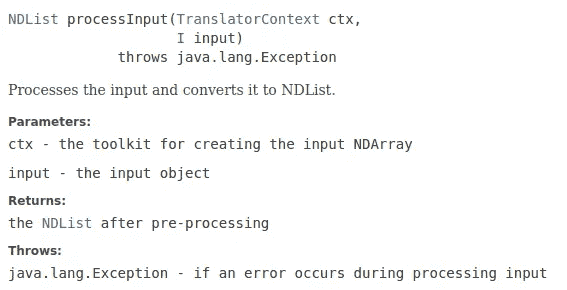

# 深度 Java 库中的 Pytorch 模型

> 原文：<https://towardsdatascience.com/pytorch-model-in-deep-java-library-a9ca18d8ce51?source=collection_archive---------20----------------------->

## 从 PyTorch 模型构建到 DJL 推理的简单端到端工作流程


在 [Unsplash](https://unsplash.com?utm_source=medium&utm_medium=referral) 上由 [Max Duzij](https://unsplash.com/@max_duz?utm_source=medium&utm_medium=referral) 拍照

[PyTorch](https://ai.facebook.com/tools/pytorch/) 是一个快速发展且非常流行的开源机器学习框架。它的命令式设计与类似“numpy”的工作流程相结合，使它成为初学者和专业人士的首选。然而，在生产中服务这些模型并不简单，如果目标是在 Java 中本地服务它们，事情会特别困难。

亚马逊的 [Deep Java Library](https://docs.djl.ai/docs/quick_start.html) (DJL)旨在通过提供高级 API 来解决这个特殊的痛点，这些 API 可以用很少的代码在 PyTorch 模型上运行推理。我最近与 DJL 的试驾告诉我，它可能是一个非常强大的工具，但现有的示例集和社区指南(也称为 stackoverflow help:)可能会让新手感到有点害怕，特别是那些来自 python 背景并且不熟悉 java 风格的人。希望这个简单的演示能让他们的工作更轻松。所有的脚本也可以在我的 git repo [这里](https://github.com/bhattacharyya/DJL_Pytorch_Demo)获得。

让我们首先用 PyTorch 创建一个简单的线性回归模型。

```
import torch
import torch.nn as nnX = torch.tensor([[1],[2],[4],[7],[9]], dtype = torch.float32)
Y = torch.tensor([[2],[4],[8],[14],[18]], dtype = torch.float32)X_test = torch.tensor([[5]], dtype=torch.float32)n_sample, n_features = X.shapemodel = nn.Linear(n_features, n_features)learn_rate = 0.01
n_epochs = 500loss = nn.MSELoss()
optimizer = torch.optim.SGD(lr = learn_rate, params=model.parameters())for i in range(0,n_epochs):
    y_pred = model(X)
    ls = loss(y_pred,Y) ls.backward()
    optimizer.step()
    optimizer.zero_grad() [w,b] = model.parameters() traced_cell = torch.jit.trace(model, X_test) #print(traced_cell(X_test).item()) print(f"{ls.item():0.3f}, {w[0][0].item():0.3f {model(X_test).item():0.3f}")traced_cell.save('./model1.zip')
```

模型(模型 1)学习获取输入 n 并预测 2 * n。

上面的脚本中有两行代码是 PyTorch 脚本中没有的。

```
1\. traced_cell = torch.jit.trace(model, X_test) 
2\. traced_cell.save('./model1.zip')
```

这两行是创建一个 [TorchScript](https://pytorch.org/tutorials/beginner/Intro_to_TorchScript_tutorial.html) 模型(序列化 pytorch 模型)所必需的，该模型可以在高性能环境中以与语言无关的方式使用。我们现在将使用这个模型通过 DJL 来进行推论。我用了一个运行 Java 内核的 Jupyter 笔记本来做这个演示。

1:获得所有需要的 maven 依赖项。DJL 支持 pytorch 模型开箱即用。SLF4J 用于伐木。

```
%maven ai.djl.pytorch:pytorch-engine:0.8.0
%maven ai.djl.pytorch:pytorch-native-auto:1.6.0
%maven org.slf4j:slf4j-simple:1.7.26
```

如果出现“未知解析器为空”的错误，现在可以忽略它们。

2:导入所需的模块

```
import ai.djl.*;
import ai.djl.inference.*;
import ai.djl.ndarray.*;
import ai.djl.translate.*;
import java.nio.file.*;
```

这里值得强调一下 [ndarray](/ndarray-a-java-based-n-dim-array-toolkit-60b4035b10b8) 的导入。n 维数组是许多语言中流行的数据结构，numpy(python 中的 ndarray 库)在深度学习领域或几乎任何涉及数值计算的应用程序中都非常普遍。

Java 没有类似的 ndarray 实现。DJL 通过上述导入提供了 ndarray 功能。这是允许 DJL 使用 PyTorch 模型的关键因素之一。

3.声明模型路径和模型名称。这假设您正在使用一个本地生成的模型。DJL 也提供了一些可以直接使用的标准模型。

```
Path modelDir = Paths.get("Path_To_Your_Model_Folder/");
Model model = Model.newInstance("model name");
model.load(modelDir);
model
```

当前的 DJL 文档说模型可以。zip，。tar，. tar.gz，.tgz 或. tar.z

如果模型加载正确，您应该会看到类似 ai . djl . py torch . engine . pt model @ 4c EFA 68 f 的输出

4.翻译器处理预处理和后处理步骤。

```
Translator<Float, Float> translator = new Translator<Float, Float>(){ @Override
    public NDList processInput(TranslatorContext ctx, Float input) {
        NDManager manager = ctx.getNDManager();
        NDArray array = manager.create(new float[] {input});
        return new NDList (array);
    }

    @Override
    public Float processOutput(TranslatorContext ctx, NDList list) {
        NDArray temp_arr = list.get(0);
        return temp_arr.getFloat();
    }

    [@](http://twitter.com/Override)Override
    public Batchifier getBatchifier() {
        // The Batchifier describes how to combine a batch together
        // Stacking, the most common batchifier, takes N [X1, X2, ...] arrays to a single [N, X1, X2, ...] array
        return Batchifier.STACK;
    }
};
```

这是最让大多数人困惑的一步。翻译器定义了输入和输出数据类型的签名。在我们的例子中，它们都是浮点数。确保使用 float，而不是 Float，因为显式需要引用。这个翻译步骤不是可选的。

此外，如果您查看[预处理器](https://javadoc.io/doc/ai.djl/api/0.4.1/ai/djl/translate/PreProcessor.html)的 DJL 文档，您会发现 NDList 是提供给模型的预处理输出的预期类型。



因此，即使假设您的输入已经是 NDList 类型，您仍然需要执行这一步。

[后处理](https://javadoc.io/doc/ai.djl/api/0.4.1/ai/djl/translate/PostProcessor.html)的情况类似。它使用 NDList 并输出您的翻译器描述的类型。

以上三条也是强制性的。当然，DJL 提供了预实现的翻译器，我推荐你去探索它们，尤其是图像处理的。

5.做出预测

祝贺您，您已经完成了艰苦的工作，离做出推论只有几行代码了。他们在这里

```
Predictor<Float, Float> predictor = model.newPredictor(translator);
predictor.predict(Your_Test_Float)
```

对于我的测试用例，我做了 predictor.predict(2.9f)，它输出 5.799781。啊，纯粹的快乐！

因此，我们看到了如何创建 PyTorch 模型，并在 Java 环境中使用该模型进行推理。尽管这是一个非常简单的用例。对于更高级的用例，让翻译人员正确地进行预处理和后处理可能需要一些迭代。此外，内置模块(如图像处理模块)的数量目前很少。

不过，我相信 DJL 将会迅速发展，并可能成为在 Java(或 C++)环境中利用 PyTorch 模型的完美库，实现开发速度和高性能的完美结合。