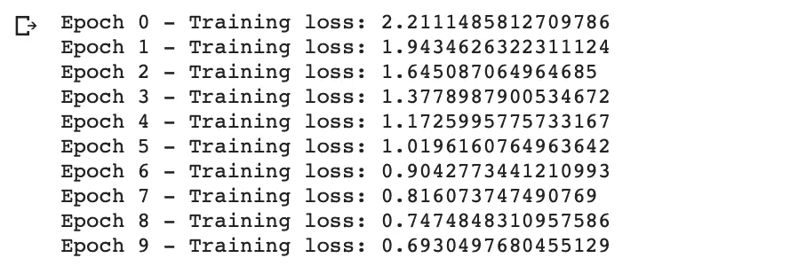
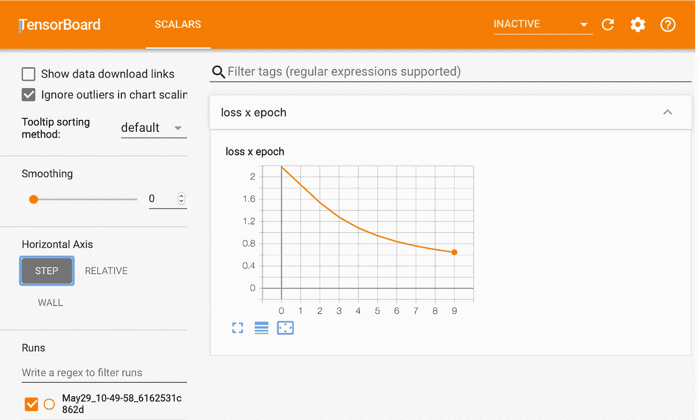
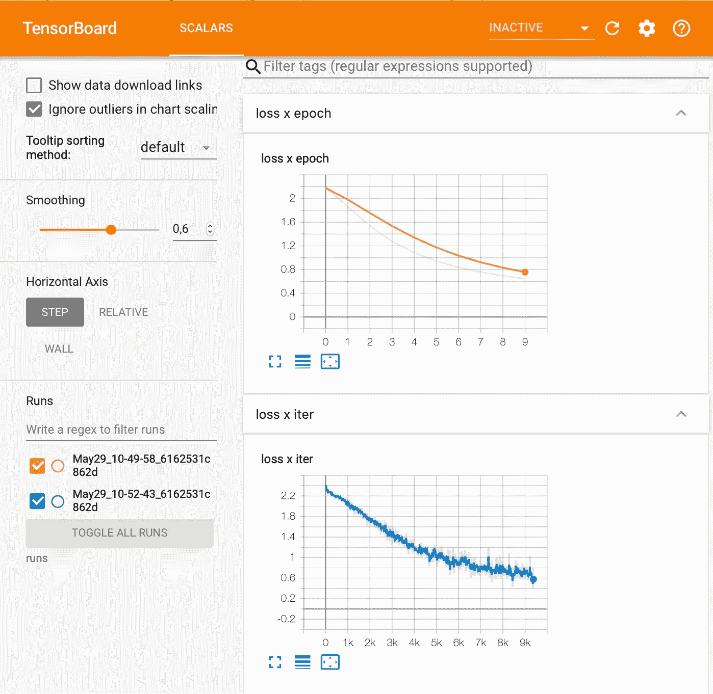
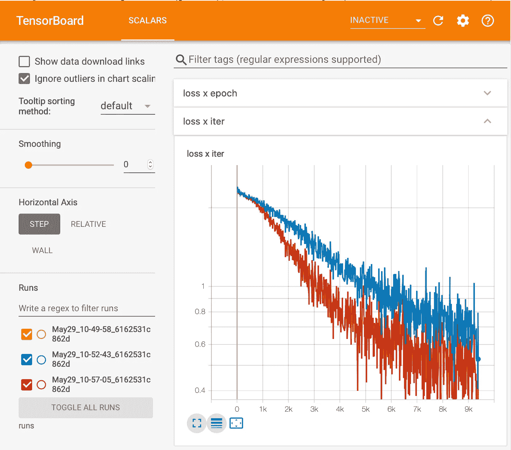
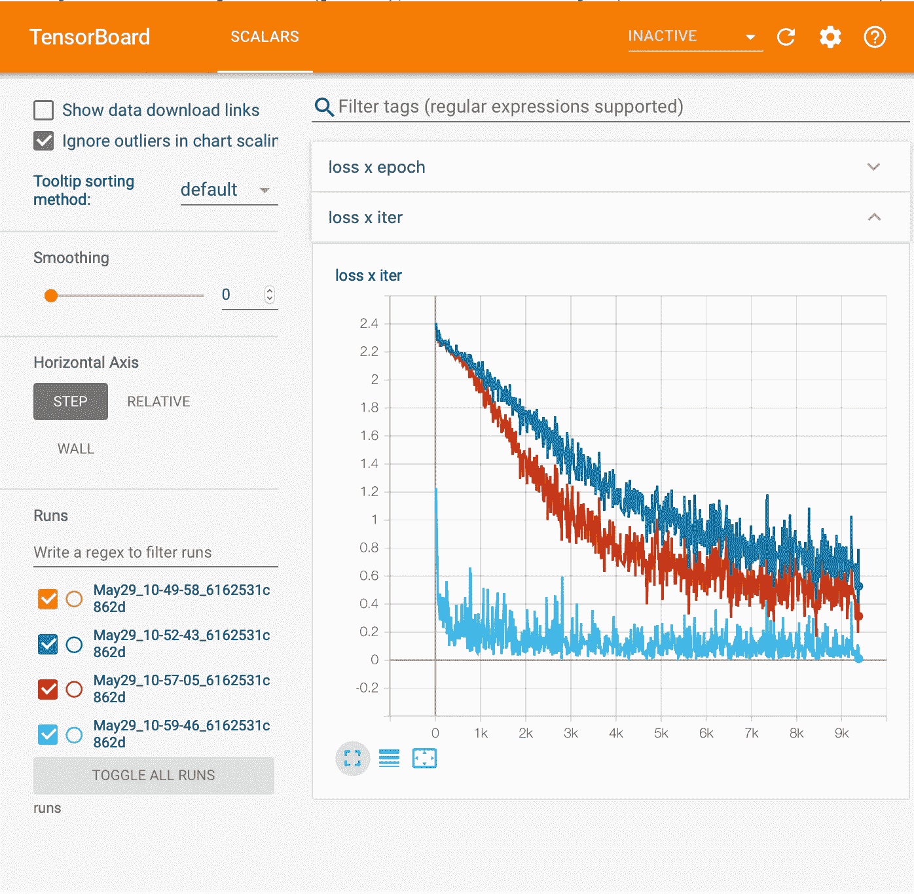

# 使用 TensorBoard 的 PyTorch 性能分析

> 原文：<https://towardsdatascience.com/pytorch-performance-analysis-with-tensorboard-7c61f91071aa?source=collection_archive---------33----------------------->

## [深度强化学习讲解— 05](https://towardsdatascience.com/tagged/deep-r-l-explained)

## 如何在 Colab 中运行 PyTorch 的 TensorBoard


[去年，脸书宣布](https://ai.facebook.com/blog/pytorch-adds-new-dev-tools-as-it-hits-production-scale/)[py torch](https://pytorch.org)的 1.1 版本支持 [TensorBoard](https://www.tensorflow.org/tensorboard) (TensorFlow 的可视化工具包)。TensorBoard 提供了深度学习实验所需的可视化和工具。毫无疑问，TensorBoard 是一个非常有用的工具，可以用来理解神经网络的行为，并在训练过程中帮助我们处理超参数。

TensorBoard 是 TensorFlow 生态系统中的一个可视化工具，可用于绘制各种定量指标和几个中间计算的结果。在这篇文章中，我们将强调我们需要开始使用它的主要功能。在以后的文章中，我们会根据需要引入新的特性。PyTorch 文档中说明其功能的详细教程可以在[这里](https://pytorch.org/tutorials/intermediate/tensorboard_tutorial.html)找到。

接下来，我们将对在 Colab 中设置 Tensorboard 的步骤做一个大致的描述和总结，这在这一系列的文章中肯定会对我们非常有用。

# Colab 环境

在这篇文章中，我们假设你想在谷歌研究项目 [*合作实验室*](https://colab.research.google.com/) (Colab)中运行 TensorBoard。正如我们在之前的帖子中所描述的，它基本上由一个 Jupyter 笔记本环境组成，不需要任何配置，完全在云中运行，允许使用不同的深度学习库，如 [PyTorch 和 TensorFlow](/tensorflow-or-pytorch-146f5397278a) 。关于该服务的详细信息可以在[常见问题页面](https://research.google.com/colaboratory/faq.html)上找到。

> 跟随[这个链接](https://github.com/jorditorresBCN/Deep-Reinforcement-Learning-Explained/blob/master/DRL_05_PyTorch_Performance_Analysis_with_TensorBoard.ipynb)你可以把这篇文章的代码当作一个谷歌笔记本来执行。

# 设置张量板

要设置 TensorBoard，您只需遵循以下步骤:

**1-** 从`torch.utils`导入`tensorboard`定义一个`SummaryWriter`，我们向 TensorBoard 写入信息的关键对象:

```
**from** torch.utils.tensorboard **import** SummaryWriter
```

**2-**tensor board 将在其中查找要消费的记录的默认日志文件夹是`runs`。我们可以说得更具体些:

```
writer **=** SummaryWriter('runs/working_directory')
```

注意，这一行单独创建了一个`runs/working_directory`文件夹。

为了表明我们已经完成注册，我们可以调用对象的`close`方法:

```
writer.close()
```

**3-** 加载 TensorBoard 笔记本扩展:

```
%load_ext tensorboard
```

**4-** 启动张量板:

```
tensorboard  --logdir=runs
```

# 使用示例

为了展示 TensorBoard 的用法，我们建议使用[上一篇文章](https://medium.com/p/a93b09bdae96/edit)中的相同代码:

```
import torch
import torchvisionimport numpy as np
EPOCHS = 10
BATCH_SIZE= 64xy_trainPT = torchvision.datasets.MNIST(root=’./data’, train=True, download=True,transform=torchvision.transforms.Compose([torchvision.transforms.ToTensor()]))xy_trainPT_loader = torch.utils.data.DataLoader(xy_trainPT, batch_size=BATCH_SIZE)def model(hidden):
    model= torch.nn.Sequential(
           torch.nn.Linear(784,hidden),
           torch.nn.Sigmoid(),
           torch.nn.Linear(hidden,10),
           torch.nn.LogSoftmax(dim=1)
           )
    return modelmodelPT = model(10)
criterion = torch.nn.NLLLoss()
optimizer = torch.optim.SGD(modelPT.parameters(), lr=0.01)
```

运行下面两行代码后:

```
from torch.utils.tensorboard import SummaryWriter%load_ext tensorboard
```

我们已经可以像上一篇文章那样进行第一次训练，但现在我们还将查看损失图表。以下代码突出显示了添加的行:

```
**writer = SummaryWriter()**for e in range(EPOCHS):
    running_loss = 0
    for images, labels in xy_trainPT_loader:
        images = images.view(images.shape[0], -1)
        output = modelPT(images)
        loss = criterion(output, labels)
        loss.backward()
        optimizer.step()
        optimizer.zero_grad()
        running_loss += loss.item()
    print(“Epoch {} — Training loss: {}”.format(e,   
           running_loss/len(xy_trainPT_loader)))
    **writer.add_scalar(“loss x epoch”, 
           running_loss/len(xy_trainPT_loader), e)****writer.close()**
```



我们可以通过调用 TensorBoard 来查看结果:

```
tensorboard  --logdir=runs
```



记住，包含数据的文件存储在`runs`文件夹中。通过选择左侧菜单中的文件夹图标，我们可以看到这一点:


但是，如果我们需要知道每次迭代(超过 9000 次迭代)的损失是如何下降的，我们无法通过简单的打印来完成，我们需要一个更图形化的表示:

```
modelPT = model(10)
criterion = torch.nn.NLLLoss()
optimizer = torch.optim.SGD(modelPT.parameters(), lr=0.01)def training_loop():
 **writer = SummaryWriter()**  iter_no=0
  for e in range(EPOCHS):
    running_loss = 0
    for images, labels in xy_trainPT_loader:
        images = images.view(images.shape[0], -1)
        output = modelPT(images)
        loss = criterion(output, labels)
        loss.backward()
        optimizer.step()
        optimizer.zero_grad()
        running_loss += loss.item()
 **writer.add_scalar("loss x iter", loss.item(), iter_no)**        iter_no += 1
 **writer.close()**training_loop()
```

本次运行的信息已保存在`runs`文件夹下的新目录中。我们可以通过再次运行以下命令来查看结果:

```
tensorboar --logdir=runs
```



但是也许我们感兴趣的是比较，例如，具有更多神经元的神经网络的行为。让我们试试这个有 32 个神经元的神经网络的例子:

```
modelPT = model(32)
criterion = torch.nn.NLLLoss()
optimizer = torch.optim.SGD(modelPT.parameters(), lr=0.01)
training_loop()
```

当记录数据时，我们可以使用相同的图形名称(在本例中为“loss x ITER”)**在相同的图形上绘图。这种情况下的结果将是:**

****

**我们可以看到两种网络中的损耗行为的比较。或者说，用另一个优化器来代替 SGD 这个 Adam 怎么样？**

```
modelPT = model(32)
criterion = torch.nn.NLLLoss()
optimizer = torch.optim.Adam(modelPT.parameters(), lr=0.01)
training_loop()
```

****

**在这种情况下我们可以看到它收敛得更好！**

**这只是 TensorBoard 提供的机会的一小部分。我邀请读者自己探索这个强大的工具，它也为其他中间件服务，特别是 TensorFlow，TensorBoard 就是在这个框架中创建的。**

**下一个帖子见！**

> **这篇文章的全部代码可以在 GitHub 上找到**

# **深度强化学习讲解系列**

****由** [**UPC 巴塞罗那理工**](https://www.upc.edu/en) **和** [**巴塞罗那超级计算中心**](https://www.bsc.es/)**

**一个轻松的介绍性[系列](https://torres.ai/deep-reinforcement-learning-explained-series/)以一种实用的方式逐渐向读者介绍这项令人兴奋的技术，它是人工智能领域最新突破性进展的真正推动者。**

**[](https://torres.ai/deep-reinforcement-learning-explained-series/) [## 深度强化学习解释-乔迪托雷斯。人工智能

### 本系列的内容](https://torres.ai/deep-reinforcement-learning-explained-series/) 

# 关于这个系列

我是在五月份开始写这个系列的，那是在巴塞罗那的封锁期。老实说，在业余时间写这些帖子帮助了我 [**#StayAtHome**](https://twitter.com/hashtag/StayAtHome?src=hashtag_click) 因为封锁。感谢您当年阅读这份刊物；它证明了我所做的努力。

**免责声明** —这些帖子是在巴塞罗纳被封锁期间写的，目的是分散个人注意力和传播科学知识，以防对某人有所帮助，但不是为了成为 DRL 地区的学术参考文献。如果读者需要更严谨的文档，本系列的最后一篇文章提供了大量的学术资源和书籍供读者参考。作者意识到这一系列的帖子可能包含一些错误，如果目的是一个学术文件，则需要对英文文本进行修订以改进它。但是，尽管作者想提高内容的数量和质量，他的职业承诺并没有留给他这样做的自由时间。然而，作者同意提炼所有那些读者可以尽快报告的错误。**