# py torch:CRAFT 和四阶段网络的场景文本检测和识别

> 原文：<https://towardsdatascience.com/pytorch-scene-text-detection-and-recognition-by-craft-and-a-four-stage-network-ec814d39db05?source=collection_archive---------5----------------------->

## 用 Python 实现成熟的文本检测和识别管道

疫情已经把我们锁在家里好几个月了。但是请记住，当生活正常的时候，我们会去购物，和朋友出去玩，看电影，在购物中心享受美食！

还有，你还记得每家商店都有独特的奇特的写法吗？像古驰、西尔斯、Pantaloons 和 Lifestyle 这样的流行品牌在他们的标志中使用弯曲或圆形字体。虽然所有这些都吸引了客户，但它确实对执行文本检测和识别的深度学习(DL)模型构成了挑战。

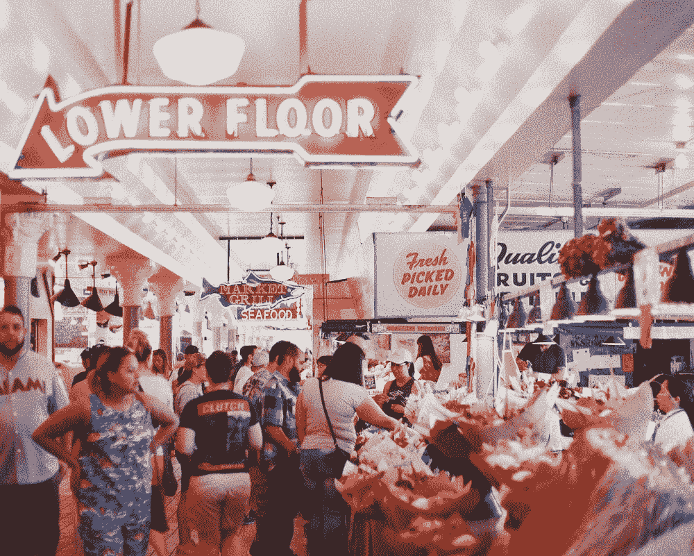

照片由泰勒·辛普森在 Unsplash 上拍摄

当你阅读横幅上的文字时，你会做什么？你的眼睛首先检测文本的存在，找出每个字符的位置，然后你识别这些字符。这也正是 DL 模型需要做的！

最近，OCR 已经成为深度学习中的一个热门话题，其中每个新的架构都在尽力超越其他架构。

广受欢迎的基于深度学习的 OCR 模块，Tesseract 在文档等结构化文本上表现出色，但在花式字体的弯曲、不规则形状的文本上表现不佳。

幸运的是，我们有 Clova AI 的这些令人惊叹的网络，它们在现实世界中出现的各种文本外观上胜过宇宙魔方。在这篇博客中，我们将简要讨论这些架构，并学习如何集成它们。

# 用 CRAFT 进行文本检测

**场景文本检测**是一项在复杂背景中检测文本区域并用包围盒标记它们的任务。

于 2019 年提出的 **CRAFT:用于文本检测的字符区域意识**的主要目标是定位单个字符区域，并将检测到的字符链接到文本实例。

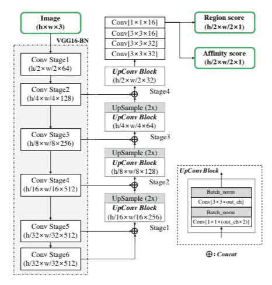

在[论文](https://arxiv.org/pdf/1904.01941.pdf)中给出的工艺网络

CRAFT 采用基于 VGG-16 的全卷积网络架构作为主干。简而言之，VGG16 本质上是一种特征提取架构，用于将网络输入编码为某种特征表示。工艺网的解码段类似于 UNet。它跳过了聚合低级功能连接。

CRAFT 为每个角色预测了两个分数:

*   **区域评分:**顾名思义，给出了人物所在的区域。它将角色本地化。
*   **亲和力得分:**‘亲和力’是一种物质倾向于与另一种物质结合的程度。因此，相似性分数将字符合并成单个实例(一个单词)。

CRAFT 生成两个地图作为输出:区域级别地图和亲缘关系地图。
让我们通过一个例子来理解它们的含义:

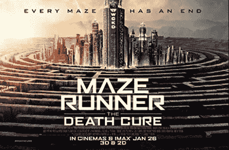

输入图像

人物出现的区域在区域图中标记出来:

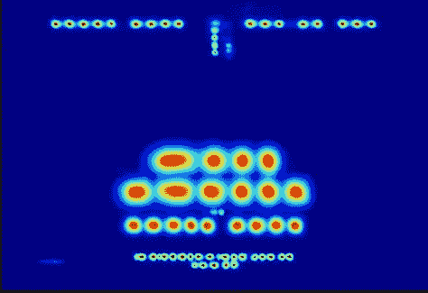

区域地图

亲和度图是相关字符的图像化表示。红色象征着人物有很高的亲和力，必须合并成一个词:

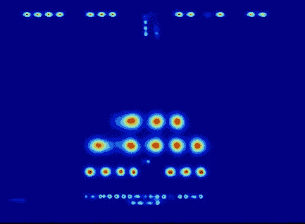

相似性地图

最后，结合相关度和区域分数来给出每个单词的包围盒。坐标的顺序是:
(左上)，(右上)(右下)，(左下)，其中每个坐标是一个(x，y)对。

为什么不遵循四点格式？
查看下图:你能把“爱”仅仅局限在 4 种价值观中吗？

布鲁诺·菲格雷多在 Unsplash 上拍摄的照片

CRAFT 是多语言的，这意味着它可以检测任何脚本编写的文本，而不仅仅是拉丁文！自己去看看吧:

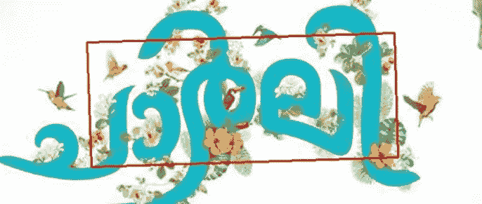

作者照片:红色边框

# **文本识别:F** 我们的舞台场景文本识别框架

2019 年，Clova AI 发表了一篇关于与现有场景文本识别(STR)数据集不一致的研究论文，并提出了一个大多数现有 STR 模型都适合的统一框架。

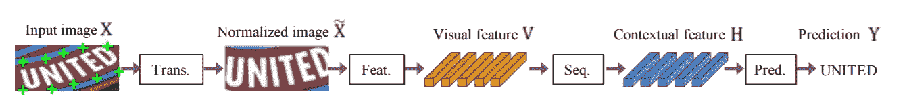

[网络提出的四个阶段](https://arxiv.org/pdf/1904.01906.pdf)

让我们来讨论这四个阶段中的每一个:

1.  **变换:**记住我们处理的是风景文字，是任意形状的，有曲线的。如果我们直接执行特征提取，还需要学习输入文本的几何形状，这是特征提取模块的额外工作。因此，STR 网络应用薄板样条(TPS)转换，并将输入文本规范化为矩形。
2.  **特征提取:**将变换后的图像映射到一组与字符识别相关的特征。字体、颜色、大小和背景被删除。作者在不同的主干网上进行了实验，即 ResNet、VGG 和 RCNN。
3.  **序列建模:**如果我写‘ba _ ’,你很有可能会猜测像‘d’，‘g’，‘t’这样的字母可能会填充空白，而不是‘u’，‘p’。我们如何教会网络捕捉上下文信息？比尔斯特姆斯！但是，BiLSTMs 占用内存，因此可以根据用户需要选择或取消选择该阶段。
4.  **预测:**这个阶段从图像的识别特征中估计输出字符序列。

作者进行了几个实验。他们为每个阶段选择了不同的网络。下表总结了精确度:

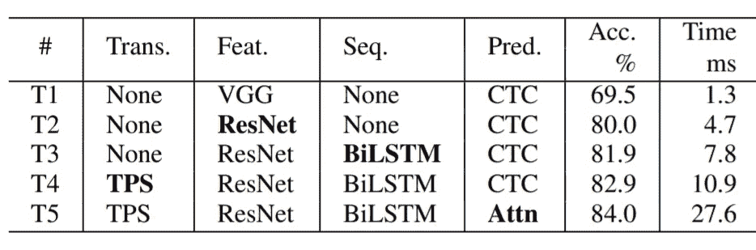

不同型号精度参考:[https://arxiv.org/pdf/1904.01906.pdf](https://arxiv.org/pdf/1904.01906.pdf)

此外，请注意，这个四阶段网络仅在拉丁脚本的语料库上进行训练。

现在我们清楚了 CRAFT 和四阶段 STR 是如何工作的，让我们来看看代码吧！

# 代码

CRAFT 预测每个单词的边界框。四阶段 STR 将单个单词(作为图像)作为输入，并预测字母。如果您正在处理像 CUTE80 这样的单个单词的图像，那么使用这些 DL 模块进行 OCR 将是一件轻而易举的事情。

但这种可能性有多大呢？我们的大多数用例涉及对大量图像的预测，如果没有，我们最有可能有带有多个文本外观的图像。如果我们有一个将两者结合起来的单一管道，那不是很好吗？

让我们编写自己的代码来组合它们！

**第一步:安装要求**

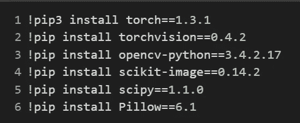

**第二步:Git 克隆存储库:**

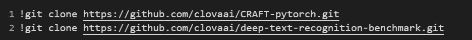

**第三步:修改返回检测框分数** CRAFT 返回超过一定分数阈值的包围盒。如果您想查看每个边界框的分值，我们需要对原始存储库进行一些更改。在克隆的 craft 存储库中打开 craft_utils.py。您需要将第 83 行和第 239 行改为如下所示。

**第四步:从 CRAFT** 中移除参数解析器打开 test.py，修改如下图。我们移除了参数解析器。

**步骤 5:编写一个单独的脚本，将图像名称和检测框坐标保存到一个 CSV 文件** 这将帮助我们裁剪需要作为四阶段 STR 输入的单词。它还帮助我们将所有与边框和文本相关的信息保存在一个地方。
创建一个新文件(我将其命名为 pipeline.py)并添加以下代码。

pandas DataFrame(可变数据)将图像名称和其中出现的单词的边界框存储在单独的列中。我们删除了图像的整个路径，只保留图像以避免笨拙。你显然可以根据自己的需求进行定制。您现在可以运行脚本了:

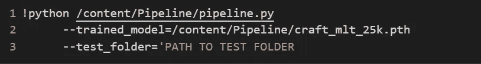

这个阶段的 CSV 是这样的。对于每个检测，我们存储一个 python 字典，其中存储了 **score: coordinates。**

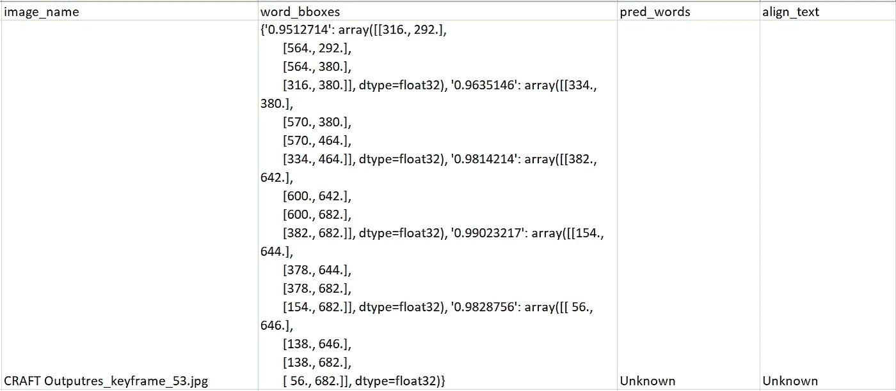

CSV 文件

**第六步:裁剪单词** 现在我们已经有了每个盒子的坐标和分数。我们可以设置一个阈值，并裁剪我们希望识别字符的单词。创建一个新的脚本 crop_images.py。记住在提到的地方添加你的路径。裁剪后的单词保存在“dir”文件夹中。我们为每张图片创建一个文件夹，并以这种格式保存从其中裁剪下来的单词:
<父图片> _ < 8 坐标由下划线>
分隔这也将帮助您跟踪每个裁剪的单词来自哪张图片。

运行脚本！

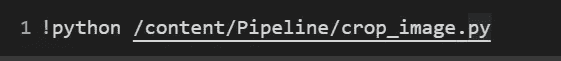

**第六步:认可(终于！)** 你现在可以对你裁剪出来的单词盲目运行识别模块了。但是如果你想让事情更有条理，请修改以下内容。我们在每个图像文件夹中创建一个. txt 文件，并将识别出的单词与裁剪图像的名称一起保存。
除此之外，预测的单词保存在我们维护的 CSV 中。

从 Clova AI STR Github 存储库下载权重后，可以运行以下命令:

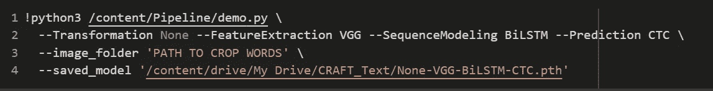

我们选择这种网络组合是因为它们的高精度。

CSV 现在看起来如下。pred_words 具有检测框坐标和预测字，由冒号分隔。

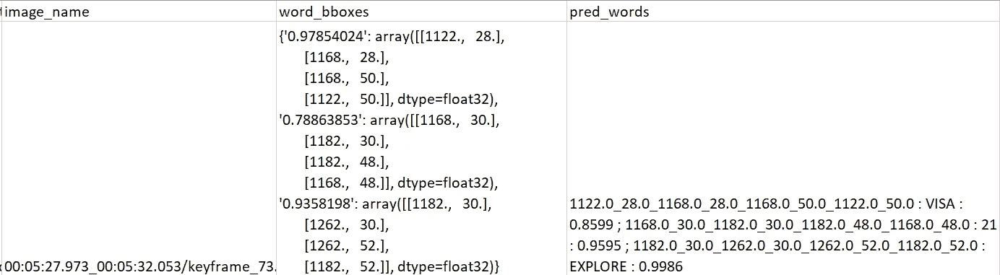

# 结论

我们已经集成了两个精确的模型来创建单个检测和识别模块。既然预测的单词和它们的边界框都在一列中，那么您就可以按照您想要的任何方式对齐文本了！