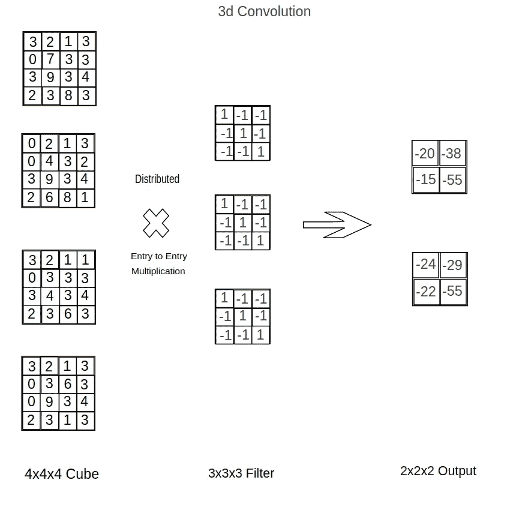

# Pytorch:逐步实现三维卷积神经网络

> 原文：<https://towardsdatascience.com/pytorch-step-by-step-implementation-3d-convolution-neural-network-8bf38c70e8b3?source=collection_archive---------1----------------------->

## 深度学习

## 了解如何编写 3d CNN 的 PyTorch 实现

照片由来自[佩克斯](https://www.pexels.com/photo/photo-of-mountain-with-ice-covered-with-black-and-gray-cloud-640781/?utm_content=attributionCopyText&utm_medium=referral&utm_source=pexels)的埃伯哈德·格罗斯加斯泰格拍摄

在本文中，我们将简要解释什么是 3d CNN，以及它与普通的 2d CNN 有何不同。然后我们会一步步教你如何用 **Pytorch** 实现自己的 3D 卷积神经网络。

这篇文章的一个非常重要的部分可以在我的另一篇关于 3d CNN 在 Keras 的实现的文章中找到。所以如果你倾向于用 Tensorflow/Keras 编码，那么这个链接可能是合适的。

本文将围绕这 **4 部分**展开:

*   **1】什么是 3D 卷积神经网络？**
*   **2】3d 数据是什么样子的？(例如 MNIST)**
*   **3】现在如何实施？！**
*   **4】但是然后一个 3d？为什么**

 [## 一步一步实现:Keras 中的 3D 卷积神经网络

### 了解如何实现您自己的 3D CNN

towardsdatascience.com](/step-by-step-implementation-3d-convolutional-neural-network-in-keras-12efbdd7b130) 

# 1]什么是 3D 卷积神经网络？

不管我们怎么说，3d CNN 仍然是一个与 2d CNN 非常相似的 CNN。不同之处在于以下几点(非穷尽列举):

**3d 卷积层**

最初，2d 卷积层是输入和不同滤波器之间的逐条目乘法，其中滤波器和输入是 2d 矩阵。(图 1)

图 1(权利:拥有)

在 3d 卷积层中，使用相同的操作。我们在多对 2d 矩阵上进行这些操作。(图 2)

图 2(权利:拥有)

填充选项和幻灯片步长选项的工作方式相同。

# 3d 最大池图层

2d Maxpool Layers (2x2 filter)是从输入中提取一个 2x2 小正方形的最大元素。(图 3)

图 3(权利:拥有)

现在，在 3d Maxpool (2x2x2)中，我们寻找宽度为 2 的立方体中的最大元素。此立方体代表由输入的 2x2x2 区域界定的空间。(图 4)

图 4(权限:拥有)

请注意，操作的数量(与 2d CNN 层相比)乘以所使用的过滤器的大小(不管该层是最大池还是卷积层)，还乘以输入本身的大小。

# 2]**3d 数据是什么样子的？**

那么 3d CNN 的数据点是什么样的呢？

描绘它的一种方法是使用下面的图像(图 5):

图 5(权限:拥有)

其他可用于 CNN 的现有数据集有:

*   RGB-D 设备:[谷歌 Tango](http://get.google.com/tango/) ，[微软 Kinect](https://developer.microsoft.com/en-us/windows/kinect) 等。
*   [激光雷达](https://en.wikipedia.org/wiki/Lidar)
*   [多幅图像的三维重建](https://en.wikipedia.org/wiki/3D_reconstruction_from_multiple_images)

# 3] **现在如何实现？！**

您可以亲自尝试我们正在使用的来自 [Kaggle](https://www.kaggle.com/daavoo/3d-mnist) 的数据集上的代码。

笔记本中将使用多个库。这是它的清单。

首先，由于数据集有点特殊，我们使用下面的 to helper 函数在将它们提供给网络之前对它们进行处理。

另外，数据集存储为 h5 文件，因此要提取实际的数据点，我们需要从 h5 文件中读取数据，并使用 to _ categorical 函数将其转换为向量。在这一步中，我们还要准备交叉验证。

假设变量 X_train/X_test 应该分别具有 shape (10000，16，16，16，3)和(2000，16，16，16，3)以及 targets _ train/targets _ test(10000，)(2000，)。但是我们现在再一次把它们转换成 PyTorch 张量格式。我们是这样做的。

这里的模型是我们将使用的**架构**:

**2 套 ConvMake:**

*   一个 3d 卷积层，两个集合的过滤器大小为 3x3x3，跨距为 1x1x1
*   泄漏的 Relu 激活功能
*   具有过滤器大小(2x2x2)和跨距(2x2x2)的 3d MaxPool 层

**2 个 FC 层**，分别有 **512** 和 **128 个节点。**

**第一 FC 层后的 1 个脱落层**。

然后，按照以下方式将模型转换成代码:

就参数而言，注意你的第一个完全卷积层的输入节点数。我们的数据集的形状是(16，16，16，3)，这就是我们如何得到大小为(2x2x2)的过滤输出。

如果您不熟悉 PyTorch 上的 CNN(即模型的参数或训练),那么可以考虑阅读 PyTorch 上的 CNN 简介！

 [## py torch:CNN 在 MNIST 的一步一步的实施

### 这里有一个关于如何在 PyTorch 中实现 CNN 及其优点的快速教程。我们一行一行地检查，以便您…

medium.com](https://medium.com/@michaelchan_2146/pytorch-real-step-by-step-implementation-of-cnn-on-mnist-304b7140605a) 

这是训练的代码。没什么特别的，你显然可以优化(更多！)例如，通过将优化器改为 Adam，调整学习速率(有一些动力)等等…

供您参考，经过小样本训练，我们得到了以下准确度和损耗。(图 6 和图 7)

图 6(权限:拥有)

图 7(权限:拥有)

# 4]但是然后一个 3d？为什么

3d CNN 碰巧有许多应用，例如:

*   IRM 的数据处理和由此得出的推论
*   自驾
*   距离估计

好了，差不多就这些了。我希望你尝试一下这项技术！源代码在这里[结束](https://github.com/miki998/3D_CNN)！

感谢您的阅读，如果您喜欢，请关注我、我的[网站](http://aitechfordummies.com/)和我的[脸书](https://www.facebook.com/aitechfordummies/)页面！