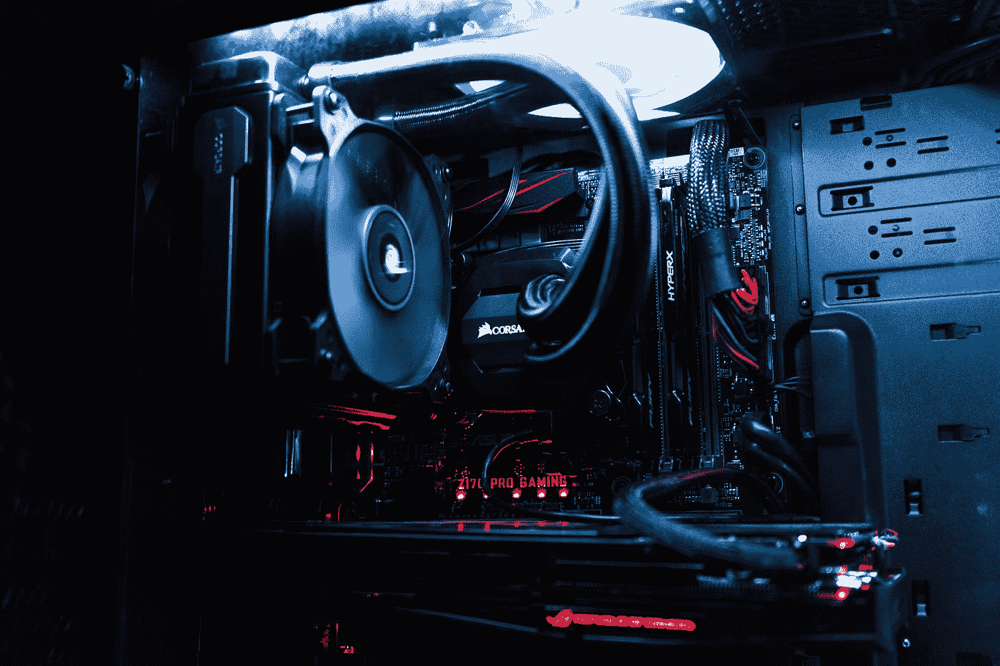
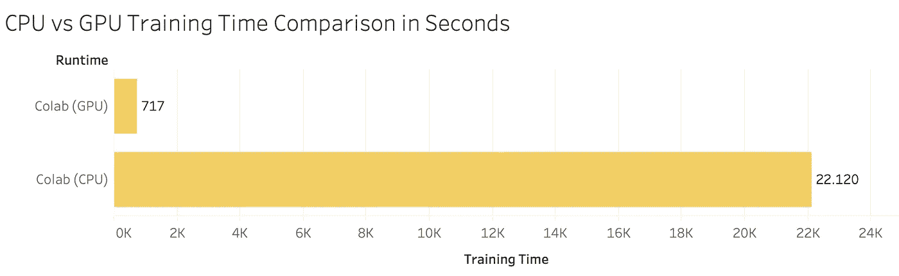

# PyTorch:切换到 GPU

> 原文：<https://towardsdatascience.com/pytorch-switching-to-the-gpu-a7c0b21e8a99?source=collection_archive---------2----------------------->

## 如何以及为什么在 GPU 上训练模型——包括代码。

与 TensorFlow 不同，PyTorch 没有为 GPU 用户提供专用的库，作为开发人员，您需要在这里进行一些手工操作。但是最后，它会节省你很多时间。



照片由 [Artiom Vallat](https://unsplash.com/@virussinside?utm_source=medium&utm_medium=referral) 在 [Unsplash](https://unsplash.com?utm_source=medium&utm_medium=referral) 上拍摄

如果你想知道，在你的机器上安装 CUDA 或者在 Colab **上切换到 GPU 运行时还不够。不要误解我的意思，这仍然是必要的第一步，但是仅仅这样做并不能充分利用 GPU 的能力。**

在本文中，您将了解如何针对以下场景从 CPU 切换到 GPU:

1.  训练/测试分离方法
2.  数据装载方法

第一个最常用于**表格数据**，而你每次处理**图像数据**时都会用到第二个(至少根据我的经验)。

这两种方法之间有相当多的差异，因此将对每一种方法进行深入解释。我还应该提到，我将在这篇文章中使用 **Google Colab** 。如果你还没有，你可以在这里阅读我的观点和更多相关内容:

[](/google-colab-how-does-it-compare-to-a-gpu-enabled-laptop-851c1e0a2ca9) [## Google Colab:它与支持 GPU 的笔记本电脑相比如何？

### Colab 简介、运行时、性能比较…以及疑难解答

towardsdatascience.com](/google-colab-how-does-it-compare-to-a-gpu-enabled-laptop-851c1e0a2ca9) 

这篇文章的结构如下:

1.  为什么要转 GPU？
2.  训练/测试分离方法
3.  数据加载器方法
4.  结论

所以事不宜迟，让我们开始吧！

# 为什么要转 GPU？

在你使用真正深度神经网络的情况下——例如**用 *ResNet152* 进行迁移学习**——对 CPU 的训练会持续很长时间。如果你是一个理智的人，你就不会试图那样做。

线性代数运算在 GPU 上并行完成，因此您可以将训练时间减少大约**100 倍**。不用说，但它也是在多个 GPU 上执行训练的一个选项，这将再次减少训练时间。

你不必相信我的话。我已经决定基于[这个数据集](https://s3.amazonaws.com/content.udacity-data.com/nd089/Cat_Dog_data.zip)做一个**猫和狗的分类器**。该模型基于 *ResNet50* 架构——首先在 CPU 上训练，然后在 GPU 上训练。

以下是训练时间:



GPU 运行时间:00:11:57h；CPU 运行时间:06:08:40 小时

自己判断吧，不过我还是坚持 GPU 运行时。它在 Colab 上是免费的，所以没有理由不这样做。好了，我们现在知道 GPU 应该用于模型训练，现在让我们看看如何进行切换。

# 训练/测试分离方法

如果你在 **Scikit-Learn** 中用 Python 做了一些机器学习，你肯定对训练/测试分割很熟悉。简而言之，这种想法是在数据集的一部分(假设 80%)上训练模型，并在剩余部分(假设 20%)上评估模型。

训练/测试分割仍然是深度学习中的一种有效方法——特别是对于表格数据。首先要做的是声明一个变量，它将保存我们正在训练的设备(CPU 或 GPU):

```
device = torch.device(**'**cuda**'** if torch.cuda.is_available() else **'**cpu**'**)
device**>>> device(type='cuda')**
```

现在我将声明一些虚拟数据，它们将作为 **X_train** 张量:

```
X_train = torch.FloatTensor([0., 1., 2.])
X_train**>>> tensor([0., 1., 2.])**
```

酷！我们现在可以检查张量是否存储在 GPU 上:

```
X_train.is_cuda**>>> False**
```

正如所料——默认情况下，数据不会存储在 GPU 上，但将数据移动到那里相当容易:

```
X_train = X_train.to(device)
X_train**>>> tensor([0., 1., 2.], device='cuda:0')**
```

干净利落。可以再次执行相同的健全性检查，这一次我们知道张量被移动到 GPU:

```
X_train.is_cuda**>>> True**
```

***很好，但是模型声明呢？***

我很高兴你问了。同样，这是一件非常简单的事情:

```
model = MyAwesomeNeuralNetwork()
model.to(device)
```

就这样，你现在可以开始训练了。简单回顾一下，这里有一个代码应该如何构建的总结:

```
X_train, X_test, y_train, y_test = train_test_split(X, y, test_size=0.2)
**X_train, X_test = X_train.to(device), X_test.to(device)
y_train, y_test = y_train.to(device), y_test.to(device)**class MyAwesomeNeuralNetwork(nn.Module):
    # your model heremodel = MyAwesomeNeuralNetwork()
**model.to(device)**# training code here
```

让我们继续使用数据加载器方法。

# 数据加载器方法

数据加载器方法在 CNN 中更常见，在这一节中，我们将了解如何将数据(图像)放在 GPU 上。第一步保持不变，因此你必须声明一个变量来保存我们正在训练的设备(CPU 或 GPU):

```
device = torch.device(**'**cuda**'** if torch.cuda.is_available() else **'**cpu**'**)
device**>>> device(type='cuda')**
```

现在，我们将声明我们的模型，并将其放在 GPU 上:

```
model = MyAwesomeNeuralNetwork()
model.to(device)
```

你可能已经注意到我们还没有在 GPU 上放置数据。**直接传输数据加载器是不可能的**，所以我们在这里必须更聪明一点。我们将在培训过程中传输图像，如下所示:

```
for epoch in range(epochs):
    for inputs, labels in train_loader:
        inputs, labels = inputs.to(device), labels.to(device)
```

因此，代码的整体结构应该如下所示:

```
class MyAwesomeNeuralNetwork(nn.Module):
    # your model heremodel = MyAwesomeNeuralNetwork()
**model.to(device)**epochs = 10
for epoch in range(epochs):
    for inputs, labels in train_loader:
        **inputs, labels = inputs.to(device), labels.to(device)**
        # backpropagation code here # evaluation
        with torch.no_grad():
            for inputs, labels in test_loader:
                **inputs, labels = inputs.to(device), labels.to(device)**
        # ...
```

而这就是你要做的一切——数据和模型都放在 GPU 上。

# 结论

这就是你想要的——两个步骤可以大大减少培训时间。起初，它看起来像是你需要执行的许多额外的步骤，但是一旦你掌握了它的要点，它就简单了。

我永远不会建议你在 CPU 上进行训练，感谢 Google Colab，你不必这样做——因为你可以免费使用 GPU 运行时。

感谢阅读。

*喜欢这篇文章吗？成为* [*中等会员*](https://medium.com/@radecicdario/membership) *继续无限制学习。如果你使用下面的链接，我会收到你的一部分会员费，不需要你额外付费。*

[](https://medium.com/@radecicdario/membership) [## 通过我的推荐链接加入 Medium-Dario rade ci

### 作为一个媒体会员，你的会员费的一部分会给你阅读的作家，你可以完全接触到每一个故事…

medium.com](https://medium.com/@radecicdario/membership)