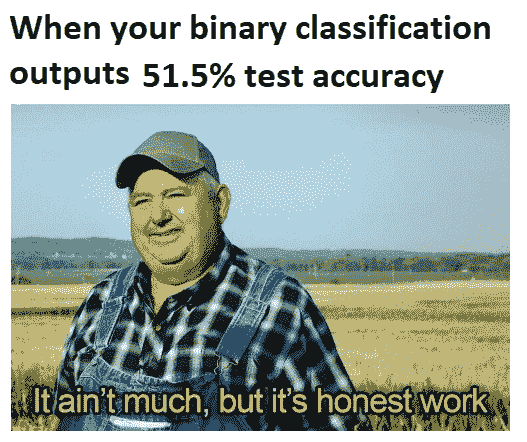
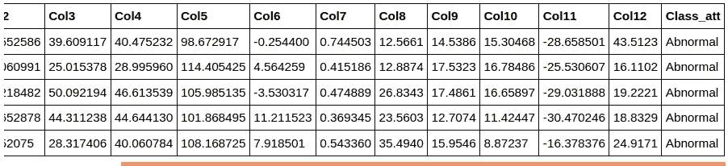
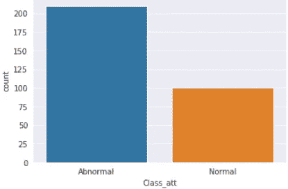
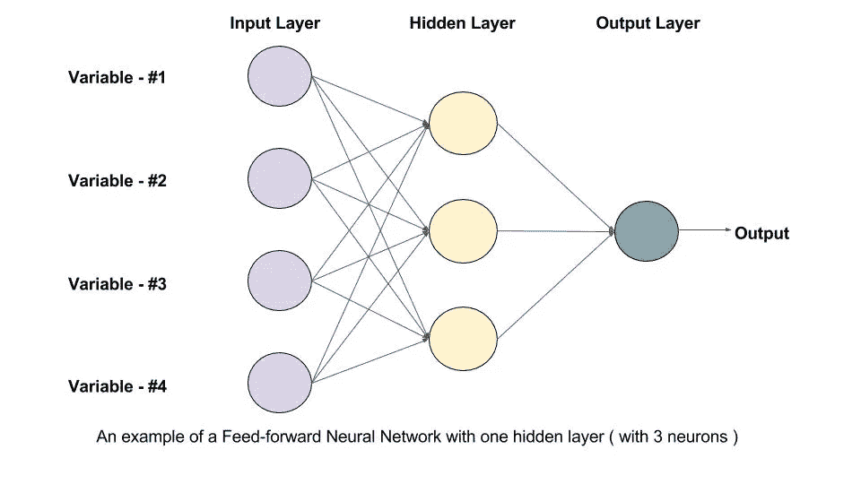
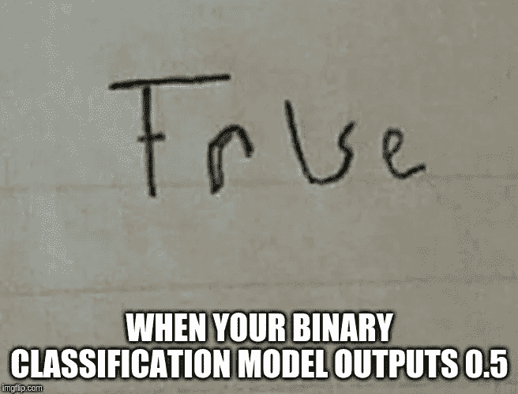

# py torch[表格]-二进制分类

> 原文：<https://towardsdatascience.com/pytorch-tabular-binary-classification-a0368da5bb89?source=collection_archive---------1----------------------->


如何训练你的神经网络[图片[0]]

## [如何训练你的神经网络](https://medium.com/tag/akshaj-wields-pytorch)

## 这篇博文将带您了解使用 PyTorch 对表格数据进行二进制分类的实现。

我们将使用 Kaggle 上可用的下背部疼痛症状数据集[。该数据集有 13 列，其中前 12 列是要素，最后一列是目标列。数据集有 300 行。](https://www.kaggle.com/sammy123/lower-back-pain-symptoms-dataset)



二元分类模因[图片[1]]

# 导入库

```
import numpy as np
import pandas as pd
import seaborn as sns
import matplotlib.pyplot as plt

import torch
import torch.nn as nn
import torch.optim as optim
from torch.utils.data import Dataset, DataLoader

from sklearn.preprocessing import StandardScaler    
from sklearn.model_selection import train_test_split
from sklearn.metrics import confusion_matrix, classification_report
```

# 读出数据

```
df = pd.read_csv("data/tabular/classification/spine_dataset.csv")df.head()
```



# EDA 和预处理

## 阶级分布

这里存在阶级不平衡。虽然有很多方法可以解决阶级不平衡问题，但这超出了本文的范围。

```
sns.countplot(x = 'Class_att', data=df)
```



等级不平衡条形图[图片[2]]

## 编码输出类别

PyTorch 支持从 0 开始的标签。那就是**【0，n】**。我们需要从 0 开始重新映射我们的标签。

```
df['Class_att'] = df['Class_att'].astype('category')encode_map = {
    'Abnormal': 1,
    'Normal': 0
}

df['Class_att'].replace(encode_map, inplace=True)
```

## 创建输入和输出数据

最后一列是我们的输出。输入是除最后一列之外的所有列。这里我们使用 Pandas 库中的`.iloc`方法来选择我们的输入和输出列。

```
X = df.iloc[:, 0:-1]
y = df.iloc[:, -1]
```

## 列车测试分离

我们现在将数据分为训练集和测试集。我们选择了 33%的数据作为测试集。

```
X_train, X_test, y_train, y_test = train_test_split(X, y, test_size=0.33, random_state=69)
```

## 标准化输入

为了正确训练神经网络，我们需要标准化输入值。我们通过去除平均值并缩放到单位方差来标准化特征。平均值为`u`且标准差为`s`的样本`x`的标准分数计算如下:

> *z = (x — u) / s*

你可以在这里找到关于神经网络[标准化/规范化的更多信息。](https://www.jeremyjordan.me/batch-normalization/)

```
scaler = StandardScaler()
X_train = scaler.fit_transform(X_train)
X_test = scaler.transform(X_test)
```

# 模型参数

为了训练我们的模型，我们需要设置一些超参数。请注意，这是一个非常简单的神经网络，因此，我们没有调整很多超参数。目标是了解 PyTorch 是如何工作的。

```
EPOCHS = 50
BATCH_SIZE = 64
LEARNING_RATE = 0.001
```

# 定义自定义数据加载器

这里我们定义了一个数据加载器。如果这对您来说是新的，我建议您阅读下面关于数据加载器的博客文章，然后再回来。

[](/pytorch-basics-intro-to-dataloaders-and-loss-functions-868e86450047) [## py torch[基础知识] —数据加载器和损失函数简介

### 这篇博文将带您了解 PyTorch 中的数据加载器和不同类型的损失函数。

towardsdatascience.com](/pytorch-basics-intro-to-dataloaders-and-loss-functions-868e86450047) 

```
## train dataclass TrainData(Dataset):

    def __init__(self, X_data, y_data):
        self.X_data = X_data
        self.y_data = y_data

    def __getitem__(self, index):
        return self.X_data[index], self.y_data[index]

    def __len__ (self):
        return len(self.X_data)

train_data = TrainData(torch.FloatTensor(X_train), 
                       torch.FloatTensor(y_train)) ## test data class TestData(Dataset):

    def __init__(self, X_data):
        self.X_data = X_data

    def __getitem__(self, index):
        return self.X_data[index]

    def __len__ (self):
        return len(self.X_data)

test_data = TestData(torch.FloatTensor(X_test))
```

让我们初始化我们的数据加载器。我们将使用一个`batch_size = 1`作为测试数据加载器。

```
train_loader = DataLoader(dataset=train_data, batch_size=BATCH_SIZE, shuffle=True)test_loader = DataLoader(dataset=test_data, batch_size=1)
```

# 定义神经网络架构

这里，我们定义了一个具有批处理和丢失的 2 层前馈网络。



使用前馈网络的二元分类示例[图像[3] [信用点](https://www.learnopencv.com/understanding-feedforward-neural-networks/)

在我们的`__init__()`函数中，我们定义我们想要使用的层，而在`forward()`函数中，我们调用已定义的层。

由于数据集中输入要素的数量为 12，因此第一个`nn.Linear`图层的输入将为 12。输出可以是你想要的任何数字。

> **您唯一需要确保的是一个图层的输出要素数量应等于下一个图层的输入要素数量。**

在[文档](https://pytorch.org/docs/stable/nn.html#linear)中阅读更多关于`nn.Linear`的信息。类似地，我们定义 ReLU、Dropout 和 BatchNorm 层。

一旦我们定义了所有这些层，就该使用它们了。在`forward()`函数中，我们将变量`inputs`作为我们的输入。我们通过我们初始化的不同层传递这个输入。

`forward()`函数的第一行接受输入，通过我们的第一个线性层，然后在其上应用 ReLU 激活。然后我们对输出应用 BatchNorm。看看下面的代码可以更好地理解它。

> 注意，我们在训练中没有在最后一层中使用**s 形**激活。这是因为，我们使用了自动应用 Sigmoid 激活的`nn.BCEWithLogitsLoss()`损失函数。

```
class BinaryClassification(nn.Module):
    def __init__(self):
        super(BinaryClassification, self).__init__() # Number of input features is 12.
        self.layer_1 = nn.Linear(12, 64) 
        self.layer_2 = nn.Linear(64, 64)
        self.layer_out = nn.Linear(64, 1) 

        self.relu = nn.ReLU()
        self.dropout = nn.Dropout(p=0.1)
        self.batchnorm1 = nn.BatchNorm1d(64)
        self.batchnorm2 = nn.BatchNorm1d(64)

    def forward(self, inputs):
        x = self.relu(self.layer_1(inputs))
        x = self.batchnorm1(x)
        x = self.relu(self.layer_2(x))
        x = self.batchnorm2(x)
        x = self.dropout(x)
        x = self.layer_out(x)

        return x
```

一旦我们定义了我们的架构，我们检查我们的 GPU 是否是活动的。PyTorch 的神奇之处在于它使用 GPU 超级简单。

变量`device`要么会说`cuda:0`如果我们有 GPU 的话。如果没有，它会说`cpu`。即使您没有 GPU，也可以在不修改代码的情况下遵循本教程。

```
device = torch.device("cuda:0" if torch.cuda.is_available() else "cpu")print(device) ###################### OUTPUT ######################cuda:0
```

接下来，我们需要初始化我们的模型。初始化后，我们将其移动到`device`。现在，这个设备是一个 GPU，如果你有，或者它是 CPU，如果你没有。我们使用的网络相当小。所以，在 CPU 上训练不会花很多时间。

在这之后，我们初始化优化器并决定使用哪个损失函数。

```
model = BinaryClassification()
model.to(device)print(model)criterion = nn.BCEWithLogitsLoss()
optimizer = optim.Adam(model.parameters(), lr=LEARNING_RATE) ###################### OUTPUT ######################BinaryClassification(
  (layer_1): Linear(in_features=12, out_features=64, bias=True)
  (layer_2): Linear(in_features=64, out_features=64, bias=True)
  (layer_out): Linear(in_features=64, out_features=1, bias=True)
  (relu): ReLU()
  (dropout): Dropout(p=0.1, inplace=False)
  (batchnorm1): BatchNorm1d(64, eps=1e-05, momentum=0.1, affine=True, track_running_stats=True)
  (batchnorm2): BatchNorm1d(64, eps=1e-05, momentum=0.1, affine=True, track_running_stats=True)
)
```



二元分类模因[图片[4]]

# 训练模型

在开始实际训练之前，让我们定义一个函数来计算精度。

在下面的函数中，我们将预测和实际输出作为输入。预测值(概率)被四舍五入，以将其转换为 **0** 或 **1** 。

一旦完成，我们只需将我们预测的 1/0 的数量与实际存在的 1/0 的数量进行比较，并计算准确度。

请注意，输入`y_pred`和`y_test`是针对一个批次的。我们的`batch_size`是 64。所以，这个精度是一次为 64 个预测(张量)计算的。

```
def binary_acc(y_pred, y_test):
    y_pred_tag = torch.round(torch.sigmoid(y_pred))

    correct_results_sum = (y_pred_tag == y_test).sum().float()
    acc = correct_results_sum/y_test.shape[0]
    acc = torch.round(acc * 100)

    return acc
```

我们期待已久的时刻到来了。让我们训练我们的模型。

你可以看到我们在循环之前放了一个`model.train()`。`model.train()`告诉 PyTorch 你正处于训练模式。

为什么我们需要这么做？如果您使用的层(如 Dropout 或 BatchNorm)在训练和评估期间表现不同，您需要告诉 PyTorch 相应地采取行动。而 PyTorch 中的默认模式是*火车*，所以，您不必显式地编写它。但这是很好的练习。

同样，当我们测试我们的模型时，我们将调用`model.eval()`。我们将在下面看到。

回到训练；我们开始一个循环。在这个 for 循环的顶部，我们将每个历元的损失和精度初始化为 0。在每个时期之后，我们将打印出损失/精度并将其重置回 0。

然后我们有另一个 for 循环。这个 for 循环用于从`train_loader`中批量获取我们的数据。

在我们做任何预测之前，我们先做`optimizer.zero_grad()`。由于`backward()`函数累加梯度，我们需要为每个小批量手动将其设置为 0。

从我们定义的模型中，我们获得一个预测，得到小批量的损失(和精度)，使用`loss.backward()`和`optimizer.step()`进行反向传播。最后，我们将所有小批量损失(和精度)相加，以获得该时期的平均损失(和精度)。

该损耗和精度在外部`for`循环中打印出来。

```
model.train()
for e in range(1, EPOCHS+1):
    epoch_loss = 0
    epoch_acc = 0
    for X_batch, y_batch in train_loader:
        X_batch, y_batch = X_batch.to(device), y_batch.to(device)
        optimizer.zero_grad()

        y_pred = model(X_batch)

        loss = criterion(y_pred, y_batch.unsqueeze(1))
        acc = binary_acc(y_pred, y_batch.unsqueeze(1))

        loss.backward()
        optimizer.step()

        epoch_loss += loss.item()
        epoch_acc += acc.item()

    print(f'Epoch {e+0:03}: | Loss: {epoch_loss/len(train_loader):.5f} | Acc: {epoch_acc/len(train_loader):.3f}') ###################### OUTPUT ######################Epoch 001: | Loss: 0.04027 | Acc: 98.250
Epoch 002: | Loss: 0.12023 | Acc: 96.750
Epoch 003: | Loss: 0.02067 | Acc: 99.500
Epoch 004: | Loss: 0.07329 | Acc: 96.250
Epoch 005: | Loss: 0.04676 | Acc: 99.250
Epoch 006: | Loss: 0.03005 | Acc: 99.500
Epoch 007: | Loss: 0.05777 | Acc: 98.250
Epoch 008: | Loss: 0.03446 | Acc: 99.500
Epoch 009: | Loss: 0.03443 | Acc: 100.000
Epoch 010: | Loss: 0.03368 | Acc: 100.000
Epoch 011: | Loss: 0.02395 | Acc: 100.000
Epoch 012: | Loss: 0.05094 | Acc: 98.250
Epoch 013: | Loss: 0.03618 | Acc: 98.250
Epoch 014: | Loss: 0.02143 | Acc: 100.000
Epoch 015: | Loss: 0.02730 | Acc: 99.500
Epoch 016: | Loss: 0.02323 | Acc: 100.000
Epoch 017: | Loss: 0.03395 | Acc: 98.250
Epoch 018: | Loss: 0.08600 | Acc: 96.750
Epoch 019: | Loss: 0.02394 | Acc: 100.000
Epoch 020: | Loss: 0.02363 | Acc: 100.000
Epoch 021: | Loss: 0.01660 | Acc: 100.000
Epoch 022: | Loss: 0.05766 | Acc: 96.750
Epoch 023: | Loss: 0.02115 | Acc: 100.000
Epoch 024: | Loss: 0.01331 | Acc: 100.000
Epoch 025: | Loss: 0.01504 | Acc: 100.000
Epoch 026: | Loss: 0.01727 | Acc: 100.000
Epoch 027: | Loss: 0.02128 | Acc: 100.000
Epoch 028: | Loss: 0.01106 | Acc: 100.000
Epoch 029: | Loss: 0.05802 | Acc: 98.250
Epoch 030: | Loss: 0.01275 | Acc: 100.000
Epoch 031: | Loss: 0.01272 | Acc: 100.000
Epoch 032: | Loss: 0.01949 | Acc: 100.000
Epoch 033: | Loss: 0.02848 | Acc: 100.000
Epoch 034: | Loss: 0.01514 | Acc: 100.000
Epoch 035: | Loss: 0.02949 | Acc: 100.000
Epoch 036: | Loss: 0.00895 | Acc: 100.000
Epoch 037: | Loss: 0.01692 | Acc: 100.000
Epoch 038: | Loss: 0.01678 | Acc: 100.000
Epoch 039: | Loss: 0.02755 | Acc: 100.000
Epoch 040: | Loss: 0.02021 | Acc: 100.000
Epoch 041: | Loss: 0.07972 | Acc: 98.250
Epoch 042: | Loss: 0.01421 | Acc: 100.000
Epoch 043: | Loss: 0.01558 | Acc: 100.000
Epoch 044: | Loss: 0.01185 | Acc: 100.000
Epoch 045: | Loss: 0.01830 | Acc: 100.000
Epoch 046: | Loss: 0.01367 | Acc: 100.000
Epoch 047: | Loss: 0.00880 | Acc: 100.000
Epoch 048: | Loss: 0.01046 | Acc: 100.000
Epoch 049: | Loss: 0.00933 | Acc: 100.000
Epoch 050: | Loss: 0.11034 | Acc: 98.250
```

# 测试模型

训练完成后，我们需要测试我们的模型进展如何。注意，在运行测试代码之前，我们已经使用了`model.eval()`。为了告诉 PyTorch 我们不希望在推断过程中执行反向传播，我们使用了`torch.no_grad()`来减少内存使用并加快计算速度。

我们首先定义一个包含我们预测的列表。然后我们使用`test_loader`循环遍历我们的批处理。对于每一批—

*   我们使用训练好的模型进行预测。
*   将概率四舍五入为 1 或 0。
*   将批处理从 CPU 移动到 GPU。
*   将张量转换为 numpy 对象，并将其添加到我们的列表中。
*   将列表展平，这样我们可以将它用作`confusion_matrix`和`classification_report`的输入。

```
y_pred_list = []model.eval()
with torch.no_grad():
    for X_batch in test_loader:
        X_batch = X_batch.to(device)
        y_test_pred = model(X_batch)
        y_test_pred = torch.sigmoid(y_test_pred)
        y_pred_tag = torch.round(y_test_pred)
        y_pred_list.append(y_pred_tag.cpu().numpy()) y_pred_list = [a.squeeze().tolist() for a in y_pred_list]
```

# 混淆矩阵

一旦我们有了所有的预测，我们使用 scikit-learn 的`confusion_matrix()`函数来计算混淆矩阵。

```
confusion_matrix(y_test, y_pred_list) ###################### OUTPUT ######################array([[23,  8],
       [12, 60]])
```

# 分类报告

为了获得具有精确度、召回率和 F1 分数的分类报告，我们使用函数`classification_report`。

```
print(classification_report(y_test, y_pred_list)) ###################### OUTPUT ######################precision    recall  f1-score   support 0       0.66      0.74      0.70        31
           1       0.88      0.83      0.86        72 accuracy                           0.81       103
   macro avg       0.77      0.79      0.78       103
weighted avg       0.81      0.81      0.81       103
```

感谢您的阅读。欢迎提出建议和建设性的批评。:)

这篇博客是“如何训练你的神经网络”系列的一部分。你可以在这里找到[系列。](https://towardsdatascience.com/tagged/akshaj-wields-pytorch)

你可以在 [LinkedIn](https://www.linkedin.com/in/akshajverma7/) 和 [Twitter](https://twitter.com/theairbend3r) 上找到我。如果你喜欢这个，看看我的其他[博客](https://medium.com/@theairbend3r)。

[](https://www.buymeacoffee.com/theairbend3r)