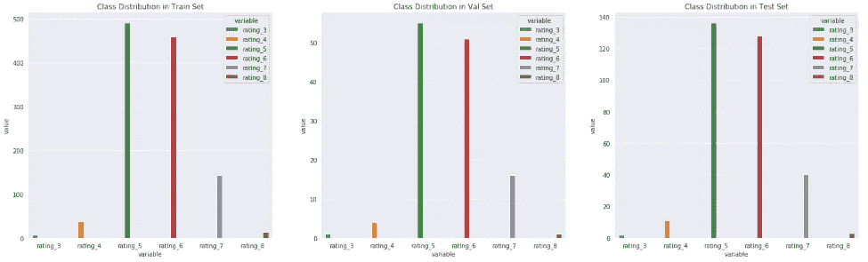
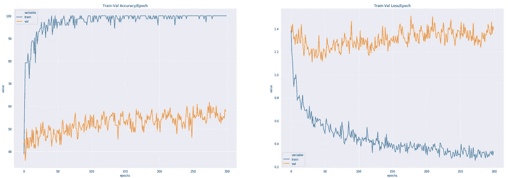
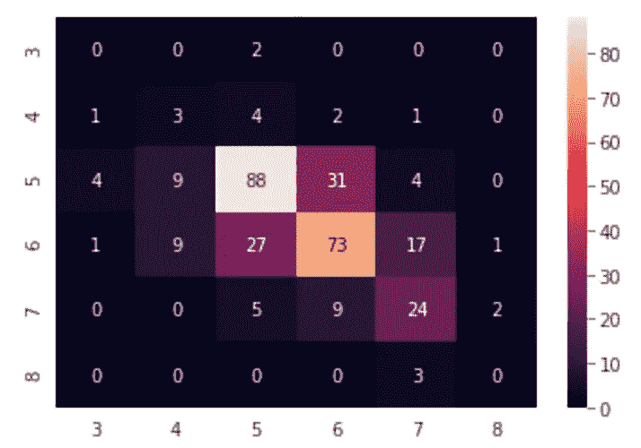

# py torch[表格]-多类分类

> 原文：<https://towardsdatascience.com/pytorch-tabular-multiclass-classification-9f8211a123ab?source=collection_archive---------1----------------------->


如何训练你的神经网络[图片[0]]

## [如何训练你的神经网络](https://medium.com/tag/akshaj-wields-pytorch)

## 这篇博文将带您了解使用 PyTorch 对表格数据进行多类分类的实现。

我们将使用 Kaggle 上的[葡萄酒数据集](https://www.kaggle.com/uciml/red-wine-quality-cortez-et-al-2009)。该数据集有 12 列，其中前 11 列是要素，最后一列是目标列。数据集有 1599 行。

# 导入库

我们使用`tqdm`来启用训练和测试循环的进度条。

```
import numpy as np
import pandas as pd
import seaborn as sns
from tqdm.notebook import tqdm
import matplotlib.pyplot as plt

import torch
import torch.nn as nn
import torch.optim as optim
from torch.utils.data import Dataset, DataLoader, WeightedRandomSampler

from sklearn.preprocessing import MinMaxScaler    
from sklearn.model_selection import train_test_split
from sklearn.metrics import confusion_matrix, classification_report
```

# 读出数据

```
df = pd.read_csv("data/tabular/classification/winequality-red.csv")df.head()
```


输入数据[图像[2]]

# EDA 和预处理

为了使数据适合神经网络，我们需要对其进行一些调整。

## 阶级分布

首先，我们绘制输出行来观察类分布。这里有很多不平衡。类别 3、4 和 8 的样本数量很少。

```
sns.countplot(x = 'quality', data=df)
```


类别分布条形图[图像[3]]

## 编码输出类别

接下来，我们看到输出标签从 3 到 8。这需要改变，因为 PyTorch 支持从 0 开始的标签。也就是**【0，n】**。我们需要从 0 开始重新映射我们的标签。

为此，让我们创建一个名为`class2idx`的字典，并使用 Pandas 库中的`.replace()`方法来修改它。让我们也创建一个名为`idx2class`的反向映射，它将 id 转换回它们原来的类。

为了创建反向映射，我们创建一个字典理解并简单地反转键和值。

```
class2idx = {
    3:0,
    4:1,
    5:2,
    6:3,
    7:4,
    8:5
}

idx2class = {v: k for k, v in class2idx.items()}

df['quality'].replace(class2idx, inplace=True)
```

## 创建输入和输出数据

为了使用来自 Sklearn 的`train_test_split`将我们的数据分成训练、验证和测试集，我们需要分离出我们的输入和输出。

输入`X`是除最后一列之外的所有列。输出`y`是最后一列。

```
X = df.iloc[:, 0:-1]
y = df.iloc[:, -1]
```

## 培训-验证-测试

为了创建 train-val-test 分割，我们将使用来自 Sklearn 的`train_test_split()`。

首先，我们将把我们的数据分成 train+val 和 test 集。然后，我们将进一步分割我们的 train+val 集合来创建我们的 train 和 val 集合。

因为存在类不平衡，所以我们希望在我们的训练、验证和测试集中，所有输出类的分布是均等的。为此，我们使用函数`train_test_split()`中的`stratify`选项。

```
# Split into train+val and test
X_trainval, X_test, y_trainval, y_test = train_test_split(X, y, test_size=0.2, stratify=y, random_state=69)

# Split train into train-val
X_train, X_val, y_train, y_val = train_test_split(X_trainval, y_trainval, test_size=0.1, stratify=y_trainval, random_state=21)
```

## 标准化输入

神经网络需要介于(0，1)范围内的数据。网上有很多关于我们为什么需要这么做的资料。

为了衡量我们的价值，我们将使用 Sklearn 中的`MinMaxScaler()`。`MinMaxScaler`通过将每个特征缩放到给定的范围(在我们的例子中是(0，1 ))来转换特征。

> *x _ scaled =(x-min(x))/(max(x)-min(x))*

注意，我们在`X_train`上使用`.fit_transform()`，而在`X_val`和`X_test`上使用`.transform()`。

我们这样做是因为我们希望使用与训练集相同的参数来扩展验证和测试集，以避免数据泄漏。`fit_transform`计算并应用缩放值，而`.transform`仅应用计算值。

```
scaler = MinMaxScaler()
X_train = scaler.fit_transform(X_train)
X_val = scaler.transform(X_val)
X_test = scaler.transform(X_test)X_train, y_train = np.array(X_train), np.array(y_train)
X_val, y_val = np.array(X_val), np.array(y_val)
X_test, y_test = np.array(X_test), np.array(y_test)
```

## 可视化培训、评估和测试中的类别分布

一旦我们将数据分成训练集、验证集和测试集，让我们确保类在所有三个集中的分布是相等的。

为此，让我们创建一个名为`get_class_distribution()`的函数。该函数将 obj `y`即。`y_train`、`y_val`或`y_test`。在函数内部，我们初始化一个字典，其中包含作为键的输出类和作为值的输出类计数。计数都被初始化为 0。

然后我们循环遍历我们的`y`对象并更新我们的字典。

```
def get_class_distribution(obj):
    count_dict = {
        "rating_3": 0,
        "rating_4": 0,
        "rating_5": 0,
        "rating_6": 0,
        "rating_7": 0,
        "rating_8": 0,
    }

    for i in obj:
        if i == 0: 
            count_dict['rating_3'] += 1
        elif i == 1: 
            count_dict['rating_4'] += 1
        elif i == 2: 
            count_dict['rating_5'] += 1
        elif i == 3: 
            count_dict['rating_6'] += 1
        elif i == 4: 
            count_dict['rating_7'] += 1  
        elif i == 5: 
            count_dict['rating_8'] += 1              
        else:
            print("Check classes.")

    return count_dict
```

一旦我们有了字典计数，我们就使用 Seaborn 库来绘制条形图。为了进行绘图，我们首先使用`pd.DataFrame.from_dict([get_class_distribution(y_train)])`将字典转换成数据帧。随后，我们`.melt()`将数据帧转换成长格式，最后使用`sns.barplot()`构建绘图。

```
fig, axes = plt.subplots(nrows=1, ncols=3, figsize=(25,7))# Train
sns.barplot(data = pd.DataFrame.from_dict([get_class_distribution(y_train)]).melt(), x = "variable", y="value", hue="variable",  ax=axes[0]).set_title('Class Distribution in Train Set')# Validation
sns.barplot(data = pd.DataFrame.from_dict([get_class_distribution(y_val)]).melt(), x = "variable", y="value", hue="variable",  ax=axes[1]).set_title('Class Distribution in Val Set')# Test
sns.barplot(data = pd.DataFrame.from_dict([get_class_distribution(y_test)]).melt(), x = "variable", y="value", hue="variable",  ax=axes[2]).set_title('Class Distribution in Test Set')
```



训练集、val 集和测试集中的类分布[图片[4]]

# 神经网络

我们现在达到了我们一直在等待的目标！

## 自定义数据集

首先，让我们定义一个自定义数据集。数据加载器将使用该数据集将我们的数据传递到模型中。

我们通过传递 X 和 y 作为输入来初始化数据集。确保 X 是`float`而 y 是`long`。

```
class ClassifierDataset(Dataset):

    def __init__(self, X_data, y_data):
        self.X_data = X_data
        self.y_data = y_data

    def __getitem__(self, index):
        return self.X_data[index], self.y_data[index]

    def __len__ (self):
        return len(self.X_data)

train_dataset = ClassifierDataset(torch.from_numpy(X_train).float(), torch.from_numpy(y_train).long())val_dataset = ClassifierDataset(torch.from_numpy(X_val).float(), torch.from_numpy(y_val).long())test_dataset = ClassifierDataset(torch.from_numpy(X_test).float(), torch.from_numpy(y_test).long())
```

## 加权抽样

因为存在类别不平衡，所以我们使用分层分割来创建我们的训练、验证和测试集。

虽然它有所帮助，但它仍然不能确保我们模型的每个小批量都能看到我们的所有类。我们需要对值数量较少的类进行过采样。为此，我们使用`WeightedRandomSampler`。

首先，我们获得一个名为`target_list`的列表，其中包含我们所有的输出。这个列表然后被转换成张量。

```
target_list = []for _, t in train_dataset:
    target_list.append(t)

target_list = torch.tensor(target_list)
```

然后，我们获得训练集中所有类的计数。我们使用每个计数的倒数来获得它的重量。现在我们已经计算了每个类的权重，我们可以继续了。

```
class_count = [i for i in get_class_distribution(y_train).values()]
class_weights = 1./torch.tensor(class_count, dtype=torch.float) print(class_weights) ###################### OUTPUT ######################tensor([0.1429, 0.0263, 0.0020, 0.0022, 0.0070, 0.0714])
```

`WeightedRandomSampler`期望每个**样品**有一个**重量**。我们使用下面的方法来实现。

```
class_weights_all = class_weights[target_list]
```

最后，让我们初始化我们的`WeightedRandomSampler`。在下面的数据加载器中，我们称之为。

```
weighted_sampler = WeightedRandomSampler(
    weights=class_weights_all,
    num_samples=len(class_weights_all),
    replacement=True
)
```

## 模型参数

在我们继续下一步之前，让我们定义几个我们将使用的参数。

```
EPOCHS = 300
BATCH_SIZE = 16
LEARNING_RATE = 0.0007NUM_FEATURES = len(X.columns)
NUM_CLASSES = 6
```

## 数据加载器

现在让我们初始化我们的数据加载器。

对于`train_dataloader` ,我们将使用`batch_size = 64`,并将我们的采样器传递给它。注意，我们没有在`train_dataloader`中使用`shuffle=True`，因为我们已经使用了一个采样器。这两个是互斥的。

对于`test_dataloader`和`val_dataloader`，我们将使用`batch_size = 1`。

```
train_loader = DataLoader(dataset=train_dataset,
                          batch_size=BATCH_SIZE,
                          sampler=weighted_sampler
)val_loader = DataLoader(dataset=val_dataset, batch_size=1)test_loader = DataLoader(dataset=test_dataset, batch_size=1)
```

## 定义神经网络架构

让我们定义一个简单的三层前馈网络，具有漏失和批量范数。

```
class MulticlassClassification(nn.Module):
    def __init__(self, num_feature, num_class):
        super(MulticlassClassification, self).__init__()

        self.layer_1 = nn.Linear(num_feature, 512)
        self.layer_2 = nn.Linear(512, 128)
        self.layer_3 = nn.Linear(128, 64)
        self.layer_out = nn.Linear(64, num_class) 

        self.relu = nn.ReLU()
        self.dropout = nn.Dropout(p=0.2)
        self.batchnorm1 = nn.BatchNorm1d(512)
        self.batchnorm2 = nn.BatchNorm1d(128)
        self.batchnorm3 = nn.BatchNorm1d(64)

    def forward(self, x):
        x = self.layer_1(x)
        x = self.batchnorm1(x)
        x = self.relu(x)

        x = self.layer_2(x)
        x = self.batchnorm2(x)
        x = self.relu(x)
        x = self.dropout(x)

        x = self.layer_3(x)
        x = self.batchnorm3(x)
        x = self.relu(x)
        x = self.dropout(x)

        x = self.layer_out(x)

        return x
```

检查 GPU 是否处于活动状态。

```
device = torch.device("cuda:0" if torch.cuda.is_available() else "cpu")print(device) ###################### OUTPUT ######################cuda:0
```

初始化模型、优化器和损失函数。将模型传输到 GPU。我们使用`nn.CrossEntropyLoss`是因为这是一个多类分类问题。我们不需要在最后一层之后手动添加一个`log_softmax`层，因为`nn.CrossEntropyLoss`已经为我们做了。然而，我们需要应用`log_softmax`进行验证和测试。


损失函数 meme [Image [5]]

```
model = MulticlassClassification(num_feature = NUM_FEATURES, num_class=NUM_CLASSES)model.to(device)

criterion = nn.CrossEntropyLoss(weight=class_weights.to(device))
optimizer = optim.Adam(model.parameters(), lr=LEARNING_RATE)print(model) ###################### OUTPUT ######################MulticlassClassification(
  (layer_1): Linear(in_features=11, out_features=512, bias=True)
  (layer_2): Linear(in_features=512, out_features=128, bias=True)
  (layer_3): Linear(in_features=128, out_features=64, bias=True)
  (layer_out): Linear(in_features=64, out_features=6, bias=True)
  (relu): ReLU()
  (dropout): Dropout(p=0.2, inplace=False)
  (batchnorm1): BatchNorm1d(512, eps=1e-05, momentum=0.1, affine=True, track_running_stats=True)
  (batchnorm2): BatchNorm1d(128, eps=1e-05, momentum=0.1, affine=True, track_running_stats=True)
  (batchnorm3): BatchNorm1d(64, eps=1e-05, momentum=0.1, affine=True, track_running_stats=True)
)
```

# 训练模型

在我们开始训练之前，让我们定义一个函数来计算每个历元的精度。

该函数将`y_pred`和`y_test`作为输入参数。然后，我们将`log_softmax`应用于`y_pred`，并提取出具有较高概率的类别。

之后，我们比较预测类别和实际类别来计算准确度。

```
def multi_acc(y_pred, y_test):
    y_pred_softmax = torch.log_softmax(y_pred, dim = 1)
    _, y_pred_tags = torch.max(y_pred_softmax, dim = 1)    

    correct_pred = (y_pred_tags == y_test).float()
    acc = correct_pred.sum() / len(correct_pred)

    acc = torch.round(acc * 100)

    return acc
```

我们还将定义 2 个字典，用于存储训练集和验证集的准确度/时期和损失/时期。

```
accuracy_stats = {
    'train': [],
    "val": []
}loss_stats = {
    'train': [],
    "val": []
}
```

让我们来看看我们的模型吧！


训练迷因[图片[6]]

```
print("Begin training.")for e in tqdm(range(1, EPOCHS+1)):

    # TRAINING
    train_epoch_loss = 0
    train_epoch_acc = 0model.train()
    for X_train_batch, y_train_batch in train_loader:
        X_train_batch, y_train_batch = X_train_batch.to(device), y_train_batch.to(device)
        optimizer.zero_grad()

        y_train_pred = model(X_train_batch)

        train_loss = criterion(y_train_pred, y_train_batch)
        train_acc = multi_acc(y_train_pred, y_train_batch)

        train_loss.backward()
        optimizer.step()

        train_epoch_loss += train_loss.item()
        train_epoch_acc += train_acc.item()

    # VALIDATION    
    with torch.no_grad():

        val_epoch_loss = 0
        val_epoch_acc = 0

        model.eval()
        for X_val_batch, y_val_batch in val_loader:
            X_val_batch, y_val_batch = X_val_batch.to(device), y_val_batch.to(device)

            y_val_pred = model(X_val_batch)

            val_loss = criterion(y_val_pred, y_val_batch)
            val_acc = multi_acc(y_val_pred, y_val_batch)

            val_epoch_loss += val_loss.item()
            val_epoch_acc += val_acc.item()loss_stats['train'].append(train_epoch_loss/len(train_loader))
    loss_stats['val'].append(val_epoch_loss/len(val_loader))
    accuracy_stats['train'].append(train_epoch_acc/len(train_loader))
    accuracy_stats['val'].append(val_epoch_acc/len(val_loader))

    print(f'Epoch {e+0:03}: | Train Loss: {train_epoch_loss/len(train_loader):.5f} | Val Loss: {val_epoch_loss/len(val_loader):.5f} | Train Acc: {train_epoch_acc/len(train_loader):.3f}| Val Acc: {val_epoch_acc/len(val_loader):.3f}') ###################### OUTPUT ######################Epoch 001: | Train Loss: 1.38551 | Val Loss: 1.42033 | Train Acc: 38.889| Val Acc: 43.750Epoch 002: | Train Loss: 1.19558 | Val Loss: 1.36613 | Train Acc: 59.722| Val Acc: 45.312Epoch 003: | Train Loss: 1.12264 | Val Loss: 1.44156 | Train Acc: 79.167| Val Acc: 35.938.
.
.Epoch 299: | Train Loss: 0.29774 | Val Loss: 1.42116 | Train Acc: 100.000| Val Acc: 57.812Epoch 300: | Train Loss: 0.33134 | Val Loss: 1.38818 | Train Acc: 100.000| Val Acc: 57.812
```

你可以看到我们已经在循环之前放置了一个`model.train()`。`model.train()`告诉 PyTorch 你正处于训练模式。

为什么我们需要这么做？如果您使用在训练和评估期间表现不同的层，如`Dropout`或`BatchNorm`(例如*；评估期间不使用 dropout*)，您需要告诉 PyTorch 采取相应的行动。

同样，当我们测试我们的模型时，我们将调用`model.eval()`。我们将在下面看到。

回到训练；我们开始一个循环。在这个 *for 循环*的顶部，我们将每个历元的损耗和精度初始化为 0。在每个时期之后，我们将打印出损失/精度并将其重置回 0。

然后我们有另一个 *for-loop* 。这个 *for 循环*用于从`train_loader`批量获取我们的数据。

在我们做任何预测之前，我们做`optimizer.zero_grad()`。由于`backward()`函数累加梯度，我们需要为每个小批量手动将其设置为 0。

从我们定义的模型中，我们获得一个预测，得到小批量的损失(和精度)，使用`loss.backward()`和`optimizer.step()`执行反向传播。

最后，我们将所有小批量损失(和精度)相加，以获得该时期的平均损失(和精度)。我们将每个小批量的所有损耗/精度相加，最后除以小批量的数量，即。`train_loader`的长度，以获得每个历元的平均损失/精度。

我们遵循的训练程序与验证程序完全相同，除了我们用`torch.no_grad`将它包装起来，并且不执行任何反向传播。`torch.no_grad()`告诉 PyTorch 我们不想执行反向传播，这样可以减少内存使用并加快计算速度。

# 可视化损失和准确性

为了绘制损耗和精度线图，我们再次从`accuracy_stats`和`loss_stats`字典中创建一个数据帧。

```
# Create dataframes
train_val_acc_df = pd.DataFrame.from_dict(accuracy_stats).reset_index().melt(id_vars=['index']).rename(columns={"index":"epochs"})train_val_loss_df = pd.DataFrame.from_dict(loss_stats).reset_index().melt(id_vars=['index']).rename(columns={"index":"epochs"})# Plot the dataframes
fig, axes = plt.subplots(nrows=1, ncols=2, figsize=(20,7))sns.lineplot(data=train_val_acc_df, x = "epochs", y="value", hue="variable",  ax=axes[0]).set_title('Train-Val Accuracy/Epoch')sns.lineplot(data=train_val_loss_df, x = "epochs", y="value", hue="variable", ax=axes[1]).set_title('Train-Val Loss/Epoch')
```



损失和精度图[图 7]]

# 测试模型

训练完成后，我们需要测试我们的模型进展如何。注意，在运行测试代码之前，我们已经使用了`model.eval()`。为了告诉 PyTorch 我们不希望在推断过程中执行反向传播，我们使用了`torch.no_grad()`，就像我们对上面的验证循环所做的那样。

我们首先定义一个包含我们预测的列表。然后我们使用`test_loader`循环遍历我们的批处理。对于每一批—

*   我们将输入小批量数据转移到 GPU。
*   我们使用训练好的模型进行预测。
*   将`log_softmax`激活应用于预测，并选择概率最高的指数。
*   将批处理从 CPU 移动到 GPU。
*   将张量转换为 numpy 对象，并将其添加到我们的列表中。
*   将列表展平，这样我们可以将它用作`confusion_matrix`和`classification_report`的输入。

```
y_pred_list = []with torch.no_grad():
    model.eval()
    for X_batch, _ in test_loader:
        X_batch = X_batch.to(device)
        y_test_pred = model(X_batch)
        _, y_pred_tags = torch.max(y_test_pred, dim = 1)
        y_pred_list.append(y_pred_tags.cpu().numpy())y_pred_list = [a.squeeze().tolist() for a in y_pred_list]
```

# 混淆矩阵

我们从混淆矩阵中创建一个数据框架，并使用 seaborn 库将其绘制为热图。

```
confusion_matrix_df = pd.DataFrame(confusion_matrix(y_test, y_pred_list)).rename(columns=idx2class, index=idx2class) sns.heatmap(confusion_matrix_df, annot=True)
```



混淆矩阵[图片[8]]

# 分类报告

最后，我们打印出包含精确度、召回率和 F1 分数的分类报告。

```
print(classification_report(y_test, y_pred_list)) ###################### OUTPUT ######################precision    recall  f1-score   support

           0       0.00      0.00      0.00         2
           1       0.14      0.27      0.19        11
           2       0.70      0.65      0.67       136
           3       0.63      0.57      0.60       128
           4       0.49      0.60      0.54        40
           5       0.00      0.00      0.00         3

    accuracy                           0.59       320
   macro avg       0.33      0.35      0.33       320
weighted avg       0.62      0.59      0.60       320
```

感谢您的阅读。欢迎提出建议和建设性的批评。:)

这篇博客是“如何训练你的神经网络”系列的一部分。你可以在这里找到系列[。](https://towardsdatascience.com/tagged/akshaj-wields-pytorch)

你可以在 [LinkedIn](https://www.linkedin.com/in/akshajverma7/) 和 [Twitter](https://twitter.com/theairbend3r) 上找到我。如果你喜欢这个，看看我的其他[博客](https://medium.com/@theairbend3r)。

[](https://www.buymeacoffee.com/theairbend3r)