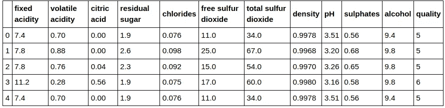
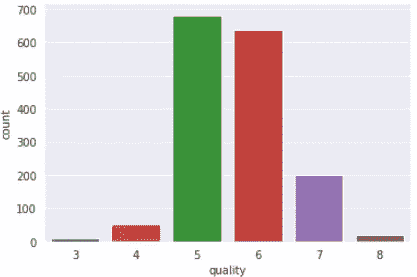

# py torch[表格]-回归

> 原文：<https://towardsdatascience.com/pytorch-tabular-regression-428e9c9ac93?source=collection_archive---------6----------------------->


如何训练你的神经网络[图片[0]]

## [如何训练你的神经网络](https://medium.com/tag/akshaj-wields-pytorch)

## 这篇博文将带您了解如何使用 PyTorch 实现对表格数据的回归。

我们将使用 Kaggle 上的[红酒质量数据集](https://www.kaggle.com/uciml/red-wine-quality-cortez-et-al-2009)。该数据集有 12 列，其中前 11 列是要素，最后一列是目标列。数据集有 1599 行。

# 导入库

我们使用`tqdm`来启用训练和测试循环的进度条。

```
import numpy as np
import pandas as pd
import seaborn as sns
from tqdm.notebook import tqdm
import matplotlib.pyplot as pltimport torch
import torch.nn as nn
import torch.optim as optim
from torch.utils.data import Dataset, DataLoaderfrom sklearn.preprocessing import MinMaxScaler    
from sklearn.model_selection import train_test_split
from sklearn.metrics import mean_squared_error, r2_score
```

# 读出数据

```
df = pd.read_csv("data/tabular/classification/winequality-red.csv")df.head()
```



输入数据帧[图像[2]]

# EDA 和预处理

首先，我们绘制输出行来观察类分布。这里有很多不平衡。类别 3、4 和 8 的样本数量很少。

这里我们不会将输出变量视为类，因为我们正在执行回归。我们将把输出列，也就是所有的`integers`，转换成`float`值。

```
sns.countplot(x = 'quality', data=df)
```



输出分布[图像[3]]

## 创建输入和输出数据

为了将数据分成训练集、验证集和测试集，我们需要将输入和输出分开。

输入`X`是除最后一列之外的所有列。输出`y`是最后一列。

```
X = df.iloc[:, 0:-1]
y = df.iloc[:, -1]
```

# 培训-验证-测试

为了创建 train-val-test 分割，我们将使用 Sklearn 的`train_test_split()`。

首先，我们将数据分成`train+val`和`test`组。然后，我们将进一步分割我们的`train+val`集合，以创建我们的`train`和`val`集合。

因为存在“类”的不平衡，所以我们希望在我们的训练、验证和测试集中，所有输出类的分布是均等的。

为此，我们使用函数`train_test_split()`中的`stratify`选项。

记住分层只对类有效，对数字无效。因此，一般来说，我们可以使用四分位数、十分位数、直方图(`np.histogram()`)等将我们的数字分类。因此，您必须创建一个包含输出及其“类”的新数据帧。这个“类”是使用上述方法获得的。

在我们的例子中，让我们按原样使用这些数字，因为它们已经和类*一样了。拆分数据后，我们可以将输出转换为 float(因为回归)。*

```
# Train - Test
X_trainval, X_test, y_trainval, y_test = train_test_split(X, y, test_size=0.2, stratify=y, random_state=69)# Split train into train-val
X_train, X_val, y_train, y_val = train_test_split(X_trainval, y_trainval, test_size=0.1, stratify=y_trainval, random_state=21)
```

## 标准化输入

神经网络需要介于(0，1)范围内的数据。网上有很多关于我们为什么需要这么做的资料。

为了衡量我们的价值，我们将使用 Sklearn 中的`MinMaxScaler()`。`MinMaxScaler`通过将每个特征缩放到给定的范围(在我们的例子中是(0，1 ))来转换特征。

> x _ scaled =(x-min(x))/(max(x)-min(x))

注意，我们在`X_train`上使用`.fit_transform()`，而在`X_val`和`X_test`上使用`.transform()`。

我们这样做是因为我们希望使用与训练集相同的参数来扩展验证和测试集，以避免数据泄漏。`fit_transform()`计算并应用缩放值，而`.transform()`仅应用计算值。

```
scaler = MinMaxScaler()X_train = scaler.fit_transform(X_train)
X_val = scaler.transform(X_val)
X_test = scaler.transform(X_test)X_train, y_train = np.array(X_train), np.array(y_train)
X_val, y_val = np.array(X_val), np.array(y_val)
X_test, y_test = np.array(X_test), np.array(y_test)
```

## 可视化培训、评估和测试中的类别分布

一旦我们将数据分成训练集、验证集和测试集，让我们确保类在所有三个集中的分布是相等的。

为此，让我们创建一个名为`get_class_distribution()`的函数。该函数将 obj `y`即。`y_train`、`y_val`或`y_test`。在函数内部，我们初始化一个字典，其中包含作为键的输出类和作为值的输出类计数。计数都被初始化为 0。

然后我们循环遍历我们的`y`对象并更新我们的字典。

```
def get_class_distribution(obj):
    count_dict = {
        "rating_3": 0,
        "rating_4": 0,
        "rating_5": 0,
        "rating_6": 0,
        "rating_7": 0,
        "rating_8": 0,
    }

    for i in obj:
        if i == 3: 
            count_dict['rating_3'] += 1
        elif i == 4: 
            count_dict['rating_4'] += 1
        elif i == 5: 
            count_dict['rating_5'] += 1
        elif i == 6: 
            count_dict['rating_6'] += 1
        elif i == 7: 
            count_dict['rating_7'] += 1  
        elif i == 8: 
            count_dict['rating_8'] += 1              
        else:
            print("Check classes.")

    return count_dict
```

一旦我们有了字典计数，我们就使用 Seaborn 库来绘制条形图。

为了进行绘图，我们首先使用`pd.DataFrame.from_dict([get_class_distribution(y_train)])`将字典转换成数据帧。

随后，我们将数据帧转换成格式，最后使用格式来构建图表。

```
fig, axes = plt.subplots(nrows=1, ncols=3, figsize=(25,7))# Train
sns.barplot(data = pd.DataFrame.from_dict([get_class_distribution(y_train)]).melt(), x = "variable", y="value", hue="variable",  ax=axes[0]).set_title('Class Distribution in Train Set')# Val
sns.barplot(data = pd.DataFrame.from_dict([get_class_distribution(y_val)]).melt(), x = "variable", y="value", hue="variable",  ax=axes[1]).set_title('Class Distribution in Val Set')# Test
sns.barplot(data = pd.DataFrame.from_dict([get_class_distribution(y_test)]).melt(), x = "variable", y="value", hue="variable",  ax=axes[2]).set_title('Class Distribution in Test Set')
```


训练值测试分割后的输出分布[图片[4]]

## 将输出变量转换为`Float`

```
y_train, y_test, y_val = y_train.astype(float), y_test.astype(float), y_val.astype(float)
```

# 神经网络

## 初始化数据集

```
class RegressionDataset(Dataset):

    def __init__(self, X_data, y_data):
        self.X_data = X_data
        self.y_data = y_data

    def __getitem__(self, index):
        return self.X_data[index], self.y_data[index]

    def __len__ (self):
        return len(self.X_data)train_dataset = RegressionDataset(torch.from_numpy(X_train).float(), torch.from_numpy(y_train).float())val_dataset = RegressionDataset(torch.from_numpy(X_val).float(), torch.from_numpy(y_val).float())test_dataset = RegressionDataset(torch.from_numpy(X_test).float(), torch.from_numpy(y_test).float())
```

## 模型参数

```
EPOCHS = 150
BATCH_SIZE = 64
LEARNING_RATE = 0.001NUM_FEATURES = len(X.columns)
```

## 初始化数据加载器

```
train_loader = DataLoader(dataset=train_dataset, batch_size=BATCH_SIZE, shuffle=True)val_loader = DataLoader(dataset=val_dataset, batch_size=1)test_loader = DataLoader(dataset=test_dataset, batch_size=1)
```

## 定义神经网络架构

我们这里有一个简单的 3 层前馈神经网络。我们使用`ReLU`作为所有层的激活。

```
class MultipleRegression(nn.Module):
    def __init__(self, num_features):
        super(MultipleRegression, self).__init__()

        self.layer_1 = nn.Linear(num_features, 16)
        self.layer_2 = nn.Linear(16, 32)
        self.layer_3 = nn.Linear(32, 16)
        self.layer_out = nn.Linear(16, 1)

        self.relu = nn.ReLU()def forward(self, inputs):
        x = self.relu(self.layer_1(inputs))
        x = self.relu(self.layer_2(x))
        x = self.relu(self.layer_3(x))
        x = self.layer_out(x)return (x)def predict(self, test_inputs):
        x = self.relu(self.layer_1(test_inputs))
        x = self.relu(self.layer_2(x))
        x = self.relu(self.layer_3(x))
        x = self.layer_out(x)return (x)
```

## 检查 GPU

```
device = torch.device("cuda:0" if torch.cuda.is_available() else "cpu")print(device) ###################### OUTPUT ######################cuda:0
```

初始化模型、优化器和损失函数。将模型传输到 GPU。

我们使用均方误差损失。

```
model = MultipleRegression(NUM_FEATURES)
model.to(device)print(model)criterion = nn.MSELoss()
optimizer = optim.Adam(model.parameters(), lr=LEARNING_RATE) ###################### OUTPUT ######################MultipleRegression(
  (layer_1): Linear(in_features=11, out_features=16, bias=True)
  (layer_2): Linear(in_features=16, out_features=32, bias=True)
  (layer_3): Linear(in_features=32, out_features=16, bias=True)
  (layer_out): Linear(in_features=16, out_features=1, bias=True)
  (relu): ReLU()
)
```

# 火车模型

在我们开始训练之前，让我们定义一个字典，它将存储训练集和验证集的丢失/时期。

```
loss_stats = {
    'train': [],
    "val": []
}
```

开始训练吧。

```
print("Begin training.")for e in tqdm(range(1, EPOCHS+1)):

    # TRAINING
    train_epoch_loss = 0model.train()
    for X_train_batch, y_train_batch in train_loader:
        X_train_batch, y_train_batch = X_train_batch.to(device), y_train_batch.to(device)
        optimizer.zero_grad()

        y_train_pred = model(X_train_batch)

        train_loss = criterion(y_train_pred, y_train_batch.unsqueeze(1))

        train_loss.backward()
        optimizer.step()

        train_epoch_loss += train_loss.item()

    # VALIDATION    
    with torch.no_grad():

        val_epoch_loss = 0

        model.eval()
        for X_val_batch, y_val_batch in val_loader:
            X_val_batch, y_val_batch = X_val_batch.to(device), y_val_batch.to(device)

            y_val_pred = model(X_val_batch)

            val_loss = criterion(y_val_pred, y_val_batch.unsqueeze(1))

            val_epoch_loss += val_loss.item()loss_stats['train'].append(train_epoch_loss/len(train_loader))
    loss_stats['val'].append(val_epoch_loss/len(val_loader))                              

    print(f'Epoch {e+0:03}: | Train Loss: {train_epoch_loss/len(train_loader):.5f} | Val Loss: {val_epoch_loss/len(val_loader):.5f}')###################### OUTPUT ######################Epoch 001: | Train Loss: 31.22514 | Val Loss: 30.50931Epoch 002: | Train Loss: 30.02529 | Val Loss: 28.97327.
.
.Epoch 149: | Train Loss: 0.42277 | Val Loss: 0.37748
Epoch 150: | Train Loss: 0.42012 | Val Loss: 0.37028
```

你可以看到我们在循环之前放了一个`model.train()`。告诉 PyTorch 你正处于训练模式。

为什么我们需要这么做？如果使用在训练和评估期间表现不同的层，如`Dropout`或`BatchNorm`(例如*；评估期间不使用 dropout*)，您需要告诉 PyTorch 采取相应的行动。

同样，当我们测试我们的模型时，我们将调用`model.eval()`。我们将在下面看到。

回到训练；我们开始一个*循环*。在这个 *for 循环*的顶部，我们将每个时期的损失初始化为 0。在每个时期之后，我们将打印出损失并将其重置回 0。

然后我们有另一个 *for 循环*。这个 *for-loop* 用于从`train_loader`批量获取我们的数据。

在我们做任何预测之前，我们做`optimizer.zero_grad()`。由于`backward()`函数累加梯度，我们需要为每个小批量手动将其设置为 0。

从我们定义的模型中，我们获得一个预测，得到小批量的损失(和精度)，使用`loss.backward()`和`optimizer.step()`执行反向传播。

最后，我们将所有小批量损失相加，以获得该时期的平均损失。我们将每个小批量的所有损失相加，最后除以小批量的数量，即。`train_loader`的长度，以获得每个历元的平均损失。

我们遵循的训练程序与验证程序完全相同，除了我们用`torch.no_grad`将它包装起来，并且不执行任何反向传播。`torch.no_grad()`告诉 PyTorch 我们不想执行反向传播，这样可以减少内存使用并加快计算速度。

# 可视化损失和准确性

为了绘制损失线图，我们再次从“loss_stats”字典中创建一个数据帧。

```
train_val_loss_df = pd.DataFrame.from_dict(loss_stats).reset_index().melt(id_vars=['index']).rename(columns={"index":"epochs"})plt.figure(figsize=(15,8))sns.lineplot(data=train_val_loss_df, x = "epochs", y="value", hue="variable").set_title('Train-Val Loss/Epoch')
```


列车价值损失曲线[图片[6]]

# 试验模型

训练完成后，我们需要测试我们的模型进展如何。注意，在运行测试代码之前，我们已经使用了`model.eval()`。为了告诉 PyTorch 我们不希望在推断过程中执行反向传播，我们使用了`torch.no_grad()`，就像我们对上面的验证循环所做的那样。

```
y_pred_list = []with torch.no_grad():
    model.eval()
    for X_batch, _ in test_loader:
        X_batch = X_batch.to(device)
        y_test_pred = model(X_batch)
        y_pred_list.append(y_test_pred.cpu().numpy())y_pred_list = [a.squeeze().tolist() for a in y_pred_list]
```

让我们检查 MSE 和 R 平方指标。

```
mse = mean_squared_error(y_test, y_pred_list)
r_square = r2_score(y_test, y_pred_list)print("Mean Squared Error :",mse)
print("R^2 :",r_square) ###################### OUTPUT ######################Mean Squared Error : 0.40861496703609534
R^2 : 0.36675687655886924
```

感谢您的阅读。欢迎提出建议和建设性的批评。:)

这篇博客是专栏“如何训练你的神经网络”的一部分。你可以在这里找到专栏[。](https://towardsdatascience.com/tagged/akshaj-wields-pytorch)

你可以在 [LinkedIn](https://www.linkedin.com/in/akshajverma7/) 和 [Twitter](https://twitter.com/theairbend3r) 上找到我。如果你喜欢这个，看看我的其他[博客](https://medium.com/@theairbend3r)。

[](https://www.buymeacoffee.com/theairbend3r)