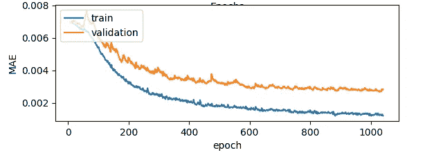

# PyTorch 花絮:测量溪流和时间

> 原文：<https://towardsdatascience.com/pytorch-tidbits-measuring-streams-and-times-de0c7bae85da?source=collection_archive---------45----------------------->

## 统计数据收集的简单实用程序

典型的 PyTorch 训练循环包含跟踪训练和测试指标的代码；他们帮助我们监控进度并绘制学习曲线。

假设对于一个分类任务，我们使用二元交叉熵作为训练损失，我们也对准确性感兴趣。在每一个时期之后，我们在一个持续的验证数据集上测量相同的值。我们希望将定期进度信息写入控制台以及 Tensorboard(或任何其他您喜欢的仪表板工具)。

请注意记录大量连续值，然后对其进行统计的模式。虽然这个片段足够简单，但是有一些重复，并且日志开始模糊主要的算法核心。我们想要跟踪的度量和统计数据(比如，除了平均值之外的标准偏差)就越多。

这已经在 [ImageNet 演示代码](https://github.com/pytorch/examples/blob/master/imagenet/main.py#L359)中得到认可，它包含了一个用于此目的的辅助类:

使用起来非常简单:我们创建一个`AverageMeter`实例`m`，反复调用`m.update(loss)`，并在一个时期结束时检索平均值为`m.avg`。

诚然，这是一个相当谦虚的班级；然而，在用 Python 编写机器学习应用程序时，像这样跟踪统计数据是普遍存在的。因此，仔细研究一下这个概念可能是值得的，因为它有助于多种扩展。

## 聚合函数

您肯定已经注意到，在第一个清单中，存储每个损失值有点天真；相反，我们只需要递增地更新元素的总数和数量。大多数数据处理语言，如 *SQL* 或 *PigLatin* 通常称之为[可分解聚合函数](https://en.wikipedia.org/wiki/Aggregate_function)；它只记录恒定数量的足够的统计数据，并以交换和关联的方式更新。常见的聚合函数有最小值、最大值和标准差(为此我们需要平方和)。很容易得出其他有用的度量:最近的值、零或非常小的值的百分比、绝对最小值和最大值。我们的更新功能变成了:

平均值和标准偏差可通过以下简单属性提取:

如果我们不局限于恒定的空间和时间要求，我们当然可以实现更复杂的聚合函数，或者作为精确的或者许多已知的近似算法[之一](https://en.wikipedia.org/wiki/Streaming_algorithm)，用于 k-最频繁、k-最小和唯一的元素。

## 句法糖

作为一种快捷方式，增量添加操作符`+=`可以作为 update 的别名。添加意味着更新副本。标准的`__len__`函数默认为计数。以字典的形式检索值并拥有合适的字符串表示很方便。

## 与其他电表、NumPy 阵列和 PyTorch 张量聚合

两个`Meters`可以在两个并发线程中聚合指标，我们希望将它们汇总在一起。更新功能的扩展很简单:

到目前为止，我们假设我们的值是本地 Python 数字。但是有时我们想要查看 PyTorch `Tensors`上的统计数据(比如模型激活、权重和它们的梯度)。我们将用数组更新`Meter`的语义定义为用每个单独的元素更新它。

回想一下，PyTorch `Tensors`可以通过共享底层内存转换成*NumPy`ndarrays`；所以当我们两个都想要的时候，一个可以简化为另一个:*

*我们希望为用户提供一个`update`函数，而不必记住选择`update_scalar,` `update_tensor,`或`update_meter.` 不幸的是，与 C++等强类型语言不同，Python 不允许参数重载，但我们可以将通用功能移到抽象基类并创建一个分派:*

***仪表词典***

*当跟踪多个指标时，可以通过使用字典来简化代码，字典的键和值分别是指标的名称和聚合器。聚合两个`MeterDicts`或一个`MeterDict`和一个`Meter`的操作非常简单。*

*当我们作为软件工程师成长时，对全局变量的恐惧已经被灌输到我们的头脑中。但有时这让我们忘记了全局变量在少数情况下确实是有用的；它们可以让我们避免在函数中传递相同或不重要的参数，或者避免重复拼写长的类引用链。Python 中现有的例子有日志和随机数生成器。在训练循环的实现中，我们开始使用我们的`Engine`类的成员变量来跟踪统计数据，但是结果证明这太麻烦了——例如，PyTorch `DataLoader`中的工作线程不能直接访问引擎，那么我们如何才能轻松地共享度量呢？我们认为，共享一个单一的、全局的`MeterDict`对于跨应用程序的度量跟踪是有用的。*

## ***格式化***

*对于人类可读的输出，数字应该总是被适当地格式化，例如，通过舍入到有效数字。此外，日志文件可以包含大量输出；我们可以使用 grep 之类的工具搜索我们感兴趣的东西，但对于这项工作来说，使用统一的格式并将相关信息放在同一行也很有帮助。我们定义一个 formatter 类，它注册一个或几个仪表，其字符串表示是所需的日志记录输出。*

*将所有内容放在一起，我们最初的、简单的训练循环现在可以写成如下形式:*

***定时***

*出于诊断和监控目的，默认情况下，将执行时间记录到 Tensorboard 是很有用的。通常，这样的度量是在多次调用中平均的，这意味着使用一个`Meter`进行聚合。查看挂钟时间和 CPU 时间可能会有所帮助，因此我们的计时函数将同时提供这两种时间(通过后缀来区分)。有时我们想对代码段计时，这需要一个上下文管理器(类`Timing`)；对于完整的函数调用，我们更喜欢装饰器，`@timed`。所有这些函数都允许一个可选的`MeterDict`参数，但是它们默认为全局的`MeterDict`。*

## ***代码***

*本文的完整代码可在[这里](https://github.com/stefan-schroedl/pymeter)获得；我希望它对你的下一个 python ML 项目有用！*