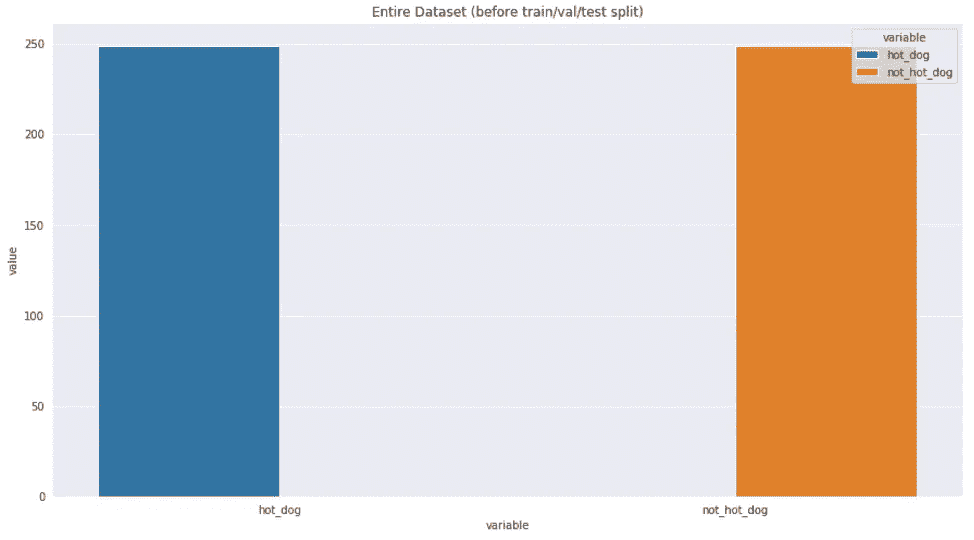
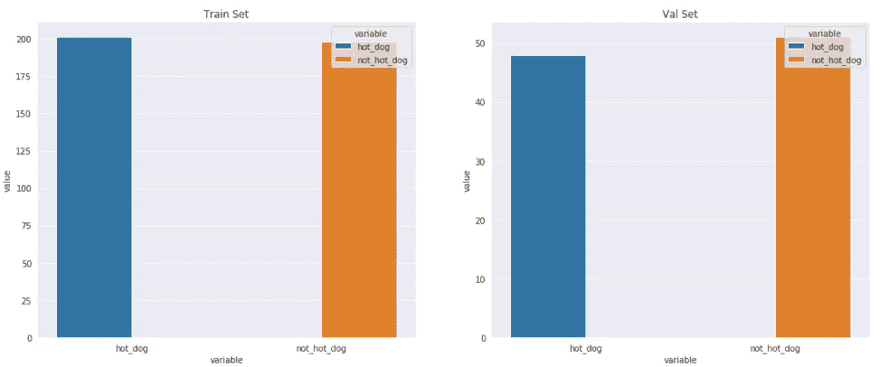
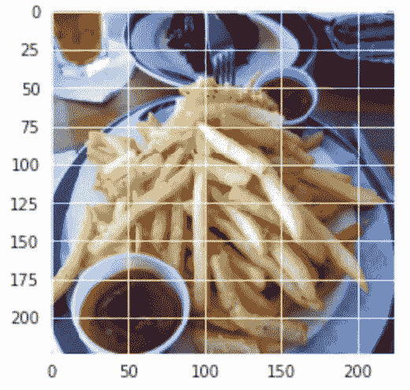
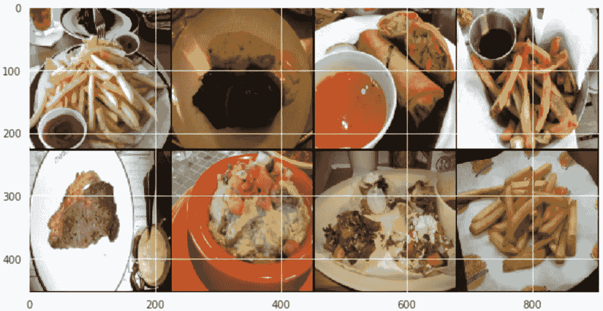
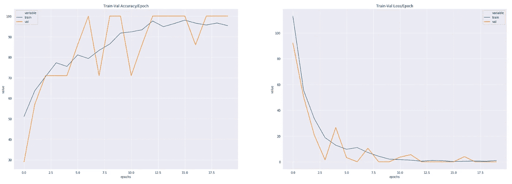

# py torch[视觉] —二值图像分类

> 原文：<https://towardsdatascience.com/pytorch-vision-binary-image-classification-d9a227705cf9?source=collection_archive---------8----------------------->


如何训练你的神经网络[图片[0]]

## [如何训练你的神经网络](https://medium.com/tag/akshaj-wields-pytorch)

## 本笔记本将带您使用 PyTorch 上的热狗/非热狗数据集，通过 CNN 实现二值图像分类。

# 导入库

```
import numpy as np
import pandas as pd
import seaborn as sns
from tqdm.notebook import tqdm
import matplotlib.pyplot as plt import torch
import torchvision
import torch.nn as nn
import torch.optim as optim
import torch.nn.functional as F
from torchvision import transforms, utils, datasets
from torch.utils.data import Dataset, DataLoader, SubsetRandomSampler from sklearn.metrics import classification_report, confusion_matrix
```

设置随机种子。

```
np.random.seed(0)
torch.manual_seed(0)
```

设置`Seaborn`样式。

```
%matplotlib inline
sns.set_style('darkgrid')
```

# 定义路径并设置 GPU

让我们定义数据的路径。

```
device = torch.device("cuda" if torch.cuda.is_available() else "cpu")
print("We're using =>", device)root_dir = "../../../data/computer_vision/image_classification/hot-dog-not-hot-dog/"
print("The data lies here =>", root_dir) ###################### OUTPUT ######################We're using => cuda
The data lies here => ../../../data/computer_vision/image_classification/hot-dog-not-hot-dog/
```

# 定义转换

让我们定义一个字典来保存训练/测试集的图像转换。我们将调整所有图像的大小为大小(224，224 ),并将图像转换为张量。

PyTorch 中的`ToTensor`操作将所有张量转换到(0，1)之间。

> `*ToTensor*` *将范围[0，255]内的 PIL 图像或 numpy.ndarray (H x W x C)转换为火炬。形状(C x H x W)在[0.0，1.0]* 范围内的浮点数

```
image_transforms = {
    "train": transforms.Compose([
        transforms.Resize((224, 224)),
        transforms.ToTensor()
    ]),
    "test": transforms.Compose([
        transforms.Resize((224, 224)),
        transforms.ToTensor()
}
```

# 初始化数据集

## 训练+验证数据集

我们随身带着 2 个数据集文件夹— **训练**和**测试**。

我们将进一步划分我们的**火车**集合为**火车+ Val** 。

```
hotdog_dataset = datasets.ImageFolder(root = root_dir + "train",
                                      transform = image_transforms["train"]
                                     )hotdog_dataset ###################### OUTPUT ######################Dataset ImageFolder
    Number of datapoints: 498
    Root location: ../../../data/computer_vision/image_classification/hot-dog-not-hot-dog/train
    StandardTransform
Transform: Compose(
               Resize(size=(224, 224), interpolation=PIL.Image.BILINEAR)
               ToTensor()
           )
```

## 输出的类<=> ID 映射

PyTorch 内置了`class_to_idx`功能。它返回数据集中的类 ID。

```
hotdog_dataset.class_to_idx ###################### OUTPUT ######################{'hot_dog': 0, 'not_hot_dog': 1}
```

我们现在将构建该字典的反向；ID 到类的映射。

```
idx2class = {v: k for k, v in hotdog_dataset.class_to_idx.items()}
```

让我们还编写一个函数，它接受一个 dataset 对象并返回一个包含类样本计数的字典。我们将使用这个字典来构建图，并观察我们的数据中的类分布。

`get_class_distribution()`接受了一个名为`dataset_obj`的论点。

*   我们首先初始化一个`count_dict`字典，其中所有类的计数都被初始化为 0。
*   然后，让我们遍历数据集，并为循环中遇到的每个类标签将计数器加 1。

`plot_from_dict()`接受 3 个参数:一个名为`dict_obj`、`plot_title`和`**kwargs`的字典。我们传入`**kwargs`是因为稍后，我们将构建需要在 Seaborn 中传递`ax`参数的支线剧情。

*   首先将字典转换为数据框。
*   融合数据框和绘图。

```
def get_class_distribution(dataset_obj):
    count_dict = {k:0 for k,v in dataset_obj.class_to_idx.items()} for _, label_id in dataset_obj:
        label = idx2class[label_id]
        count_dict[label] += 1
    return count_dict def plot_from_dict(dict_obj, plot_title, **kwargs):
    return sns.barplot(data = pd.DataFrame.from_dict([dict_obj]).melt(), x = "variable", y="value", hue="variable", **kwargs).set_title(plot_title)plt.figure(figsize=(15,8))
plot_from_dict(get_class_distribution(hotdog_dataset), plot_title="Entire Dataset (before train/val/test split)")
```



整个数据集上的类分布[图像[1]]

# 获取训练和验证样本

我们使用`SubsetRandomSampler`来制作我们的训练和验证加载器。`SubsetRandomSampler`用于使每批接收一个随机分布的类。

我们也可以将我们的数据集分成两部分— train 和 val ie。制作 2 个`Subsets`。但是这更简单，因为我们的数据加载器现在几乎可以处理所有的事情。

`SubsetRandomSampler(indices)`将数据的索引作为输入。

我们首先创建我们的采样器，然后将它传递给我们的数据加载器。

*   创建索引列表。
*   打乱索引。
*   根据列车价值百分比拆分指数。
*   创造`SubsetRandomSampler`。

创建从 0 到数据集长度的索引列表。

```
hotdog_dataset_size = len(hotdog_dataset)
hotdog_dataset_indices = list(range(hotdog_dataset_size))
```

使用 np.shuffle 打乱索引列表。

```
np.random.shuffle(hotdog_dataset_indices)
```

创建拆分索引。我们选择拆分索引为数据集大小的 20% (0.2)。

```
val_split_index = int(np.floor(0.2 * hotdog_dataset_size))
```

将列表切片以获得 2 个索引列表，一个用于训练，另一个用于测试。

> `0-----------val_split_index------------------------------n`
> 
> train = >**val _ split _ index**至 **n**
> 
> Val => **0** 至 **val_split_index**

```
train_idx, val_idx = hotdog_dataset_indices[val_split_index:], hotdog_dataset_indices[:val_split_index]
```

最后，创建采样器。

```
train_sampler = SubsetRandomSampler(train_idx)
val_sampler = SubsetRandomSampler(val_idx)
```

# 试验

既然我们已经完成了训练和赋值数据，让我们加载测试数据集。

```
hotdog_dataset_test = datasets.ImageFolder(root = root_dir + "test",
                                            transform = image_transforms["test"]
                                           )hotdog_dataset_test ###################### OUTPUT ######################Dataset ImageFolder
    Number of datapoints: 500
    Root location: ../../../data/computer_vision/image_classification/hot-dog-not-hot-dog/test
    StandardTransform
Transform: Compose(
               Resize(size=(224, 224), interpolation=PIL.Image.BILINEAR)
               ToTensor()
           )
```

# 培训、验证和测试数据加载器

现在，我们将把采样器传递给我们的数据加载器。请注意，当您使用`SubsetRandomSampler`时，不能使用`shuffle=True`。

```
train_loader = DataLoader(dataset=hotdog_dataset, shuffle=False, batch_size=8, sampler=train_sampler)val_loader = DataLoader(dataset=hotdog_dataset, shuffle=False, batch_size=1, sampler=val_sampler)test_loader = DataLoader(dataset=hotdog_dataset_test, shuffle=False, batch_size=1)
```

# 探索数据

为了研究我们 train 和 val 数据加载器，让我们创建一个新函数，它接收一个数据加载器并返回一个包含类计数的字典。

*   将字典`count_dict`初始化为全 0。
*   如果`dataloader_obj`的 batch_size 为 1，则循环通过`dataloader_obj`并更新计数器。
*   否则，如果`dataloader_obj`的 batch_size 是**而不是** 1，则循环通过`dataloader_obj`获得批次。循环遍历批以获得单个张量。现在，相应地更新了计数器。

```
def get_class_distribution_loaders(dataloader_obj, dataset_obj):
    count_dict = {k:0 for k,v in dataset_obj.class_to_idx.items()} if dataloader_obj.batch_size == 1:    
        for _,label_id in dataloader_obj:
            y_idx = label_id.item()
            y_lbl = idx2class[y_idx]
            count_dict[str(y_lbl)] += 1
    else: 
        for _,label_id in dataloader_obj:
            for idx in label_id:
                y_idx = idx.item()
                y_lbl = idx2class[y_idx]
                count_dict[str(y_lbl)] += 1 return count_dict
```

为了绘制类分布，我们将使用前面定义的带有`ax`参数的`plot_from_dict()`函数。

```
fig, axes = plt.subplots(nrows=1, ncols=2, figsize=(18,7))plot_from_dict(get_class_distribution_loaders(train_loader, hotdog_dataset), plot_title="Train Set", ax=axes[0])plot_from_dict(get_class_distribution_loaders(val_loader, hotdog_dataset), plot_title="Val Set", ax=axes[1])
```



训练和值集的类分布[图像[2]]

既然我们已经看了类分布，现在让我们看一个单一的图像。

```
single_batch = next(iter(train_loader))
```

`single_batch`是 2 个元素的列表。第一个元素(第 0 个索引)包含图像张量，而第二个元素(第 1 个索引)包含输出标签。

这是列表的第一个元素，它是一个张量。这个张量的形状是`(batch, channels, height, width)`。

```
single_batch[0].shape ###################### OUTPUT ######################torch.Size([8, 3, 224, 224])
```

这是该批次的输出标签。

```
print("Output label tensors: ", single_batch[1])
print("\nOutput label tensor shape: ", single_batch[1].shape) ###################### OUTPUT ######################Output label tensors:  tensor([1, 1, 1, 1, 1, 1, 1, 1])Output label tensor shape:  torch.Size([8])
```

为了绘制图像，我们将使用 matloptlib 中的`plt.imshow`。它期望图像尺寸为`(height, width, channels)`。我们将`.permute()`我们的单个图像张量来绘制它。

```
# Selecting the first image tensor from the batch. 
single_image = single_batch[0][0]single_image.shape ###################### OUTPUT ######################torch.Size([3, 224, 224])
```

让我们来看图像。

```
plt.imshow(single_image.(1, 2, 0))
```



数据集[图像[3]]中的单个样本

PyTorch 使我们更容易直接从批次中绘制网格图像。

我们首先从列表中提取图像张量(由我们的数据加载器返回)并设置`nrow`。然后我们使用`plt.imshow()`函数来绘制网格。记住`.permute()`张量维度！

```
# We do single_batch[0] because each batch is a list 
# where the 0th index is the image tensor and 1st index is the output label.
single_batch_grid = utils.make_grid(single_batch[0], nrow=4)plt.figure(figsize = (10,10))
plt.imshow(single_batch_grid.permute(1, 2, 0))
```



来自数据集的多个样本[图像[4]]

# 定义 CNN 架构

我们的建筑很简单。我们使用 4 块 Conv 层。每个区块由`Convolution` + `BatchNorm` + `ReLU` + `Dropout`层组成。

我们不会在最后使用一个`FC`层。我们将坚持使用`Conv`层。

```
class HotDogClassifier(nn.Module):
    def __init__(self):
        super(HotDogClassifier, self).__init__()
 self.block1 = self.conv_block(c_in=3, c_out=256, dropout=0.1, kernel_size=5, stride=1, padding=2)
        self.block2 = self.conv_block(c_in=256, c_out=128, dropout=0.1, kernel_size=3, stride=1, padding=1)
        self.block3 = self.conv_block(c_in=128, c_out=64, dropout=0.1, kernel_size=3, stride=1, padding=1)
        self.lastcnn = nn.Conv2d(in_channels=64, out_channels=2, kernel_size=56, stride=1, padding=0) self.maxpool = nn.MaxPool2d(kernel_size=2, stride=2) def forward(self, x):
        x = self.block1(x)
        x = self.maxpool(x) x = self.block2(x) x = self.block3(x)
        x = self.maxpool(x) x = self.lastcnn(x) return x def conv_block(self, c_in, c_out, dropout,  **kwargs):
        seq_block = nn.Sequential(
            nn.Conv2d(in_channels=c_in, out_channels=c_out, **kwargs),
            nn.BatchNorm2d(num_features=c_out),
            nn.ReLU(),
            nn.Dropout2d(p=dropout)
        ) return seq_block
```

现在我们将初始化模型、优化器和损失函数。

然后我们将模型传输到 GPU。

尽管这是一个二元分类问题，我们还是使用了`nn.CrossEntropyLoss`。这意味着，我们将处理`0 and 1`的返回 2 个值，而不是返回`1/0`的单个输出。更具体地说，输出的概率是`1`或`0`。

我们不需要在最后一层之后手动添加一个`log_softmax`层，因为`nn.CrossEntropyLoss`已经为我们做了。

然而，我们需要应用`log_softmax`进行验证和测试。

```
model = HotDogClassifier()
model.to(device)
print(model)criterion = nn.CrossEntropyLoss()
optimizer = optim.Adam(model.parameters(), lr=0.008) ###################### OUTPUT ######################HotDogClassifier(
  (block1): Sequential(
    (0): Conv2d(3, 256, kernel_size=(5, 5), stride=(1, 1), padding=(2, 2))
    (1): BatchNorm2d(256, eps=1e-05, momentum=0.1, affine=True, track_running_stats=True)
    (2): ReLU()
    (3): Dropout2d(p=0.1, inplace=False)
  )
  (block2): Sequential(
    (0): Conv2d(256, 128, kernel_size=(3, 3), stride=(1, 1), padding=(1, 1))
    (1): BatchNorm2d(128, eps=1e-05, momentum=0.1, affine=True, track_running_stats=True)
    (2): ReLU()
    (3): Dropout2d(p=0.1, inplace=False)
  )
  (block3): Sequential(
    (0): Conv2d(128, 64, kernel_size=(3, 3), stride=(1, 1), padding=(1, 1))
    (1): BatchNorm2d(64, eps=1e-05, momentum=0.1, affine=True, track_running_stats=True)
    (2): ReLU()
    (3): Dropout2d(p=0.1, inplace=False)
  )
  (lastcnn): Conv2d(64, 2, kernel_size=(56, 56), stride=(1, 1))
  (maxpool): MaxPool2d(kernel_size=2, stride=2, padding=0, dilation=1, ceil_mode=False)
)
```

在我们开始训练之前，让我们定义一个函数来计算每个历元的精度。

该函数将`y_pred`和`y_test`作为输入参数。然后，我们将 softmax 应用于`y_pred`并提取具有较高概率的类别。

之后，我们比较预测类别和实际类别来计算准确度。

```
def binary_acc(y_pred, y_test):
    y_pred_tag = torch.log_softmax(y_pred, dim = 1)
    _, y_pred_tags = torch.max(y_pred_tag, dim = 1) correct_results_sum = (y_pred_tags == y_test).sum().float() acc = correct_results_sum/y_test.shape[0]
    acc = torch.round(acc * 100) return acc
```

我们还将定义 2 个字典，用于存储训练集和验证集的准确度/时期和损失/时期。

```
accuracy_stats = {
    'train': [],
    "val": []
}loss_stats = {
    'train': [],
    "val": []
}
```

让我们训练我们的模型！

你可以看到，我们在循环之前已经在。`model.train()`告诉 PyTorch 你正处于训练模式。为什么我们需要这么做？如果你使用了像`Dropout`或`BatchNorm`这样在训练和评估过程中表现不同的层(例如；评估期间不使用`dropout`，您需要告诉 PyTorch 采取相应的行动。而 PyTorch 中的默认模式是火车，因此，您不必显式地编写它。但这是很好的练习。

同样，当我们测试我们的模型时，我们将调用`model.eval()`。我们将在下面看到。回到训练；我们开始一个循环。在这个 for 循环的顶部，我们将每个历元的损失和精度初始化为 0。在每个时期之后，我们将打印出损失/精度并将其重置回 0。

然后我们有另一个 for 循环。这个 for 循环用于从`train_loader`中批量获取我们的数据。

在我们做任何预测之前，我们先做`optimizer.zero_grad()`。由于`.backward()`函数累加梯度，我们需要为每个小批量手动将其设置为 0。然后，从我们定义的模型中，我们获得一个预测，获得该小批量的损失(和准确性)，使用 loss.backward()和 optimizer.step()执行反向传播。

最后，我们将所有小批量损失(和精度)相加，以获得该时期的平均损失(和精度)。我们将每个小批次的所有损耗/精度相加，最后除以小批次的数量，即。为获得每个时期的平均损失/精确度，列车装载器的长度。

我们遵循的培训程序与验证程序完全相同，除了我们在`torch.no_grad`中对其进行了包装，并且不执行任何反向传播。`torch.no_grad()`告诉 PyTorch 我们不想执行反向传播，这样可以减少内存使用并加快计算速度。

```
print("Begin training.")for e in tqdm(range(1, 21)): # TRAINING train_epoch_loss = 0
    train_epoch_acc = 0 model.train()
    for X_train_batch, y_train_batch in train_loader:
        X_train_batch, y_train_batch = X_train_batch.to(device), y_train_batch.to(device)
        optimizer.zero_grad() y_train_pred = model(X_train_batch).squeeze() train_loss = criterion(y_train_pred, y_train_batch)
        train_acc = binary_acc(y_train_pred, y_train_batch) train_loss.backward()
        optimizer.step() train_epoch_loss += train_loss.item()
        train_epoch_acc += train_acc.item() # VALIDATION
    with torch.no_grad():
        model.eval()
        val_epoch_loss = 0
        val_epoch_acc = 0
        for X_val_batch, y_val_batch in val_loader:
            X_val_batch, y_val_batch = X_val_batch.to(device), y_val_batch.to(device) y_val_pred = model(X_val_batch).squeeze()
            y_val_pred = torch.unsqueeze(y_val_pred, 0) val_loss = criterion(y_val_pred, y_val_batch)
            val_acc = binary_acc(y_val_pred, y_val_batch) val_epoch_loss += val_loss.item()
            val_epoch_acc += val_acc.item() loss_stats['train'].append(train_epoch_loss/len(train_loader))
    loss_stats['val'].append(val_epoch_loss/len(val_loader))
    accuracy_stats['train'].append(train_epoch_acc/len(train_loader))
    accuracy_stats['val'].append(val_epoch_acc/len(val_loader)) print(f'Epoch {e+0:02}: | Train Loss: {train_epoch_loss/len(train_loader):.5f} | Val Loss: {val_epoch_loss/len(val_loader):.5f} | Train Acc: {train_epoch_acc/len(train_loader):.3f}| Val Acc: {val_epoch_acc/len(val_loader):.3f}')###################### OUTPUT ######################Begin training.Epoch 01: | Train Loss: 113.08463 | Val Loss: 92.26063 | Train Acc: 51.120| Val Acc: 29.000
Epoch 02: | Train Loss: 55.47888 | Val Loss: 50.39846 | Train Acc: 63.620| Val Acc: 57.000
Epoch 03: | Train Loss: 33.44443 | Val Loss: 20.69457 | Train Acc: 70.500| Val Acc: 71.000
Epoch 04: | Train Loss: 18.75201 | Val Loss: 1.50821 | Train Acc: 77.240| Val Acc: 71.000
Epoch 05: | Train Loss: 12.88685 | Val Loss: 26.62685 | Train Acc: 75.480| Val Acc: 71.000
Epoch 06: | Train Loss: 9.70507 | Val Loss: 3.25360 | Train Acc: 81.080| Val Acc: 86.000
Epoch 07: | Train Loss: 11.04334 | Val Loss: 0.00000 | Train Acc: 79.320| Val Acc: 100.000
Epoch 08: | Train Loss: 7.16636 | Val Loss: 10.48954 | Train Acc: 83.300| Val Acc: 71.000
Epoch 09: | Train Loss: 4.32204 | Val Loss: 0.00001 | Train Acc: 86.400| Val Acc: 100.000
Epoch 10: | Train Loss: 2.03338 | Val Loss: 0.00000 | Train Acc: 91.720| Val Acc: 100.000
Epoch 11: | Train Loss: 1.68124 | Val Loss: 3.65754 | Train Acc: 92.320| Val Acc: 71.000
Epoch 12: | Train Loss: 1.27145 | Val Loss: 5.52111 | Train Acc: 93.320| Val Acc: 86.000
Epoch 13: | Train Loss: 0.42285 | Val Loss: 0.00000 | Train Acc: 97.600| Val Acc: 100.000
Epoch 14: | Train Loss: 1.03441 | Val Loss: 0.00000 | Train Acc: 94.840| Val Acc: 100.000
Epoch 15: | Train Loss: 0.76563 | Val Loss: 0.00000 | Train Acc: 96.340| Val Acc: 100.000
Epoch 16: | Train Loss: 0.16889 | Val Loss: 0.00000 | Train Acc: 98.040| Val Acc: 100.000
Epoch 17: | Train Loss: 0.42046 | Val Loss: 4.02560 | Train Acc: 96.560| Val Acc: 86.000
Epoch 18: | Train Loss: 0.57535 | Val Loss: 0.00000 | Train Acc: 95.640| Val Acc: 100.000
Epoch 19: | Train Loss: 0.40181 | Val Loss: 0.00000 | Train Acc: 96.620| Val Acc: 100.000
Epoch 20: | Train Loss: 0.92207 | Val Loss: 0.00000 | Train Acc: 95.360| Val Acc: 100.000
```

# 可视化损失和准确性

为了绘制损耗和精度线图，我们再次从`accuracy_stats`和`loss_stats`字典中创建一个数据帧。

```
train_val_acc_df = pd.DataFrame.from_dict(accuracy_stats).reset_index().melt(id_vars=['index']).rename(columns={"index":"epochs"})train_val_loss_df = pd.DataFrame.from_dict(loss_stats).reset_index().melt(id_vars=['index']).rename(columns={"index":"epochs"})fig, axes = plt.subplots(nrows=1, ncols=2, figsize=(30,10))
sns.lineplot(data=train_val_acc_df, x = "epochs", y="value", hue="variable",  ax=axes[0]).set_title('Train-Val Accuracy/Epoch')sns.lineplot(data=train_val_loss_df, x = "epochs", y="value", hue="variable", ax=axes[1]).set_title('Train-Val Loss/Epoch')
```



列车和阀门组的 Acc/loss 曲线[图片[5]]

# 试验

训练完成后，我们需要测试我们的模型进展如何。注意，在运行测试代码之前，我们已经使用了`model.eval()`。为了告诉 PyTorch 我们不希望在推断过程中执行反向传播，我们使用了`torch.no_grad()`，就像我们对上面的验证循环所做的那样。

*   我们首先定义一个包含我们预测的列表。然后我们使用`test_loader`循环遍历我们的批处理。对于每一批-
*   我们将输入小批量数据转移到 GPU。
*   我们使用训练好的模型进行预测。
*   将 log_softmax 激活应用于预测，并选择概率最高的索引。
*   将批处理从 CPU 移动到 GPU。
*   将张量转换为 numpy 对象，并将其添加到我们的列表中。

```
y_pred_list = []
y_true_list = []
with torch.no_grad():
    for x_batch, y_batch in tqdm(test_loader):
        x_batch, y_batch = x_batch.to(device), y_batch.to(device) y_test_pred = model(x_batch)
        _, y_pred_tag = torch.max(y_test_pred, dim = 1) y_pred_list.append(y_pred_tag.cpu().numpy())
        y_true_list.append(y_batch.cpu().numpy())
```

我们将使列表变平，这样我们就可以将它用作`confusion_matrix`和`classification_report`的输入。

```
y_pred_list = [i[0][0][0] for i in y_pred_list]y_true_list = [i[0] for i in y_true_list]
```

# 分类报告

最后，我们打印出包含精确度、召回率和 F1 分数的分类报告。

```
print(classification_report(y_true_list, y_pred_list)) ###################### OUTPUT ######################precision    recall  f1-score   support 0       0.90      0.91      0.91       249
           1       0.91      0.90      0.91       249 accuracy                           0.91       498
   macro avg       0.91      0.91      0.91       498
weighted avg       0.91      0.91      0.91       498
```

# 混淆矩阵

让我们使用`confusion_matrix()`函数来制作一个混淆矩阵。

```
print(confusion_matrix(y_true_list, y_pred_list)) ###################### OUTPUT ######################[[226  23]
 [ 24 225]]
```

我们从混淆矩阵中创建一个数据框架，并使用 seaborn 库将其绘制为热图。

```
confusion_matrix_df = pd.DataFrame(confusion_matrix(y_true_list, y_pred_list)).rename(columns=idx2class, index=idx2class)fig, ax = plt.subplots(figsize=(7,5))         
sns.heatmap(confusion_matrix_df, annot=True, ax=ax)
```


混淆矩阵热图[图片[6]]

感谢您的阅读。欢迎提出建议和建设性的批评。:)

这篇博文是专栏“如何训练你的神经网络”的一部分。你可以在这里找到[系列](https://towardsdatascience.com/tagged/akshaj-wields-pytorch) **。**

你可以在 [LinkedIn](https://www.linkedin.com/in/akshajverma7/) 和 [Twitter](https://twitter.com/theairbend3r) 找到我。如果你喜欢这个，看看我的其他[博客](https://medium.com/@theairbend3r)。

[](https://www.buymeacoffee.com/theairbend3r)