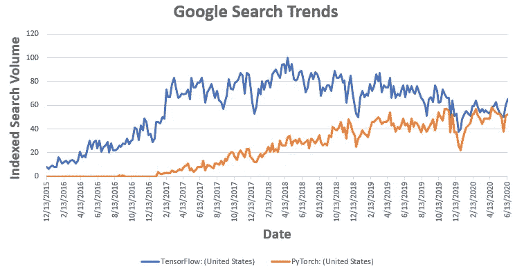

# 2020 年 Pytorch vs Tensorflow

> 原文：<https://towardsdatascience.com/pytorch-vs-tensorflow-in-2020-fe237862fae1?source=collection_archive---------4----------------------->

## 两种流行的框架是如何融合的

Pytorch 和 Tensorflow 是目前最流行的两个深度学习框架。学习和适应一个新的框架总是需要做大量的工作，所以很多人面临着从两个框架中选择哪一个的困境

这两个框架在设计、范式、语法等方面有很大的不同，但是它们已经发展了很多，都从对方那里吸取了好的特性，不再有那么大的不同。

很多比较这两者的网上文章都有点过时了，而且没有恰当地抓住当前的情况。事实上，PyTorch 的原始作者之一 Soumith Chintala 最近也在推特上说这两个框架现在非常相似。

# 简史

Tensorflow 来自谷歌，于 2015 年发布，PyTorch 由脸书于 2017 年发布。

Tensorflow 出现较早，因此在用户数量、采用率等方面领先，但 Pytorch 在过去几年中大大缩小了差距



来源:[谷歌趋势](https://trends.google.com/trends/explore?date=today%205-y&geo=US&q=%2Fg%2F11bwp1s2k3,%2Fg%2F11gd3905v1)

两者都致力于被称为*张量*的基本数据类型，它只不过是多维数组，适合高性能计算。两者都将计算表示为有向无环图，通常称为*计算图。*

# 功能比较:过去和现在

让我们来看看这些框架的一些重要方面，开始时的主要区别以及目前的情况。

**编程 API**

Tensorflow API 一开始非常神秘，感觉就像在学习一种新的编程语言，此外，由于其静态计算图方法，它也很难调试(下面将详细介绍)。另一方面，Pytorch (python) API 从一开始就非常 python 化，感觉就像编写原生 Python 代码一样，非常容易调试。

Tensorflow 使用 Tensorflow 2.0 对其 API 进行了重大清理，并将高级编程 API Keras 集成到主 API 本身中。这两者的结合极大地减少了过去编写张量流代码时必须承受的认知负荷:-)。

编程 API(tensor flow 和 PyTorch)实际上现在看起来非常相似，以至于两者很多时候都无法区分(见最后的例子)

## **计算图**

计算图是两个框架之间的主要设计差异。

Tensorflow 采用了一种静态计算图方法，在这种方法中，我们定义了想要执行的计算序列，并为数据预留了占位符。之后，为了训练/运行模型，你输入数据。静态计算图对于性能和在不同设备(cpu / gpu / tpu)上运行的能力非常重要，但是调试起来非常麻烦。

另一方面，Pytorch 采用了动态计算图方法，在解释代码时逐行进行计算。这使得调试代码变得容易得多，并且还提供了其他好处——例如在像 RNN 这样的模型中支持可变长度输入。

快进到今天，Tensorflow 引入了通过其“渴望”模式构建动态计算图的工具，PyTorch 允许构建静态计算图，所以现在两个框架中都有静态/动态模式。

## **分布式计算**

这两个框架都提供了在单/多/分布式 CPU 或 GPU 上运行的工具。在早期，让 Tensorflow 在多个 GPU 上工作是一件痛苦的事情，因为人们必须在多个设备上手动编码和微调性能，从那时起事情发生了变化，现在使用这两个框架进行分布式计算几乎毫不费力。

谷歌定制的硬件加速器张量处理单元(TPU)可以以极快的速度运行计算，甚至比 GPU 快得多，将于 2018 年供第三方使用。由于 Tensorflow 和 TPU 都来自谷歌，使用 Tensorflow 在 TPU 上运行代码要比使用 PyTorch 容易得多，因为 PyTorch 使用第三方库(如 [XLA](https://github.com/pytorch/xla) )在 TPU 上运行代码的方式有点混乱

## 部署/生产

与 PyTorch 相比，Tensorflow 在部署方面有很多优势，部分原因是其静态计算图方法带来了更好的性能，但也是因为有助于在云、浏览器或移动设备上快速部署的包/工具。这就是很多公司在生产时更喜欢 Tensorflow 的原因。

PyTorch 试图在 1.5+版本中用 TorchServe 来弥补这一差距，但它尚未成熟

## 代码比较

有趣的是，很多东西的 API 是如此的相似，以至于代码几乎无法区分。下面是 Tensorflow 和 Pytorch 的 [MNIST 数字识别](https://en.wikipedia.org/wiki/MNIST_database)(计算机视觉中众所周知的“Hello World”问题)的核心组件的代码片段，试着**猜猜**哪个是哪个

完整的 Tensorflow 和 Pytorch 代码可在我的 [Github Repo](https://github.com/moizsaifee/TF-vs-PyTorch) 获得

**数据加载器**

```
*# Download the MNIST Data* (x_train, y_train), (x_test, y_test) = mnist.load_data()
x_train, x_test = x_train / 255.0, x_test / 255.0
*# Add a channels dimension* x_train = x_train[..., tf.newaxis]
x_test = x_test[..., tf.newaxis]

train_ds = tf.data.Dataset.from_tensor_slices((x_train, y_train)).shuffle(10000).batch(32)
test_ds = tf.data.Dataset.from_tensor_slices((x_test, y_test)).batch(32)
```

哪一个是 PyTorch 代码-上面还是下面？

```
*# Download the MNIST Data and create dataloader* transform = transforms.Compose([transforms.ToTensor()])
xy_train = datasets.MNIST(**'./'**, download=True, train=True, transform=transform)
xy_test = datasets.MNIST(**'./'**, download=True, train=False, transform=transform)

train_ds = DataLoader(xy_train, batch_size=32, shuffle=True)
test_ds = DataLoader(xy_test, batch_size=32, shuffle=True)
```

好的，加载数据的方法看起来有点不同，但是我保证从现在开始会变得相似:-)

**模型定义**

```
*# Model Definition* class MyModel(nn.Module):
    def __init__(self):
        super(MyModel, self).__init__()
        self.conv1 = Conv2d(in_channels=1, out_channels=32, kernel_size=3)
        self.flatten = Flatten()
        self.d1 = Linear(21632, 128)
        self.d2 = Linear(128, 10)

    def forward(self, x):
        x = F.relu(self.conv1(x))
        x = self.flatten(x)
        x = F.relu(self.d1(x))
        x = self.d2(x)
        output = F.log_softmax(x, dim=1)
        return output
```

*哪一个是 PyTorch 码——上面还是下面？*

```
*# Model Definition* class MyModel(Model):
    def __init__(self):
        super(MyModel, self).__init__()
        self.conv1 = Conv2D(filters=32, kernel_size=3, activation=**'relu'**)
        self.flatten = Flatten()
        self.d1 = Dense(128, activation=**'relu'**)
        self.d2 = Dense(10)

    def call(self, x):
        x = self.conv1(x)
        x = self.flatten(x)
        x = self.d1(x)
        output = self.d2(x)
        return output
```

**实例化模型、损失、优化器**

```
*# Instantiate Model, Optimizer, Loss* model = MyModel()
optimizer = Adam()
loss_object = SparseCategoricalCrossentropy(from_logits=True, reduction=**'sum'**)
```

*哪个是 PyTorch 码——上面还是下面？*

```
*# Instantiate Model, Optimizer, Loss* model = MyModel()
optimizer = Adam(model.parameters())
loss_object = CrossEntropyLoss(reduction=**'sum'**)
```

**训练循环**

```
for epoch in range(2):
    *# Reset the metrics at the start of the next epoch* train_loss = 0
    train_n = 0
    for images, labels in train_ds:
        with GradientTape() as tape:
            *# training=True is only needed if there are layers with different
            # behavior during training versus inference (e.g. Dropout).* predictions = model(images, training=True)
            loss = loss_object(labels, predictions)
            train_loss += loss.numpy()
            train_n += labels.shape[0]
        gradients = tape.gradient(loss, model.trainable_variables)
        optimizer.apply_gradients(zip(gradients, model.trainable_variables))
    train_loss /= train_n
```

*哪个是 PyTorch 码——上面还是下面？*

```
for epoch in range(2):
    *# Train* model.train()
    train_loss = 0
    train_n = 0
    for image, labels in train_ds:
        predictions = model(image).squeeze()
        loss = loss_object(predictions, labels)
        train_loss += loss.item()
        train_n += labels.shape[0]
        loss.backward()
        optimizer.step()
        optimizer.zero_grad()
    train_loss /= train_n
```

真的很有趣(而且方便！)现在的 API 看起来是多么的相似。

# 结论

Tensorflow 和 PyTorch 是深度学习应用研发的两个优秀框架。他们在计算、管理底层硬件方面做着繁重的工作，并拥有庞大的社区，这使得站在巨人的肩膀上开发定制应用程序变得容易得多。

直到不久前，这两个框架还存在一些主要的差异，从那以后，它们都从对方那里吸取了好的特性，并在这个过程中变得更好。仍然有一些东西在一个中比另一个稍微容易一些，但是由于相似性的增加，现在在两者之间来回切换也比以前更容易了。

# 参考

*   [https://github.com/moizsaifee/TF-vs-PyTorch](https://github.com/moizsaifee/TF-vs-PyTorch)
*   [https://www.tensorflow.org/guide/effective_tf2](https://www.tensorflow.org/guide/effective_tf2)
*   [https://pytorch.org/docs/stable/index.html](https://pytorch.org/docs/stable/index.html)