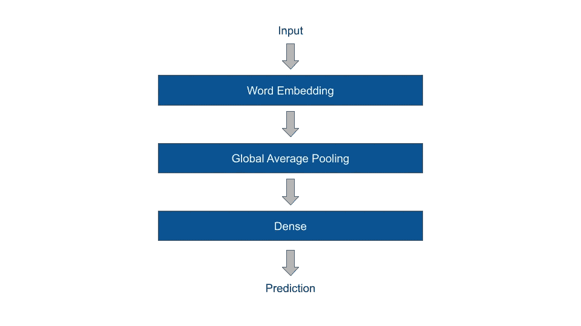
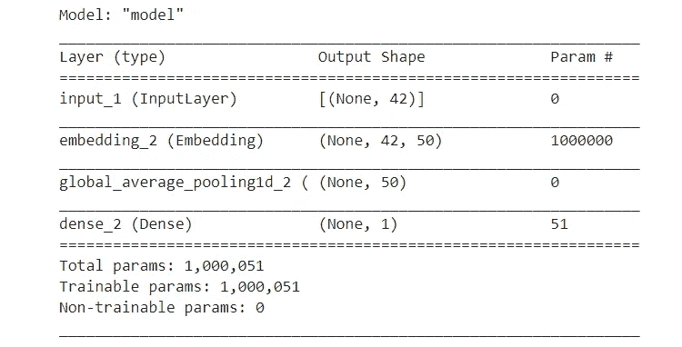

# 深度学习 TensorFlow vs PyTorch

> 原文：<https://towardsdatascience.com/pytorch-vs-tensorflow-in-code-ada936fd5406?source=collection_archive---------3----------------------->

## 下面是 TensorFlow 和 PyTorch 中编码神经网络的样子


[cloudvisual.co.uk](https://unsplash.com/@cloudvisual?utm_source=medium&utm_medium=referral)在 [Unsplash](https://unsplash.com?utm_source=medium&utm_medium=referral) 上拍照

Y 你可能想知道是学习 PyTorch 还是 TensorFlow (2.0)。如果是这样，希望这篇博文能有所帮助。这个想法并不是在这里给出一个绝对的答案，而是仅仅展示在这两种情况下开发和训练神经网络是什么样子。

在研究代码之前，需要知道一些事情:TensorFlow 和 PyTorch 都是专门为开发深度学习算法而设计的机器学习框架，这些算法具有处理大量数据所需的计算能力(例如，并行计算、GPU 上的训练等)。

来自谷歌的 TensorFlow 于 2015 年在 Apache 2.0 许可下发布。2019 年十月，TensorFlow 2.0 发布，据说是一个巨大的进步。它通常在 Python 中使用。另一方面，PyTorch 来自脸书，于 2016 年在类似的许可开源许可证下发布。顾名思义，它也是一个 Python 库。

## 模型定义

回到这篇博文的主要原因。我们的计划是在 TensorFlow 和 PyTorch 中实现一个简单的神经网络架构，以了解其中的一些相似之处和不同之处。

神经网络模型由三层组成:嵌入层→全局平均池层→密集层。就是基于这个[例子](https://keras.io/examples/imdb_fasttext/)。



## 数据集和预处理

这里使用的数据集由 40，000 条推文及其情绪组成(0 =负面，1 =正面)。首先，从 CSV 文件加载数据，并显示数据框的一些行，以了解数据的概念。

```
import numpy as np
import pandas as pddata = pd.read_csv("./data/tweets.csv", encoding=’utf-8')
data[:10]
```


为了对推文进行矢量化，我在这里使用了 Keras 的 tokenizer，但还有无数其他人可以做同样的事情，甚至更多。

下面是上面代码片段中发生的情况。我们给推文中 20，000 个最常见的单词分配一个整数，然后将推文转换成整数序列。我们用零填充较短的 1，并截掉较长的 1，强制序列长度为 42。最后，我们应该有一个 40，000 x 42 (tweets x sequence length)的矩阵。

# 张量流 2.0

`import tensorflow as tf`

创建张量流模型通常是使用 Keras 完成的。Keras 建立在 TensorFlow 之上，可以轻松快速地构建原型，因为它内置了许多层，每次从头开始编写代码会很繁琐，甚至令人望而却步。

在 Keras 中有三种方法可以建立神经网络模型。

## 1.模型子类化

您可以通过子类化`tf.keras.Model`类并在`call`方法中实现向前传递来创建您自己的完全可定制的模型。换句话说，在`__init__()`方法中定义了层，在`call`方法中定义了向前传递的逻辑。

使用这种面向对象方法的好处是，您可以在`call`方法中多次重用层，或者定义一个更复杂的正向传递。但是在这个例子中没有发生这样的事情，它只是一个线性的层叠。

## 2.功能 API

在函数式 API 中，给定一些输入张量和输出张量，您还可以实例化一个`Model`。这是一种用户友好的构建神经网络的方式，Keras 甚至推荐它优于模型子类化。使用这种方法，您实际上定义了一个层，并立即将前一层的输入传递给它。因此，在获得相同结果的情况下，它需要的编码稍微少一些。

## 3.顺序模型 API

顺序 API 是定义模型的最紧凑的方式，对于某些(简单的)神经网络来说足够了，通常只由几个公共层组成——这是一种可训练模型的捷径。它确实很方便，也很好用，但是如果你想实现更复杂的想法，它就太不灵活了。

不管您如何构建 Keras 模型，我都想向您展示两个功能。首先，调用`model.summary()`打印模型和参数数量的紧凑摘要，超级有用。



第二，通过调用`tf.keras.utils.plot_model()`，您可以获得模型的图形化摘要。然而，它在我的 Jupyter 笔记本上不起作用。所以我不能在这里给你看，很遗憾。

## 在 Keras 中训练神经网络

在训练 Keras 模型之前，必须通过运行`model.compile()`函数对其进行编译，这也是指定损失函数和优化器的地方。

```
model.compile(loss='binary_crossentropy', optimizer='Adam', metrics=['accuracy'])
```

Keras 模型有一个方便的 fit 函数用于训练模型(就像 Scikit-Learn 一样)，它还负责批处理，甚至在运行中评估模型(如果您告诉它这样做的话)。

```
model.fit(x=X, y, batch_size=32, epochs=5, verbose=2, validation_split=0.2)
```

> **注意**:可以将 Numpy 数组作为输入传递给 fit 函数，即使 TensorFlow (PyTorch 也是如此)只对 tensors 进行操作，这是一种类似的数据结构，但针对矩阵计算进行了优化。Keras 负责转换引擎盖下的阵列。

# PyTorch

```
import torch
import torch.nn as nn
import torch.nn.functional as F
import torch.optim as optim
```

在 PyTorch 中有两种方法可以建立神经网络模型。

## 1.子类

类似于 TensorFlow，在 PyTorch 中，你子类化`nn.Model`模块，并在`__init__()`方法中定义你的层。唯一的区别是你在一个名为`forward`的方法中创建了向前传递，而不是调用。

> **注意**:与 Keras 模型的区别:PyTorch 中只有一个平均池层，因此它需要有合适的内核大小，以便使它成为全局平均池。

## 2.连续的

PyTorch 还提供了一个`Sequential`模块，看起来几乎相当于 TensorFlow 的。

> **注意**:我发现很多层和 PyTorch 的`*nn.Sequential*`不兼容，比如很多循环层(rnn，LSTMS 等。).事实上，PyTorch 根本不想实现顺序模块，因为它希望开发人员使用子类化。

## 在 PyTorch 中训练神经网络

PyTorch 模型没有预制的 fit 函数，因此训练循环需要从头开始实现。下面是 PyTorch 中一个典型的训练循环。

> **注意**:为了批量处理数据，必须创建一个数据加载器(此处省略，参见 GitHub [代码](https://github.com/AStoeffelbauer/PyTorchVsTensorFlow/blob/master/blogpost.ipynb))。数据加载器以字典格式一次返回一批数据。

训练循环的简短描述:对于每一批，我们计算损失，然后调用`loss.backward()`通过层反向传播梯度。此外，我们调用`optimizer.step()`来告诉优化器更新参数。关于如何训练 PyTorch 模型的更多详细描述，请参见[此处](https://pytorch.org/tutorials/beginner/pytorch_with_examples.html)。

# 如何学习 PyTorch & TensorFlow

以下是我所知道的关于 TensorFlow 和/或 PyTorch 入门的最佳资源。

## 学习 PyTorch 的一些资源

PyTorch 网站上的官方教程很棒，在我看来比 TensorFlow 的要好。在 Udacity 上还有一个非常好的免费 PyTorch 课程。

*   [py torch 网站的教程](https://pytorch.org/tutorials/)
*   [在 Udacity 上用 PyTorch](https://www.udacity.com/course/deep-learning-pytorch--ud188) 介绍深度学习
*   [深度学习用 PyTorch](https://pytorch.org/deep-learning-with-pytorch) (书)

## 学习 TensorFlow 2.0 的一些资源

TensorFlow 在 Coursera 上有一些非常好的课程，还有一本由 Keras 的创始人 Franç ois Chollet 写的很棒的书。TensorFlow 的，尤其是 Keras 的官方网站也是重要的来源。

*   [TensorFlow 网站](https://www.tensorflow.org/)
*   [Keras Dokumentation](https://keras.io/)
*   [深度学习 TensorFlow 简介](https://www.udacity.com/course/intro-to-tensorflow-for-deep-learning--ud187)在 Udacity 上
*   [TensorFlow in Practice](https://www.coursera.org/specializations/tensorflow-in-practice) 来自 Coursera 上的 deeplearning.ai
*   Franç ois Chollet 的 Python 深度学习(书)

# 那么哪个更好呢？

我真的觉得无法回答这个问题，因为到目前为止我只触及了表面。但是这里有一些我注意到的事情。

TensorFlow 非常像 Scikit-Learn，这要归功于它的 fit 功能，这使得训练模型变得超级简单快捷。但是即使你需要自己在 PyTorch 中构建每一个训练循环，我还是有点喜欢它，因为它让你更仔细地思考你在做什么。所以这不像是一个黑箱，这总是好的。我第一次学习 PyTorch，我认为这是一个非常好的主意。

> **注意**:当然，TensorFlow 也允许你建立定制的训练循环，但它不是那么整洁。另外，PyTorch 有第三方库可以自动完成训练循环，所以这里的差别可能不会太大。

总而言之，在 TensorFlow 中从一个空白脚本到一个经过训练的神经网络肯定比在 PyTorch 中更容易——这主要是由于 TensorFlow 的`fit`方法。但是另一个不同点在这里也起了作用。我注意到 Keras 层通常不需要你指定输入维度，而在 PyTorch 中你需要更明确。很容易混淆尺寸，尤其是如果你想尝试不同的尺寸。除此之外，如前所述，Keras' `model.summary()`和`tf.keras.utils.plot_model()`是非常有用的函数。没有标准的 PyTorch 函数(据我所知)可以做到这一点。

这些绝对是 TensorFlow 的一些加分项。但总的来说，两个库感觉很像。看起来他们已经通过互相学习和吸收对方的优点而融合了很多。这并不是一件坏事，只是他们成熟了许多的一个标志。因此，转换起来也很容易——所以不要担心选择了“错误”的库。当然，还有很多方面我没有考虑到，尤其是任何高级特性，比如并行计算、GPU 上的训练等等。

反正 2020 年 TensorFlow 和 PyTorch 的表现会很有意思。虽然 PyTorch 最近在研究人员中更受欢迎，但 TensorFlow 是该行业的领跑者。感谢 TensorFlow 和 PyTorch，深度学习比以往任何时候都更容易获得，更多的人会使用它。从来没有这么简单过。

代码也可以在 Jupyter 笔记本[这里](https://github.com/AStoeffelbauer/PyTorchVsTensorFlow/blob/master/blogpost.ipynb)找到。