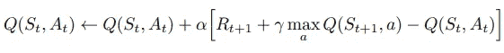

# q 学习

> 原文：<https://towardsdatascience.com/q-learning-a4f1bcec58be?source=collection_archive---------18----------------------->

## [强化学习之旅](https://towardsdatascience.com/tagged/a-journey-into-r-l)

## 强化学习的早期突破——非策略时差控制方法

欢迎来到我的强化学习专栏，在这里我花了一些时间来回顾一些非常有趣的概念，这些概念围绕着用计算方法学习的本质。正如大多数学习一样，它与环境有互动，正如萨顿和巴尔托在*强化学习:介绍中所说的那样，“从互动中学习是几乎所有学习和智力理论的基础思想。”*

在我的上一篇文章中，我们回顾了在*时差* (TD)学习中的政策控制方法，特别是——*Sarsa*，在这种情况下，我们在一个步骤之后朝着估计的回报更新我们的价值函数，从一个状态-动作对移动到下一个。今天，我们将学习 *Q-Learning* ，一种非策略 TD 控制方法。一些概念在之前的帖子里解释过，你可以在这里找到。我用来学习这个很酷的话题的资源链接会在文章的底部。

*问*-学习的概念很容易理解:我们根据我们的行为政策选择下一步行动，*但是*我们也会考虑如果我们遵循我们的目标政策，我们可能会采取的替代行动。这允许行为和目标策略改进，利用动作值 *Q(s，a)* 。该流程的工作方式类似于不符合政策的[蒙特卡罗方法](/my-journey-into-reinforcement-learning-part-4-monte-carlo-methods-2b14657b7032)。更新如下所示:

如您所见，我们的 Sarsa 更新被替换为*q*-值 *Q(Sₜ，Aₜ】，*在目标策略下朝着奖励加上**备选**行动的下一个状态的贴现值的方向更新了一点。这是之前的[贝尔曼方程，但是现在对于 *Q* 来说，不需要重要性抽样。](https://medium.com/@reubena.kavalov/my-journey-into-reinforcement-learning-part-3-dynamic-programming-3cb8a8d0815c)

正如我们对 MC 方法的偏离策略控制所做的那样，我们将使目标策略*π*贪婪关于我们的价值函数 *Q(s，a)* 在每一步:

我们的行为策略 *b* 是**ε-贪婪**关于我们的价值函数 *Q(s，a)* ，允许一点探索，同时仍然大致遵循一条明智的道路。

通过将此代入我们的贝尔曼方程，我们可以看到*Q*-学习目标简化为以下内容:

这种算法也可以称为 *SARSAMAX* ，因为它选择在采取步骤后具有最大可用值的动作。这个简单的图表清楚地显示了这一点。

下面是算法伪代码:

[http://incompleteideas.net/book/RLbook2018.pdf](http://incompleteideas.net/book/RLbook2018.pdf)

像往常一样，让我们把这个例子翻译成另一个 [OpenAI Gym](https://gym.openai.com/) 环境 *Cliffwalking* 。

与 gridworld 场景一样，目标是在给定特定起点( **S** )的情况下达到特定目标( **G** )。代理人可以在四个基本方向上移动，代理人每走一步，就会获得 **-1** 的奖励。因此，就像我们的 gridworld 示例一样，存在着更快达到目标*的动机*。这个环境的变化包括增加了悬崖，如果代理人踩到它所占据的任何空间，它会将代理人重置回左下角，并给予一个重大惩罚，奖励 **-100** 。从开始到结束显然有多条安全路线，但只有一条最优路线(巧合的是，这条路线是最“危险”的)。使用非策略时间差控制来控制我们的代理为我们提供了一些很好的结果——我们可以观察到良好而快速地收敛到最优策略，因为代理学习通过优化动作值函数来最大化回报。

对我来说，这些可视化的美妙之处在于，即使在找到最优目标策略之后，你也能看到ε-贪婪行为策略在起作用。当然，代理会继续采取行动，探索它认为是最佳的路径，偶尔会跌入悬崖，不得不重新设置。但这个过程让我想象了一个未来，这个智能体所在的世界经历了某种破坏性的重大变化，也许目标空间被移动到了环境的其他某个部分，或者悬崖以不同的方式分散。我们的代理可能会困惑一会儿，但肯定会再次找到最佳路径。

非常感谢你加入我对强化学习知识的讨伐。下一次，我们将看一看*价值函数逼近*，给我们一个更新价值函数的更复杂的方法！

# 资源

[**强化学习:简介**由*萨顿和*巴尔托](http://incompleteideas.net/book/RLbook2018.pdf)

YouTube 上大卫·西尔弗的 RL 课程

[强化学习 Github](https://github.com/dennybritz/reinforcement-learning) 由 *dennybritz*

[*OpenAI* 旗下*健身房*](https://gym.openai.com/)