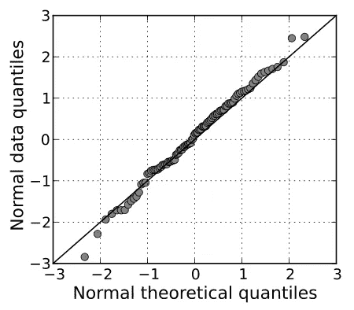
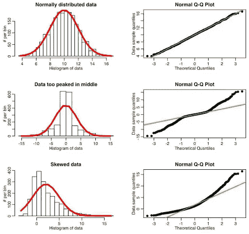
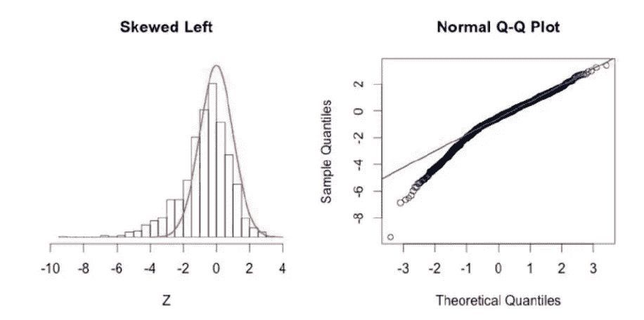
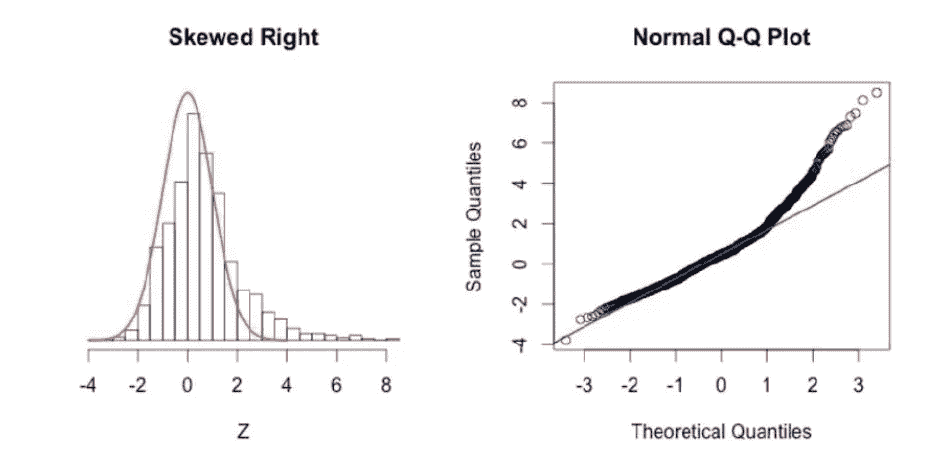
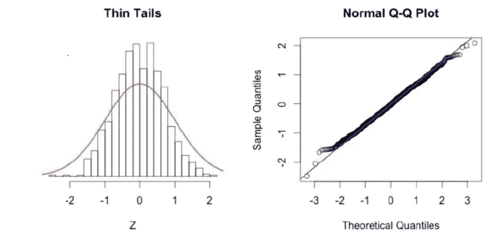
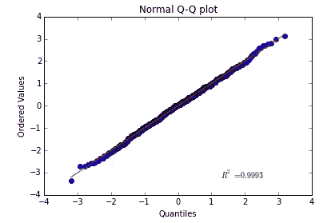

# Q-Q 图解释

> 原文：<https://towardsdatascience.com/q-q-plots-explained-5aa8495426c0?source=collection_archive---------0----------------------->

## [统计数据](https://towardsai.net/p/category/statistics)

## “理解 Q-Q 图的概念”

来源:[图片链接](https://www.youtube.com/watch?v=okjYjClSjOg)

在统计中，Q-Q(分位数-分位数)图在通过绘制两个概率分布的分位数来图形化分析和比较两个概率分布方面发挥着非常重要的作用。如果我们比较的两个分布完全相等，那么 Q-Q 图上的点将完全位于直线 y = x 上。

> “画图，画线，你说你觉得好不好！”乔希·斯塔默

是的，就是这么简单。作为一名数据科学家，或者总的来说是一名统计学家，了解分布是否正态非常重要，这样才能对数据应用各种统计方法，并以更容易理解的可视化方式进行解释，这样 Q-Q 图就出现了。Q-Q plot 回答的最根本的问题是:

> 这条曲线是正态分布吗？

来源:维基百科 [Q-Q 图](https://en.wikipedia.org/wiki/Q%E2%80%93Q_plot#/media/File:Normal_normal_qq.svg)正态分布

## 正态分布，但是为什么呢？

Q-Q 图用于寻找随机变量的分布类型，无论是高斯分布、[均匀分布](https://en.wikipedia.org/wiki/Uniform_distribution_(continuous))、[指数分布](https://en.wikipedia.org/wiki/Exponential_distribution)还是甚至[帕累托分布](https://en.wikipedia.org/wiki/Pareto_distribution)等。你可以通过 Q-Q 图的功效来判断分布的类型。一般来说，我们谈论**正态分布**只是因为我们有一个非常漂亮的概念[**68–95–99.7 规则**](https://en.wikipedia.org/wiki/68%E2%80%9395%E2%80%9399.7_rule) ，它完全符合正态分布，因此我们知道有多少数据位于平均值的第一标准差、第二标准差和第三标准差的范围内。因此，知道一个分布是否是正态分布为我们打开了一扇新的大门，让我们可以很容易地用数据进行实验。其次，正态分布在大部分范围广泛的自然事件中出现得非常频繁。

## 它是如何工作的？

我们在 x 轴上绘制理论分位数或基本上称为标准正态变量(均值=0 且标准差=1 的正态分布),在 y 轴上绘制我们想要确定其是否为高斯分布的随机变量的有序值。其从图上绘制的每个点给出了非常漂亮且平滑的直线状结构。

现在我们必须关注直线的两端。如果由这些点形成的曲线末端的点没有落在一条直线上，而是确实明显偏离这些位置，那么我们不能得出 x 轴和 y 轴之间的关系，这清楚地表明我们想要计算的有序值不是正态分布的。

如果图上绘制的所有点完全位于一条直线上，那么我们可以清楚地说这个分布是正态分布，因为它与标准正态变量均匀对齐，这是 Q-Q 图的简单概念。

来源:Sherrytowers Q-Q 图[示例](http://sherrytowers.com/2013/08/29/aml-610-fall-2013-module-ii-review-of-probability-distributions/qqplot_examples/)

## 偏斜 Q-Q 图

Q-Q 图也用于寻找一个分布的****(**不对称的度量)。当我们在 x 轴上绘制理论分位数，在 y 轴上绘制我们想要知道其分布的样本分位数时，我们会看到一个非常特殊的正态分布 Q-Q 偏度图。如果 Q-Q 图的底端偏离直线，但上端没有偏离，那么我们可以清楚地说，分布向左有一个较长的尾部，或者简单地说，它是**左偏**(或 ***负偏*** )但是，当我们看到 Q-Q 图的上端偏离直线，下端沿着直线，那么曲线向右有一个较长的尾部，它是**右偏**(或******

**********

*****正态分布的左偏斜 Q-Q 图*****

**********

*****正态分布的右偏斜 Q-Q 图*****

## *****有尾 Q-Q 图*****

*****同样，我们可以通过简单地看它的 Q-Q 图来谈论分布的****(衡量“*”)峰度。具有厚尾的分布将使 Q-Q 图的两端偏离直线，并且其中心沿着直线，而薄尾分布将形成 Q-Q 图，其两端的偏差非常小或可以忽略，从而使其非常适合正态分布。**********

************

******正态分布的厚尾 Q-Q 图******

************

******正态分布的细尾 Q-Q 图******

## ******我们需要多少数据？******

******请注意，当数据点非常少时，Q-Q 图不会非常精确，它无法给出结论性的答案，但是当我们有足够数量的数据点，然后我们使用大型数据集绘制 Q-Q 图时，它会给我们一个重要的结果，以总结关于分布类型的任何结果。******

## ******Python 中 Q-Q 图的实现******

******下面是一个用 python 绘制 Q-Q 图的简单实现。******

******使用 statsmodels api 实现 QQ 绘图******

******使用 [Scipy 库](https://www.scipy.org/)的 Q-Q 图的另一个实现。******

******使用 script.stats 实现 Q-Q 图******

************

******来源:StackExchange [输出 Q-Q 图](https://stats.stackexchange.com/questions/139708/qq-plot-in-python)******

## ******探索更多关于 Q-Q 图的信息******

******我强烈建议你去查看一下 Q-Q 图的维基百科页面，它有一个非常漂亮的解释，关于在它背后工作的数学的完整概念，这在这篇介绍性的文章中是相当令人震惊的。此外，看看 youtube 上由 [Josh Starmer](https://www.youtube.com/channel/UCtYLUTtgS3k1Fg4y5tAhLbw) 制作的视频，它以一种很好的可视化方式展示了这个概念。******

## ******更多关于数据科学的文章由 [Paras Varshney](https://medium.com/@pv009) 撰写:******

****** [## 如何评价 Python 中机器学习模型性能？

### 一个实用的方法来计算模型的性能和在 Python 中的实现，涵盖了所有数学…

medium.com](https://medium.com/@pv009/how-to-evaluate-machine-learning-model-performance-in-python-135b4ae27f7e)  [## 如何建立一个能让你找到工作的数据科学投资组合？

### 学会制作一个关于你的强有力的作品集！

medium.com](https://medium.com/datadriveninvestor/how-to-build-a-data-science-portfolio-that-can-get-you-a-job-9f8d113739b3)  [## k-最近邻解释-第 1 部分

### KNN 算法背后的科学解释！

medium.com](https://medium.com/analytics-vidhya/k-nearest-neighbour-explained-part-1-5e5e9192050) 

还有更多在 [Paras Varshney](https://medium.com/u/22b31444736c?source=post_page-----5aa8495426c0--------------------------------) 。

我希望你从这篇文章中学到了新的东西！

下载 Q-Q 剧情实现的 [Jupyter 笔记本](https://github.com/paras009/Minor-Data-Science-Projects/tree/master/Q-Q%20plot%20Implementation)。

我写关于数据科学和机器学习的博客。有兴趣和我喝杯咖啡，在 [**中**](https://medium.com/@pv009) 上关注我，在 [**LinkedIn**](https://www.linkedin.com/in/pv009) 上联系我。

谢谢你！******