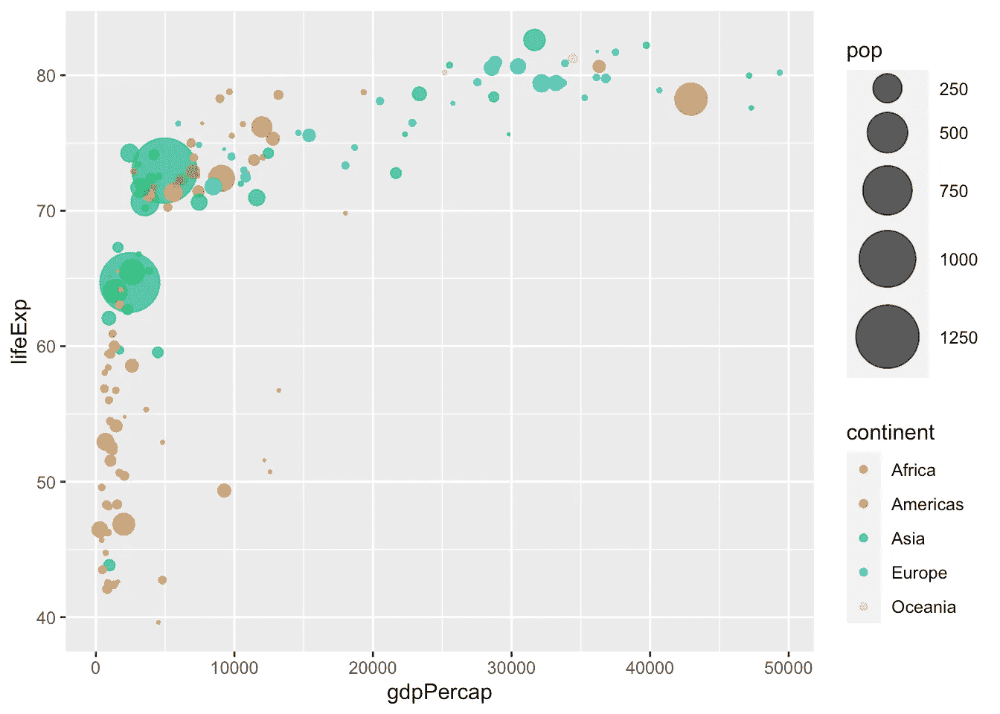
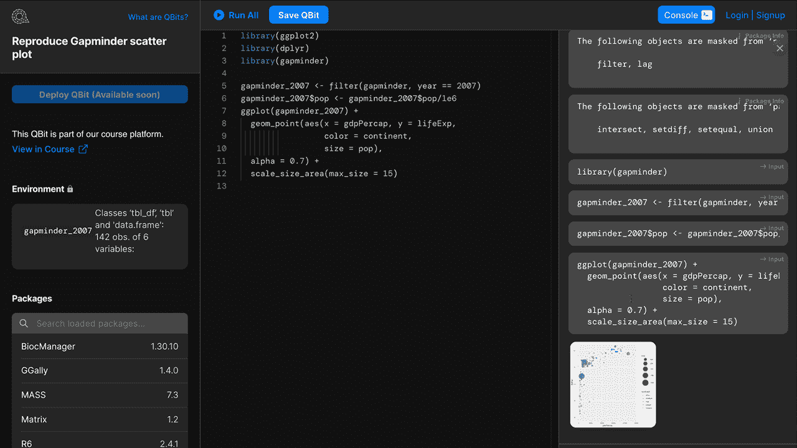

# 在几秒钟内部署和共享您的 R 代码，而不是几周。

> 原文：<https://towardsdatascience.com/qbits-workspace-a-new-online-editor-to-share-and-deploy-r-code-48c46f3394c2?source=collection_archive---------60----------------------->

## QBits Workspace:一个新的无服务器数据科学编辑器，专为无缝部署和协作而构建。


今天，我们很高兴地宣布在浏览器中运行和部署 R 代码的 [QBits 工作区](https://www.quantargo.com/qbits)。QBits 使您能够在无服务器的云环境中运行 R，并提供一种简单且经济高效的方式来大规模开发、运行、部署和共享数据科学项目，而无需管理服务器、软件设置和软件包安装。它们可以立即启动，部署速度非常快，并且可以处理各种数据科学项目。事实上，量子比特已经为我们的[在线课程平台](https://www.quantargo.com/courses/course-r-introduction)提供了动力，更令人兴奋的用例将很快出现。

我们创建 QBits 是为了让数据科学家的部署体验更加轻松。太多的项目失败了，因为数据科学家很难部署他们的成果。想一个简单的 **ggplot2** 的例子来重现[汉斯·罗斯林精彩演讲](https://www.ted.com/talks/hans_rosling_the_best_stats_you_ve_ever_seen)中的`gapminder`情节:

```
library(ggplot2) 
library(dplyr) 
library(gapminder) gapminder_2007 <- filter(gapminder, year == 2007) 
gapminder_2007$pop <- gapminder_2007$pop/1e6 ggplot(gapminder_2007) + 
  geom_point(aes(x = gdpPercap, 
                 y = lifeExp, 
                 color = continent, 
                 size = pop), 
                 alpha = 0.7) + 
  scale_size_area(max_size = 15)
```



这个情节在当地运行良好。然而，为了在一些交互式 web 应用程序中再现绘图，允许用户通过例如`year == 1952`过滤数据集，我们需要

1.  选择*右边的*操作系统创建一个 docker 容器。
2.  安装正确的语言运行时，例如 R 4.0.0。
3.  安装所有软件包依赖项(例如 **ggplot2** 、 **dplyr** 、 **gapminder** )
4.  创建一个闪亮的应用程序或水管工 API，供交互式或编程使用。

您可以看到，即使对于这个简单的示例，部署开销也是相当大的。这导致了部署瓶颈，使许多数据科学项目未完成，并使数据科学家感到沮丧。与 QBits 最大的不同是，它们已经提供了正确的容器、语言运行时和包。你唯一要做的就是把你的代码放在上面。就是这样。

**qp its 工作区**提供了一个开发环境来快速开发您的定制 qp its。因为你已经在你的定制容器中工作，最终的部署只是几秒钟的事情，而不是几周。



# 下一步是什么

我们正在努力扩展编辑器以适应更多的工作流程并实现新的功能。进一步的更新将引入以下可能性

*   创建您自己的量子比特
*   添加和删除软件包(所有 15，000 多个 CRAN 软件包都可用)
*   QBit 部署，包括版本控制
*   …等等(是的，Python 也即将推出)

现在，[去我们的游乐场](https://www.quantargo.com/qbits#showcase)试一试。

我们希望听到您的反馈和功能需求:

干杯，

你的 Quantargo 团队

*最初发表于*[T5【https://www.quantargo.com】](https://www.quantargo.com/blog/2020-05-27-introducing-qbits-editor)*。*