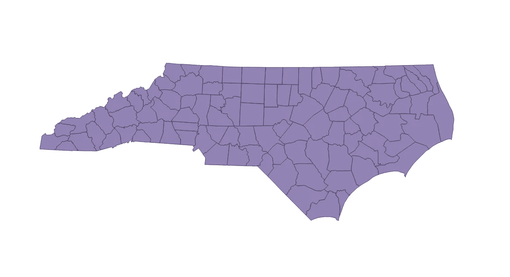
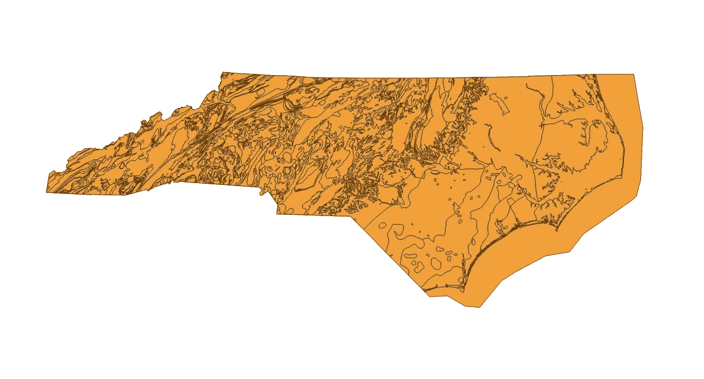
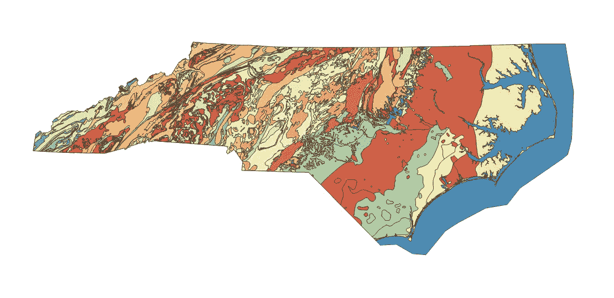
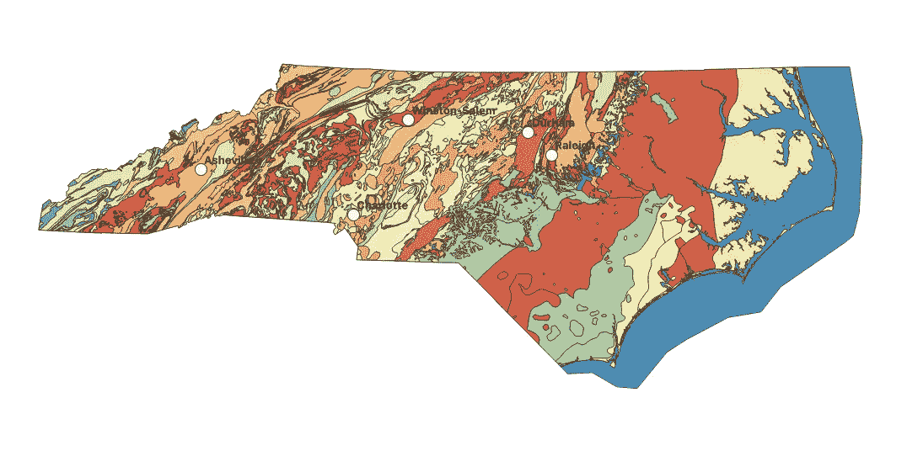
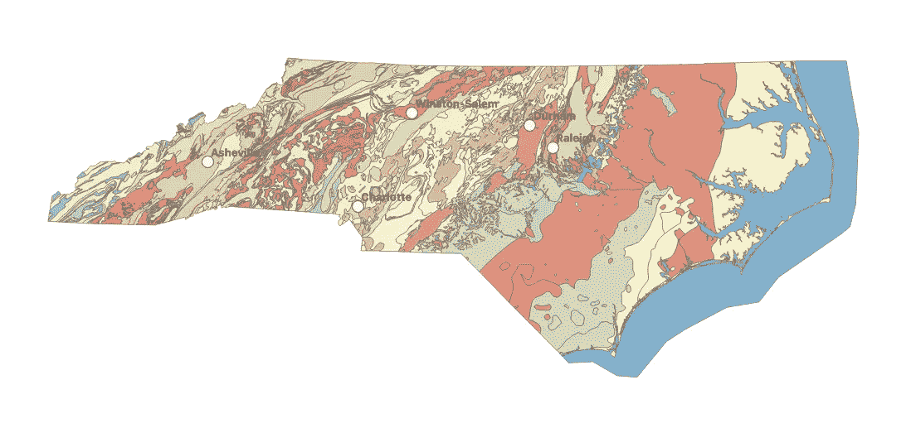

# QGIS 制图 101:使用 shapefiles 制作您的第一个分类地图

> 原文：<https://towardsdatascience.com/qgis-mapping-101-importing-shapefiles-categorial-symbology-labeling-cities-simple-tools-5cba8aa2868b?source=collection_archive---------62----------------------->

## 继续学习如何导入 shapefiles、使用分类符号系统、标注城市以及使用简单的工具！

当调查一组新的 GIS 或环境数据时，在开始任何机器学习之前，绘制出您的要素并了解任何潜在的潜在关系通常是有用的。由于与 ArcMap 相似，QGIS 很快成为我的首选制图软件，最重要的是，它是免费的！通过我学习这个新工具的努力，我认为它可能对你们中的一些刚刚开始使用它的人有所帮助。如果你以前用过 QGIS，老实说，这个博客可能不适合你，因为它更侧重于非常基本的入门级技能。但是，如果这是你的第一张地图，我想你会发现这非常有用！

如果您还没有下载 QGIS，现在就开始下载吧，[这里](https://www.qgis.org/en/site/)。在大学期间，我在本科研究中广泛使用了 ArcMap。现在我独自一人，没有那种奢侈，我在寻找一些便宜的，或者更好的免费的东西，让我的地图绘制技能达到标准。这时我偶然发现了 QGIS。它与 ArcMap 惊人地相似，我很高兴看到它提供的所有功能。用户界面也非常漂亮，我对这个开源软件非常满意。这样的话，就像任何事情一样，会有一个轻微的学习曲线，但是一旦你掌握了要点，事情就简单多了。今天，我希望通过使用来自各种资源的数据制作一个简单的北卡罗莱纳州地质图，来帮助你们减轻一些学习曲线。就这样，我们开始吧！

要开始跟随，我建议你从我的 GitHub，[这里](https://github.com/kdua1006/NC_QGIS_Blog)下载需要的数据。您将找到一个包含 shapefiles 的 zip 文件、一个包含北卡罗来纳州一些城市坐标的 CSV 文件，以及一个最终结果地图的 QGIS 文件。数据来自[北卡罗莱纳 DoT](https://connect.ncdot.gov/resources/gis/Pages/GIS-Data-Layers.aspx) 和[美国农业部地理空间数据网关](https://gdg.sc.egov.usda.gov/)，两者都是非常有用的数据资源，包含各种 GIS 数据！

让我们进入正题。首先，打开 QGIS 并创建一个新项目。您应该会看到一个普通的白色屏幕。让我们添加第一点数据，地图形状文件。QGIS 很棒，因为它可以处理各种数据类型，其中最有用的是 shapefiles。在顶部工具栏选择图层→添加图层→添加矢量图层。从那里你会看到一个弹出窗口。在“源类型”下，保持“文件”处于选中状态，并让编码自动进行。在源下，单击带有三个点的按钮，导航到标记为“NC_County_Boundaries”的文件夹，并从文件列表中选择 shapefile。Shapefiles 用。在他们名字的末尾 shp。按“添加”,您将被要求指定特定的转换。有多个与此 shapefile 相关联，但 2/3 仅用于军事目的。鉴于这是一个博客，我们将使用它已经选择的一个，为平民设计的一个。点击应用，现在你应该看到一个美丽的北卡罗莱纳州县界地图。干得好！

我们的第一张底图！|(图片由作者提供)

现在你已经有了你的地图，并且知道了如何导入图层，让我们添加一张地质图。也是同样的思路:图层→添加图层→添加矢量图层。这一次，导航到“NC_geology”文件夹并选择您的 shapefile。一旦它被添加，它应该看起来像下面的图片。

NC 地质图|(图片由作者提供)

看一看，所有这些橙色并不真正有用，我们再也看不到县边界了。发生的事情是 QGIS 导入了新的 shapefile，但是把它放在县界地图上，它认为我们只是想看到区分不同地质类型的线。但是，如果我们可以对地图进行颜色编码，使每种颜色代表不同的岩石类型，这不是很酷吗？或者，我们甚至可以改变颜色来代表地质形成的时间！让我们采用第一个想法，看看我们能从地图上得到什么信息。

在地图的左侧，您应该会看到一个弹出框。在该框架中，应该有一个显示“层”的部分。在这里，您可以切换层的顺序，如果他们甚至显示在地图上！不过，现在我们需要了解地质图的图层属性，以便进行必要的调整。找到“NC_geology”图层，点击右键，选择“属性”。应弹出一个新窗口，其中符号系统选项卡打开。在页面的顶部，应该有一个下拉菜单，选择“单一符号”。点击它，并将其更改为“分类”。这将解决我们的一个颜色问题，并允许我们根据我们想要的任何属性进行颜色编码！就像我上面说的，我会根据岩石类型分类，但是你可以选择你喜欢的。对于值，我选择“岩石类型 _1”，保留符号为，并选择“光谱”为色带。你可以为色带选择任何颜色，但我认为光谱会很好，因为我对岩石类型的不同感兴趣，不希望颜色暗示它们之间存在某种连续体或关系(即选择蓝色渐变)。在弹出窗口底部附近，我们可以选择对列出的所有岩石类型进行分类，或者只对少数几种进行分类。同样，我对整个地图感兴趣，所以我所要做的就是按分类，QGIS 将自动为该属性的每个标注分配颜色。按应用→确定，现在你应该有一个精彩的彩色地图探索！

北卡罗来纳州地质图|(图片由作者提供)

这张地图很棒，但如果能看到主要城市在地图上的位置，以及它们是否可能与特定的地质类型相关联，那就更好了。幸运的是，这非常简单，只需导入一个带有纬度、经度和城市名称的. csv 文件。我已经在我的 GitHub 上提供过了，[这里](https://github.com/kdua1006/NC_QGIS_Blog)。

要导入. csv，请转到图层→添加图层→添加分隔文本图层。像往常一样导航到您的文件，给它一个有用的名称，这样您就知道它是什么了，对于我们今天的目的，这就是您所要做的！继续按添加，然后你应该会遇到一些非常小，很难看到城市所在的点。让我们改变这些，让他们更容易发现，并给他们标签，让我们知道他们是什么城市。右键单击城市图层，然后转到属性。我将使标记为白色，并将它们的大小更改为 5。然后，在弹出的左侧选择“标签”。按下下拉菜单并选择“单个标签”。QGIS 应该自动从。csv 作为值。我要先把样式改成粗体，字体大小改成 13。按应用，但停留在弹出窗口中。

如果你在地图上取一个顶点，这些名字并不在标记周围的理想位置。它们需要被上移，看起来更干净。通过更改距离，您可以将标签上移。在同一窗口中，点击“位置”选项卡。我把我的设置为 2mm，我对这个位置很满意，但是这取决于你！

我们标注的地质图|(图片由作者提供)

背景中有各种颜色，文字还是有点看不清。返回到您的地质图层属性，选择符号系统，然后按下“图层渲染”旁边的小箭头。这里我们可以改变层的不透明度。我把我的设置为 68%,这样我仍然可以很好地看到颜色，也可以阅读文字。你可能会注意到我们使用的基本地图，县界地图，可能会或可能不会用所有额外的线打扰你。通过选中和取消选中图层名称旁边的白色框，可以随意打开和关闭该图层。我发现保留这些层很有用，以防我想检查其他可能的关系，但有些人更喜欢为此制作一个全新的地图。每个人都有自己的想法，随着时间的推移，你会明白的！

我们关闭了县界地图的标注地质图|(图片由作者提供)

现在我们已经有了一个基本的地图轮廓，你可以利用这个时间做一些探索！一些有用的工具包括“识别”工具(位于上方工具条中，带有一个蓝色圆圈和一个“I”)，“平移地图”工具(上方工具条，白色手形)和放大功能(上方工具条，放大镜)。识别工具对于快速查找特定区域的属性非常有用，只需确保您选择了感兴趣的图层，否则单击某个区域时将一无所获。

环顾地图，并使用可靠的识别工具，似乎没有任何明显的迹象表明，人们选择定居和创建这些城市是基于他们的岩石类型和地质。该死，谁会想到呢！

比方说，我们可能想要找出有多少不同的岩石类型，或者绘制了多少不同的剖面。使用方便的统计工具，我们可以很容易，很快找到答案！导航到上部工具栏，并单击带有求和符号的按钮。现在，检查屏幕的左侧，应该会有一个新的统计窗口。只需选择您想要了解更多信息的图层和属性，简单的统计分析就会出现！您还可以通过按下属性选择旁边的求和符号并创建一个简单的查询来获得特定的属性统计信息。

这是一个如何加载和操作地图的简单例子，但是可能性是无穷的！有这么多工具可以使用，所以尽情发挥吧。如果你打算创建一个以数据为中心的机器学习模型，做这种初步分析非常有益，可以节省你很多时间。如果你遇到任何有趣的事情，请在评论中告诉我，并关注更多 QGIS 博客！