# QR 矩阵分解

> 原文：<https://towardsdatascience.com/qr-matrix-factorization-15bae43a6b2?source=collection_archive---------5----------------------->

## 最小二乘法和计算(用 R 和 C++)

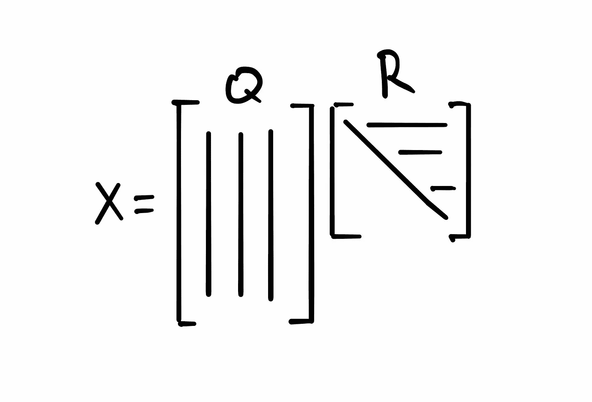

本·丹尼斯·谢弗

# 数据科学和矩阵分解

有几种矩阵分解，也称为分解，每个数据科学家都应该非常熟悉。这些很重要，因为它们有助于为我们使用的模型和算法找到实际计算和估计结果的方法。在某些情况下，因式分解的一种特殊形式是算法(例如 PCA 和 SVD)。在所有情况下，矩阵分解都有助于发展直觉和分析能力。

***QR*** 因式分解就是这些矩阵因式分解中非常有用的一种，在数据科学、统计学和数据分析中有非常重要的应用。这些应用之一是计算最小二乘(LS)问题的解。

# 议程

*   重述最小二乘问题
*   介绍 QR 矩阵分解
*   使用 QR 求解 LS
*   用 R 和 C++实现 QR 计算并比较。

# LS 问题

***QR*** 矩阵分解允许我们*计算*最小二乘问题的解。我强调*计算*是因为 [OLS](https://en.wikipedia.org/wiki/Ordinary_least_squares) 给出了正规方程形式的封闭解。这很好，但是当你想找到实际的数值解时，它们并不真的有用。

以下是最小二乘问题的概述。我们想解下面的方程

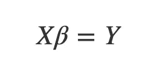

问题是我们无法求解 ***β*** 因为通常情况下如果我们的观测值多于变量*X 没有一个逆，下面就不能做了:*

*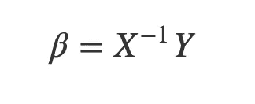*

*相反，我们试图找到一些 ***β̂*** 来解这个方程，虽然不完美，但误差尽可能小。一种方法是最小化下面的目标函数，它是 ***β̂*** 的函数。*

*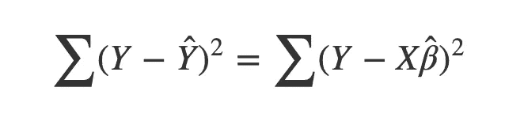*

*最小化这个*平方*偏差的和就是为什么这个问题被称为*最小平方*问题。对 ***β̂*** 求导并设为零将会引导你到正规方程并为你提供一个封闭形式的解。*

*这是做这件事的一种方法。但是我们也可以只用线性代数。这就是 ***QR*** 矩阵分解的用武之地。*

# *QR 分解*

*首先，让我们继续描述这个分解是什么。 ***QR*** 矩阵分解允许将矩阵表示为两个独立矩阵 ***Q*** 和 ***R*** 的乘积。*

*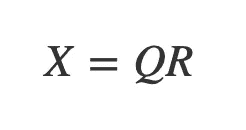*

****Q*** 中的一个[正交矩阵](https://en.wikipedia.org/wiki/Orthogonal_matrix)和 ***R*** 是一个正方形[的上/右三角矩阵](https://en.wikipedia.org/wiki/Triangular_matrix)。*

*这意味着*

*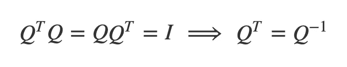*

*而且由于 ***R*** 是正方形，只要对角线上的条目没有零，也是可逆的。如果 ***X*** 的列是[线性独立的](https://en.wikipedia.org/wiki/Linear_independence)，那么情况将总是如此。尽管如果数据中存在共线性，问题仍然会出现。撇开这个不谈，这个 ***QR*** 因式分解意味着一个矩形且不可逆的 ***X*** 可以表示为两个可逆矩阵！这一定会有用的。*

# *利用 QR 分解求解 LS 问题。*

*既然我们已经知道了 ***QR*** 因式分解，一旦我们能够实际找到它，我们将能够以下面的方式解决 LS 问题:*

*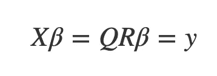*

*因此*

*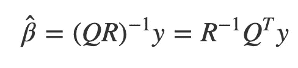*

*这意味着我们需要做的就是找到 ***R*** 的逆，转置 ***Q*** ，取乘积。这将产生 OLS 系数。我们甚至不需要计算方差-协方差矩阵及其逆，这是 OLS 解通常是如何提出的。*

# *执行 QR 分解。*

*求一个矩阵的 ***QR*** 因子的方法是使用 [Gram-Schmidt 过程](https://en.wikipedia.org/wiki/Gram%E2%80%93Schmidt_process)先求***Q*** 。然后要求 ***R*** 我们只要把原矩阵乘以 ***Q*** 的转置即可。让我们继续使用在`R`和`C++`中实现的函数来执行 ***QR*** 。稍后我们可以查看这些函数的内部，以便更好地了解正在发生的事情。*

# *计算系数*

*我正在加载两个函数。`myQRR`和`myQRCpp`使用格拉姆-施密特过程进行 ***QR*** 因式分解。一个函数写在`R`中，另一个写在`C++`中，并通过`Rcpp`加载到`R`环境中。稍后我会比较他们的表现。*

```
*library(Rcpp)
library(tidyverse)
library(microbenchmark)sourceCpp("../source-code/myQRC.cpp")
source("../source-code/myQRR.R")*
```

*让我们从一个小例子开始，我们模拟 **y** 和 **X** ，然后使用 ***QR*** 分解来解决它。我们还可以仔细检查一下 ***QR*** 分解是否真的有效，并返回我们模拟的 ***X*** 。*

*这是我们模拟的反应变量。*

```
*y = rnorm(6)
y## [1] 0.6914727 2.4810138 0.4049580 0.3117301 0.6084374 1.4778950*
```

*这是我们将用来求解 LS 系数的数据。我们有 3 个变量可以支配。*

```
*X = matrix(c(3, 2, 3, 2, -1, 4,
             5, 1, -5, 4, 2, 1,
             9, -3, 2 , -1, 8, 1), ncol = 3)
X##      [,1] [,2] [,3]
## [1,]    3    5    9
## [2,]    2    1   -3
## [3,]    3   -5    2
## [4,]    2    4   -1
## [5,]   -1    2    8
## [6,]    4    1    1*
```

*现在我将使用`myQRCpp`找到`Q`和`R`。*

1.  *可以看到 ***R*** 确实是上三角。*

```
*Q = myQRCpp(X)$Q
R = t(Q) %*% X %>% round(14)R##          [,1]     [,2]      [,3]
## [1,] 6.557439 1.829983  3.202470
## [2,] 0.000000 8.285600  4.723802
## [3,] 0.000000 0.000000 11.288484Q##            [,1]        [,2]        [,3]
## [1,]  0.4574957  0.50241272  0.45724344
## [2,]  0.3049971  0.05332872 -0.37459932
## [3,]  0.4574957 -0.70450052  0.34218986
## [4,]  0.3049971  0.41540270 -0.34894183
## [5,] -0.1524986  0.27506395  0.63684585
## [6,]  0.6099943 -0.01403387 -0.07859294*
```

*2.这里我们可以验证 ***Q*** 事实上是正交的。*

```
*t(Q)%*%Q %>% round(14)##      [,1] [,2] [,3]
## [1,]    1    0    0
## [2,]    0    1    0
## [3,]    0    0    1*
```

*3.而那个 ***QR*** 确实把原来的 ***X*** 矩阵给还原了。*

```
*Q %*% R##      [,1] [,2] [,3]
## [1,]    3    5    9
## [2,]    2    1   -3
## [3,]    3   -5    2
## [4,]    2    4   -1
## [5,]   -1    2    8
## [6,]    4    1    1*
```

*现在，让我们计算实际系数。*

```
*beta_qr = solve(R) %*% t(Q) %*% ybeta_qr##             [,1]
## [1,]  0.32297414
## [2,]  0.07255123
## [3,] -0.02764668*
```

*为了检查这是否是正确的解，我们可以将计算出的 ***β̂*** 与`lm`函数给出的结果进行比较。*

```
*coef(lm(y ~ -1 + ., data = data.frame(cbind(y,X))))##          V2          V3          V4 
##  0.32297414  0.07255123 -0.02764668*
```

*显然，对于估计的系数，我们得到了完全相同的解。*

# *实施快速反应计划*

## *格拉姆-施密特过程*

**Gram–Schmidt 过程*是一种计算正交矩阵*的方法，该矩阵由正交/独立的单位向量组成，并且跨越与原始矩阵 ***X*** 相同的空间。**

*   **这种算法包括选择一个列向量 ***X*** ，比如说 ***x1 = u1*** 作为初始步骤。**
*   **然后，我们通过将***X*** 的下一列投影到它上面，比如说 **x2** 并从中减去投影***U2 = x2 proj u1 x2***，找到一个与 ***u1*** 正交的向量。现在我们有了一组两个正交的向量。在之前的一篇文章中，我详细介绍了这种方法的工作原理。**
*   **下一步以同样的方式进行，但是减去正交向量组中每个向量的投影和 ***英国*** 。**

**我们可以这样表达:**

**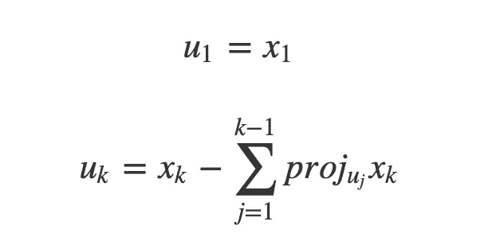**

**[参考](https://en.wikipedia.org/wiki/Gram%E2%80%93Schmidt_process)。一旦我们有了完整的正交向量集，我们只需将每个向量除以其范数，然后将它们放入一个矩阵中:**

**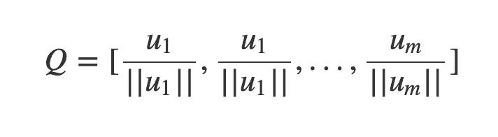**

**一旦我们有了 ***Q*** 我们就可以很容易地解出 ***R*****

**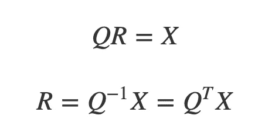**

# **用 R 和 C++实现**

**当然，`R`中有一个内置函数会帮你做 ***QR*** 矩阵分解。因为上面的 GS 算法本质上是迭代的，所以我决定在`C++`中实现它，这是一个很好的工具，并将其与一个等价的`R`函数进行比较。下面是我的`R`版本的样子:**

```
**myQR = function(A){
  dimU = dim(A)
  U = matrix(nrow = dimU[1], ncol = dimU[2])
  U[,1] = A[,1]
  for(k in 2:dimU[2]){
    subt = 0
    j = 1
    while(j < k){
      subt = subt + proj(U[,j], A[,k])
      j = j + 1
    }
    U[,k] = A[,k] - subt
  }
  Q = apply(U, 2, function(x) x/sqrt(sum(x^2)))
  R = round(t(Q) %*% A, 10)
  return(list(Q = Q, R = R, U = U))
}**
```

**它是非常字面的。for 循环里面有一个 while 循环，被调用的投影函数也是用`R`写的函数。**

**这是我的`C++`版本的样子。逻辑基本上是相同的，只是有另一个 for 循环来规范化正交列。**

```
**// [[Rcpp::export]]
List myQRCpp(NumericMatrix A) {
  int a = A.rows();
  int b = A.cols();
  NumericMatrix U(a,b);
  NumericMatrix Q(a,b);
  NumericMatrix R(a,b);
  NumericMatrix::Column Ucol1 = U(_ , 0);
  NumericMatrix::Column Acol1 = A(_ , 0);

  Ucol1 = Acol1;

  for(int i = 1; i < b; i++){
    NumericMatrix::Column Ucol = U(_ , i);
    NumericMatrix::Column Acol = A(_ , i);
    NumericVector subt(a);
    int j = 0;
    while(j < i){
      NumericVector uj = U(_ , j);
      NumericVector ai = A(_ , i);
      subt = subt + projC(uj, ai);
      j++;
    }
    Ucol = Acol - subt;
  }
  for(int i = 0; i < b; i++){
    NumericMatrix::Column ui = U(_ , i);
    NumericMatrix::Column qi = Q(_ , i);

    double sum2_ui = 0;
    for(int j = 0; j < a; j++){
      sum2_ui = sum2_ui + ui[j]*ui[j];
    }
    qi = ui/sqrt(sum2_ui);
  }

  List L = List::create(Named("Q") = Q , _["U"] = U);
  return L;
}**
```

# **比较 R 与 C++的实现**

**除了上面的两个函数之外，我还有第三个函数，除了它调用了`projC`而不是`proj`之外，它和`R`完全相同。我把这个函数命名为`myQRC`。(`projC`写在`C++`，而`proj`写在`R`)。否则，我们有一个纯`C++`函数`myQRCpp`和一个纯`R`函数`myQR`。**

**为了比较这三个函数执行 ***QR*** 因式分解的速度，我将它们放在一个函数`QR_comp`中，用相同的矩阵参数调用和计时。**

```
**QR_comp = function(A){
  t0 = Sys.time()
  myQR(A)
  tQR = Sys.time() - t0
  t0 = Sys.time()
  myQRC(A)
  tQRC = Sys.time() - t0
  t0 = Sys.time()
  myQRCpp(A)
  tQRCpp = Sys.time() - t0

  return(data.frame(tQR = as.numeric(tQR), 
                    tQRC = as.numeric(tQRC),
                    tQRCpp = as.numeric(tQRCpp)))
}**
```

**我们可以通过`m`随机矩阵在`n`的网格上比较它们的性能。这些矩阵是在调用`QR_comp`函数时生成的。**

```
**grid = expand.grid(n = seq(10, 3010, 500), 
                   m = seq(50, 600, 50))tvec = map2(grid$n, 
            grid$m, 
            ~QR_comp(matrix(runif(.x*.y), ncol = .y)))**
```

**最后，我们可以直观地评估这些变化。**

```
**plotly::ggplotly(
bind_rows(tvec) %>%
  gather("func","time") %>%
  mutate(n = rep(grid$n, 3),
         m = rep(grid$m, 3)) %>%
  ggplot(aes(m, n, fill = time)) + 
  geom_tile() + 
  facet_grid(.~func) +
  scale_fill_gradientn(colours = rainbow(9)) +
  theme(panel.background = element_blank(),
        axis.ticks.y = element_blank(),
        axis.text.y = element_text(angle = 35, size = 5),
        axis.text.x = element_text(angle = 30, size = 5)), width = 550, heigh = 400)**
```

**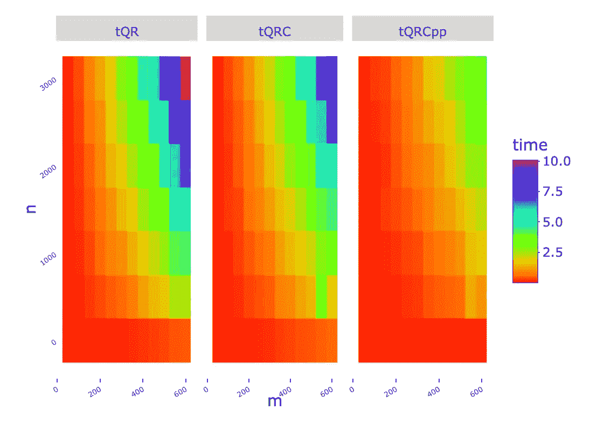**

**显然，涉及的`C++`越多，计算 ***QR*** 因式分解的速度就越快。all `C++` 函数在不到一分钟的时间内求解最多有`250`列和`3000`行或`600`列和`500`行的矩阵。`R`功能慢 2-3 倍。**

# **结论**

**QR 只是一种矩阵分解，LS 只是 QR 的一种应用。希望上面的讨论证明了线性代数对于数据科学是多么重要和有用。在未来，我将讨论 QR 分解的另一个应用，并讨论一些其他重要的分解，如特征值和 SVD 分解。**

**另外，你可以看出我正在使用`R`和`C++`来计算实现这些方法。我希望这是有用的，并将激励像我一样的其他`R`用户学习`C++`和`Rcpp`,并在他们的工具包中放入它们，使他们的`R`工作得更加强大。**

**感谢阅读！**