# QRNN:变形金刚的潜在竞争对手

> 原文：<https://towardsdatascience.com/qrnn-a-potential-competitor-to-the-transformer-86b5aef6c137?source=collection_archive---------23----------------------->

## 用准 RNN 训练更快的 RNNs

布拉登·科拉姆在 [Unsplash](https://unsplash.com?utm_source=medium&utm_medium=referral) 拍摄的照片

递归神经网络(RNNs)在序列建模业务中已经有很长时间了。但是 RNNs 很慢；他们一次处理一个令牌。此外，递归结构增加了对完整序列的固定长度编码向量的限制。为了解决这些问题，类似 CNN-LSTM、Transformer、QRNNs 这样的架构应运而生。

在本文中，我们将讨论在论文“[准递归神经网络](https://arxiv.org/abs/1611.01576)中提出的 QRNN 模型它本质上是一种把卷积加到递归上，把递归加到卷积上的方法。当你继续阅读这篇文章时，你会得到这个。

# 长短期记忆(LSTM)

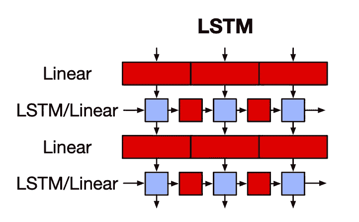

LSTM via [QRNN 论文](https://arxiv.org/abs/1611.01576)

LSTM 是 RNNs 最著名的变体。**红色模块是线性函数或矩阵乘法，蓝色模块是无参数的元素式模块**。LSTM 单元应用门控功能(输入、遗忘、输出)来获得输出和称为隐藏状态的存储元件。这个隐藏状态包含整个序列的上下文信息。由于单个载体编码了完整的序列，LSTMs 不能记住长期依赖性。此外，每个时间步长的计算取决于前一个时间步长的隐藏状态，即 LSTM 一次计算一个时间步长。因此，计算不能并行进行。

到目前为止，Colah 的博客是对 RNNs 最好的解释之一(在我看来)。如果你有兴趣了解 LSTM 背后的数学，可以考虑读一读。

# 卷积神经网络(CNN)

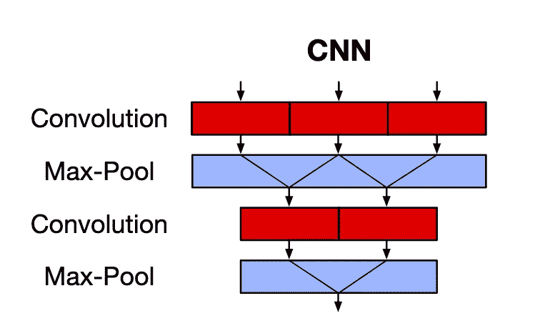

CNN via [QRNN 论文](https://arxiv.org/abs/1611.01576)

而 CNN 则捕捉空间特征(多用于图像)。**红色块是卷积运算，蓝色块是无参数汇集运算**。CNN 使用核(或过滤器)通过滑动窗口捕捉特征之间的对应关系。这克服了固定长度的隐藏表示(以及因此的长期依赖性问题)以及 rnn 缺乏并行性的限制。但是，CNN 没有考虑序列的时间性质，即时间不变性。池层只是减少了通道的维数，而没有考虑序列顺序信息。

[深度学习卷积运算指南](https://arxiv.org/abs/1603.07285v1)是 DL 中涉及卷积运算最好的论文之一。值得一读！

# 准递归神经网络

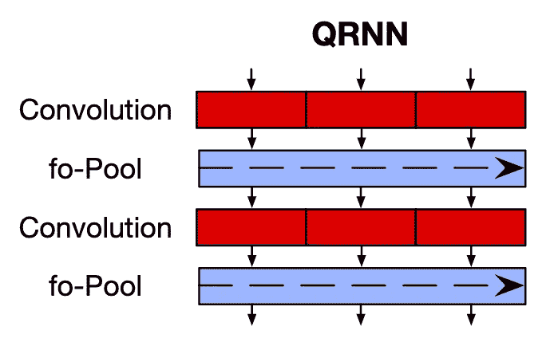

QRNN via [QRNN 论文](https://arxiv.org/abs/1611.01576)

QRNN 解决了这两种标准架构的缺点。它允许并行处理和捕获长期依赖关系，如 CNN，还允许输出依赖于序列中的标记顺序，如 RNN。

因此，首先，QRNN 架构有 2 个组件对应于 CNN 中的**卷积(红色)和汇集(蓝色)组件**。

## 卷积分量

卷积组件的工作原理如下:

1.  形状的输入顺序: ***(批量 _ 大小，顺序 _ 长度，嵌入 _ 尺寸)***
2.  ***【hidden _ dim】***形状的一个‘bank’:***(batch _ size，kernel_size，embed_dim)*** 各一个。
3.  输出的是一个形状序列: ***(batch_size，sequence_length，hidden_dim)*** 。这些是序列的隐藏状态。

卷积运算并行应用于序列和小批量。

为了保持模型的因果关系(即，只有过去的表征应该预测未来)，使用了一个称为**掩蔽卷积**的概念。也就是说，输入序列通过'***kernel _ size-1 '***零填充到左边。所以，只有'***sequence _ length-kernel _ size+1 '***过去的记号才有可能预测给定的记号。为了更好的直观，请参考下图:

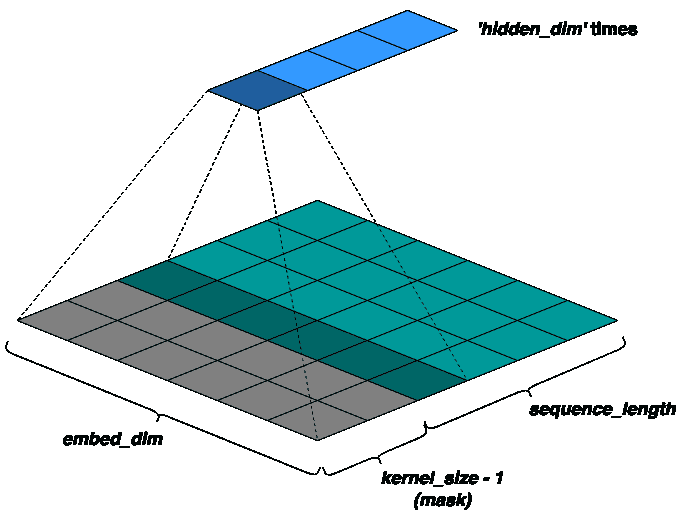

作者的掩蔽卷积动画

接下来，我们基于我们的**池函数**(将在下一节讨论)使用额外的内核库，来获得像 LSTM 中那样的门控向量:

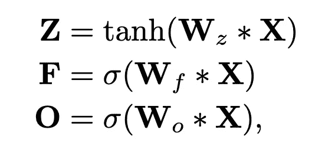

通过 [QRNN 纸](https://arxiv.org/abs/1611.01576)输出卷积组件

这里， ******* 是卷积运算； **Z** 是上面讨论的输出(称之为'**输入门**输出)； **F** 是使用额外内核库 ***W_f*** 获得的“**遗忘门**”输出； **O** 是使用额外内核库 ***W_o*** 得到的'**输出门**输出。

> **趣闻:**如上所述，这些卷积仅应用于过去的'**sequence _ length-kernel _ size+1*'***记号。因此，如果我们取**内核大小** = 2，我们得到**类似 LSTM 的**方程:

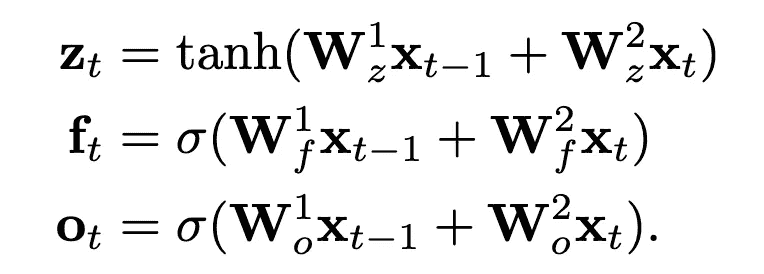

通过 [QRNN 纸张](https://arxiv.org/abs/1611.01576)实现类似 LSTM 的输出

## 共用组件

总的来说，池是一个无参数的函数，它从错综复杂的特性中捕捉重要的特性。在图像的情况下，通常使用最大池和平均池。然而，在序列的情况下，我们不能简单地取特征之间的平均值或最大值。它需要有一些复发。因此，QRNN 论文提出了受传统 LSTM 单元中元件式门控结构启发的池功能。它本质上是一个无参数的函数，将在时间步长上混合隐藏状态。

最简单的选项是“**动态平均池**”，它仅使用遗忘门(因此称为***f-池*** ):

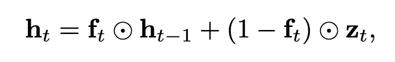

动态平均池(***f-池*** )通过 [QRNN 纸](https://arxiv.org/abs/1611.01576)

其中 **⊙** 是逐元素矩阵乘法。

如您所见，它或多或少是以遗忘门为参数的输出的'**移动平均值**'。

另一种选择是使用遗忘门和输出门(因此， ***fo-pooling*** ):

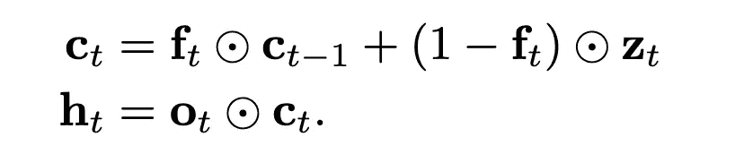

***fo-pooling*** 经 [QRNN 纸](https://arxiv.org/abs/1611.01576)

或者池可以另外具有专用输入门( ***ifo-pooling*** ):

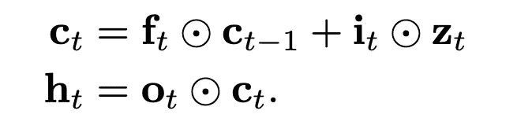

***ifo-pooling***via[QRNN 论文](https://arxiv.org/abs/1611.01576)

# 正规化

在检查了各种经常性辍学方案后，QRNN 使用了一个名为' **zone out '的扩展方案。**'它本质上是在每个时间步长选择一个随机的通道子集进行丢弃，对于这些通道，它只是将当前通道值复制到下一个时间步长，而不做任何修改。

> 方便地说，这相当于将 QRNN 的遗忘门通道子集随机设置为 1，或者对 1 f 施加压差。
> 
> — [QRNN 论文](https://arxiv.org/abs/1611.01576)

因此，

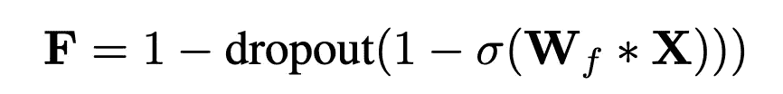

通过 [QRNN 论文](https://arxiv.org/abs/1611.01576)退学

# 来自 DenseNet 的想法

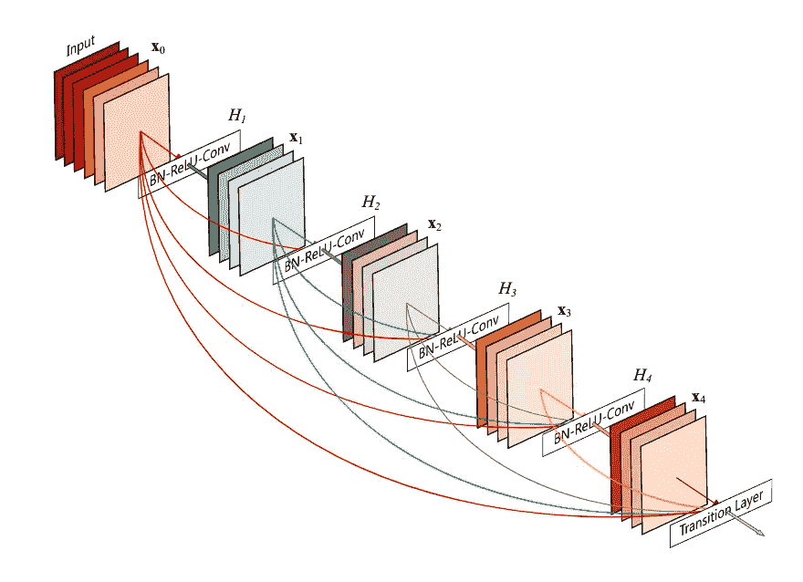

DenseNet via [DenseNet 纸](https://arxiv.org/abs/1608.06993)

DenseNet 架构建议在每一层和它之前的每一层之间**有跳跃连接**，这与在后续层上有跳跃连接的惯例相反。因此，对于具有 ***L*** 层的网络，将有 ***L(L - 1)*** 个跳过连接。这有助于梯度流动和收敛，但会占用二次空间。

# 带 QRNN 的 seq2seq

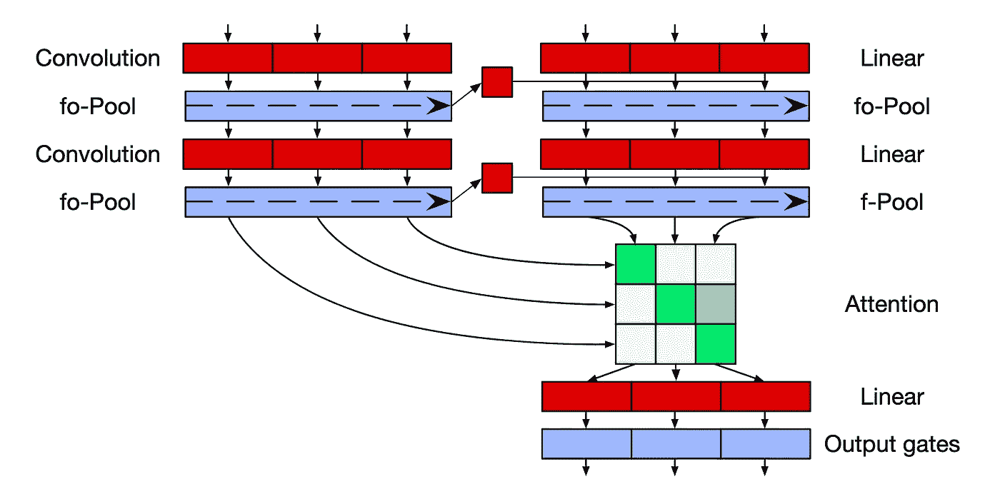

QRNN seq2seq via [QRNN 论文](https://arxiv.org/abs/1611.01576)

在常规的基于 RNN 的 seq2seq 模型中，我们简单地用编码器的最后隐藏状态初始化解码器，然后针对解码器序列进一步修改它。好吧，我们不能对循环池层这样做，因为在这里，编码器状态不会对解码器的隐藏状态有太大贡献。因此，作者提出了一种改进的解码器结构。

来自编码器的最后隐藏状态(最后令牌的隐藏状态)被线性投影(线性层)，并且在应用任何激活之前被添加([广播](https://www.tutorialspoint.com/numpy/numpy_broadcasting.htm)，因为编码器向量更小)到解码器层的每个时间步长的卷积输出:

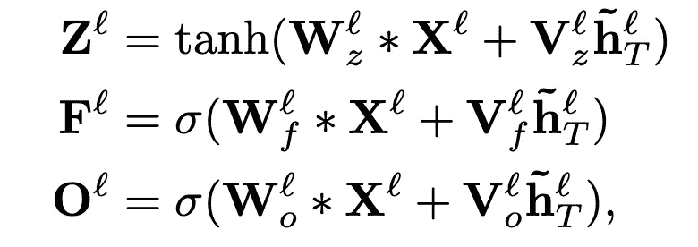

解码器层通过 [QRNN 纸](https://arxiv.org/abs/1611.01576)

***~*** 表示属于编码器； ***V*** 是应用于最后一个编码器隐藏状态的线性权重。

## 注意力

注意力仅应用于解码器的最后隐藏状态。

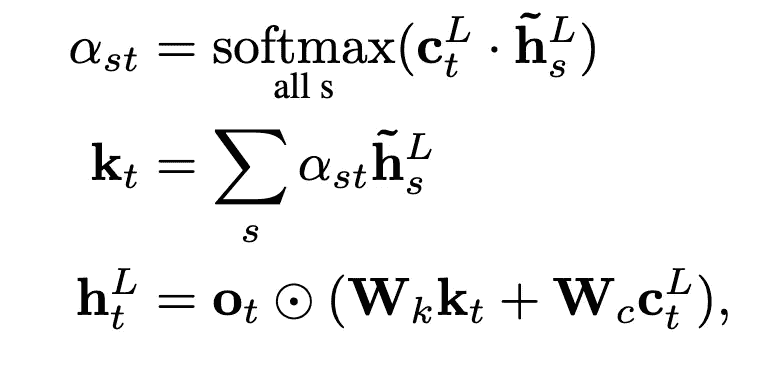

通过 [QRNN 论文](https://arxiv.org/abs/1611.01576)关注 QRNN

其中 ***s*** 是编码器的序列长度， ***t*** 是解码器的序列长度， ***L*** 表示最后一层。

首先，将解码器的 ***未选通*** 最后一层隐藏状态与最后一层编码器隐藏状态进行点积。这将产生一个形状为 ***(t，s)*** 的矩阵。Softmax 接管了 ***s*** ，用这个 ***分数*** 获取注意力总和，形状***【t，hidden _ dim】***的 ***k_t* 。 ***k_t*** 然后与 ***c_t*** 一起使用，为解码器获得 ***门控*** 最后一层隐藏状态。**

# 结果

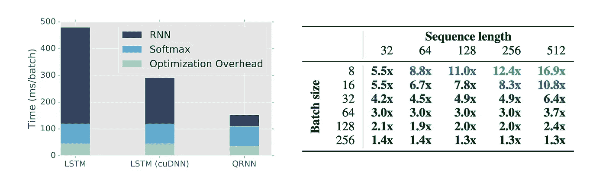

通过 [QRNN 纸](https://arxiv.org/abs/1611.01576)进行速度比较

QRNN 的计算速度比 LSTM 架构快 17 倍，在某些情况下，其结果与前者相当，甚至略好于后者。

> 最近，基于 QRNN 的模型 pQRNN 仅用 1.3M 个参数就在序列分类方面取得了与 BERT 相当的结果(与 BERT 相反，它有 440M 个参数):

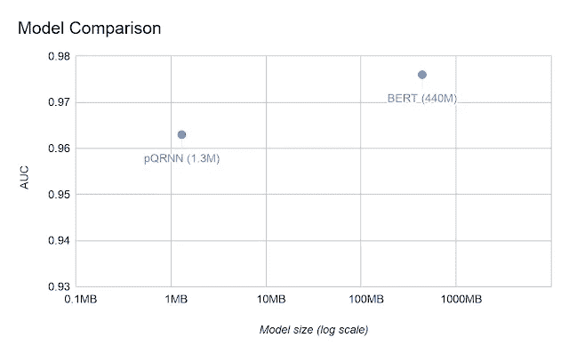

pQRNN vs BERT via [谷歌人工智能博客](https://ai.googleblog.com/2020/09/advancing-nlp-with-efficient-projection.html)

# 结论

我们深入讨论了新颖的 QRNN 架构。我们看到了它如何将递归添加到基于卷积的模型中，从而加速序列建模。QRNN 的速度和性能肯定会让我们重新考虑一些 NLP 任务的变压器。

# 参考

 [## 准递归神经网络

### 递归神经网络是一个强有力的工具，用于建模序列数据，但每个时间步的依赖…

arxiv.org](https://arxiv.org/abs/1611.01576)