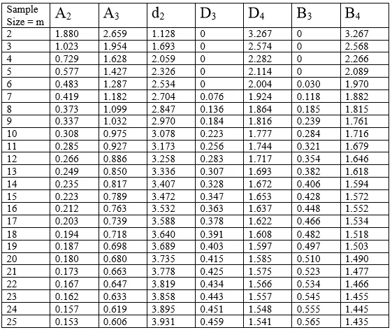
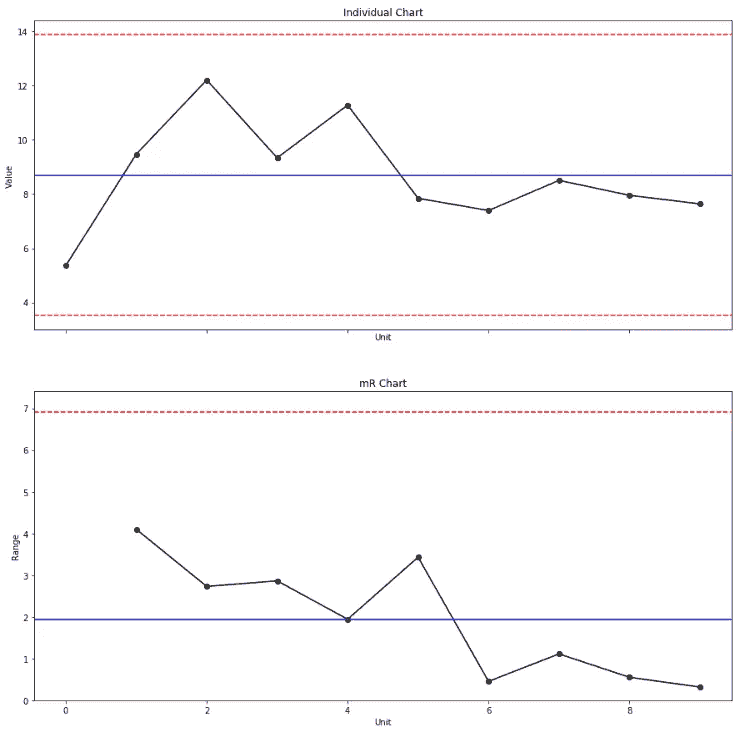
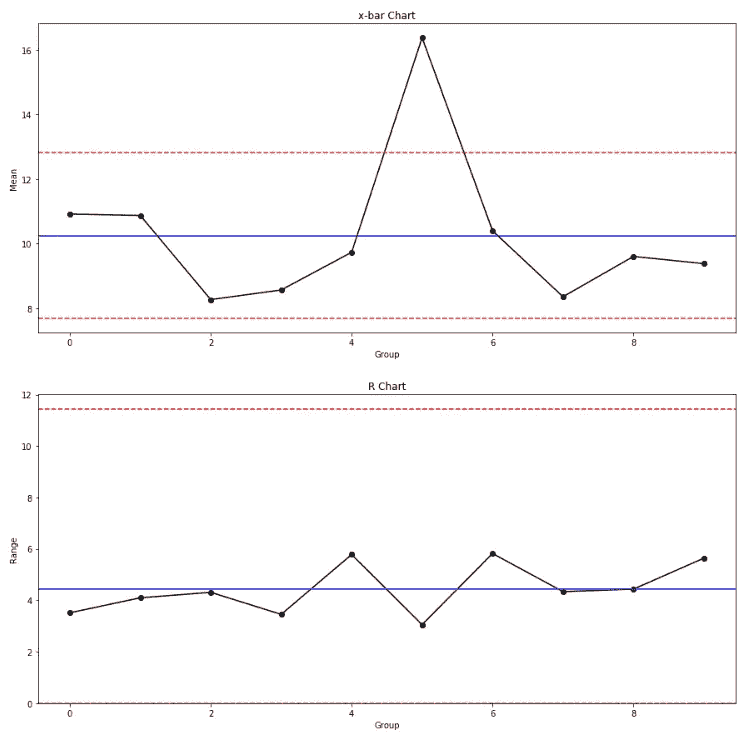
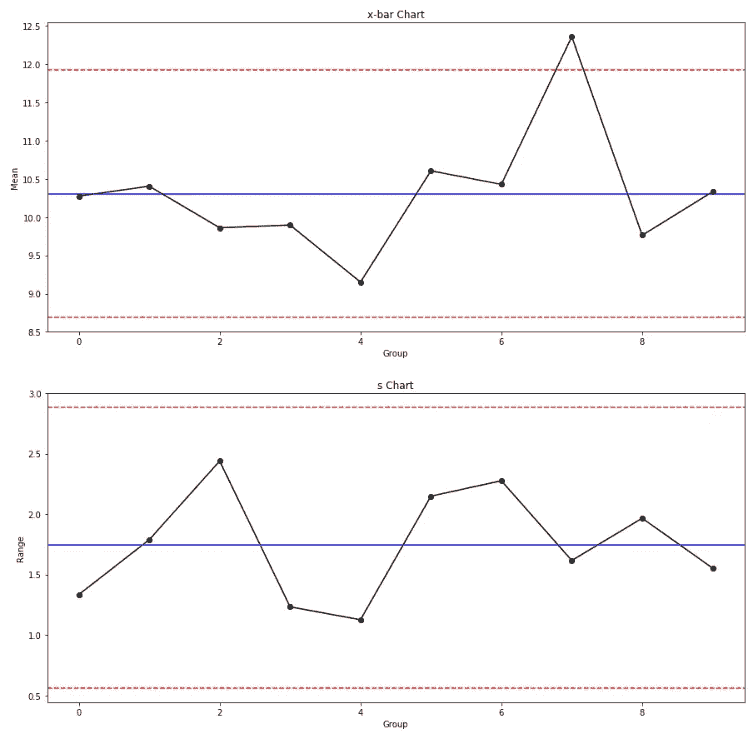
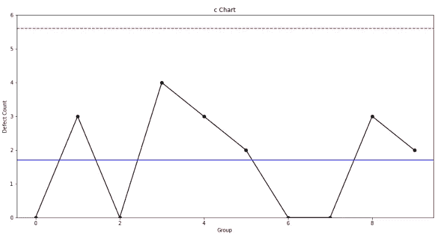
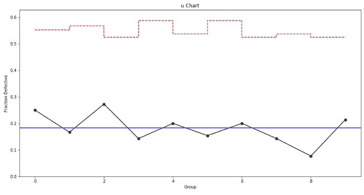
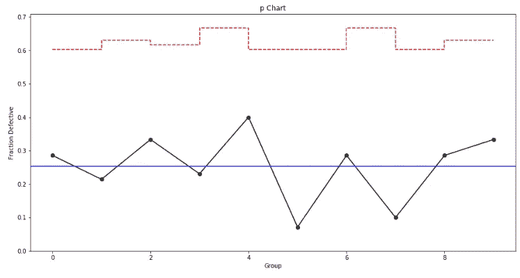
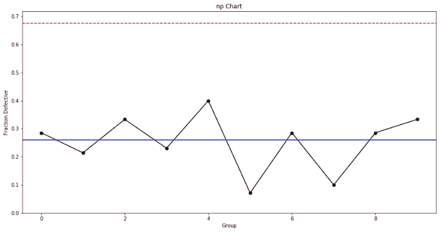

# 使用 Python 制作质量控制图表

> 原文：<https://towardsdatascience.com/quality-control-charts-guide-for-python-9bb1c859c051?source=collection_archive---------3----------------------->

## 面向工业工程师的 Python

## 使用 Python 库创建质量控制图

图片由 Sara Kurfe 拍摄，可在 [Unsplash](https://unsplash.com/photos/jqpRECmiNEU) 获得

# **质量控制图**

质量控制图是工程师监控一个过程是否在**统计控制下**的重要工具。它们有助于可视化变化，发现并纠正出现的问题，预测预期的结果范围，并分析特殊或常见原因导致的流程变化模式。质量控制图常用于精益六适马项目和 DMAIC 项目的控制阶段，被认为是过程改进的七个基本质量工具之一。

要使用的适当控制图由数据类型(即测量)、缺陷数量和样本大小决定。下面的决策树分别说明了每个控制图的条件:

质量控制图决策树

## 控制极限

在质量控制图中，控制极限是绘制在中心线(即平均值)上方和下方的线，其功能是作为识别信号(即超出控制极限的点)的阈值，并帮助确定过程是否处于统计控制之下。它们是由特定于每种类型控制图的公式定义的，这些公式包括常数，这些常数根据样本大小而变化。下表列出了这些常数:

控制极限常数

对于以下示例，将使用 Python 从头开始构建每种类型的质量控制图。同样，将提供每个控制图的简要描述。让我们来看看 Python 代码。

# 连续数据的控制图

## x 图和 mR 图

x 图(也称为个体图)和 mR 图用于根据给定时间内采集的个体样本监控过程的**均值和变异**。为了将 mR 图与 x 图一起使用，样本大小 *n* 必须等于 1。在 x 图上， *y* 轴显示平均值和控制限值，而 *x* 轴显示样本单位。在 mR 图上， *y* 轴显示移动范围的平均值和控制极限，而 *x* 轴显示样本单位。

## x 条形图和 R 图

x-bar 和 R-chart 用于根据给定时间内采集的样本监控过程的平均值**和变化量**。为了将 R 图与 x 条形图一起使用，样本大小 *n* 必须大于 1 且小于 11。在 x-条形图上， *y* 轴显示总体平均值和控制限值，而 *x* 轴显示样本组。在 R 图上，*y*-轴显示范围的平均值和控制限，而*x*-轴显示样本组。

## x 条形图和 s 图

同样，x-bar 和 s 图用于根据给定时间内采集的样本监控过程的**均值和变化**。为了将 s 图与 x 条形图一起使用，样本大小 *n* 必须大于 10 个单位。在 x-条形图上， *y* 轴显示总平均值和控制限，而 *x* 轴显示样本组。在 s 图上，*y*-轴显示标准偏差平均值和控制限，而 *x* 轴显示样本组。

# 离散数据的控制图

## **c 图**

c 图用于监控尺寸为 *n* 的固定样本中**缺陷总数**。 *y* 轴显示每个样品的不合格数量，而 *x* 轴显示样品组。

## u 形图

u 形图用于监控尺寸为 *n* 的不同样品中**每单位**的缺陷总数；它假设单元可以有一个以上的缺陷。 *y* 轴显示每个单元的缺陷数量，而 *x* 轴显示样本组。

## p 图

p 图用于监控不同尺寸 *n* 样本中不合格品单位的**比例**；它基于二项式分布，每个单位只有两种可能性(即有缺陷或无缺陷)。 *y* 轴显示不合格单位的比例，而 *x* 轴显示样本组。

## np 图表

np-chart 用于监控大小为 *n.* 的固定样本中不合格单位的**计数**。*y*轴显示不合格单位的总数，而 *x* 轴显示样本组。

# 总结想法

质量控制图是分析流程稳定性和获取重要统计信息的重要工具，可用于精益六适马和 DMAIC 项目的流程改进。质量和工业工程师必须能够准确地解释它们，以识别可能导致潜在不合格的不良趋势，从而采取预防措施而不是纠正措施，从而减少废料和浪费。

本指南涵盖了如何使用多个 Python 库从头构建质量控制图的分步教程。考虑到 Python 在专业人士和学者中的高受欢迎程度，Python 是一个很好的工具，能够为统计目的构建质量控制图表。虽然也有其他程序和软件可以构建它们(例如 Minitab、R、Microsoft Excel)，但质量和工业工程师应根据他们的编码和分析技能决定使用哪一种，同时符合组织的目标和客户的规格。

*—*

*如果你觉得这篇文章有用，欢迎在* [*GitHub*](https://github.com/rsalaza4/Python-for-Industrial-Engineering/tree/master/Quality%20Control%20Charts) *上下载我的个人代码。也可以直接发邮件到*[*rsalaza4@binghamton.edu*](mailto:rsalaza4@binghamton.edu)*找我，在*[*LinkedIn*](https://www.linkedin.com/in/roberto-salazar-reyna/)*找我。有兴趣了解工程领域的数据分析、数据科学和机器学习应用的更多信息吗？通过访问我的媒体* [*简介*](https://robertosalazarr.medium.com/) *来探索我以前的文章。感谢阅读。*

*——罗伯特*