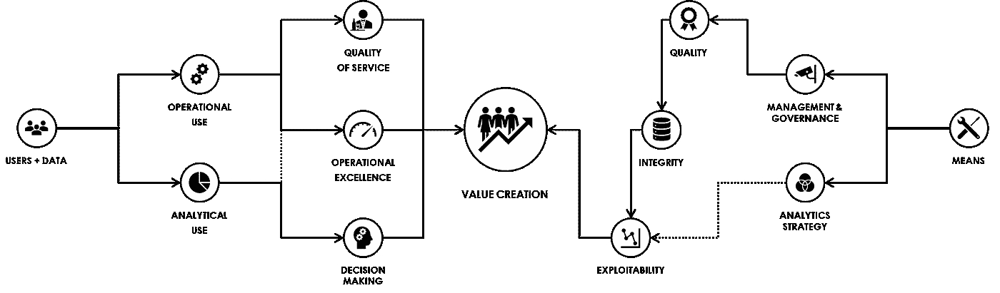

# 数据的质量、完整性和可利用性

> 原文：<https://towardsdatascience.com/quality-integrity-and-exploitability-of-data-9f75c39d384d?source=collection_archive---------56----------------------->

## [上的数据值](https://towardsdatascience.com/tagged/on-the-value-of-data)

## 价值创造的三个关键驱动因素

在 [关于数据价值的这一系列文章的第一部分](/from-users-to-value-creation-bb9b14c882f8)中，我们看到数据不仅具有内在的市场价值，而且还“间接”参与为公司创造价值，考虑到数据的使用方式及其对服务质量、卓越运营和决策的影响。

但是，仅仅理解用途(“什么”)和相关的业务价值(“为什么”)是不够的，我们还需要定义**如何**最大限度地从数据中创造价值。我考虑两种不同的策略:

*   数据管理和治理策略，主要是保存其“名义”或“单位”价值，以便不限制其使用。
*   分析策略，特别是利用超出其运营用途的数据，并通过合并不同的数据源、分析、汇总、可视化等来创造超出其“单位”价值的价值。

这两个战略包括实施工具和技术、实践和流程，旨在引导三个关键驱动因素创造价值，这次不是从用户方面，而是作为实现价值的手段:

1.  **质量**，在数据创建期间
2.  **完整性**，在存储和复制数据期间
3.  **可开发性**，在使用数据期间

事实上，说数据是通过计算机应用程序产生的并不意味着它是可用的，我们都知道应用程序包含不正确或不完整的数据(质量和/或完整性问题)，或难以用于分析的数据(我不谈论甚至不存在的数据，这些应用程序甚至不允许获取)。

因此，本系列的第二部分将致力于这三个特征，它们是从数据中创造价值的关键驱动因素，它们的影响往往不为人所知，有时甚至被低估。

照片由[埃维拉尔多·科埃略](https://unsplash.com/@_everaldo?utm_source=medium&utm_medium=referral)在 [Unsplash](https://unsplash.com?utm_source=medium&utm_medium=referral) 上拍摄

# 质量和诚信，这两个概念经常被相互混淆

数据质量和完整性对依赖于数据使用的流程有直接影响，因此也影响服务质量、卓越运营和决策制定，进而影响价值创造。然而，这两个概念并不意味着相同的原因，或者相同的过程(或者相同的团队)，因此它们必须分开考虑。

数据质量是链中的第一个环节，翻译过来就是“在正确的时间、正确的地点获得好的数据”。我们在这里讨论的是，在数据创建的那一刻，符合一定数量的规则。这些规则几乎总是相同的，数据必须在你需要的时候就在那里，它必须是完整的，它必须是准确的(这三个标准必须被精确地定义)。

与数据质量不同，完整性与数据创建无关，而只与数据创建后的存储和拷贝有关(除非在极端情况下，应用程序会在数据创建时“创建不正确”并破坏数据)。因此，数据必须保持不变，复制的数据必须与原始数据完全相同。

数据完整性主要是一个技术问题，基础设施和工具，以及围绕数据存储、复制或传输的不良流程和做法的实施，都可能导致完整性的丧失。

另一方面，数据质量通常是运营团队感到沮丧的原因，也是管理层关心的问题，尤其是当数据对公司的活动至关重要时。这是许多企业的情况，许多计算机应用程序(包括最近的应用程序)在设计时没有将数据质量作为一个关键要素。

# 提高数据质量:约束、自动化、管理

在我看来，数据质量主要是一个方法论的问题。首先，在我看来，只有三种方法可以保证高质量的数据:

1.  **将**约束到应用程序中，并在数据产生时正确显示。例如，您可以强制某些数据字段，防止“自由”输入，并强制用户从列表中选择值，在允许验证页面之前检查数据一致性等。
2.  **自动化**数据输入，尽可能避免手动输入，手动输入是错误的来源。这包括复制数据并将其从一个应用程序传输到另一个应用程序，以避免在两个不同的系统中手动输入相同的数据。
3.  **管理**，提高负责生产数据的团队对拥有高质量数据的重要性的认识，在可能的情况下激励他们，必要时可能还会在一定程度上约束他们。

那么，糟糕的数据质量本身并不是真正的问题。真正的问题是它对服务质量和客户体验、卓越运营、新业务机会、合规性等的负面影响。因此，影响是一个关键方面。

**识别、测量、分析和理解这种影响将首先使情况变得真实，而且还能确定哪些数据是关键的，并因此为每个数据、应用程序(约束和/或自动化)或管理定义要实施的策略。**

# 保证数据可用于分析

数据可利用性是指允许按照预期对数据进行操作和/或分析。但是，如果运营使用主要依赖于保证数据质量和完整性的数据管理和治理流程，那么分析使用在很大程度上依赖于分析策略。

不言而喻，今天，能够分析数据变得越来越重要。如果数据质量和完整性允许保留数据的“单位”价值，则分析允许在“单位”价值之外通过以下方式创造额外的价值:

*   **描述发生的事情**并从数据中获得证据来支持事实，而不是依赖于意见、假设或教条，从而促进决策。
*   **解释一种情况，**通过引出相互关系和因果联系，允许理解为什么会发生，已经发生了什么，并在可能的情况下对不同的变量采取行动以改善结果。
*   **预测未来的情况，**特别是当你被迫适应它，因为你无法控制导致它的环境(天气就是一个很好的例子，作为一个人，你不能准确预测天气，也不能影响它)

*(关于解释性分析和预测性分析之间的区别的更详细的解释，* [*参见我以前关于这个主题的文章*](/predictive-vs-interpretative-analytics-9f2d85ac1106) *)*

为了通过分析最大限度地创造价值，数据质量和完整性是不够的。数据还需要可用于分析。这种可利用性已经变得越来越重要，并且必须成为应用程序设计中不可或缺的一部分。数据的定义、编码和建模方式是可以简化数据分析的关键驱动因素，或者相反会使数据分析变得更加复杂和昂贵。

**因此，数据必须易于业务团队理解。数据模型和将数据创建到业务应用程序中的方式必须考虑到业务领域和流程，以便轻松地将数据“转换”为有形和可用的信息。**

分析的可利用性要求不仅适用于业务应用。它还适用于存储数据并可用于报告和分析目的的分析平台。这些平台和相关工具将允许通过使这些数据可访问、通过合并来自不同业务应用程序的数据、聚合它们、关联它们等来创造额外的价值。但这些分析生态系统的设计也一定是为了简化用户对数据的使用。

首先，数据的获取、存储、转换、建模和提供给用户的方式必须从一开始就用于分析用途，从原始数据到细化数据的这些过程具有完整和可理解的可追溯性，模型适合业务用户并为其所理解。它必须满足服务级别、安全性和性能方面的要求。

然后，提供给用户的工具不仅必须简化用于接收、转换和建模数据的不同管道的构建和维护，还必须简化业务用户对数据的使用和管理，业务用户必须了解数据、数据的接收、转换和建模方式、可用性、分析和显示方式。

因此，可利用性也是关于特定工具的选择和实现，例如:

*   **数据目录**，定义数据以及与数据质量规则的符合性
*   **数据准备工具**和 ELT/ETL(提取、转换、加载)简化数据接收和转换
*   **数据可视化工具**简化分析并帮助用户更好地展示数据
*   等等。

**总之，如下图所示，数据的质量、完整性和可利用性是三个关键驱动因素，它们直接影响价值创造，以及这些数据用于服务质量、卓越运营和决策的方式。总而言之:**

感谢您的阅读，请让我知道您的想法，并毫不犹豫地分享。