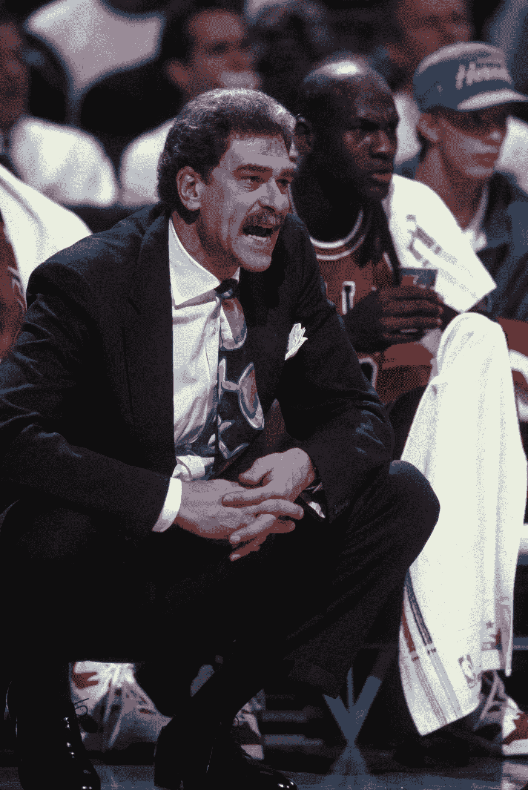
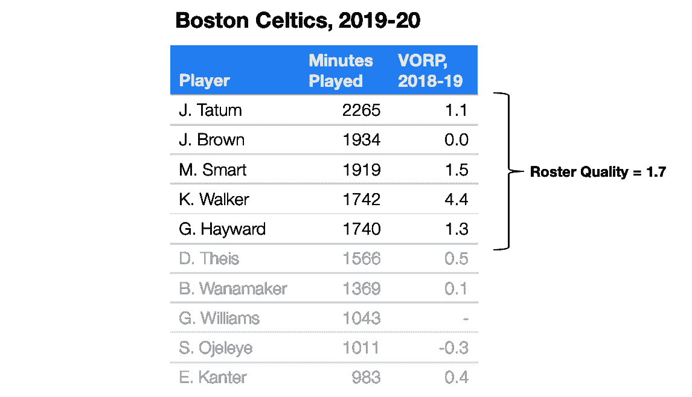
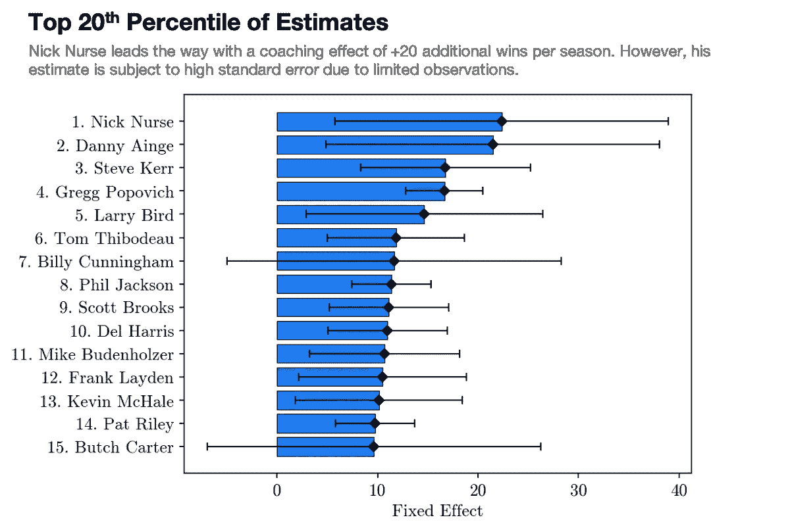
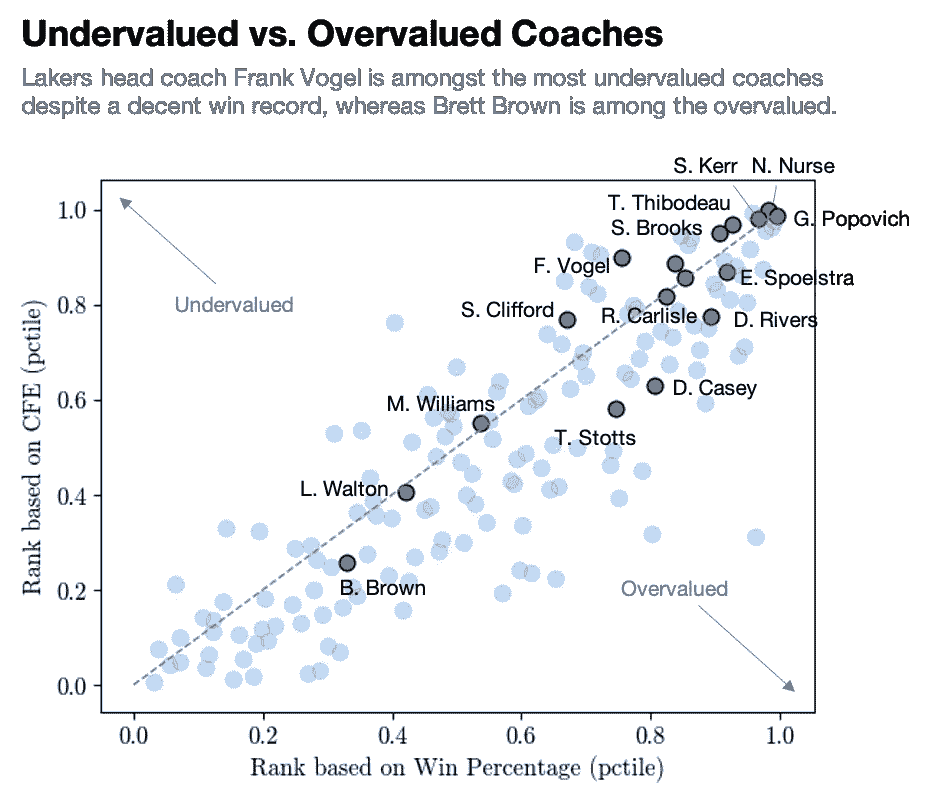
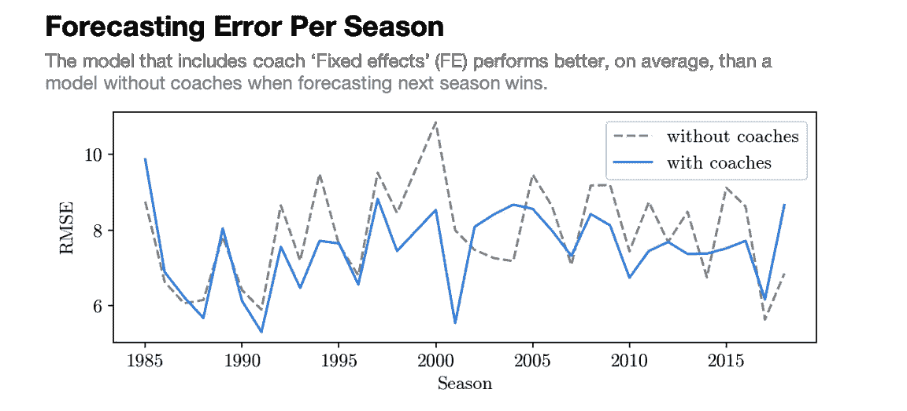

# 用固定效应量化 NBA 教练的贡献

> 原文：<https://towardsdatascience.com/quantifying-the-contribution-of-nba-coaches-using-fixed-effects-56f77f22153a?source=collection_archive---------26----------------------->

## [实践教程](https://towardsdatascience.com/tagged/hands-on-tutorials)

*一些教练改变了体育运动的方式，而另一些教练尽管有巨大的天赋，却缺乏领导。使用追溯到 1980 年的数据，我探索了高层管理人员的频繁变动，以理清 NBA 教练在名册特征之上产生的胜利。我发现对一些教练的影响，像格雷格波波维奇，尼克护士和史蒂夫·科尔，比全明星赛季的超级明星更大。*

# 为什么是教练？

想想一个成功的体育王朝，你会发现背后有一个超水平发挥的教练。例如，在美国国家橄榄球联盟，如果不提到比尔·贝利奇克的天才，就很难谈论汤姆·布拉迪的成功。在足球方面，正是佩普·瓜迪奥拉精湛的战术释放了梅西的天赋，将巴塞罗那足球俱乐部变成了欧洲巨人。很少有人质疑尤尔根·克洛普对利物浦的变革性影响，利物浦几乎在一夜之间成为 EPL 历史上最强大的攻击之一。如果没有菲尔杰克逊的三角进攻，谁能说迈克尔乔丹会不会成为六次冠军得主**？**

**如果你仍然持怀疑态度，考虑一下在过去的 40 个赛季中，只有 4 名教练赢得了超过 60%的 NBA 总冠军。**

**我在黎巴嫩作为职业篮球运动员亲身体验了教练效应。当我通过训练进入国家队选拔时，我注意到一些教练能够从我身上得到最好的东西。他们让比赛变得更简单(也更有趣),不管环境和阵容如何，他们都能带来好的结果。我也曾在一些团队中表演过，尽管有着非凡的天赋，但我们的表现和一个小分队没什么区别。**

****

**菲尔·杰克逊被广泛认为是有史以来最伟大的篮球教练，他赢得的冠军(11 个)超过了 28 个。*图片来自*体育图片|*Dreamstime.com 获得了拉姆济-阿米的许可。***

# **更系统的方法**

**因此，根据我多年作为团队运动员的表现，我确信，教练提供的价值远比分析师和体育行业人士所认为的更大。当我开始我的经济学研究生学习时，我着手开发一种系统的方法来测量这种效应。我的目标是让教练分析不那么“黑箱化”,并给予教练应有的评价。**

**我将我的研究问题表述如下:篮球教练重要吗？如果是的话，他们对名册特征的相对贡献是什么？我通过对主教练身份的团队胜利进行回归来评估这一点，同时考虑其他可能有影响的因素。特别是，我开发了名册质量和伤病的控制变量。最终目标是为过去和现在的 NBA 教练提供可靠的衡量管理贡献的指标。**

**我的方法遵循了关于经理人的经济学文献，包括 Abowd et。Al (1999) 研究公司部门的员工工资， [Bertrand 和 Schoar (2003)](https://academic.oup.com/qje/article-abstract/118/4/1169/1925095?redirectedFrom=fulltext) 研究首席执行官身份对资产负债表表现的影响， [Muelheusser 等人](https://www.researchgate.net/publication/255856494_The_Impact_of_Managerial_Change_on_Performance_The_Role_of_Team_Heterogeneity) (2012)研究德国德甲联赛中的教练效应。这种方法特别适合 NBA，因为相当一部分教练在不止一个球队被观察。这种高周转率可以很准确地跟踪他们的影响。**

# **它是如何工作的**

***本次分析使用的数据集涵盖了 1979-80 赛季到 2018-19 赛季之间的所有常规赛。除去部分教练赛季，剩下 808 个个人赛季，包括总共 163 名主教练。所有数据来源于* [*篮球参考*](http://www.basketballreference.com/) *。***

**NBA 是 30 支球队的主场，每个常规赛都有超过 82 场比赛。我用总胜场数作为某个赛季团队表现的指标。然后将每个观察结果与主教练的信息、球员过去的表现指标以及其他统计数据(如总上场时间和错过的比赛)进行匹配。**

**然后，我使用上个赛季替代球员(VORP)的价值来构建一个**天赋**的衡量标准。为了简单起见，我根据上场时间将名单限制为 5 名球员，并计算前一赛季的平均 VORP。这个想法是，这个变量将捕获教练在赛季开始时可用的人才数量。**

****

**如何计算天赋变量，以波士顿凯尔特人队目前的名单为例。**

**第二个控制变量是**伤病**，衡量的是球队主要球员在整个赛季中错过的比赛总数。这背后的直觉是捕捉关键执行者错过的时间的影响，这预计会使教练的工作更加艰难。**

**最后，模型包括教练[固定效应](https://www.statisticshowto.com/experimental-design/fixed-effects-random-mixed-omitted-variable-bias/#:~:text=Fixed%20effects%20are%20variables%20that,an%20individual%20is%20the%20same.)——利益变量。简而言之，固定效应是在时间或空间上不变的变量。比如说，在衡量“住在某个地区”或“属于某个种族”对预期收入的影响时，通常会用到它们。由于主教练身份是一个分类变量，我使用一键编码将其转换为模型可以解释的二进制形式。**

# **主要结果**

**固定效应对一些教练来说相当大——比全明星赛季超级明星的胜率还要大。值的范围从-25 到+21，平均值为 0.15。这意味着+10.0 的值表示教练每个赛季相对于平均值多赢得 10 场比赛。从这个角度来看，这样的金额足以将平庸的球队推入季后赛的争夺。**

****

**从一般的主教练到尼克护士(1)的变化产生了大约 20 个额外的胜利，当花名册的特征保持在他们的平均水平时。换句话说，护士团队倾向于持续超额完成 20 场胜利。当然，护士的估计是有噪声的——这意味着精度较低——因为模型只观察了他两个季节。类似地，史蒂夫·科尔(3)与+ 17 效应和相当大的标准误差相关联。**

****

**对菲尔杰克逊(8)，格雷格波波维奇(4)和帕特·莱利(14)的影响估计更精确。任期越长，观察次数越多，获胜次数越多，标准误差越低。拉里·伯德(第 5 名)和丹尼·安吉(第 2 名)都名列前茅，尽管(或者可能是由于)执教时间很短。考虑到他们都很快晋升到总经理的职位，也许他们也成为有效的教练并不完全令人惊讶。**

**布鲁克斯(9)被模型确定为超过他的平均名册建议的胜利数约 12 胜。虽然一些 NBA 篮球的密切关注者认为这难以置信，但这一结果可能受到了他在雷霆队的影响，在那里他带着一个令人惊讶的年轻阵容进入了 NBA 总决赛。这也可能突出模型中的一个缺点。由于它使用以前的表现作为名册质量的衡量标准，该模型可能有利于崭露头角的超级明星教练。我稍后会回到这个问题。**

> **如需教练指标的完整表格，请访问我的个人网站[这里](https://www.ramzyalamine.com/2020/fullcoachratings/)。**

## **被低估的教练**

**这种方法的最终好处是发现隐藏的教练能力。如果好的教练被定义为用*少*做*多*，那么获胜最多的教练不一定是最有效的。尤其是在 NBA，球员选拔发生在总经理层面，一些教练可能会发现自己比其他人更有前途的阵容。因此，传统的看待胜率的方式是不够的；基于模型的方法通过控制名册效应提供了一个更好的选择。**

****

**以现任湖人主教练弗兰克·沃格尔为例，他的胜率大约在第 75 百分位，而根据教练效应，模型将他排在第 89 百分位。在印第安纳的 6 个赛季中，有 5 个赛季他至少获得了东部第二。然后在奥兰多的两个赛季，他没能取得有意义的成绩。**

**总的来说，该模型发现沃格尔做得比他的胜率显示的要好，尽管他在这方面已经排名很好。这很可能是因为当他掌舵时，步行者队见证了一夜之间的转变。现在，在湖人队，沃格尔似乎正在兑现这一评估。他能否像他之前的一些伟人那样建立一个王朝，还有待观察。无论如何，拥有三届冠军勒布朗詹姆斯不太可能有助于他的固定效果。**

# **结果有多可靠？**

**我通过观察模型的样本外表现来评估准确性。对于样本开始以来的每一个赛季，我都根据该赛季之前的数据拟合模型，然后观察一个赛季之前对球队获胜的预测与实际数据的匹配程度。我选择均方根误差(RMSE)作为评估标准:预测误差越低，教练的估计就越可靠。**

**与只有球员和伤病的模式相比，教练模式总体上减少了 15%的 RMSE。这意味着，实际上，教练效应正在捕捉价值，否则错过了。然而，偶尔，无教练模式(通过完全放弃固定效果)表现更好。例如，在 2018-19 年，教练模式下降了 20%以上。**

****

**作为健壮性检查，我考虑了模型的替代规范，包括 blench 播放器的包含。然而，这并没有导致评估的任何改进。我对除 VORP 之外的玩家指标的使用进行了进一步的稳健性检查，如获胜份额、盒子正负和玩家效率评级。然而，我发现 VORP 的预测表现最好。**

# **局限性和后续步骤**

**我的分析并非没有挑战，其中一些可能需要一个单独的研究项目。我在这里讨论了其中的一些挑战，包括我目前如何应对这些挑战或计划在未来如何应对。总的来说，虽然我确实相信还有改进的空间，但我也重视简单性(但不幼稚)和可解释性的首要原则。**

1.  **不包括季后赛。也许最终的指标是团队在最重要的时候的表现。季后赛是战术得到检验的时候，鼓舞人心的领袖得到了一个锻炼自己影响力的机会。但是由于每个赛季只有表现最好的球队才有资格参加，所以对季后赛的分析会受到选择偏差的影响。**
2.  ****这个模型没有考虑到新手的素质。**由于缺乏新加入球员的历史指标，该模型无法像对经验丰富的球员那样控制新秀的质量。相反，所有的新人都被认为是平等的。解决这个问题的一个潜在方法是控制汇票订单。换句话说，高选秀的新秀会比那些后来被选中的新秀得到更高的价值。**
3.  ****这种模式可能有利于拥有崭露头角的超级明星的教练。**由于过去的表现被用作质量的代表，每年的球员发展都归功于主教练。这在像斯科特·布鲁克斯这样的情况下可能会有问题，在那里他发现自己有高成长球员(杜兰特，威斯布鲁克和哈登)。在未来的工作中，我计划从两个方面解决这个问题。第一种是通过使用过去赛季的移动平均值来控制球员的老化曲线，第二种是通过潜在地将后面的赛季纳入球员变量。**
4.  ****结果可能会受到遗漏变量偏倚的影响。人们可能会想到潜在的混淆因素，如团队化学或特许权固定效应，这些因素会影响团队胜利，但目前却归咎于教练。特许经营效应的论点意味着，一些教练可能会从招聘能力强的“大”市场团队中受益。此外，有吸引力的自由球员可能会选择位于天气条件好的城市的球队。然而，这些球队通常会签下久经考验的教练，他们的固定效应在很大程度上已经被抓住了。一个潜在的解决方案是对球员类型进行建模。****
5.  **玩家的分配可能不是完全随机的。问题在于，好教练是不是因为带走球员，让他们打得更好才是好教练；或者他们挑选他们知道在一起会打得更好的球员。如果他们选择了自己的球队，那么怎么能真正区分球员和教练呢？这是评论我工作的经济学家向我提出最多的一个问题。幸运的是，NBA 是这样的，教练不负责球员的获得；签约、交易和挑选球员是总经理的工作。例如，这与欧洲足球不同，在欧洲足球中，教练(经理)既负责战术，也负责球员的引进。此外，有人可能会说像菲尔杰克逊和格雷格波波维奇这样的“更好的教练”可能会吸引更高质量的人才(反之亦然)，因为球队需要*最大限度地利用他们的存在。这些情况发生在教练已经证明了他们的能力的时候，通常是在辉煌的职业生涯之后，这意味着他们的固定效果在那时已经基本形成。***

# **结论**

**经理是组织成功的关键。他们制定战略，激励员工，并建立文化。他们也是吸引和留住优秀人才的关键。像玩家一样，他们可以以不同的方式影响游戏。有些人是具有出色人际交往技巧的激励型领导者(如帕特·莱利、尤尔根·克洛普、何塞·穆里尼奥)，而其他人则以象棋般的战术才华而闻名(如布拉德·史蒂文斯、格雷格·波波维奇和比尔·贝利奇克)。最优秀的人能够凭借天赋和风格的结合超越体育(例如菲尔杰克逊、佩普瓜迪奥拉、约翰·克鲁伊夫和约翰·麦登)。**

**尽管如此，很少有人非常严谨地研究过篮球教练。除了[这篇](http://www.sloansportsconference.com/wp-content/uploads/2019/02/Do-Coaches-Matter.pdf)斯隆的论文，分析社区继续关注球员作为价值的主要来源，而教练仍然是一个黑箱。因此，任何分析都无法超越猜想和轶事证据。**

**尽管存在缺点，即球员发展被分配给教练，忽略了可变偏差，以及潜在的不那么随机的名册分配，基于模型的方法提供了几个重要的见解。首先，它证实了伟大的教练和伟大的球员一样重要。其次，相对于历史上的同行，它提供了对当前教练的影响的公平和稳健的量化评估。第三，它揭示了传统方式所没有的价值。**

**就现实世界决策的适用性而言，该模型是否能够特别好地预测新分配的教练团队配对的成功还有待观察。**