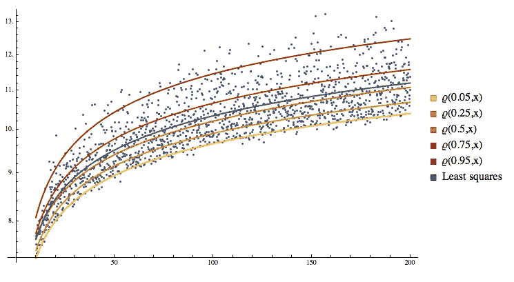
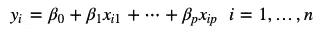
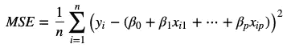
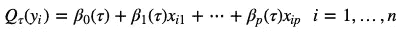
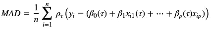
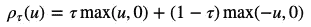
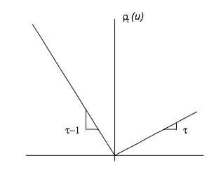
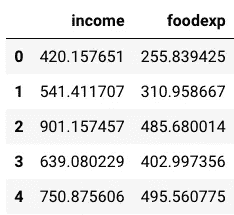
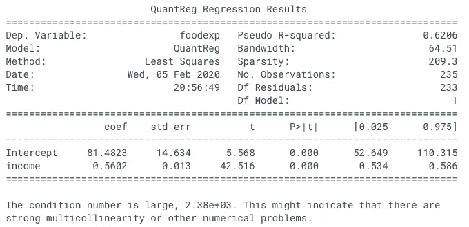

# 分位数回归

> 原文：<https://towardsdatascience.com/quantile-regression-ff2343c4a03?source=collection_archive---------1----------------------->



分位数回归拟合的数据

当进行回归分析时，对一个问题给出一个数字预测是不够的，你还需要表达你对这个预测有多有信心。例如，如果您正在查看某个特定市场的房价，而您的模型预测某栋房子的售价为 262，458.45 美元，那么您对模型的预测完全正确有多大把握呢？但愿你的直觉告诉你，这是真的可能性极小，但也许你的模型有可能接近实际答案。我们需要一种方法来预测一个数值范围，同时对该范围有一定的把握。

输入分位数回归。不同于使用最小二乘法来计算跨越不同特征值的目标的条件 ***均值*** 的常规线性回归，分位数回归估计目标的条件 ***中值*** 。分位数回归是线性回归的扩展，在不满足线性回归的条件(即线性、同方差、独立性或正态性)时使用。

传统上，用于计算平均值的线性回归模型采用以下形式



线性回归模型方程

其中 *p* 等于等式中特征的数量，而 *n* 是数据点的数量。最佳线性回归线是通过最小化均方误差找到的，这是通过以下等式找到的



线性回归的均方误差

现在，对于分位数回归，您不仅限于查找中位数，还可以计算特征变量中特定值的任何分位数(百分比)。例如，如果我们要找到特定房屋价格的第 25 个分位数，这将意味着有 25%的可能性房屋的实际价格低于预测，而有 75%的可能性价格高于预测。

采用与线性回归模型类似的结构，𝜏th 分位数的分位数回归模型方程为



分位数回归模型

这意味着β系数不再是常数，而是依赖于分位数的函数。在特定分位数上寻找这些 betas 值的过程与常规线性量化几乎相同，只是现在我们必须降低中值绝对偏差。



分位数回归的中位数绝对偏差

这里，函数𝜌是检查函数，它根据误差的分位数和总体符号对误差赋予不对称的权重。数学上，𝜌采取的形式



检查函数方程



检查功能图

在这种情况下， *u* 是单个数据点的误差，max 函数返回括号中的最大值。这意味着，如果误差为正，则检查函数将误差乘以𝜏，如果误差为负，则检查函数将误差乘以(1- 𝜏).

例如，如果您想要第 10 个百分位数的中间值，这意味着您想要 90%的误差为正，10%为负。为了找到最小的 MAD，同时使该陈述为真，必须将权重添加到误差中。在第 10 个分位数的情况下，权重 0.9 被添加到负权重，而权重 0.1 被添加到正权重。

让我们看看分位数回归的作用。让我们检查一下 QuantReg 的 python statsmodels 示例，该示例查看了 1857 年比利时工人阶级家庭样本的收入和食品支出之间的关系，并查看我们可以进行何种统计分析。

```
import statsmodels.api as sm
import statsmodels.formula.api as smf
data = sm.datasets.engel.load_pandas().data
data.head()
```



1857 年贝尔加因家庭数据

```
mod = smf.quantreg('foodexp ~ income', data)
res = mod.fit(q=.5)
print(res.summary())
```



如您所见，您可以为特定的分位数创建一条回归线，并对其执行统计分析，就像使用常规线性回归模型一样。

如果你想了解更多，这里有一个[链接](https://support.sas.com/resources/papers/proceedings17/SAS0525-2017.pdf)到 SAS 写的一篇关于分位数回归的论文。下文提供了其他来源。

[](https://en.wikipedia.org/wiki/Quantile_regression) [## 分位数回归

### 分位数回归是统计学和计量经济学中使用的一种回归分析。而最小二乘法…

en.wikipedia.org](https://en.wikipedia.org/wiki/Quantile_regression)  [## 分位数回归-统计模型

### 此示例页面显示了如何使用 statsmodels 的类来复制 Koenker，Roger…

www.statsmodels.org](https://www.statsmodels.org/devel/examples/notebooks/generated/quantile_regression.html)