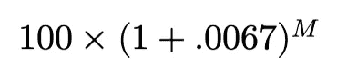

# Python 中的量化金融

> 原文：<https://towardsdatascience.com/quantitative-finance-in-python-e8d48e6b9c23?source=collection_archive---------30----------------------->

## 用代码介绍货币的时间价值


照片由 [Alexander Mils](https://www.pexels.com/@alexandermils?utm_content=attributionCopyText&utm_medium=referral&utm_source=pexels) 从 [Pexels](https://www.pexels.com/photo/person-holding-100-us-dollar-banknotes-2068975/?utm_content=attributionCopyText&utm_medium=referral&utm_source=pexels) 拍摄

普通金融和量化金融专业的第一堂量化课都与金钱的时间价值有关。本质上，这是一个长达一学期的课程，将今天的 100 美元从今天起一年后价值超过 100 美元的观念灌输到大学生的头脑中，并让他们手工解决令人痛苦的算术题，以确定他们今天需要投资多少才能在未来达到某种价值。这是与作为时间价值差异应用的永久财产和年金的介绍同时进行的。虽然我不喜欢手工计算，但我非常喜欢用 Python 来编写代码以便于使用。

# 金钱的时间价值

无风险利率——在实践中，由美国国库券、票据和债券代表的利率是货币价值随时间变化的原因。涵盖衍生品和证券定价等科目的高级课程总是在定价公式中考虑货币的时间价值，这使得这个主题就像代数之于微积分一样。

考虑到目前的无风险利率是每年 8%。今天收到 100 美元意味着可以立即以无风险利率进行投资…


一年后，100 美元的无风险利率是 108 美元。因此，在其他条件相同的情况下，今天收到 100 美元比一年后收到 100 美元更有价值。

在前面的例子中，复利(全年定期利息支付的再投资)被完全忽略。让我们看看另一个例子，我们考虑了复合效应。

考虑目前的无风险利率是每年 8%，复利频率是每月一次。今天收到 100 美元意味着可以以无风险利率进行每月复利的直接投资…


年度至月度汇率转换


第一个月的利息


第二个月的利息


第三个月的利息

希望到目前为止，每个月都有一个模式被认可…


第一个月的利息


第二个月的利息


第三个月的利息



m 月的利息

一年后，按无风险利率计算，100 美元约为 108.34 美元。通常用“*时间段美元*”来表示该值。例如，今天的 100 美元在时间段 1 美元中价值 108.34 美元…


关于时间的无风险投资寿命

因此，今天收到 100 美元将比今天收到 100 美元更有价值，如果没有每月复利*的话，其他一切都等于*。

从上面的例子可以构造出一个通用公式…


货币时间价值公式

*   **P** —初始金额或本金(100 美元)
*   **A** —时间段内的结果金额为新台币(108 美元或 108.34 美元)
*   **r** —无风险利率(8%)
*   **n** —时间段 t (1 或 12)的复合频率
*   **t** —经过的时间段(1)

现在让我们用 Python 写这个等式…

为了测试这个函数，使用上面的参数写一个调用…

```
108.29995068075098
```

*注:得出的值不同，更准确。*

值得一提的是，当复利频率的极限接近无穷大时，在时间段 t 美元中产生的金额就越高。

```
108.29995068075098 # Compounding period of 12
108.31429591590663 # Compounding period of 24
108.31909221757883 # Compounding period of 36
108.32149310823426 # Compounding period of 48
```

证明超出了本文的范围，但结果是一个不断复合的方程。在未来，我将讨论连续复利、交易和时间的重要性，以及它们与包括布莱克-斯科尔斯方程在内的高级模型推导的关系。