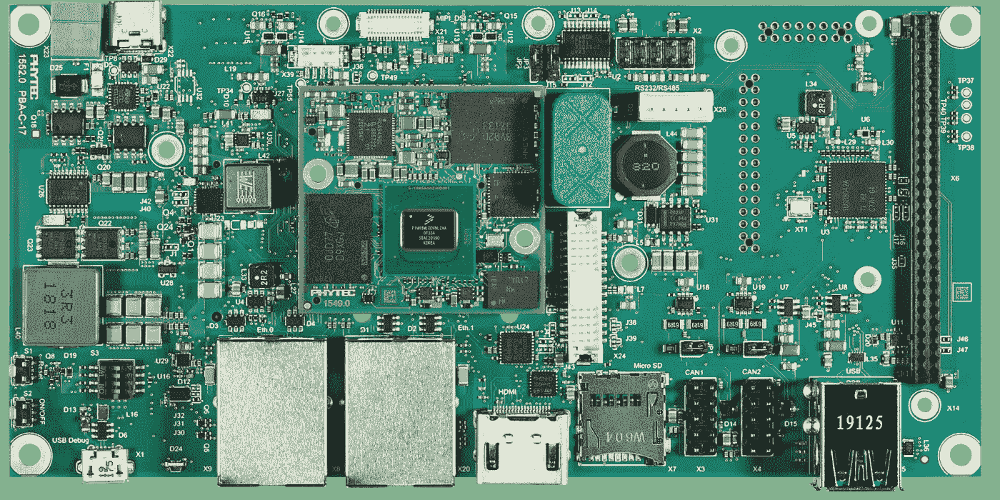

# 量化你的深度学习模型在 NPU 上运行

> 原文：<https://towardsdatascience.com/quantize-your-deep-learning-model-to-run-on-an-npu-2900191757e5?source=collection_archive---------24----------------------->

## 准备 TensorFlow 模型，以在集成在 [phyBOARD-Pollux](https://www.phytec.de/produkte/development-kits/phyboard-pollux-ki-kit/) 中的 [i.MX 8M Plus](https://www.nxp.com/products/processors-and-microcontrollers/arm-processors/i-mx-applications-processors/i-mx-8-processors/i-mx-8m-plus-arm-cortex-a53-machine-learning-vision-multimedia-and-industrial-iot:IMX8MPLUS) NPU 上运行推理

图片由加拿大 CC Liam Huang 和 mikemacmarketing 提供

# 目录

*   **简介**
    ——为什么大多数人工神经网络都是在 float32 中训练的，NPU 却使用 int8？
    -先决条件
*   **使用 TensorFlow 版本 2.x**
    进行训练后量化——第一种方法——直接量化已训练的模型
    ——第二种和第三种方法——量化来自*.h5 或*的已保存模型。pb 文件
*   **使用 TensorFlow 以下版本转换**

# 介绍

在本文中，我们将在本文中解释使用不同的 TensorFlow 版本对您的模型进行变换和量化需要采取哪些步骤。我们只关注培训后的量化。

我们使用 [phyBOARD-Pollux](https://www.phytec.de/produkte/development-kits/phyboard-pollux-ki-kit/) 来运行我们的模型。phyBOARD-Pollux 集成了一个 [i.MX 8M Plus](https://www.phytec.de/produkte/system-on-modules/phycore-imx-8m-plus/) ，它具有来自 VeriSilicon (Vivante VIP8000)的专用神经网络加速器 IP。

[phyBOARD pollux](https://www.phytec.de/produkte/development-kits/phyboard-pollux-ki-kit/) [ *图片经由 phytec.de 授权给 Jan Werth】*

恩智浦 i.mx8MPlus 框图[图片来自 phytec.de，经恩智浦许可]

由于恩智浦的神经处理单元(NPU)需要完全 int8 量化模型，我们必须研究 TensorFlow lite 或 PyTorch 模型的完全 int8 量化。恩智浦的 eIQ 库支持这两个库。这里我们只研究张量流变体。

关于如何进行训练后量化的概述可以在 [TensorFlow 网站](https://www.tensorflow.org/lite/performance/post_training_quantization)上找到。

## 为什么 NPU 使用 int8，而大多数人工神经网络都是用 float32 训练的？

浮点运算比整数运算更复杂(算术运算，避免溢出)。这导致只能使用更简单和更小的算术单元，而不是更大的浮点单元。​

float32 操作所需的物理空间比 int8 大得多。这导致:

*   更低的功耗，
*   较少的热量产生，
*   加入更多计算单元的能力减少了推理时间。

## 先决条件

要首先在您的 PC 上创建代码，我们建议在运行 Python 3.6、TensorFlow 2.x、numpy、opencv-python 和 pandas 的虚拟环境中使用 Anaconda。

克隆环境的环境文件可以在[这里](https://github.com/JanderHungrige/tf.keras-vggface/tree/main/Anaconda)找到。

# tensor flow 2 . x 版训练后量化

如果您通过 tf.keras 创建并训练了一个模型，那么有三种类似的方法来量化这个模型。

## 第一种方法——直接量化训练好的模型

经过训练的 TensorFlow 模型必须转换为 TFlite 模型，并且可以直接量化，如以下代码块中所述。对于训练的模型，我们示例性地使用基于 [rcmalli](https://github.com/rcmalli/keras-vggface) 的工作的更新的 [tf.keras_vggface](https://github.com/JanderHungrige/tf.keras-vggface) 模型。转换从第 28 行开始。

在加载/训练您的模型后，您首先必须创建一个代表性数据集。转换器使用代表性数据集来获取最大值和最小值，以便估算比例因子。这限制了从 float32 到 intX 的量化所引入的误差。误差来源于浮点数和整数的不同的数空间。从 float 到 int8 的转换将数字空间限制为-128 到 127 之间的整数值。根据输入的动态范围校准模型可以限制这种误差。

在这里，你可以像我们的例子一样循环遍历你的图像或者创建一个生成器。我们使用[*TF . keras . preprocessing . image . imagedata generator()*](https://www.tensorflow.org/api_docs/python/tf/keras/preprocessing/image/ImageDataGenerator)生成图像，并对图像进行必要的预处理。作为发电机，你当然也可以使用 [tf。*数据。dataset . from _ tensors()*](https://www.tensorflow.org/api_docs/python/tf/data/Dataset#from_tensors)*或*…*[*from . tensor _ slices()*](https://www.tensorflow.org/api_docs/python/tf/data/Dataset#from_tensor_slices)*。请记住，在这里对您的数据进行与您训练网络所用的数据相同的预处理(标准化、调整大小、去噪等)。这些都可以打包到生成器的*预处理 _ 函数*调用中(第 19 行)。**

*转换从第 28 行开始。简单的 TensorFlow lite 转换如下所示:*

*量化部分介于两者之间:*

*   *第 3 行:不推荐使用默认优化以外的优化。目前(2020 年)没有其他选择。*
*   *第 4 行:这里我们设置了代表性的数据集。*
*   *第 5 行:在这里，我们确保完全转换为 int8。如果没有此选项，只有权重和偏差会被转换，而不是激活。当我们只想减小模型尺寸时，使用这种方法。然而，我们的 NPU 需要完整的 int8 量化。激活仍处于浮点状态会导致整体浮点，并且无法在 NPU 上运行。*
*   *第 6 行:启用基于 MLIR 的转换，而不是 TOCO 转换，这使得 RNN 支持，更容易的错误跟踪，[和更多的](https://groups.google.com/a/tensorflow.org/g/tflite/c/C7Ag0sUrLYg?pli=1)。*
*   *第 7 行:将内部常量值设置为 int8。target_spec 对应于第 5 行的 TFLITE_BUILTINS。*
*   *第 9 行和第 10 行:也将输入设置为 int8。这在 TF 2.3 中是完全可用的*

*现在，如果我们使用 TF2.3 转换模型*

*   **experimental _ new _ converter = True**
*   **推论 _ 输入 _ 类型=tf.int8**
*   **推论 _ 输出 _ 类型=tf.int8**

*我们收到以下模型:*

**

**作者图片**

*然而，如果我们不设置*推理 _ 输入 _ 类型*和*推理 _ 输出 _ 类型*，我们将收到以下模型:*

**

**作者图片**

*因此，效果是您可以确定模型接受和返回哪种输入数据类型。如果您使用嵌入式摄像机，这一点可能很重要，如 [pyhBOARD-Pollux](https://www.phytec.de/produkte/development-kits/phyboard-pollux-ki-kit/) 所包含的。mipi 摄像头返回 8 位值，所以如果你想转换成 float32 int8 输入会很方便。但是请注意，如果您使用没有预测层的模型来获得(例如嵌入)，int8 输出将导致非常差的性能。这里推荐使用 float32 输出。这说明每个问题都需要特定的解决方案。*

## *第二种和第三种方法—从*.h5 或*量化保存的模型。pb 文件*

*如果你已经有了你的模型，你最有可能把它保存在某个地方，作为一个 Keras h5 文件或者一个 TensorFlow 协议缓冲 pb。我们将使用 TF2.3 快速保存我们的模型:*

*下面的转换和量化与方法一非常相似。唯一的区别是我们如何用转换器加载模型。要么加载模型，然后像方法一那样继续。*

*或者直接加载 h5 模型。使用 TensorFlow 版本 2 及更高版本时，您必须使用兼容的转换器:*

*如果从 TensorFlow pb 文件加载，请使用:*

# *使用低于 2.0 的 TensorFlow 版本进行转换*

*如果你想转换一个用 TensorFlow 版本编写的模型< 1.15.3 using Keras, not all options are available for TFlite conversion and quantization. The best way is to save the model with the TensorFlow version it was created in (e.g., rcmalli keras-vggface was trained in TF 1.13.2). I would suggest not using the “[保存](https://blog.metaflow.fr/tensorflow-saving-restoring-and-mixing-multiple-models-c4c94d5d7125)和[冻结图形](https://blog.metaflow.fr/tensorflow-how-to-freeze-a-model-and-serve-it-with-a-python-api-d4f3596b3adc)的方法来创建一个 pb 文件，因为 TF1 和 TF2 的 pb 文件不同。*tflite converter . from _ saved _ model*不工作，为实现量化制造了相当大的麻烦。我建议使用 Keras 的上述方法:*

*然后，从 1.15.3 开始，使用 TensorFlow 版本转换和量化您的模型。在这个版本的基础上，增加了很多功能，为 TF2 做准备。我建议使用最新版本。这将导致前面介绍的相同模型。*

*祝你好运，玩得开心。*