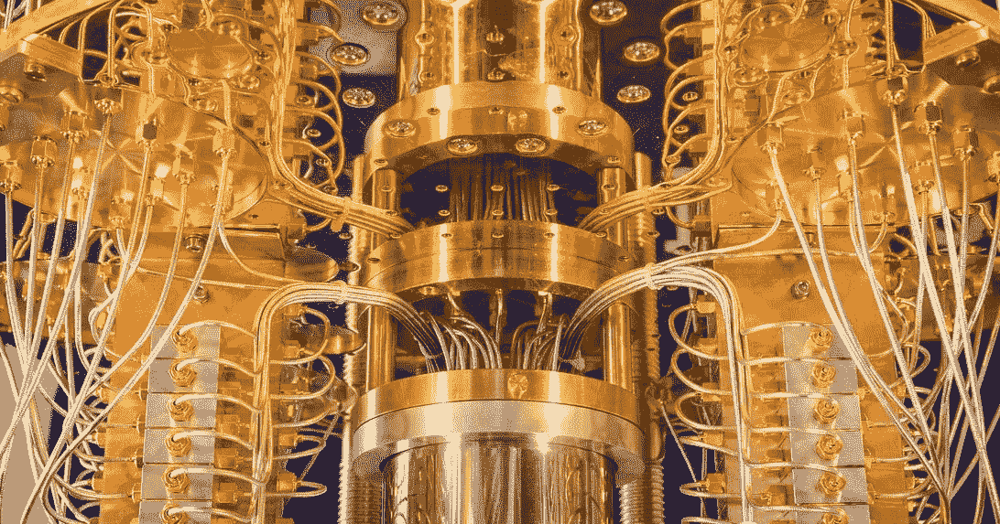
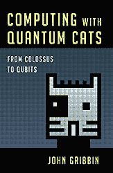
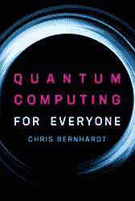
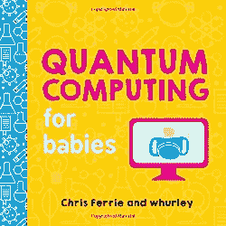
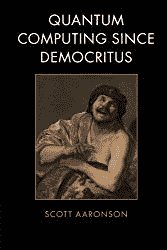
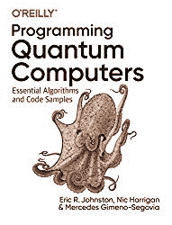
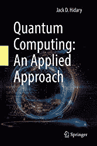

# 2020 年你应该读的量子书

> 原文：<https://towardsdatascience.com/quantum-books-you-should-read-in-2020-e58c34befbf?source=collection_archive---------22----------------------->

## 量子计算机和量子计算来了！

[量子计算机已经问世](/quantum-computing-for-business-347b95d400f9?source=post_stats_page---------------------------)，因此值得进一步了解这项即将上市的令人惊叹的技术。因为它太新了，现在市场上只有少数几本书。如果你想了解等待我们的是什么，这里列出了非数学的概述和更多的量子计算实践编码方法。

2020 年你应该读的量子书

# 要读的量子书

在[用量子猫计算:从巨像到量子位](https://amzn.to/3at65xG)中，约翰·格里宾提出了一个由许多平行世界组成的宇宙，其中“一切都是真实的”。回顾艾伦·图灵在恩尼格玛机和第一台电子计算机上的工作，格里宾解释了量子理论是如何发展到使量子计算机在理论上和实践中都能工作的。他带领我们超越理论物理领域，探索它们的实际应用——从通过“直觉”和反复试验学习的机器到无法破解的笔记本电脑和智能手机。他研究了这种非凡的科学创造一个世界的潜力，在这个世界里，交流比光还快，传送是可能的。

[面向每个人的量子计算](https://amzn.to/2TAXyBY)是对计算中一个令人兴奋的新领域的通俗易懂的介绍，为普通读者解释了量子比特、纠缠和量子隐形传态等主题。

在这本书里，Chris Bernhardt 介绍了量子计算，任何熟悉高中数学的人都可以阅读。他解释道:

*   量子位，
*   纠结，
*   量子隐形传态，
*   量子算法

和其他与量子有关的主题。

到本书结束时，读者明白量子计算和经典计算并不是两个截然不同的学科，量子计算是计算的基本形式。计算的基本单位是量子位，而不是比特。

给大家说一本书，[婴儿量子计算](https://amzn.to/2PGIx0j)是个好去处。这本书是对量子计算机神奇世界的简单介绍。婴儿(和成人！)将发现比特和量子比特的区别，以及量子计算机将如何改变我们的未来。

[与量子位共舞:量子计算如何工作以及它如何改变世界](https://amzn.to/2vGii34)是一本量子计算教科书，它从概述为什么量子计算与经典计算如此不同开始，并描述了它可以产生重大影响的几个行业用例。从那里，它移动到一个经典计算和数学基础的必要理解叠加，纠缠和干涉等概念的更全面的描述。接下来是电路和算法，既有基础的也有更复杂的。然后，它很好地继续提供了一个如何建立量子计算硬件背后的物理和工程思想的调查。最后，这本书展望未来，并在理解进一步的发展将如何影响你方面给你指导。

真正理解量子计算需要大量的数学知识，这本书不会回避你需要的必要的数学概念。每个主题都有详尽的介绍和解释，用清晰的英语和有用的例子。

[与量子位共舞](https://amzn.to/2vGii34)是一本量子计算教科书，面向那些想要深入探索量子计算内部工作原理的人。这需要一些复杂的数学解释，因此最适合那些对数学、物理、工程和计算机科学感兴趣的人。

[自德谟克里特斯以来的量子计算](https://amzn.to/3avf5lZ)带领读者穿越数学、计算机科学和物理学的一些最深奥的概念。这本书充满了真知灼见、论点和哲学观点，涵盖了一系列令人惊叹的主题。从古代的德谟克里特斯开始，它通过逻辑和集合论、可计算性和复杂性理论、量子计算、密码学、量子态的信息内容和量子力学的解释而发展。也有关于时间旅行、纽康悖论、人择原理和罗杰·彭罗斯观点的广泛讨论。

阿伦森的非正式风格使这本引人入胜的书容易被有科学背景的读者，以及从事物理、计算机科学、数学和哲学的学生和研究人员所理解。

[量子计算机编程:基本算法和代码样本](https://amzn.to/2wpPEn0)为程序员理解量子计算提供了实践指南。您将直接使用示例来展示这项技术的独特能力，而不是通过数学和理论来劳动。

这本书有三个部分:

*   QPU 编程——探索量子处理单元编程的核心概念，包括如何描述和操纵量子位以及如何执行量子隐形传态。
*   QPU 原语—学习算法原语和技术，包括振幅放大、量子傅立叶变换和相位估计。
*   QPU 应用——研究如何使用 QPU 原语构建现有应用，包括量子搜索技术和 Shor 因子分解算法。

[量子计算:一种实用的方法](https://amzn.to/39mTMTv)将量子计算的基础与动手编程方法相结合。

这本书有三个部分:

1.  概述量子计算和量子电路的必要基础。
2.  走过量子计算算法的经典，并提供当前使用的一系列量子计算方法的代码。
3.  涵盖掌握量子计算所需的数学工具包。

其他资源包括操作器和电路元件表，以及提供代码和更新的 GitHub 网站。

这是所有的乡亲，这份名单将与市场上新的量子计算书籍更新。

**量子计算快乐！**

**免责声明:以上链接均为附属链接，感谢您的支持**