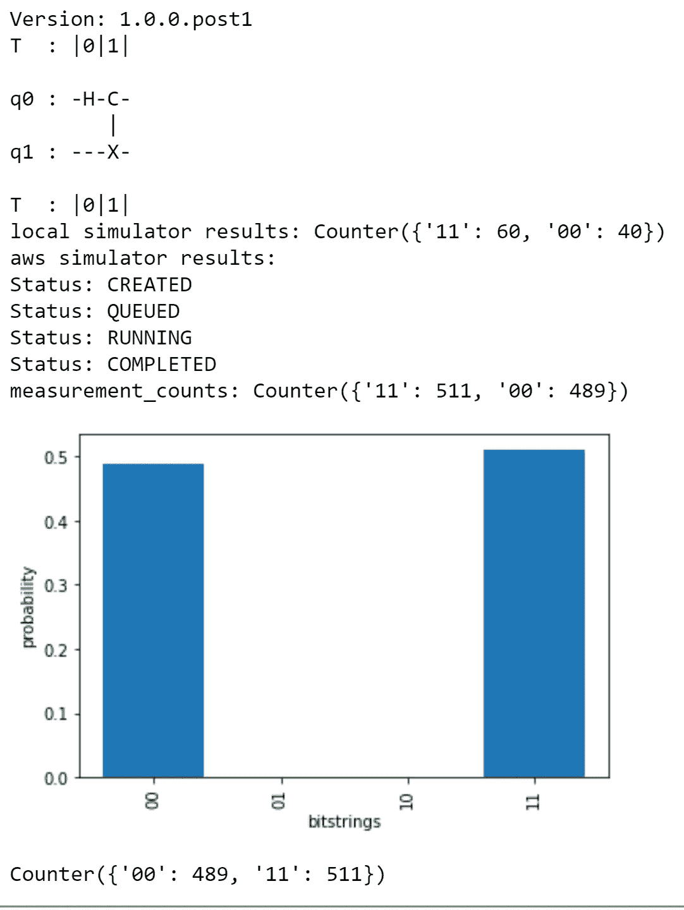
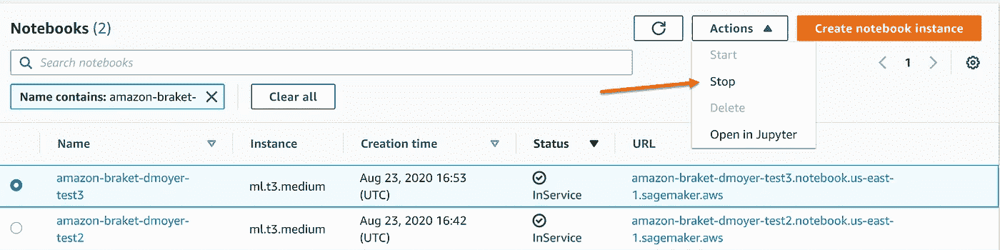

# 23 美分的量子计算。

> 原文：<https://towardsdatascience.com/quantum-computing-for-23-cents-917e1f664cea?source=collection_archive---------51----------------------->

## AWS 量子计算的简单而实惠的介绍现已推出。今天就开始吧。


迈克尔·泽兹奇在 [Unsplash](https://unsplash.com/s/photos/quantum?utm_source=unsplash&utm_medium=referral&utm_content=creditCopyText) 上的照片

2020 年 8 月 13 日， [AWS 宣布](https://aws.amazon.com/about-aws/whats-new/2020/08/quantum-computing-available-aws-through-amazon-braket/)亚马逊 Braket 全面上市。Braket 是他们完全托管的量子计算服务。它是按需提供的，很像 SageMaker。这意味着日常的开发人员和数据科学家可以四处修补和踢轮胎。

我想看看 Braket 控制台，看看这种体验有多直观。易用性和友好的用户界面对我来说至关重要。我是量子计算领域的新手，所以我有很多东西要学。可用的入门笔记本使学习基础知识变得容易。我应该说是最基本的。魔术背后的科学变得相当复杂，但是很有趣。

## 费用

我的第一个任务是检查[成本。当我玩一些 SageMaker 项目时，我的 AWS 预算警报提前响起。我不想要任何 100 美元的惊喜，我相信你也不想。从我收集的情况来看，费用在四个方面有所不同。这些笔记本电脑基于 SageMaker 的定价，并按此计费。实例越大，成本越高。AWS 模拟器每小时收费 4.50 美元。量子设备在它们自己的“发射”基础上运行。最后，您需要将输出发送到 S3，因此会收取象征性的存储费用。在这个过程中，我小心翼翼地检查我的账单。我知道我运行的是一个小样本，所以成本会很低——不到 1 美元。最后花了我 23 美分。](https://aws.amazon.com/braket/pricing/)

23 美分运行在这个[极客的眼睛糖果](https://www.engadget.com/2018-01-09-this-is-what-a-50-qubit-quantum-computer-looks-like.html)？还不错。

## 准备

以下所有信息都假设您已经设置了 AWS 帐户，包括账单。如果你是第一次设置你的账户，有一些[自由层选项](https://aws.amazon.com/free/?trk=ps_a134p000003yBfsAAE&trkCampaign=acq_paid_search_brand&sc_channel=ps&sc_campaign=acquisition_US&sc_publisher=google&sc_category=core&sc_country=US&sc_geo=NAMER&sc_outcome=acq&sc_detail=%2Baws%20%2Baccount&sc_content=Account_bmm&sc_segment=438195700988&sc_medium=ACQ-P|PS-GO|Brand|Desktop|SU|AWS|Core|US|EN|Text&s_kwcid=AL!4422!3!438195700988!b!!g!!%2Baws%20%2Baccount&ef_id=Cj0KCQjwp4j6BRCRARIsAGq4yMGFkcgdPrRLQB9KY30Sr6dUaK5v13V_29tTNcgbn7n3K7oOZhRDtmIaAqbTEALw_wcB:G:s&s_kwcid=AL!4422!3!438195700988!b!!g!!%2Baws%20%2Baccount&all-free-tier.sort-by=item.additionalFields.SortRank&all-free-tier.sort-order=asc)，虽然不是针对量子设备。

一旦你有一个帐户，你需要为你的输出命名一个 S3 桶。除此之外，你已经准备好了。

## 运行示例

有时候，直接进入代码是了解硬件如何工作的最好方式。在这个早期阶段，实践教程可能很难找到。我从 AWS 博客本身开始。它有一步一步的屏幕截图指南。

[https://AWS feed . com/whats-new/AWS/Amazon-braket-go-hands-on-with-quantum-computing](https://awsfeed.com/whats-new/aws/amazon-braket-go-hands-on-with-quantum-computing)

就运行示例笔记本而言，这非常简单。

我只打了一个小嗝；我忽略了更新 S3 桶变量。如果不使用您选择的 S3 时段更新该值，您将会得到以下错误:

```
“ValidationException: An error occurred (ValidationException) when calling the CreateQuantumTask operation: Caller doesn’t have access to amazon-braket-<##########> or it doesn’t exist.”
```

如果您想运行一个快速测试来确保您的所有配置都是正确的，下面是一个简单的单细胞脚本。基于超密集的例子，它涵盖了使用本地模拟器(随 SDK 一起提供)、AWS 模拟器和 one quantum 设备( [ionQ](https://ionq.com/) )，在我测试的时候在我所在的地区是可用的。

```
# !pip show amazon-braket-sdk | grep Version# Import Braket librariesfrom braket.circuits import Circuit, Gate, Momentsfrom braket.circuits.instruction import Instructionfrom braket.aws import AwsDeviceimport matplotlib.pyplot as pltimport boto3import timefrom braket.devices import LocalSimulator# Please enter the S3 bucket you created during onboarding in the code below,# or create a new bucket named as ‘amazon-braket-<your account number>’ to run the below code without changes.aws_account_id = boto3.client(“sts”).get_caller_identity()[“Account”]my_bucket = f”amazon-braket-{aws_account_id}” # the name of the bucketmy_prefix = “simulation-output” # the name of the folder in the buckets3_folder = (my_bucket, my_prefix)# Run local simulatordevice = LocalSimulator()bell = Circuit().h(0).cnot(0, 1)print(bell)print(‘local simulator results: ‘ + str(device.run(bell, shots=100).result().measurement_counts))# Run AWS simulatordevice = AwsDevice(“arn:aws:braket:::device/quantum-simulator/amazon/sv1”)bell = Circuit().h(0).cnot(0, 1)print(‘aws simulator results: ‘)get_result(device, bell, s3_folder)
```

我的输出:



作者图片

## Braket 示例笔记本

高级电路算法

*   格罗弗的量子算法
*   量子振幅放大(QAA)
*   量子傅立叶变换(QFT)
*   量子相位估计(QPE)

混合量子算法

*   量子近似优化算法
*   具有变分量子本征值解算器的横向伊辛模型(VQE)

量子退火

*   D 波量子退火剖析
*   d-波图划分—二次无约束二元优化(曲波)
*   d 波最大割问题(MaxCut)
*   d 波最小顶点覆盖问题

简单电路算法++从这里开始

*   量子电路剖析
*   后端设备— GHZ 状态准备
*   后端设备—响铃状态准备
*   超密集编码

## 全部的

我很高兴在笔记本实例中看到如此详细且有教育意义的笔记本。这些不是入门级的概念，但是很好地分解了工作流程。这是一个很好的平台介绍。上面，我列出了提供的例子的不同文件夹。我建议从简单的电路算法开始。这些说明会引导你完成电路的构建。电路可视化选项不如其他一些平台好，但我想这将随着时间的推移而改善。众所周知，AWS 将产品的核心推向市场，然后在后续版本中添加更友好的功能。价格合适，就试试吧。

## 一如既往—记得停止并删除您的笔记本实例。



作者图片