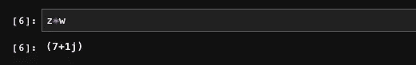

# Python 中的量子计算

> 原文：<https://towardsdatascience.com/quantum-computing-in-python-5e7e8efd0edf?source=collection_archive---------34----------------------->

## [奇点研究](https://towardsdatascience.com/tagged/the-singularity-research)

## 量子计算的线性代数

在这篇文章中，我将介绍理解量子计算所需的基本线性代数。在本文中，我们将只使用 NumPy，在文章的最后，您会得到一些交互式 Jupyter 笔记本的介绍，因此您不需要下载任何东西或学习终端来开始。你所需要的只是一个网络浏览器。如果你愿意，你可以下载笔记本并在本地运行。

由[沙哈达特拉赫曼](https://unsplash.com/@hishahadat?utm_source=medium&utm_medium=referral)在 [Unsplash](https://unsplash.com?utm_source=medium&utm_medium=referral) 上拍摄的照片

如果您想在 Jupyter 笔记本上本地运行这些命令，首先您需要下载 Anaconda 的最新(免费)发行版，可以从这里下载。下载 Anaconda 后，打开 Anaconda navigator。下载后，图标将出现在您的应用程序中:

Anaconda 导航图标

一旦你打开 Anaconda Navigator，你可以选择打开一个“Jupyter 笔记本”或者“Jupyter 实验室”。两者都可以，但我个人更喜欢 Jupyter Lab。

巨蟒领航员

如果你不想下载任何东西，你可以通过点击[这个链接](https://hub.mybinder.turing.ac.uk/user/jupyterlab-jupyterlab-demo-6xcyipg4/lab)在你的浏览器中尝试 Jupyter Lab。一旦你打开 Jupyter 实验室，点击小“+”按钮打开一个新的 Python 3 内核。可以在 Jupyter 图标旁边的“文件”和“编辑”下找到。

单击“+”按钮会出现以下窗口。单击橙色笔记本图标下的 Python 3 图标。

这将导致一个空白的单元格(如果你没有切换到“设置”下的“黑暗模式”，它可能是白色的，这是我的设置，并导致你在这里看到的光滑的黑色美学。

在此窗口的空白单元格中，键入以下命令按住“shift”键，然后按“enter”键运行单元格。这将加载允许我们做线性代数的 NumPy 库。

导入数字

## 创建复数和算术运算

在 Python 中使用 NumPy 创建复数非常容易。我们可以使用 NumPy 库创建两个复数𝑧=3+4𝑗和𝑤=1−1𝑗。这里，记住" *j"* 是虚数单位，在大多数数学课程中用" *i* 表示，复数通常写成"𝑎+𝑏𝑖"而不是" 𝑎+𝑏𝑗". "我们将从头到尾使用这两种符号，因此熟悉这两种符号并在两种符号之间流畅地转换是很重要的。

在 Python 中定义复数

我们可以把𝑧和𝑤:这两个复数相加

在 Python 中添加两个复数

我们也可以减去两个复数:

减去复数

python 中复数相乘的过程如下:

复数相乘

我们可以为𝑧=3+4𝑖:打印复数的实部和虚部，如下所示

打印实部和虚部

## 向量

向量将是我们研究量子计算的基础。量子计算机中最基本的计算单位是一个*量子位*，它可以表示为一个长度为 1 的二维复数向量。所以理解向量对于我们在这本书里将要做的大部分事情来说是基础和必要的。向量可以有多种理解方式，其中最基本的一种就是简单的数字数组，我们通常将它表示为一列数字，称为**列向量**，但在某些情况下，我们还需要**行向量**:

行和列向量

我们可以用 Python 创建一个列向量和一个行向量:

Python 中的行和列向量

这应该让你开始学习你需要的线性代数，但是你肯定需要更深入地了解这些在量子计算中是如何使用的。为了继续下去，我们有一个交互式笔记本，你可以在你的浏览器中访问它，你可以[点击这个链接](https://hub.gke.mybinder.org/user/the-singularity-antum_computing-faqjteej/notebooks/lecture_2_complex_numbers.ipynb)。对于整个线性代数系列的笔记本[请查看本页](https://the-singularity-research.github.io/linear_algebra_for_quantum_computing/)。

如果你对深入学习量子计算感兴趣，考虑支持这个项目或者为它做贡献！[奇点研究](https://github.com/sponsors/The-Singularity-Research)正在不断生产量子计算笔记本，将教科书和研究论文翻译成交互式笔记本，以学习和使用量子计算和量子机器学习。联系

thesingularity.research@gmail.com

并包含主题“*黑客宇宙*”如果你有问题，想投稿，或者对使用量子计算和量子机器学习有兴趣。