# 量子因子分解

> 原文：<https://towardsdatascience.com/quantum-factorization-b3f44be9d738?source=collection_archive---------30----------------------->

## 肖尔算法

图像通过 [Unsplash](https://images.unsplash.com/photo-1477244075012-5cc28286e465?ixlib=rb-1.2.1&ixid=eyJhcHBfaWQiOjEyMDd9&auto=format&fit=crop&w=334&q=80)

因式分解问题是每个人都能理解的问题之一，我们大多数人都觉得这是他们的机会:数学名人堂的神圣突破口:

**设 N，一个具有相对大的二进制表示(例如几百位)的奇整数和 p，q 个素数，使得:**

**1。** **p 和 q 的大小差不多(这并不重要，但显然你不能用一个容易实现的质数来构造 N)**

**2。** **N 已知**

3 **N =pq**

**在 log(n)的多项式时间内求 p & q。**

的确，极其容易理解。然而，不太容易实现。它是如此的“不容易”,以至于大量的加密产业依赖于利用这种特殊方式的传奇算法 RSA。

处理因式分解问题的主要算法有:

1.  GNFS(一般数域筛)的复杂度为:

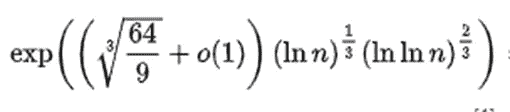

2.复杂性为的 QS(二次筛)

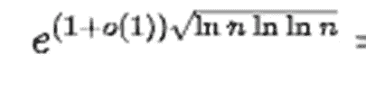

这个算法是否有多项式解的问题仍然没有答案。

然而，随着数论的发展，似乎可以找到因式分解的等价问题。这样的问题就是**“周期寻找”**

***期寻***

正如我们在“超越周期”一节中所描述的，寻找周期是因式分解的一个等价问题。

设 ***N*** 为超出部分(即可以写成两个素数***p***&***q****的乘积的奇数)。*

***定义:**设 **a，**整数 s . t . 0<**a**<**N**。 **a** 是**可逆**模 **N** (即存在 0<b<N 和 K 个整数 s . t**a*** b = K**N**+1*

***主张:** **a** 是可逆 mod**N**<>GCD(**a**， **N** ) =1*

***符号:**我们用 b( **N** )来表示 b 模 **N***

*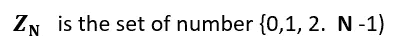*

***费马小定理**暗示着*

*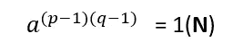*

*这暗示我们，这样的指数可能有周期。*

***定义:**一个函数 **f** 有一个**周期** **r** 如果:*

***r** 是一个整数*

*对于所有 x**f**(x+**r**)=**f**(x)*

*没有整数**m**<**r**s . t**f**(x+**m**)=**f**(x)*

*设 **a** 一个可逆数 mod **N***

*我们定义一个函数 **F***

*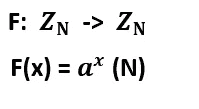*

*假设 **F** 有一个周期 **r** ，很容易看出 **F** ( **r** ) =1，那么*

*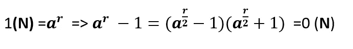**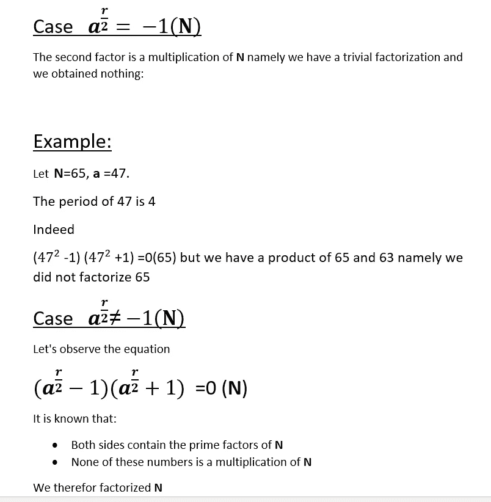**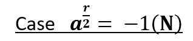*

*第二个因子是 **N** 的乘法，即我们有一个平凡的因子分解。*

## ***示例***

*设 **N** =65， **a** =47。这个环中 47 的周期是 4。我们观察得到的等式:*

*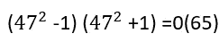*

*可以看出，第二项是 65 的倍数。因此，因子分解还没有实现*

*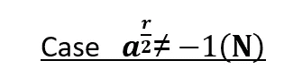*

*让我们重新观察一下这个公式。我们可以看到:*

*1 没有一项是 ***N*** 的乘法*

*2***N***的每个质因数都存在于左手边。*

*我们可以得出这样的结论:*

*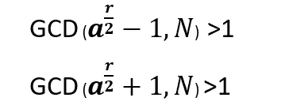*

*因此，当我们有一个周期时，我们可以因式分解 N*

*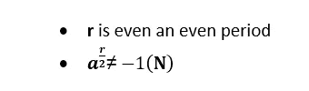*

## *例子*

*设 **N** =15 **，a** =7。7 (15)的周期是 4。*

*因此我们有*

*GCD(49–1，15) = 3 **GCD** (49+1，15) = 5*

*3，5 是 15 的质因数，所以我们得到了所需的*

*我们可以把这个过程总结如下:*

*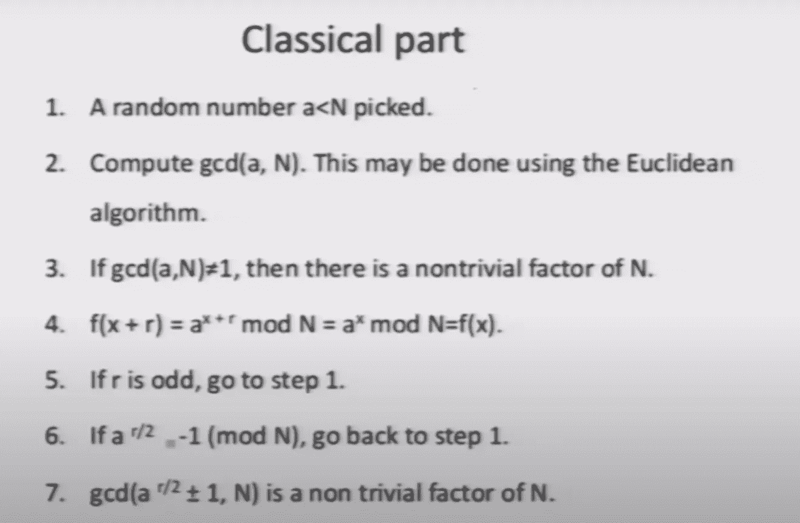*

*酷！我们可以分解…一件小事:*

***怎么才能找到周期！！？！***

# *量子部分*

*对于不熟悉量子计算的读者，我在下面添加了教程。我将简要描述基本对象，如量子位和量子门，但我建议你在更广泛的框架中学习它们。基本上，量子计算机出现在 80 年代初，当时传奇物理学家理查德·费曼“挑战”计算机科学家开发一种基于量子物理的计算机。主要动机是理解模拟量子系统是不可能的:过程总是粒子数量的指数。费曼还担心量子计算是否至少和经典计算一样普及。当工程师了解到晶片微型化开始遭受量子效应时，另一个动机出现了。在过去的几十年中，量子计算经常与 NP 问题以及量子计算是否使它们易于处理联系在一起。*

## ***基本量子实体***

***量子位**——量子计算的基本单位。与经典比特相反，量子比特的一般结构具有以下形式*

*q= a|0> +b|1 >*

*量子位被认为处于*叠加态*。a 和 b 是复数，它们的幅度之和是 1。*

*|0 >，|1 >是我们测量的基中的向量*

***张量积***

*由两个较小向量空间 X，Y 组成的向量空间表示为*

*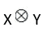*

*这个空间上的算子是每个子空间上的双线性算子。就矩阵而言，张量积具有以下形式:*

*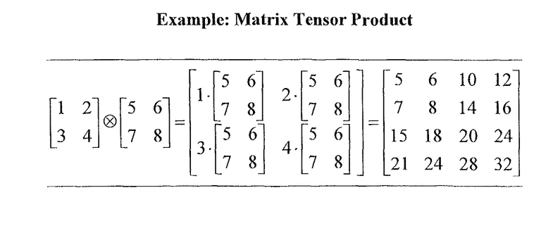*

***量子门***

*对一个或一组量子位进行操作的逻辑门。在量子计算的世界里，这些门是用酉矩阵实现的*

## ***普通门***

*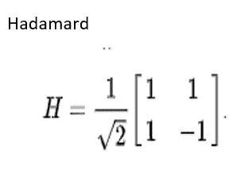**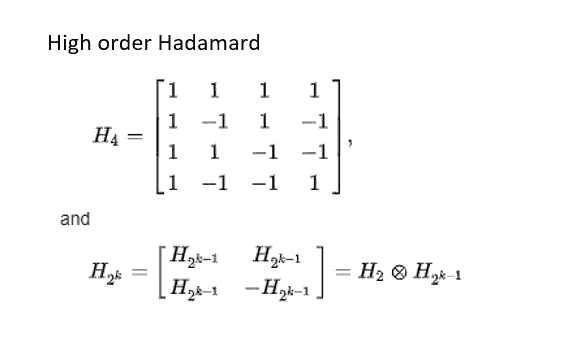**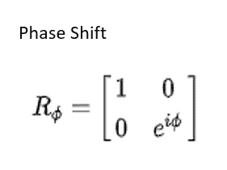**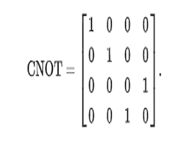**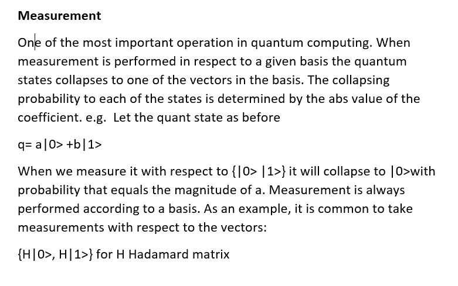*

# ***量子傅立叶变换***

*量子傅立叶变换是众所周知的 FFT 的量子模拟。在量子态 x 上，QFT 定义如下:*

*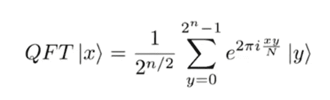*

*其中 ***N*** 是*2 的幂(log( ***N*** )=n) n 因此是量子位的个数。很容易看出，QFT 是一个酉算子:**

**|QFT|x>| =|x|**

**<x>=0 => <qft>，QFT|y> = 0</qft></x>**

**我们可以把 QFT 观察成一个维数为***N***x***N***(一个巨型的)的矩阵，它的(x，y)项是超过 ***的系数。当 Shor 发表他的算法时，他的成就之一集中在改进比特串输入的 QFT。*****

## **二进制字符串的 QFT**

**“传统上”FFT 将复数转换为复数，但这里我们考虑输入 x s.t. x 是一个整数，x<***N***因此它具有唯一的二进制表示，在 1994 年 Coppersimth 的一篇论文中使用了 N 位，他已经表明我们可以将 QFT 分解为 N 个量子位上的张量积[CopperSmith]。如果我们用 **D、**定义大矩阵，我们可以重写变换:**

**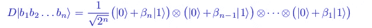**

**其中 b 是量子位**

**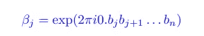**

**显然，我必须在这里展示整个严谨的开发过程，但我希望读者能留下来。这种表示的主要好处是，我们可以使用 n(n-1)/2 哈达玛和相移运算来写 QFT，即多项式次数的运算:**

**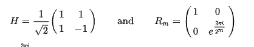****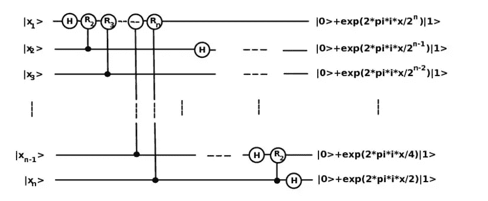**

**在 Shor 的术语中，他使用了以下符号:**

**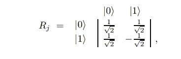****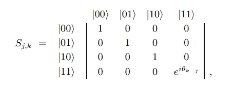**

**对于**

**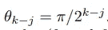**

**该算法变成:**

**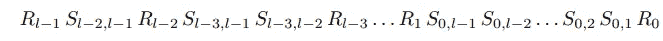**

**因此，我们有动力开发一种用于**周期查找**的算法，以及将 QFT 用于该算法的好处(自然，每个工程师都知道 FFT 用于查找频率，因此这是一个自然的步骤)。现在让我们来组合这个包。**

# **肖尔算法**

**你可能会猜测 Shor 算法的目的是找到我们在第一节中讨论过的周期 **r** 。可以观察到:**

**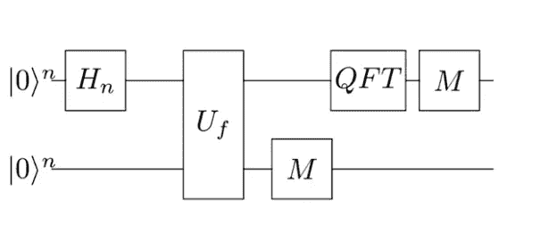**

**其中 Hn 是 n 阶哈达玛矩阵。设 ***N*** 我们要因式分解的数。我们选择 q 使得:**

**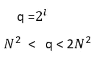**

**即 q 是 2 的幂，这是 QFT 矩阵的阶，l 是量子比特的数量**

**我们也将定义一个函数 **f** 如下 **:****

**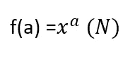**

**回想一下， ***N*** 是要因式分解的数字，而***x****I*s 是我们要搜索其周期的数字。我们需要两个寄存器第一个包含 ***l*** 量子位，第二个需要足够的空间来获得整个似是而非的结果 mod ***N*** *(即超过 log(****N****))我们用**表示它因此寄存器具有以下形式***

***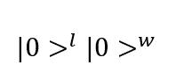***

***在某些地方，右寄存器的概念是“**输出寄存器** r”***

***为了使量子位叠加，我们执行 l 阶哈达玛矩阵***

***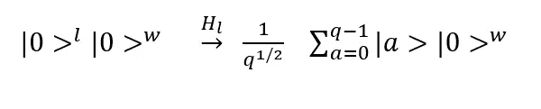***

***下一步只是计算第二个寄存器的函数 ***f******

**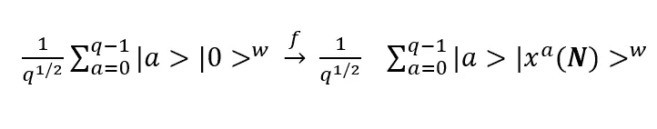**

**请注意，现在寄存器是纠缠在一起的(很明显，每个 a 都映射到它自己的函数值)**

**在肖尔的原始论文中表现了 QFT 这一阶段。然而，在后来的版本中，通常的方法是在第二寄存器上执行测量。右(输出)寄存器随后被压缩为单个值，并且在第一个寄存器中只留下 ***f*** 将其映射到该值的状态，我们用 **A** 表示这些状态的数量。我们用 ***m*** 来表示这些值，其中 ***m*** 是整数，m < ***N .*** 系统现在具有以下形式:**

**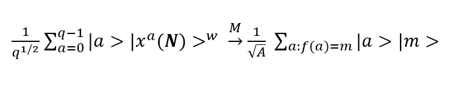**

**假设 x0 是 a 态这样的***f***(x0)=***m******r***是 x0 的周期我们可以把我们的量子态写成:**

**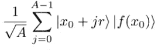**

**在哪里**

**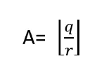**

**显然 x0 < ***r*** (否则 r 不是句号)**

**我们现在对第一个寄存器执行顺序为 ***q*** 的 QFT。**

**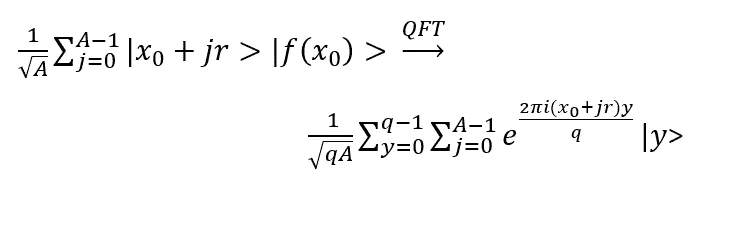**

**下一步将是测量这个量子态中的一个状态。我们希望验证我们有很高的概率得到一个结果，将导致一个正确的时期。因此，我们需要展示概率分析。**

**作为第一步，我们可以看到，我们可以重写当前的量子态为**

**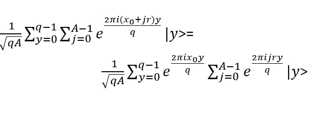**

**我们希望估计某个状态的概率 **|y >****

**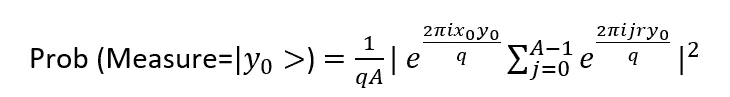**

**我们有:**

**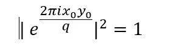**

**那留给我们**

**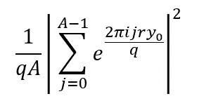**

**我们对满足的 y 感兴趣**

**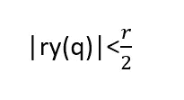**

**(在一些书中它们被称为“好 y”)我们可以看到，概率项实际上是一个几何数列。因此，我们可以做到以下几点:**

**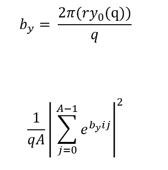**

**该序列的总和由下式给出:**

**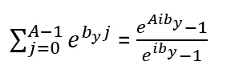**

**余弦定律意味着**

**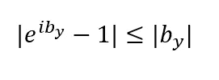**

**对于提名者，我们有:**

**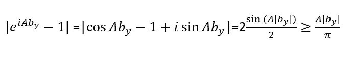**

**因此，我们估计的概率是**

**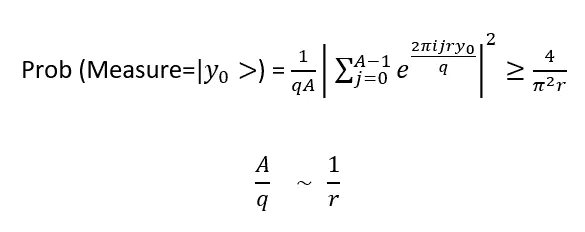**

**既然我们有关于***r***y’***s***(| ry(q)|<0.5r)***，*** 的概率是**

**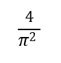**

**大约是 0.4。**

## **为什么我们关心这样的 y？**

********

**索赔？！现在吗？让我们做一些代数**

****

**我们有**

****

**由于 y 和 ***q*** 已知，我们可以从权利要求中推断出，在 y/q 附近只有一个分数具有如此小的分母(在比 1/(2q)更低的距离上小于 ***N*** )。**

**我们现在必须提供一种有效的方法来找到这样一个分母(即 **r)****

## **连分式展开式**

**连分数展开是一种通过分数计算使用一系列整数来表示一个数的方法。如果 x 是要近似的数字，一般形式将是:**

****

**其中 **a 的**是整数。注意，当最后一个分数有一个指定者 **1** 时，过程总是终止**

**一个很好的结果表明有理数有一个有限的展开，而无理数有一个无限的展开。**

## **例子**

**我们希望得到分数 **867/42** 的近似值**

**结果是这样的**

****

**分数 **79/14** 有膨胀**

****

**有时我们对一个分数的第 n 次收敛感兴趣，也就是只进行第一步。例如，在我们的示例中，我们将取 **j=4** ，因此我们将取向量[5，1，1，1]并重构一个接近原始分数的有理数。**

**我们如何利用它？**

**所以我们有了分数 **y/q** ，我们希望找到一个分数，它既:**

**近似 **y/q** (距离小于 **1/(2q)** )**

**有一个分母小于*N。因此，只要分母小于 ***N*** ，我们将展开一个不同阶的连分式展开式***

****

# **文献学**

**https://arxiv.org/pdf/quant-ph/0201067.pdf【铜匠】**

**[https://en . Wikipedia . org/wiki/File:Quantum _ circuit _ for _ Quantum-Fourier-Transform _ with _ n _ qubits](https://en.wikipedia.org/wiki/File:Quantum_circuit_for_Quantum-Fourier-Transform_with_n_qubits)**

**https://arxiv.org/pdf/quant-ph/9508027.pdf[T3【肖尔】](https://arxiv.org/pdf/quant-ph/9508027.pdf)**

**【https://www.quantiki.org/wiki/shors-factoring-algorithm **

**[https://gadial.net/2014/08/24/shor_algorithm/](https://gadial.net/2014/08/24/shor_algorithm/)**

**[https://www.youtube.com/watch?v=_zTY_Rhb2Js](https://www.youtube.com/watch?v=_zTY_Rhb2Js)**

**[https://cosmos magazine . com/physics/quantum-computing-for-the-qubit-curious/](https://cosmosmagazine.com/physics/quantum-computing-for-the-qubit-curious/)**

**[http://mmrc . amss . cas . cn/TLB/201702/w 020170224608149125645 . pdf](http://mmrc.amss.cas.cn/tlb/201702/W020170224608149125645.pdf)**

**[https://academic.oup.com/nsr/article/5/4/598/4987212](https://academic.oup.com/nsr/article/5/4/598/4987212)**

**[http://www.math.umd.edu/~lcw/three68.pdf](http://www.math.umd.edu/~lcw/three68.pdf)**

**[https://leftasexercise . com/2018/11/26/shors-quantum-factoring-algorithm/](https://leftasexercise.com/2018/11/26/shors-quantum-factoring-algorithm/)**

**[http://www . maths . surrey . AC . uk/hosted-sites/R .克诺特/斐波那契/cfCALC.html](http://www.maths.surrey.ac.uk/hosted-sites/R.Knott/Fibonacci/cfCALC.html)**

**[https://interest ing engineering . com/how-Peter-shors-algorithm-dooms-RSA-encryption-to-failure](https://interestingengineering.com/how-peter-shors-algorithm-dooms-rsa-encryption-to-failure)**

**[https://interesting engineering . com/how-Peter-shors-algorithm-dooms-RSA-encryption-to-failure](https://interestingengineering.com/how-peter-shors-algorithm-dooms-rsa-encryption-to-failure)[图片]**

**[https://images . unsplash . com/photo-1477244075012-5cc 28286 e465？IX lib = r b-1 . 2 . 1&ixid = eyjhchbfawqiojeymdd 9&auto = format&fit = crop&w = 334&q = 80](https://images.unsplash.com/photo-1477244075012-5cc28286e465?ixlib=rb-1.2.1&ixid=eyJhcHBfaWQiOjEyMDd9&auto=format&fit=crop&w=334&q=80)**

## ****连分数展开****

**【https://www.youtube.com/watch?v=R5HhNmFPLPQ **

**[https://en.wikipedia.org/wiki/Continued_fraction](https://en.wikipedia.org/wiki/Continued_fraction)**

**[https://www.math.u-bordeaux.fr/~pjaming/M1/exposes/MA2.pdf](https://www.math.u-bordeaux.fr/~pjaming/M1/exposes/MA2.pdf)**

**[https://planetcalc.com/8456/](https://planetcalc.com/8456/)**

## **量子计算教程**

**[https://www . coursera . org/learn/quantum-computing-algorithms/home/welcome](https://www.coursera.org/learn/quantum-computing-algorithms/home/welcome)**

**[https://courses . EDX . org/courses/course-v1:MITx+8 . 370 . 1 x+1t 2018/course/](https://courses.edx.org/courses/course-v1:MITx+8.370.1x+1T2018/course/)**

**[https://medium.com/qiskit/hello-quantum-2c1c00fe830c](https://medium.com/qiskit/hello-quantum-2c1c00fe830c)**

**[https://python programming . net/quantum-computer-programming-tutorial/](https://pythonprogramming.net/quantum-computer-programming-tutorial/)**

**[https://www-users.cs.york.ac.uk/schmuel/comp/comp.html](https://www-users.cs.york.ac.uk/schmuel/comp/comp.html)**

## **Python 包**

**[https://github.com/Qiskit](https://github.com/Qiskit)**