# 一维量子引力

> 原文：<https://towardsdatascience.com/quantum-gravity-in-one-dimension-456dc83c59f9?source=collection_archive---------24----------------------->

## 为什么 1D 的量子引力描述了 4D 时空的粒子

图片由[皮克斯拜](https://pixabay.com/fr/?utm_source=link-attribution&utm_medium=referral&utm_campaign=image&utm_content=681196)的 Gerd Altmann 提供

[量子引力](https://en.wikipedia.org/wiki/Quantum_gravity)可以说是理论物理的圣杯。虽然一个彻底发展的量子引力理论仍然超出了我们的理解范围，物理学家相信它可能包含一些基本的成分。在这篇文章中，我将展示一维量子引力理论也描述了四维时空中的粒子。

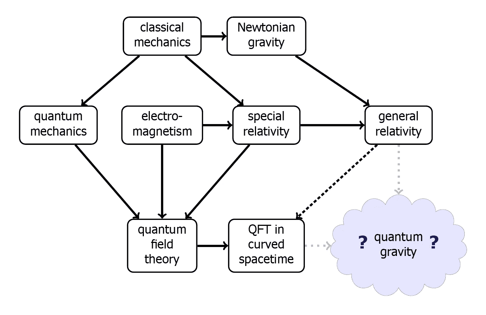

图 1:这个图显示了量子引力在物理理论层次中的位置([来源](https://en.wikipedia.org/wiki/Quantum_gravity))。

[其中一个要素](https://www.sns.ias.edu/sites/default/files/2015_Phys_Today.pdf)是[费曼历史总和形式主义](https://en.wikipedia.org/wiki/Path_integral_formulation)。后者将跃迁振幅(或传播子)表示为系统从某个初态到某个终态的所有可能时空路径的加权和。在量子引力的背景下，路径积分的平均值不是在时空的路径上，而是在时空的几何上(然而，正如 [Witten](http://www.sns.ias.edu/sites/default/files/2015_Phys_Today.pdf) 所指出的，这种描述在微观层面可能是无效的)。

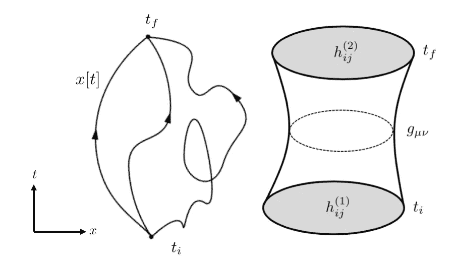

图 2:左边显示了量子力学历史总和方法的路径。([来源](https://en.wikipedia.org/wiki/Path_integral_formulation))。右边是量子引力中相应的和，其中时空 **g** 是类似于路径 x[t]。时空 **g** 连接两个三维空间 **h** (基于[源](https://www.researchgate.net/publication/258710346_Quantum_gravity_on_a_laptop_11_Dimensional_Causal_Dynamical_Triangulation_simulation/figures?lo=1))。

你可以看我的上一篇文章，了解关于量子力学历史求和方法的更多细节。

 [## 量子引力、永恒和复数

### 宇宙的波动方程是永恒真实的吗？

towardsdatascience.com](/quantum-gravity-timelessness-and-complex-numbers-855b403e0c2f) 

要建立一维量子引力和四维时空的量子场论(QFT)之间的对应关系，我们首先需要了解这两个成分中的每一个。让我们从后者开始。这里遵循的方法论通常被称为 QFT 的*世界观*(参见[斯金纳](https://dec41.user.srcf.net/h/III_L/advanced_quantum_field_theory/)讲座)。

# 标量场理论和克莱因-戈登方程

[量子场](https://en.wikipedia.org/wiki/Quantum_field_theory)是电磁场、爱因斯坦引力场等经典场在量子框架下的延伸。

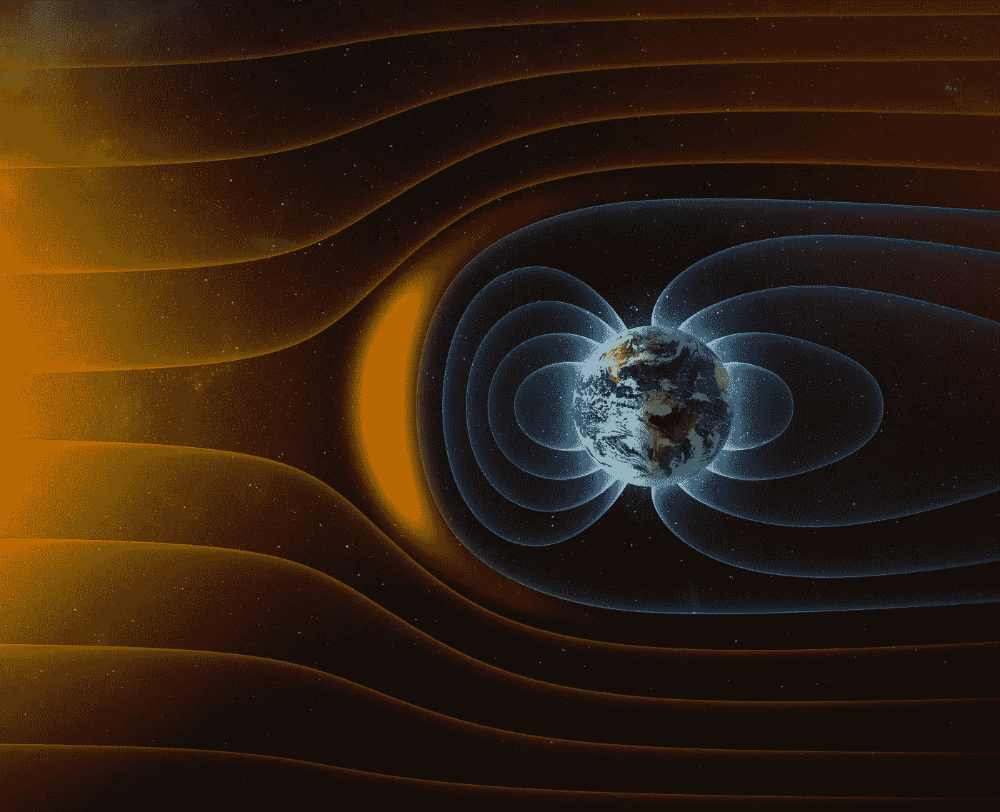

图 3:这张图片说明了行星地球的磁场对抗太阳太阳风的情况(by[koya 979](https://www.shutterstock.com/g/koya979)/shutterstock . com)。

在 [Zee](https://books.google.com.br/books?id=n8Mmbjtco78C&printsec=frontcover&dq=anthony+zee+qft&hl=en&sa=X&ved=0ahUKEwjEnY3brbLnAhUJH7kGHUr7AUoQ6AEIKTAA#v=onepage&q=anthony%20zee%20qft&f=false) 中，作者将量子场论定义如下:

> "量子场论是对生命短暂本质的回应."
> 
> —阿·齐

这个定义来自于下面的观察:结合狭义相对论和量子力学，暗示了粒子“[可以生与死](https://books.google.com.br/books?id=n8Mmbjtco78C&printsec=frontcover&dq=anthony+zee+qft&hl=en&sa=X&ved=0ahUKEwjEnY3brbLnAhUJH7kGHUr7AUoQ6AEIKTAA#v=onepage&q=anthony%20zee%20qft&f=false)”。

让我们明白为什么。能量-时间不确定性原理[指出](https://phys.libretexts.org/Bookshelves/University_Physics/Book%3A_University_Physics_(OpenStax)/Map%3A_University_Physics_III_-_Optics_and_Modern_Physics_(OpenStax)/07%3A_Quantum_Mechanics/7.03%3A_The_Heisenberg_Uncertainty_Principle)人们无法确定只存在短暂时间的量子态的能量。在数学上，这可以表示为:

等式 1:时间-能量不确定关系。

事实上，真空能量剧烈波动，如下图所示，允许创造成对的(粒子-反粒子)[虚粒子](https://en.wikipedia.org/wiki/Virtual_particle)。

图 4:根据能量-时间不确定性原理，真空波动是一个空间区域中能量数量的短暂而强烈的变化。([来源](https://en.wikipedia.org/wiki/Quantum_fluctuation))

作为狭义相对论的一个结果，这导致了能量转化为质量的可能:新的粒子可以“诞生”，现有的粒子可以“消失”。问题是标准的量子力学框架无法解释这一现象，因此需要修改。这个量子力学的修正版就是 QFT。

此外，QFT 使我们能够解释，除了其他事情之外，为什么在宇宙中有基本粒子的不可区分的副本:粒子仅仅是量子场的激发。

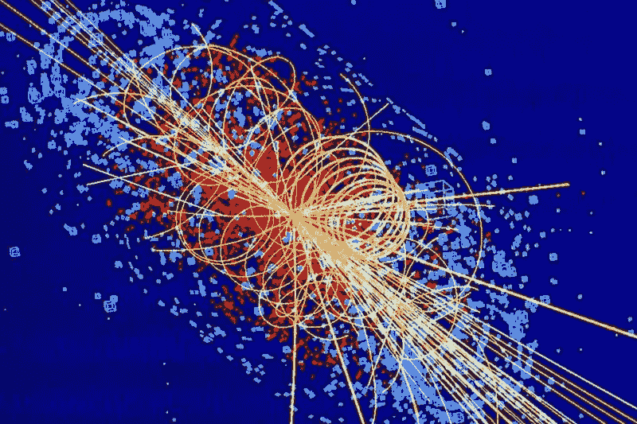

图 5:图片显示了一个粒子碰撞的模拟，产生了一个希格斯玻色子。后者是 QFT 的著名预言([来源](https://phys.org/news/2013-07-higgs-boson-year.html))。

## 热身:简单的古典弦乐

量子场相当抽象。在这个主题的几个处理之后，为了给读者一些直觉，我将使用一串相互耦合的质量为 *m* 的 *N* 谐振子的类比。仅考虑垂直 *qᵢ* ( *t* )位移。

的相应操作是:

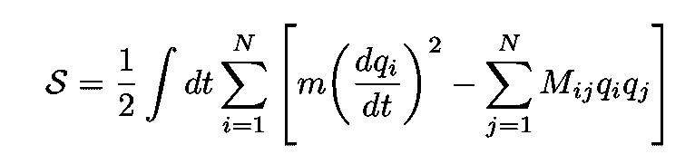

等式 2:N 个谐振子的经典作用，其中 M 是对称且[正定的](https://en.wikipedia.org/wiki/Definiteness_of_a_matrix)矩阵。

其中矩阵 *M* 对称且[正定](https://en.wikipedia.org/wiki/Definiteness_of_a_matrix):

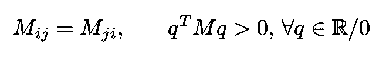

等式 3:矩阵既对称 M 又正定。

对角化 *M* 我们得到正常模式的动作:

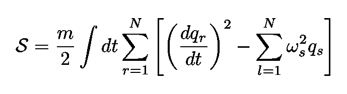

等式 4:正常模式的动作。

*ω* s 是质量振荡的固有频率。

下一步是获得连续标量经典场 *ϕ* ( ***x*** ， *t* )的作用。[标量场](https://en.wikipedia.org/wiki/Scalar_field_theory)QFT 最简单的场类型。解读*ϕ*(***x***， *t* )的一个有用的方法是，把它看成是每个点上的一组无限的振子 ***x*** (参见[穆哈诺夫和 Winitzki](https://books.google.com.br/books?id=vmwHoxf2958C&printsec=frontcover&dq=mukhanov+winitzki&hl=en&sa=X&ved=0ahUKEwiTiLb42bHnAhU4ILkGHWUFCDQQ6AEIKTAA#v=onepage&q=mukhanov%20winitzki&f=false) )。注意，当我们取连续极限时，振荡器的指数 *i* 变成空间坐标 ***x*** 。连续体极限中的作用变为:

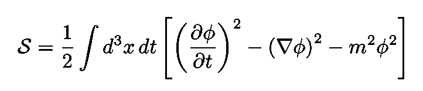

方程式 5:自由大质量标量场的作用。

根据量子力学的[路径积分公式](https://en.wikipedia.org/wiki/Path_integral_formulation#Quantum_field_theory)，系统在两个状态 I 和 F 之间跃迁的概率为

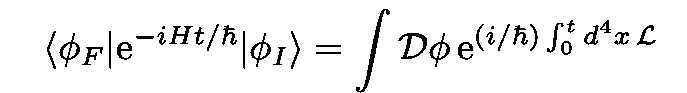

方程 6:量子力学路径积分公式中的跃迁振幅。

在这种情况下，拉格朗日密度由下式给出:

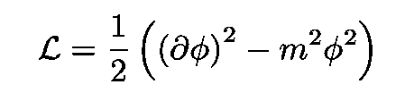

方程式 7:大质量标量场的拉格朗日密度。

其中:

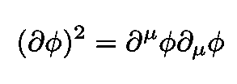

[生成泛函或配分函数](https://en.wikipedia.org/wiki/Partition_function_(quantum_field_theory))，等式的一个特例。6 量子场论中的一个关键对象，是从[真空态](https://en.wikipedia.org/wiki/Vacuum_state)回到自身的跃迁振幅，它由下式给出:

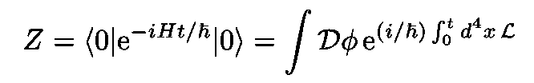

方程式 8:生成泛函或配分函数，量子场论中的一个关键对象。

真空状态在上面的图 4 中示出。

**抛开关于量子化方案的** 在本文中，我将遵循量子化的路径积分方法(而不是[规范的](https://en.wikipedia.org/wiki/Canonical_quantization)一)。正如我们刚才看到的，这种方法是基于拉格朗日，它是相对论不变的，使得路径积分也明显不变。此外，积分内的对象[是*经典*量(这是非常方便的，因为在这个公式中没有令人讨厌的非交换算子，例如)。](https://www.physicsforums.com/threads/canonical-vs-path-integral-quantization.408836/)

我们注意到，与[规范量子化](https://en.wikipedia.org/wiki/Canonical_quantization)相比，该方法涉及到视角的转变。系统的哈密顿动力学由等式定义。6(参见[销套](https://books.google.com.br/books?id=EVeNNcslvX0C&dq=peskin+QFT&hl=en&sa=X&ved=0ahUKEwj01O72tLDnAhU2GrkGHcmVCRkQ6AEIKTAA))。因此拉格朗日量成为量子场论的“最基本规范”(见 [Peskin](https://books.google.com.br/books?id=EVeNNcslvX0C&dq=peskin+QFT&hl=en&sa=X&ved=0ahUKEwj01O72tLDnAhU2GrkGHcmVCRkQ6AEIKTAA) )。

让我们回到 Eq。4 对于真正的[标量场理论](https://en.wikipedia.org/wiki/Scalar_field_theory)。对[动作](https://en.wikipedia.org/wiki/Action_(physics))应用[最速下降法](https://en.wikipedia.org/wiki/Method_of_steepest_descent)近似得到[欧拉-拉格朗日运动方程](https://en.wikipedia.org/wiki/Euler%E2%80%93Lagrange_equation):

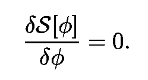

等式 9:求动作的极值。

图 6:展示最速下降法的动画([来源](https://blog.paperspace.com/intro-to-optimization-in-deep-learning-gradient-descent/))。

结果就是无处不在的克莱因-戈登方程:

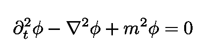

方程 10:大质量标量场服从的克莱因-戈登方程。

## 跃迁振幅的显式计算

重写拉格朗日显式我们得到，方程。8:

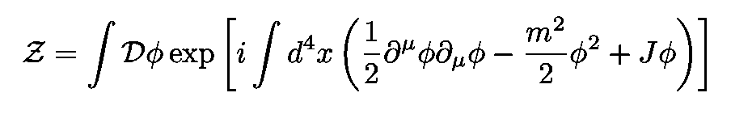

方程 11:方程 8 中的生成泛函或配分函数，明确地写出拉格朗日密度。

其中包括外部电势或源电流 *J* 。包含 *J* 的项是与标量场 *ϕ* ( *x* )和源电流 *J* ( *x* )相互作用相关的势能项。

这个积分只是平凡的[高斯积分](https://en.wikipedia.org/wiki/Gaussian_integral)的复杂版本:

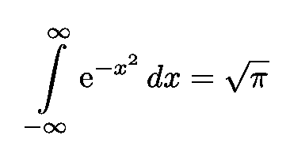

并且可以使用高斯积分的标准程序来评估。我们获得:

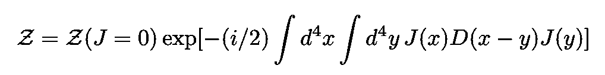

等式 12:在ϕ.上积分后生成泛函的表达式

函数 *D* ( *x* )是[自由传播子](https://en.wikipedia.org/wiki/Propagator#Relativistic_propagators)，它是以下微分方程的解:

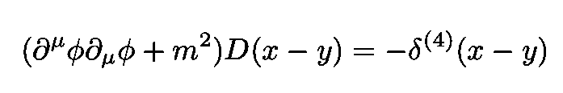

方程式 13:自由传播子遵守的方程式。

来自 Eq。13、我们可以计算动量为 *p、*的粒子在动量空间中的费曼传播子，其中是对象乘以被积函数中的指数，对于*D*(*x*-*y*)如下:

方程 14:自由传播子写成动量空间传播子的傅立叶变换。

其中 *ε* 是一个小的正数。据我们所知，一个无声的假设是我们正在洛伦兹签名中工作。给定时空的签名是对角化后度量张量的矩阵表示上的正值和负值的个数。对于一个 *n* 维洛伦兹流形，

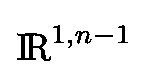

等式 15:n 维洛伦兹流形。

签名是(-、+、+、+、…、+)其中有一个 0 和 *n 个* - *1 个*个(在我们的讨论中， *n 个* = *4 个*)。

相反，如果我们在[欧几里得签名](https://en.wikipedia.org/wiki/Metric_signature) (+，+，…，+)中工作，正如我们在本文的其余部分中经常会做的那样，我们在质量项变为正之前会丢失 *ε* 和符号。传播方然后读取:

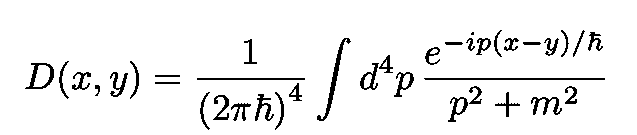

方程 16:作为欧几里德动量空间传播子的傅立叶变换的自由传播子的欧几里德版本。

现在让我们深入讨论第二个要素(见引言的最后一段)，即一维时空中的量子引力。

# 一维量子引力

我们现在的目标是建立一个量子场论或一维 QFT，在那里场与引力相互作用**。**正如[斯金纳](http://www.damtp.cam.ac.uk/user/dbs26/AQFT/chaps1+2.pdf)所说，要建设我们的 QFT，我们需要两个基本要素:

*   理论“生存”的时空(“T6”)我们的宇宙(“T7”)
*   将被研究的对象，即在这种情况下的场。这些可以有几种类型，但是这里我只考虑标量字段[。](https://en.wikipedia.org/wiki/Scalar_field_theory)

## 一维紧致流形

一维上只有两种可能的[紧致流形](https://en.wikipedia.org/wiki/Compact_space)(闭有界流形)，即圆 S 和区间 *I* :

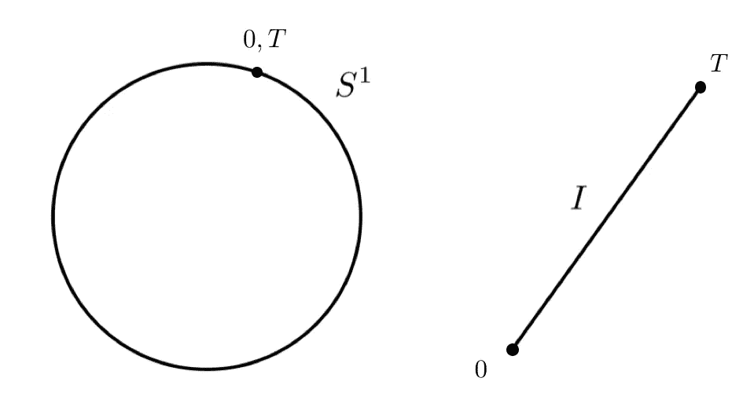

图 7:一维中仅有的两种可能的紧致流形。圆圈上的点表示点 0 和 t 之间的标识。

我们可以用一个实数来标注这两个流形的点:区间 *I* 和圆 *S* 可以用*T*∈【0，T】来参数化。不同的是，在 *S* 中，我们识别出 *t* 和 *t +T* (参见[斯金纳](http://www.damtp.cam.ac.uk/user/dbs26/AQFT/chap3.pdf))。每个流形都有其关联的度量 ***g*** ，在一维中，它是一个 *1* x *1* 张量。我们将度量和逆度量分别表示为:

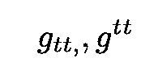

等式 17:1D 流形的 1x1 度量(下指数)和 1x1 逆度量(上指数)。

## 数学插曲

本节将简要介绍*回拉*的概念，以备将来使用。

**回调** 微分几何中一个有用的概念是[回调](https://en.wikipedia.org/wiki/Pullback_(differential_geometry))(更多细节见[贝兹和穆尼阿因](https://books.google.com.br/books?id=qvw7DQAAQBAJ&printsec=frontcover&dq=john+baez+muniain&hl=en&sa=X&ved=0ahUKEwiU2OyYmb3kAhXfGLkGHa65D1AQ6AEIKjAA#v=onepage&q=john%20baez%20muniain&f=false)和[卡罗尔](https://books.google.com.br/books?id=qvw7DQAAQBAJ&printsec=frontcover&dq=john+baez+muniain&hl=en&sa=X&ved=0ahUKEwiU2OyYmb3kAhXfGLkGHa65D1AQ6AEIKjAA#v=onepage&q=john%20baez%20muniain&f=false))。考虑两个流形 *M* 和 *N，*图 *ϕ* ， *f，*以及它们的组成，都在下图中说明。

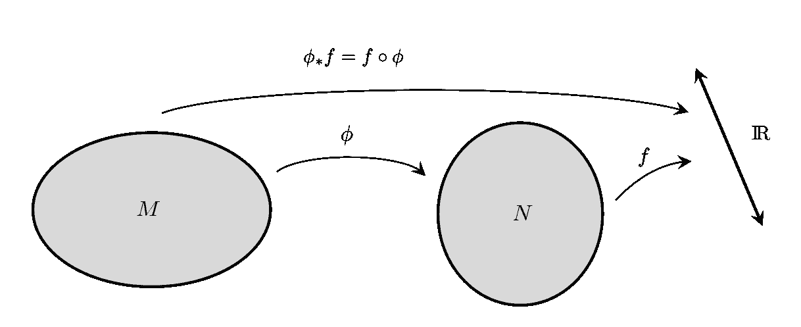

图 8:回调(基于[卡罗尔](https://books.google.com.br/books?id=qvw7DQAAQBAJ&printsec=frontcover&dq=john+baez+muniain&hl=en&sa=X&ved=0ahUKEwiU2OyYmb3kAhXfGLkGHa65D1AQ6AEIKjAA#v=onepage&q=john%20baez%20muniain&f=false))。

从图中我们看到

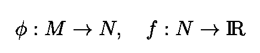

函数 *ϕ* 将函数 *f* 从 *N* 拉回 *M* 由以下复合函数定义:

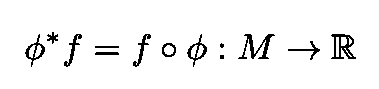

等式 18:函数 *ϕ.对函数 *f* 的拉回*

图 7 显示了地图 *ϕ.将 *f* 从 *N* 拉回 *M* 的过程*

## 引入标量字段

现在让我们用( *M* ， **g** )来表示上面两个一维流形中的一个，即区间 *I，*并让它成为场“存在”的时空。我们还介绍了另一种尺寸为 *n* 的歧管( *N* 、**G)。后者称为[目标空间](https://ncatlab.org/nlab/show/target+space)，是要研究的****物体的空间，即标量场(参见[斯金纳](http://www.damtp.cam.ac.uk/user/dbs26/AQFT/chaps1+2.pdf))。******

****现在考虑这两个流形之间的映射****

****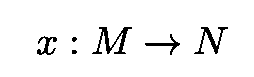****

****让我们在 *N* 上引入坐标并选择一个开放的[面片](http://mathworld.wolfram.com/Patch.html)u⊂*n*带有 *n* 局部坐标****

****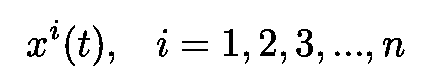****

****其中对于每个 *t* ∈ *M* 都有一个**×t17*t*)在 *U.* 上面的 *n* 对象*×*中的每一个都是一个[标量字段](https://en.wikipedia.org/wiki/Scalar_field_theory)(虽然这类字段的标准表示法是 *ϕʲ，*这样选择会更方便)。******

****下图使这些定义更加清晰:****

****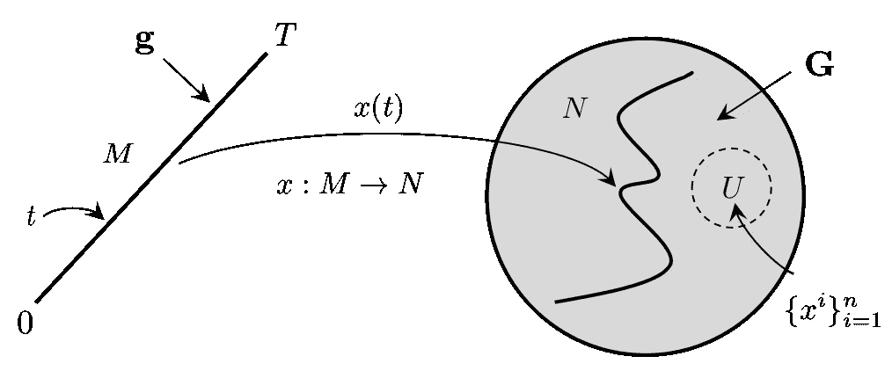****

****图 9:从度量为 **g** 的流形 M(两个可能的 1D 流形之一)到目标空间 N 的映射，目标空间 N 是一个 N 维流形。对 U 中的每个点，我们关联一个[标量场](https://en.wikipedia.org/wiki/Scalar_field_theory) **x** (基于[这个源](http://www.damtp.cam.ac.uk/user/dbs26/AQFT/chap3.pdf))。****

****基于前面的讨论，我们通过函数 *x* 将局部坐标 *xⁱ* ( *t* )标识为拉回至开面片 u 内的坐标 *M* 。****

## ****广义相对论作用****

****我们现在将写下我们理论的广义相对论作用。一般来说，广义相对论的作用是:****

********

****方程 19:包括物质场的广义相对论作用。****

****在这个表达式中，有四个重要的量:****

*   ****平方根内的 *g* 是[度量张量](https://en.wikipedia.org/wiki/Metric_tensor)的行列式:****

****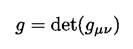****

*   *****R* 是 [Ricci 曲率标量](https://en.wikipedia.org/wiki/Ricci_curvature)其中描述了时空在每个点附近的几何形状(见下图)。****

****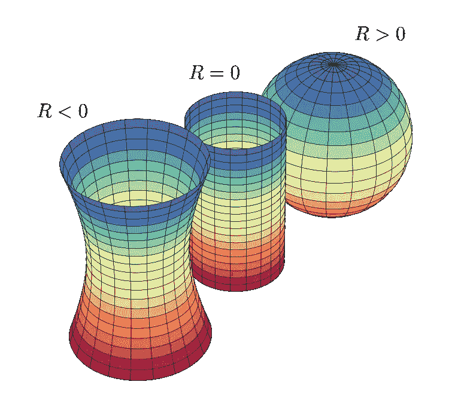****

****图 10:该图显示了三个表面。第一种是具有负局部曲率 R<0 的双曲面；第二个是圆柱体，零曲率的曲面，第三个是球体，正曲率的曲面。****

*   ****λ是[宇宙常数](https://en.wikipedia.org/wiki/Cosmological_constant)，与真空的[能量相关，与](https://en.wikipedia.org/wiki/Vacuum_energy)[暗能量](https://en.wikipedia.org/wiki/Dark_energy)的概念相关****
*   ****时空的体积元素是符号****

****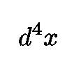****

*   ****括号内的第三项是[物质场的拉格朗日密度](https://en.wikipedia.org/wiki/Lagrangian_(field_theory))(稍后将更详细地讨论)。****

****当我们只有一维时， *R* 消失(曲线的固有曲率不存在)。 *R* ≡ 0 的一个结果是，在一维空间中，重力**是非动态的**(参见[斯金纳](http://www.damtp.cam.ac.uk/user/dbs26/AQFT/chap3.pdf))。对于 1D 流形，上面的操作比方程 1 简单得多。19，可以写成:****

****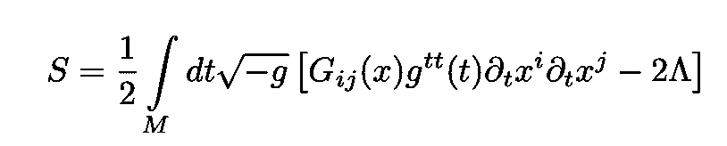****

****方程 20:1D 流形的广义相对论作用。注意 Ricci 标量的缺失和度量 ***g*** 的存在表明标量场与引力相互作用。****

****括号内的第一项代表标量场，其中 ***G*** 是对 *N 的度量的拉回*M*。*注意没有该项****

****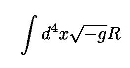****

****尽管如此，我们仍然可以建立一个量子引力理论，将度规和物质场联系起来。度量 ***g*** 的存在表明标量场与引力相互作用。选择目标空间中的洛伦兹度规****

****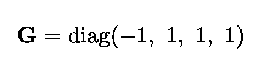****

****方程 21:四维闵可夫斯基度规张量。****

****动作 *S* 变为:****

****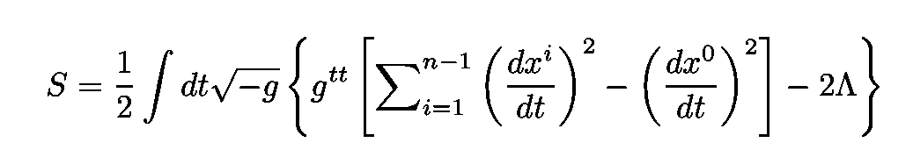****

****等式 22:具有上面给出的闵可夫斯基度量 G 的动作 S。****

****如果我们相对于**改变 *S* ，则[爱因斯坦场方程](https://en.wikipedia.org/wiki/Einstein_field_equations) (EFE)可以从该作用中导出。* 定义 2λ≦*m*“EFE”读作:*****

*****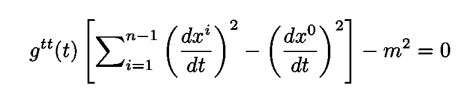*****

*****方程 23:我们理论的“爱因斯坦场方程”。*****

*****这个方程可以用“共轭动量”来表示:*****

*****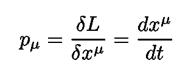*****

*****使用引号的原因是为了提醒我们, *x* 是标量字段，而不是位置坐标(到目前为止):*****

*****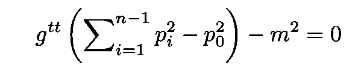*****

*****方程 24:用共轭动量表示的“爱因斯坦场方程”。*****

*****遵循规范量化的标准过程(并设置 *ħ* = 1)*****

**********

*****方程 25:共轭动量由微分算子代替。*****

*****情商。24 变成了:*****

*****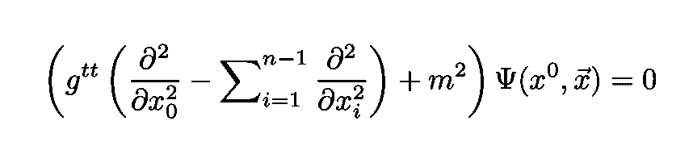*****

*****方程 26:正则量子化过程后量子波函数的微分算子。*****

*****其中我们看到系统的量子波函数ψ被与方程关联的微分算符湮灭。24.如果我们重新参数化流形 *M* 或者等效地，如果我们执行一般的坐标变换*****

*****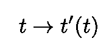*****

*****度量张量变换如下:*****

*****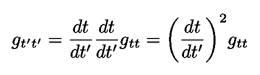*****

*****现在，我们可以按照我们想要的任何方式重新调整度量。选择:*****

*****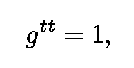*****

*****将符号从 *x* ⁰改为 *t* 并设置 *n=d=* 4 我们得到[克莱因-戈登方程](https://en.wikipedia.org/wiki/Klein%E2%80%93Gordon_equation) (KGE):*****

*****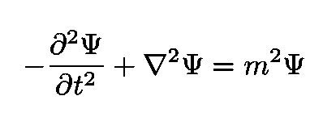*****

*****方程 27:量子化一维经典引力得到的克莱因-戈登方程。*****

*****KGE 描述自旋为[-0 的粒子。著名的](https://en.wikipedia.org/wiki/Spin_(physics))[希格斯玻色子](https://en.wikipedia.org/wiki/Higgs_boson)是第一个也是唯一一个观测到的自旋为-0 的粒子。*****

*****我们得出结论，在一维空间中存在一个非平凡的量子引力理论，它描述了一个大质量粒子在四维闵可夫斯基时空中运动的动力学。注意，在新的解释中，标量场变成了时空坐标。*****

## *****过渡幅度*****

*****现在让我们计算一个粒子从时空中的一点 *x* 传播到另一点 *y* 的跃迁振幅(或传播子)。参见图 1 的左侧，其示出了构成通用传播器的路径的示例。*****

*****为了方便起见(遵循[斯金纳](http://www.damtp.cam.ac.uk/user/dbs26/AQFT/chaps1+2.pdf)和[威滕](http://www.sns.ias.edu/sites/default/files/2015_Phys_Today.pdf))我们将选择 *n* 维流形 *N* 为一个具有欧几里得度量的四维[欧几里得时空](https://en.wikipedia.org/wiki/Minkowski_space):*****

*****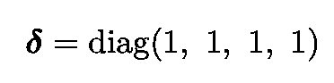*****

*****我们将评估传播子 *G* 也使用一维流形中的欧几里德签名 *M.* 在[海森堡图](https://en.wikipedia.org/wiki/Heisenberg_picture)中，传播子读取:*****

*****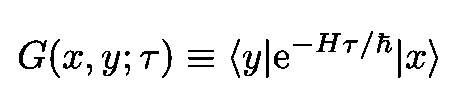*****

*****等式 28:跃迁幅度。它的平方模数给出了一个粒子在τ=0 的 x 处和τ= 0 的 y 处被发现的概率。*****

*****关于欧几里得时空的全面讨论，请看我以前的一篇文章:*****

***** [## 循环虚时间和温度之间的神秘联系

### 一个显而易见的事故可能蕴含着物理学上的一个巨大谜团

towardsdatascience.com](/the-mysterious-connection-between-cyclic-imaginary-time-and-temperature-c8fb241628d9) 

这个表达式可以写成由下面的积分给出:

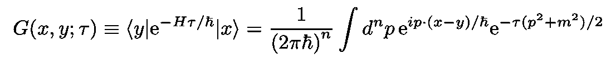

其中 T≦*τ*。固定 *τ* 处的传播子可以表示为所有可能路径上的路径积分:

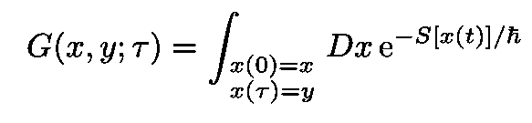

在量子引力中，为了计算跃迁振幅，我们必须对一维 *M* 上所有可能的度量进行额外的积分，直到[微分同胚](https://en.wikipedia.org/wiki/Diffeomorphism)。然而，请注意，上述重新参数化的自由度受到以下事实的限制:对于任意坐标变换， *M* 的总长度不变:

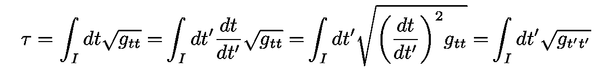

长度是 *M* 的唯一不变量。因此，在这种情况下，在所有可能的度量上积分直到微分同胚，意味着简单地在所有可能的长度上积分(可以解释为适当的时间)。因此:

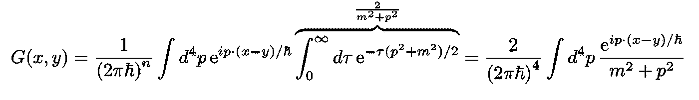

除了因子 2 之外，这是我们之前见过的欧几里得四维空间中质量为 m 的粒子的标准标量场传播子。因此，通常的传播子可以表示为一维量子引力流形上的积分。我们再次看到，一维的量子引力也描述了四维时空中自旋为 0 的粒子。换句话说，我们可以用一维的量子引力理论来解释一个在四维时空中运动的自由粒子！***** 

*****一如既往，感谢您的阅读，再见！建设性的批评和反馈总是受欢迎的！*****

*****我的 [Github](https://github.com/marcotav) 和个人网站 [www.marcotavora.me](https://marcotavora.me/) ，有一些关于理论物理和深度学习和金融等其他主题的其他酷东西。看看他们！*****