# 量子引力、永恒和复数

> 原文：<https://towardsdatascience.com/quantum-gravity-timelessness-and-complex-numbers-855b403e0c2f?source=collection_archive---------4----------------------->

## 宇宙的波动方程是永恒真实的吗？

图片由 [Bruno /德国](https://pixabay.com/fr/users/Bru-nO-1161770/?utm_source=link-attribution&utm_medium=referral&utm_campaign=image&utm_content=3179167)来自 [Pixabay](https://pixabay.com/fr/?utm_source=link-attribution&utm_medium=referral&utm_campaign=image&utm_content=3179167)

从我们宏观人类的角度来看，宇宙似乎不是量子力学的。在我们看来，宏观物体在空间和时间上基本上是局部的。这与它们的量子本质形成了鲜明的对比，在量子本质中，纠缠、非定域性和干涉等属性被证明是[持续发生的](https://www.ncbi.nlm.nih.gov/pmc/articles/PMC4068017/)。只有极少数情况下量子现象可以被宏观地观察到，例如在超导体和超流体中。但是量子特性确实在能量和物质的微观尺度上占主导地位。

图 1:悬浮在液氮冷却的超导体上方的磁性物体的概念图(作者[kts design](https://www.shutterstock.com/g/ktsdesign)/shutterstock . com)。

在量子力学中，正如将要详细描述的，物质具有波动性。更具体地说，一个质量 *m* 动量 *p = mv* (其中 *v* 是速度)的粒子，其波长 *λ* = *h* / *p* 其中 *h* 是所谓的[普朗克常数](https://en.wikipedia.org/wiki/Planck_constant)。为了说明宏观物体的量子特性是如何不可探测的，考虑一下科恩-坦努吉、迪乌和拉罗在本书中给出的例子。与以每秒 1 毫米的速度运动的尘埃粒子(其直径约为 0.001 毫米)相关的波长约为10⁻ ⁶米(或 1/1 万万亿)，这在尘埃粒子的长度尺度上实际上是可以忽略的。

图 2:现代物理学主要领域的四个领域。量化过程对应于虚线框内的箭头(基于[来源](https://en.wikipedia.org/wiki/Branches_of_physics))。

因此，物理学家首先发展了经典或非量子理论。上图说明了物理学的四个可能领域，它们取决于被研究系统的大小和速度。

# 为什么我们需要引力的量子理论？

将引力，更具体地说是广义相对论(GR)统一到量子力学(QM)框架中，可以说是当今物理学中最重要的未解决问题。难点在于广义相对论和量子力学有着极其不同的数学和概念结构。前者是基于[光滑时空](https://en.wikipedia.org/wiki/Spacetime)的几何特性，而后者是基本概率性的，并基于[测不准原理](https://en.wikipedia.org/wiki/Uncertainty_principle)，根据测不准原理，测量某些物理量的精度有一个基本限制。

继[基弗](https://books.google.com.br/books?id=TJ3mRIdG7RQC&printsec=frontcover&dq=kiefer+quantum+gravity&hl=en&sa=X&ved=0ahUKEwifwfrr7oDmAhUZF7kGHU_3B8AQ6AEIKDAA#v=onepage&q=kiefer%20quantum%20gravity&f=false)之后，我们可以将量子化引力的主要动机分成三个副主题:[其他统一方案的成功](https://en.wikipedia.org/wiki/List_of_unsolved_problems_in_physics#Quantum_gravity)，关于黑洞和[宇宙学](https://en.wikipedia.org/wiki/List_of_unsolved_problems_in_physics#Cosmology_and_general_relativity)的[物理学的未解问题，以及所谓的时间](https://en.wikipedia.org/wiki/Black_hole)的[问题。](https://en.wikipedia.org/wiki/Problem_of_time)

## 一致

[量子场论](https://en.wikipedia.org/wiki/Quantum_field_theory) (QFT)是经典场论、狭义相对论和量子力学的结合体(见图 2)，是现代物理学中实验最成功的理论之一。QFT 将所有的非引力统一到一个框架中。既然所有已知的粒子都与引力耦合，那么把它包含在这个框架中似乎至少是合理的。

图 3:粒子物理学[标准模型](https://en.wikipedia.org/wiki/Standard_Model)的基本粒子。它们包括六个[夸克](https://en.wikipedia.org/wiki/Quark)，四个[规范玻色子](https://en.wikipedia.org/wiki/Gauge_boson)，以及最近测量的 [希格斯玻色子](https://en.wikipedia.org/wiki/Higgs_boson) ( [来源](https://en.wikipedia.org/wiki/Quantum_field_theory))。

在给他的朋友、数学家马塞尔·格罗斯曼的一封信中，爱因斯坦做了如下评论:

> "发现一系列起初似乎完全分离的现象的统一是一种光荣的感觉……"
> 
> ——阿尔伯特·爱因斯坦

## 黑洞和宇宙学

根据著名的[彭罗斯-霍金定理](https://en.wikipedia.org/wiki/Penrose%E2%80%93Hawking_singularity_theorems)，[奇点](https://en.wikipedia.org/wiki/Gravitational_singularity)在 GR 中是不可避免的(在相当温和的条件下——参见[巴罗](https://books.google.com.br/books?id=KHPhAgAAQBAJ&printsec=frontcover&dq=the+origin+of+the+universe+barrow&hl=en&sa=X&ved=0ahUKEwiL2an_4rfmAhWxIbkGHbcrBrMQ6AEIKTAA))。奇点的例子有黑洞内部的奇点和宇宙诞生中的奇点。GR 的量化可以消除这种差异。

图 4:黑洞奇点的 2D 类比图(作者 [vchal](https://www.shutterstock.com/g/vchal) /shutterstock.com)。

## 时间的问题

普通量子力学中的时间是绝对的，在物理系统之外。量子场论结合了特殊的相对论，平的闵可夫斯基时空代替了标准量子理论的绝对外部时间。

图 5:块状闵可夫斯基宇宙，一堆空间切片。根据狭义相对论，切片并不是唯一的:时空可以以几种方式切片，这取决于参考系的选择(图基于[巴罗](https://books.google.com.br/books?id=KHPhAgAAQBAJ))。

相比之下，广义相对论中的时间(更准确地说是时空)不是固定的，而是动态的。因此，将 GR 和 QM 统一起来很可能会导致一个新的、不同的时间概念。

图 6:左图显示了狭义相对论的固定(非动态)闵可夫斯基时空和相应的[光锥](https://en.wikipedia.org/wiki/Light_cone)。右边的一个说明了广义相对论的时空，它是动态的，并且由于物质和能量的存在而被扭曲。

由于统一量子力学和广义相对论[将迫使我们](https://philpapers.org/rec/KIEDTE)在量子力学框架中表达引力(或者相反)，我们面临着所谓的时间的[问题。](https://en.wikipedia.org/wiki/Problem_of_time)

图 7:量子力学和广义相对论的时间概念不同。把两种理论统一起来，就产生了所谓的“时间问题”。

因此，为了理解引力在原则上是如何被量子化的，我们必须首先研究经典的(图 2 中最上面一行的方框)和量子力学的(图 2 中最下面一行的方框)的数学和物理结构。

# 经典力学

1687 年，[艾萨克·牛顿](https://en.m.wikipedia.org/wiki/Isaac_Newton)出版了他的[哲学自然数学原理](https://en.m.wikipedia.org/wiki/Philosophiæ_Naturalis_Principia_Mathematica)，更广为人知的名字是《原理》，可以说是科学史上最有影响力的书。在 1905-1915 年期间，阿尔伯特·爱因斯坦通过发表他的[狭义和广义相对论论文](https://en.wikipedia.org/wiki/Theory_of_relativity)推广了牛顿力学。

*图 8:左边是《原理》*第一版的 t* itle 页(* [*来源*](https://en.m.wikipedia.org/wiki/Philosophi%C3%A6_Naturalis_Principia_Mathematica) *)* 。右边是爱因斯坦手稿的第一页，在那里他解释了他的广义相对论([来源](https://en.wikipedia.org/wiki/List_of_scientific_publications_by_Albert_Einstein))。

## 拉格朗日和哈密顿方法

正如我以前的一篇文章中详细解释的那样，牛顿力学有两种重新表述，使它在数学上更加优雅和强大:朗格方法和哈密顿方法。

拉格朗日函数 *L* 定义在所谓的[组态空间](https://en.wikipedia.org/wiki/Configuration_space_(physics)) *C* 、和**C*中的每个点都与某个 *N* 粒子组态相关联。 *C* 中各点的动力学服从一组微分方程称为[欧拉-拉格朗日方程](https://en.wikipedia.org/wiki/Euler%E2%80%93Lagrange_equation)，由[拉格朗日](https://en.wikipedia.org/wiki/Lagrangian_mechanics)函数 *L:**

**

*方程 1:具有 N 个粒子的系统的朗格函数，欧拉-拉格朗日方程从该函数中导出。虚线变量是[广义速度](https://en.wikipedia.org/wiki/Generalized_coordinates)。*

**L* 的自变量包含[广义坐标](https://en.wikipedia.org/wiki/Generalized_coordinates)及其关联的[广义速度](https://en.wikipedia.org/wiki/Generalized_coordinates)(详见[本文](/the-mysterious-connection-between-cyclic-imaginary-time-and-temperature-c8fb241628d9))。*

*

图 9:广义坐标的例子。左边可以选择椭球面上的广义坐标为( *u* ， *v* )。在右边，双摆的广义坐标可以是两个角度θ₁和θ₂ ( [来源](https://en.wikipedia.org/wiki/Generalized_coordinates))。* 

*拉格朗日量是系统的动能 *K* (由于其[运动](https://en.wikipedia.org/wiki/Motion_(physics)))和势能 *V* 之差:*

**

*方程 2:N 个粒子系统的拉格朗日量是动能和势能之差。*

*使用变分法的基本引理[从 *L* 中导出](https://en.wikipedia.org/wiki/Fundamental_lemma_of_calculus_of_variations)[欧拉-拉格朗日方程](https://en.wikipedia.org/wiki/Euler%E2%80%93Lagrange_equation)。它们由以下各项给出:*

**

*方程 3:欧拉-拉格朗日运动方程。*

*与拉格朗日情形一样，哈密尔顿方法基于多元函数，即[哈密尔顿函数](https://en.wikipedia.org/wiki/Hamiltonian_mechanics)*

**

*方程 4:具有 N 个粒子的系统的哈密尔顿函数，从中获得哈密尔顿运动方程。自变量中分号后的 p 变量是与分号前的 q 变量相关联的共轭动量。*

*由此得到哈密顿的运动方程。函数 *H* 定义在[相空间](https://en.wikipedia.org/wiki/Phase_space)而不是配置空间。*

*

图 10:都柏林扫帚桥上的著名牌匾，汉密尔顿在这里用他的小刀雕刻了乘法四元数规则([来源](https://en.wikipedia.org/wiki/History_of_quaternions))。* 

*相空间[可以定义](https://en.wikipedia.org/wiki/Phase_space)为“一个系统所有可能状态的空间，每个可能状态对应一个唯一的点。”相空间中的一个点由系统所有粒子的位置和(共轭)动量决定。*

*

图 11:在实空间和相空间运动的摆([来源](https://en.wikipedia.org/wiki/Phase_space))。* 

*你可以查看我的上一篇文章(如下)以获得更详细的解释。*

* [## 循环虚时间和温度之间的神秘联系

### 一个显而易见的事故可能蕴含着物理学上的一个巨大谜团

towardsdatascience.com](/the-mysterious-connection-between-cyclic-imaginary-time-and-temperature-c8fb241628d9) 

## 汉密尔顿运动方程:鸟瞰

而不是求解等式给出的 *N* 个耦合二阶微分方程。3 可以用 2N 个一阶方程代替。这可以显示如下。

首先，我们定义对应于每个广义坐标的共轭动量:

方程 5:与第 I 个广义坐标 qᵢ.相关的第 I 个共轭动量 pᵢ

然后，根据广义坐标、共轭动量和拉格朗日量显式写出哈密顿函数:

等式 6:哈密顿量的定义。

从 *H* 可以快速推导出*2N*哈密尔顿的运动方程，如下一小节所示(更多细节见[戈尔茨坦、普尔和萨夫科](https://books.google.com.br/books?id=bhVnngEACAAJ&dq=goldstein+mechanics+book&hl=en&sa=X&ved=0ahUKEwiD9JOuwPLlAhXpLLkGHVQQAKYQ6AEIKDAA))。

## 推导哈密顿的运动方程

我们从定义[动作](https://en.wikipedia.org/wiki/Action_(physics))开始。它由以下对时间的积分给出:

方程 7:作用量 S，它是拉格朗日函数的时间积分。

图 12:与系统的给定运动相对应的时空路径是由粗线给出的路径。

当 *S* 用于[场](https://en.wikipedia.org/wiki/Field_(physics))理论时，它还包含了对空间变量的积分。现在，为了简单起见，我们设置 *N* =1。改变 *q* 和 *p* 我们得到:

等式 8:哈密顿量相对于 q 和 p 的变化。

其中广义速度的增量重新表示为:

方程 9:用增量广义坐标表示的广义速度增量。

对于独立变量 *δq* 和 *δp* 和固定端点，动作的平稳性 *δS* =0 导致哈密顿运动方程:

方程式 10:汉密尔顿运动方程式。

例如，对于简谐运动的情况(如弹簧-质量系统),求解方程可以绘制相应的[相图](https://en.wikipedia.org/wiki/Phase_space),如下所示。

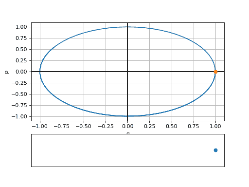

图 13:这个动画在顶部显示了简谐振子的相空间运动(或相图)，在底部显示了物理运动(图由[加布](https://physics.stackexchange.com/users/62297/gabe)使用他的 [Python 脚本](https://github.com/gplynch619/phase-mixing/blob/master/harmonic_phase.py)生成)。

## 典范变换

一个[正则变换](https://en.wikipedia.org/wiki/Canonical_transformation)取一组坐标和共轭动量

方程式 11:原始广义坐标和共轭动量。

另一组坐标和共轭动量

方程 12:新坐标和共轭动量。

或者写得更简洁些:

方程式 13:接触转换。如果哈密顿的运动方程保持不变，这叫做正则变换。

用不同的(但相关的)变换后的哈密顿量 *K* 保持哈密顿运动方程的结构:

方程 14:新的坐标和共轭动量服从哈密顿量为 k 的哈密顿运动方程。

这是一个简单的任务[派生一个算法](http://www.astro.caltech.edu/~golwala/ph106ab/ph106ab_notes.pdf)生成规范的转换。

为了保持运动方程，我们需要下面的变化也为零(对于任何 *δP* 和 *δQ* ):

方程 15:新哈密顿量相对于 Q 和 p 的变化。

然后，让我们首先做出下面的"[猜测](http://www.astro.caltech.edu/~golwala/ph106ab/ph106ab_notes.pdf)，并假设**足以**使上面的等式消失:

这相当于:

等式 16: **根据新的规范变量，新的、变换的拉格朗日量的定义**。

这里的“~”表示我们不仅仅是在新的坐标中重写拉格朗日函数

但是相反，我们正在 [**定义**](http://www.astro.caltech.edu/~golwala/ph106ab/ph106ab_notes.pdf) 一个新的、变换的拉格朗日量。

注意，尽管通过构造，在原始动作的初始和最终积分极限处的增量 *δq* 为零，但是增量*δQ*不一定在那里消失。现在，改变与 Eq 相关的新旧动作。16(分别对应于 *H* 和 *K*

等式 17:新动作，通过积分等式 17 获得。16.

人们很容易发现，新的汉密尔顿运动方程成立的唯一方法是，如果满足下列条件:

方程 18:新的运动方程对哈密顿量 k 成立的必要条件。

但是如果我们现在假设运动方程服从于 K，我们就可以反演正则变换

方程 19:从新的广义坐标和动量回到原始的广义坐标和动量。

其中:

等式 20:逆规范变换。

重复上述过程，得到从( *p，q* )到( *P，Q* )的变换为规范的第二个条件，即:

等式 21:变换(Q，p) → (Q，P)为正则变换的必要额外条件。

等式和等式之间符号差异的来源。18 和情商。21 是等式中 *F* 的时间导数前的负号。16.这个函数 *F* 被称为[生成函数](https://en.wikipedia.org/wiki/Generating_function_(physics))。上面的论证表明，对于( *p，q* ) → ( *P，Q* )为规范变换，存在生成函数 *F* ( *q* ， *Q* ， *t* )就足够了，使得方程。16、18、21 满足。

一个[也可以证明](http://www.astro.caltech.edu/~golwala/ph106ab/ph106ab_notes.pdf)每一个正则变换都可以从母函数导出。换句话说， *F* 的存在是变换( *p，q* ) → ( *P，Q* )规范的**必要**。

考虑最后一个要点。在新拉格朗日函数中包含 *F* 的时间导数也改变了哈密顿量，其变为:

方程 22:在重新定义方程中的拉格朗日量后获得新的哈密顿量。16.

## 简单的例子

现在让我们简要分析一个例子，使事情不那么抽象。考虑一个简单的谐振子(SHO)，例如[弹簧质量系统](https://en.wikipedia.org/wiki/Spring%E2%80%93mass_system)。

[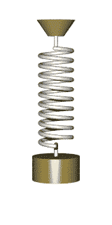](https://en.wikipedia.org/wiki/Harmonic_oscillator#Spring/mass_system)

图 14:动画显示了弹簧质量系统的简谐运动([来源](https://en.wikipedia.org/wiki/Harmonic_oscillator#Spring/mass_system))。

质量 *m* =1，以频率 *ω* 振荡的哈密顿量为:

方程 23:频率为ω的简谐振子的经典哈密顿量。

应用等式。将图 18 和 21 转换为下面的生成函数

方程 24:选择用于求解 SHO 方程的生成函数。

和反相等式。18，一个获得:

等式 25:等式中给出的两个逆变换。20 为 SHO 的情况。

图 15:简谐运动([来源](https://en.wikipedia.org/wiki/Harmonic_oscillator#Spring/mass_system))。

新的哈密顿量和相应的运动方程获得了极其简单的形式，即:

方程 26:新规范变量 Q 和 p 的哈密顿运动方程。

这些是微不足道的集成。将结果代入方程。25 我们得到:

方程 27:相空间中熟悉的 SHO 方程运动。

这些是相空间中常见的 SHO 方程运动。

## 其他生成函数

还有其他形式的 *F* 具有不同的变量依赖关系。更具体地，在当前情况下 *F* 取决于 *q* 和 *Q* ，但是有三种其他可能的组合，即

等式 28:新旧相空间坐标的三种其他组合，给出了三种其他类型的生成函数的原点。

更详细的分析见戈尔茨坦、普尔和萨夫科。

## 汉密尔顿-雅可比方程(HJE)

在特殊情况下，有一个特殊的生成函数，通常用 *S* 表示，这样新的哈密顿量

等式 29:对于某个母函数 s，变换后的哈密顿量等于零。

情商。22 就变成了所谓的[汉密尔顿-雅可比方程](https://en.wikipedia.org/wiki/Hamilton%E2%80%93Jacobi_equation) (HJE):

方程式 30:汉密尔顿-雅可比方程式。

其中 Eq。21 被用来代替 *H 内的动量。*需要注意的是:

*   由于新的哈密顿量 *K* =0，相应的哈密顿运动方程意味着 *Q* s 和 *P* s 是常数:

方程 31:当变换的哈密顿量 K=0 时，新的相空间变量的哈密顿运动方程。

*   如前所述，生成函数可以有四种不同类型的变量依赖。这个特殊的生成函数 *S* 必须只依赖于 *q* s 和 *P* s(而不是依赖于 *p* s 和 *Q* s)。
*   HJE，一个具有 *N* + *1* 个独立变量和 *N* + *1* 个任意常数(由初始条件固定)的单个偏微分方程，解决[与哈密顿运动方程相同的力学问题](http://www.astro.caltech.edu/~golwala/ph106ab/ph106ab_notes.pdf)。
*   人们可以很快地[向](http://www.astro.caltech.edu/~golwala/ph106ab/ph106ab_notes.pdf)表明*的*生成函数就是动作。当我们比较经典方程和量子方程时，这个观察将是至关重要的。

图 16:数学家[威廉·罗恩·汉密尔顿爵士](https://en.wikipedia.org/wiki/William_Rowan_Hamilton)(左)和[卡尔古斯塔夫雅各布雅各布](https://en.wikipedia.org/wiki/Carl_Gustav_Jacob_Jacobi)(右)，HJE 就是以他们的名字命名的。

具体来说，考虑质量为 *m* 的粒子在与时间无关的势 *V* 中运动时的 HJE。它由下式给出:

等式 32:质量为 m 的牛顿粒子在与时间无关的势 v 中运动时的 HJE

让我们知道换挡和潜入量子力学。* 

# *量子力学中重要概念的鸟瞰图*

*在短短的 1925-1926 年间，随着奥地利物理学家埃尔温·薛定谔和德国物理学家沃纳·海森堡的开创性论文的发表，量子力学的时代开始了，新理论取代了经典理论成为描述自然的更基本的框架。他们的工作基于其他几位物理学家之前的发现，包括[普朗克](https://en.wikipedia.org/wiki/Max_Planck)、[爱因斯坦](https://en.wikipedia.org/wiki/Einstein)、[玻尔](https://en.wikipedia.org/wiki/Niels_Bohr)和[德布罗意](https://en.wikipedia.org/wiki/Louis_de_Broglie)。*

**

*图 17:量子力学的两位主要创始人，物理学家[沃纳·海森堡](https://en.wikipedia.org/wiki/Werner_Heisenberg)(左)和[埃尔温·薛定谔](https://en.wikipedia.org/wiki/Erwin_Schr%C3%B6dinger)(右)。*

*量子力学框架中的基本概念是[量子物理状态](https://en.wikipedia.org/wiki/Quantum_state)的概念(参见[弗拉德金](http://eduardo.physics.illinois.edu/phys582/582-chapter4.pdf))。数学上，它由量子态的[希尔伯特空间](https://en.wikipedia.org/wiki/Hilbert_space)中的[向量空间](https://en.wikipedia.org/wiki/Vector_space)中的[射线](https://en.wikipedia.org/wiki/Quantum_state#Pure_states_as_rays_in_a_Hilbert_space)来表示。如果满足以下条件，两个归一化矢量或[纯态](https://en.wikipedia.org/wiki/Quantum_state#Pure_states) *ψ* ₁和 *ψ* ₂属于同一光线:*

**

*方程 33:希尔伯特状态空间中属于同一光线的状态所服从的条件。*

*(例如，参见[温伯格](https://books.google.com.br/books/about/The_Quantum_Theory_of_Fields.html?id=doeDB3_WLvwC&redir_esc=y))。量子系统的希尔伯特空间中的单位球(例如[布洛赫球](https://en.wikipedia.org/wiki/Bloch_sphere))包含范数为 1 的所有纯态的集合。*

*

图 18:量子力学中的布洛赫球代表一个二能级量子力学系统的所有纯态的空间([来源](https://en.wikipedia.org/wiki/Bloch_sphere))。* 

*维数为 N 的希尔伯特空间中的一组状态*

**

*等式 34:N 维希尔伯特空间中的一组 N 个量子态。*

*跨越整个希尔伯特空间的称为[基](https://en.wikipedia.org/wiki/Quantum_state#Basis_states_of_one-particle_systems)。一个态 *ψ* 在基础 *ϕᵢ* 上的扩展变成了:*

**

*等式 35:状态ψ扩展到一组完整的状态ϕᵢ.*

*在上图中，基只包含两个向量:*

**

*等式 36:图 18 中ψ的基本向量。*

*两态量子系统被称为[量子位](https://en.wikipedia.org/wiki/Two-state_quantum_system)。纯量子位状态 *ψ* 是基态的叠加，可以写成如下:*

**

*等式 37:量子位是两个基本向量的线性组合。*

*量子比特的重要性在于，它是[量子信息](https://en.wikipedia.org/wiki/Quantum_information)的基本单位([量子计算机](https://en.wikipedia.org/wiki/Quantum_computing)将信息编码为量子比特)。*

*

图 19:量子计算芯片阵列([来源](https://www.scientificamerican.com/article/hands-on-with-googles-quantum-computer/))。* 

*所谓的[经典和](https://en.wikipedia.org/wiki/Correspondence_principle)[量子理论](https://en.m.wikipedia.org/wiki/Quantum_mechanics)之间的对应原理，陈述了物理系统遵守量子力学定律，经典物理学是对大型物体有效的近似，或者更具体地说，是对大型[量子数](https://en.wikipedia.org/wiki/Quantum_number)有效的近似。两个框架之间的转换过程被称为[量化](https://en.wikipedia.org/wiki/Quantization)。*

**

*图 20:左边是诺贝尔奖获得者尼尔斯·玻尔的照片，他对量子理论包括对应原理做出了基础性贡献([来源](https://en.wikipedia.org/wiki/Niels_Bohr))。右边是玻尔的手稿，包含与量子力学相关的笔记([来源](https://www.christies.com/lotfinder/Lot/bohr-niels-1885-1962-autograph-manuscript-diagrams-and-6218446-details.aspx))。*

*在[正则量子化](https://en.wikipedia.org/wiki/Canonical_quantization)过程中，经典力学中的正则坐标对( *q* ， *p* )成为希尔伯特空间中的位置和动量[算符](https://en.wikipedia.org/wiki/Operator_(physics)#Operators_in_quantum_mechanics):*

**

*等式 38:在正则量子化中，相空间中的经典坐标变成希尔伯特状态空间中的线性算子。*

*其对量子态线性作用， *q* 和 *p* 之间的泊松括号成为相应算符之间的[正则对易关系](https://en.wikipedia.org/wiki/Canonical_commutation_relation):*

**

*方程式 39:当一个经典理论被量子化时，泊松括号变成了交换子。*

*对于给定的算子 *A* ，存在一组状态 *ψ* ᵢ，使得 *Aψ* ᵢ与 *ψ* ᵢ.成比例这个集合的成员是所谓的 *A 的[本征态](https://en.wikipedia.org/wiki/Introduction_to_eigenstates)。*换句话说如果 *ψ* ᵢ是 *A 的本征态*:*

**

*等式 40:态 *ψ* ᵢ是算符 a 的一个本征态，数 a 是其对应的本征值。*

*集合{ *a* ᵢ}的成员是算子 *A* 的特征值(更多细节参见例如 [Sakurai](https://books.google.com.br/books?id=010yDwAAQBAJ&printsec=frontcover&dq=sakurai+book&hl=en&sa=X&ved=0ahUKEwjPvM-xotfmAhVmI7kGHX_rC9cQ6AEIKTAA#v=onepage&q=sakurai%20book&f=false) )。本征态和本征值的两个重要性质如下:*

*   *与物理可观测量相关的算符是[厄米算符](https://en.wikipedia.org/wiki/Self-adjoint_operator)，因此只有实特征值*
*   *希尔伯特空间中ψ的任何态都可以表示为本征态的线性组合。这意味着本征态集构成了希尔伯特空间的基础。*

**

*方程 41:任何任意态ψ都可以分解成某个给定算符的本征态的基。*

*一个特别重要的基础是[位置算符](https://en.wikipedia.org/wiki/Position_operator)的本征态的(无限维)基础。在这种情况下，我们得到:*

**

*等式 42:位置本征态的[基础](https://en.wikipedia.org/wiki/Position_operator)。态ψ展开成位置本征态的系数是[量子波函数](https://en.wikipedia.org/wiki/Wave_function)。*

*

图 21:一维系统的典型波函数示例(基于 [Griffiths](https://books.google.com.br/books?id=0h-nDAAAQBAJ&printsec=frontcover&dq=griffiths+quantum+mechanics&hl=en&sa=X&ved=0ahUKEwjd3r2B4tHmAhU4IrkGHQuJB1gQ6AEIKTAA#v=onepage&q=griffiths%20quantum%20mechanics&f=false) )。箭头表示波函数是[平方可积的](https://en.wikipedia.org/wiki/Square-integrable_function)，这意味着其绝对值平方的积分是有限的。* 

*量子态 *ψ* 到位置本征态的展开系数给出了[量子波函数](https://en.wikipedia.org/wiki/Wave_function)的值。在以 *q* 为中心的小间隔 *dq* 内的某个时间 *t* 发现粒子的概率由下式给出:*

**

*等式 43:在时间 *t* 在间隔 *dq 内发现一个在 1D 运动的粒子的概率。**

*量子系统的哈密顿量是通过在方程中进行替换而获得的。经典哈密顿量中的 38。对于势 *V* 中的单个粒子，量子哈密顿量为:*

**

*等式 44:势能 v 中的单个粒子的哈密顿量。注意，势能被选择为仅取决于 **q** 。*

*人们可以使用任何一组基向量来表示希尔伯特空间中的算子。例如，考虑由等式给出的位置算符的本征态的基础。42.在此基础上如何表示动量算符？不难看出(详见 [Fradkin](http://eduardo.physics.illinois.edu/phys582/582-chapter4.pdf) ):*

**

*方程式 45:动量算符的坐标表示。*

*因此，在位置基础上工作，通过用以下[厄米算子](https://en.wikipedia.org/wiki/Self-adjoint_operator)代替坐标和动量来执行量化:*

**

*方程式 46:为了量子化经典力学，我们进行这些替换。*

*经典哈密顿量中的经典能量被替换为*

**

*方程式 47:量子化后，经典能量变成能量算符。*

*你可以看到[泡利](https://books.google.com.br/books/about/General_principles_of_quantum_mechanics.html?id=A84NAQAAIAAJ&redir_esc=y)或[彭罗斯](https://en.wikipedia.org/wiki/The_Road_to_Reality)对上述等式的详细论证。*

*正如我们将在下一节看到的，经过这些替换，哈密顿量变成了[薛定谔方程](https://en.wikipedia.org/wiki/Schr%C3%B6dinger_equation)，量子力学的主要结果之一。*

***一个简单的例子** 为了说明量子化的概念，让我们考虑一个简单的一维系统:[一维盒子里的一个粒子](https://en.wikipedia.org/wiki/Particle_in_a_box)，这个模型描述了一个粒子在被不可穿透的屏障包围的空间(在 1D 是一条线)中自由移动。*

*

图 23:无限深势阱([来源](https://en.wikipedia.org/wiki/Quantum_mechanics#Quantum_mechanics_and_classical_physics))。* 

*该系统的本征态由下式给出:*

**

*方程 48:盒子模型中 1D 量子粒子的本征态。*

*粒子的经典运动如下图的方框 A 所示(跳动的红球)。剩下的方框(从 B 到 F)显示了不同波函数的实部和虚部的动力学。方框 B、C、D 中的波函数是对应于 *n* =1、2、3 的哈密顿量 *H* (或能量本征态)的本征态。*

*

图 24:经典运动显示在方框 a 中，其他方框显示了遵守[薛定谔方程](https://en.wikipedia.org/wiki/Schr%C3%B6dinger_equation)的量子波函数的实部和虚部。只有 B、C、D 是能量本征态([来源](https://en.wikipedia.org/wiki/Particle_in_a_box))。* 

## *薛定谔方程*

*[薛定谔方程](https://en.wikipedia.org/wiki/Schr%C3%B6dinger_equation) (SE)最早出现在[埃尔温·薛定谔【1926 年的著名论文](https://en.wikipedia.org/wiki/Erwin_Schr%C3%B6dinger)之一[中，它描述了量子波函数的动力学。它是一个](https://onlinelibrary.wiley.com/doi/abs/10.1002/andp.19263840404)[线性](https://en.wikipedia.org/wiki/Linear_differential_equation) [偏微分方程](https://en.wikipedia.org/wiki/Partial_differential_equation)包含一个因子 *i* 乘以波函数的时间导数。*

*

图 25:论文“[量子化作为本征值问题](https://onlinelibrary.wiley.com/doi/abs/10.1002/andp.19263840404)”发表在期刊[*Annalen der Physik*](https://en.wikipedia.org/wiki/Annalen_der_Physik)*作者* [埃尔温·薛定谔](https://en.wikipedia.org/wiki/Erwin_Schr%C3%B6dinger)。本文包含薛定谔方程的首次出现([来源](https://onlinelibrary.wiley.com/doi/abs/10.1002/andp.19263840404))。* 

*如上所述，可以通过应用等式中的替换来获得 SE。46 和 Eq。47 进入哈密顿量:*

**

*方程 49:描述量子力学系统波函数的薛定谔方程。*

*(注意我们选择自己的坐标为笛卡尔***q***=***x***=(*x*， *y* ， *z* ))。这里，哈密顿算符具有以下形式:*

**

*等式 50:等式中的哈密顿算符 H。49.*

**

*图 26:安妮玛丽和埃尔温·薛定谔的墓碑。薛定谔方程内接([来源](https://en.wikipedia.org/wiki/Schr%C3%B6dinger_equation))。*

*有趣的是，薛定谔方程并不局限于非相对论量子力学(正如人们通常认为的那样)。你可以看[这篇博文](https://www.preposterousuniverse.com/blog/2016/08/15/you-should-love-or-at-least-respect-the-schrodinger-equation/)获得启发性的解释。例如，在量子场论中，坐标被场配置代替，波函数**被波函数**代替，薛定谔方程变成了[标量场](https://en.wikipedia.org/wiki/Scalar_field_theory) *ϕ* ( *x* )的简单情况:*****

**

*方程 51:描述标量场的波函数ψ[ϕ,t 的薛定谔方程。*

*其中被积函数中的 *K* 是空间坐标的函数(更多详细信息见 [Mukhanov 和 Winitzki](https://books.google.com.br/books?id=vmwHoxf2958C&printsec=frontcover&dq=curved+spacetime+mukhanov+winitzki&hl=en&sa=X&ved=0ahUKEwj9gvi_kt_kAhXEH7kGHVTPAG4Q6AEIKDAA#v=onepage&q=curved%20spacetime%20mukhanov%20winitzki&f=false) ):*

**

*作为题外话，实验发现的唯一基本量子标量场是著名的[希格斯场](https://en.wikipedia.org/wiki/Higgs_field)。*

**

*图 27:大型强子对撞机一部分的照片，2012 年在这里探测到希格斯玻色子(图片由[D-VISIONS](https://www.shutterstock.com/g/Massimo+Dallaglio)/shutterstock . com 提供)。*

*应该注意的是，SE 的这种普遍性仅限于[纯态](https://en.wikipedia.org/wiki/Quantum_state#Pure_states)。对于一个[混合态](https://en.wikipedia.org/wiki/Quantum_state#Mixed_states)，它是一个[纯态的统计系综](https://en.wikipedia.org/wiki/Statistical_ensemble)，SE 由[冯诺依曼方程](https://en.wikipedia.org/wiki/Density_matrix#The_von_Neumann_equation_for_time_evolution)代替。在希尔伯特空间中，混合态由一个[密度算符](https://en.wikipedia.org/wiki/Density_matrix) *ρ* 表示*

**

*等式 52:密度算符ρ，它是纯态的外积之和。*

*它是状态的[外积](https://en.wikipedia.org/wiki/Outer_product)之和，其中系数是系统处于纯态的概率 p₁，p₂，p₃,…，ψ₁，ψ₂，ψ₃等等。冯·诺依曼方程用密度算符写成如下:*

**

*方程 53:当描述的态是混合态而不是纯态时，代替 SE 的冯诺依曼方程。*

*

图 28:光子在(2)中的混合状态的例子，其在穿过偏振器(3)后变成纯态(4) ( [源](https://en.wikipedia.org/wiki/Density_matrix))。* 

## *薛定谔方程的起源*

*在“[费曼物理学讲座](https://www.feynmanlectures.caltech.edu/)*”*中，诺奖得主[理查德·费曼](https://en.wikipedia.org/wiki/Richard_Feynman)做了如下[声明](https://www.feynmanlectures.caltech.edu/III_16.html):*

> *我们是从哪里得到[薛定谔方程]的？哪儿也不去。不可能从你所知道的任何事情中推导出来。它源于薛定谔的想法，是他在努力寻求对现实世界的实验观察的理解时发明的。*
> 
> *—理查德·费曼*

*然而，人们可以建立一些方程应该遵守的性质。这至少会给我们一些关于它的形式的限制(更详细的描述见[弥赛亚](https://books.google.com.br/books?id=mwssSDXzkNcC&dq=quantum+mechanics+messiah&hl=en&sa=X&ved=0ahUKEwie44jNprrlAhWyFbkGHfYoDg8Q6AEIMTAB))。*

***线性和齐次性** 让我们考虑某个函数 *f* 的一个[线性微分方程](https://en.wikipedia.org/wiki/Linear_differential_equation)。它具有一般形式:*

*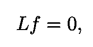*

*方程 54:线性微分方程的一般形式，其中 L 是线性微分算子。*

*其中 *L* 为[线性微分运算器](https://en.wikipedia.org/wiki/Differential_operator)。它具有一般形式:*

**

*方程式 55:线性微分算子的一般形式。*

*一个简单的例子是:*

**

*操作符 *L* 遵守以下性质:*

**

*方程式 56:线性微分算子所服从的性质。*

*因此，如果 *f* 和 *g* 是由 *Lf* =0 给出的微分方程的解，那么它们的线性组合也是解:*

**

*方程 57:线性微分方程的解的叠加也是一个解。*

*线性**偏微分方程(PDE)也是线性微分方程的一个例子。薛定谔方程(SE)是复波函数ψ的线性 PDE 的一个例子。其对应的微分运算符为:***

**

*方程式 58:与薛定谔方程相关的微分算子。*

*因此，如果下列波函数是 SE 的解*

**

*方程 59:SE 的一组解。*

*它们的叠加*

**

*方程 60:上述解的叠加也是 SE 的一个解。*

*也是。线性是使 T2 波包的形成成为可能的原因之一。下图显示了一个波包的例子。*

**

*图 29:代表量子力学的波包([源](https://en.wikipedia.org/wiki/Wave%E2%80%93particle_duality))。*

***方程的阶** 微分方程的[阶](https://en.wikipedia.org/wiki/Linear_differential_equation)是方程中出现的最高求导阶。例如:*

**

*图 30:一个偏微分方程的例子。指出了方程在时间和空间上的顺序。由于常数-1，这个方程不是齐次的。*

*薛定谔方程在时间中的顺序**必须是 1。换句话说，方程必须是时间变量的一阶。如果假设波函数ψ在某个初始时间的规范唯一地定义了它随后的时间演化(不需要它的初始时间导数的值)，这必然发生。***

***经典极限** 当普朗克常数 *h* → 0 时，该方程必然退化为某种形式上类似的经典运动方程。这是上述[对应原则](https://en.wikipedia.org/wiki/Correspondence_principle)的结果。让我们更详细地探讨这一点。*

*遵循[樱井](https://books.google.com.br/books?id=010yDwAAQBAJ&printsec=frontcover&dq=sakurai+book&hl=en&sa=X&ved=0ahUKEwjPvM-xotfmAhVmI7kGHX_rC9cQ6AEIKTAA#v=onepage&q=sakurai%20book&f=false)，我们可以把任何波函数写成:*

**

*方程 61:用概率密度ρ=|ψ|和一般实函数 s 表示的波函数。*

*其中函数 S 是未指定的实函数。然后我们将 *ψ* 代入薛定谔方程，取经典极限 *h* → 0。更具体地说，我们作出以下近似，即所谓的短波极限:*

**

*等式 62:短波极限。*

*在目前的上下文中，“短波长”的含义是粒子的量子波长比作用在粒子上的电势变化的典型距离小得多。收集不包含普朗克 *h* 的项，我们得到:*

**

*方程 63:薛定谔方程的短波长极限(用 *h* → 0)就是(经典的)哈密顿-雅可比方程。*

*这就是汉密尔顿-雅可比方程，而 *S* ( ***x*** ， *t* )竟是经典动作。*

## *用费曼路径积分推导薛定谔方程*

*如果我们包括一个额外的成分，即量子力学的[路径积分公式](https://en.wikipedia.org/wiki/Path_integral_formulation)，有一个简单的方法来获得薛定谔方程。这个公式首先由 n .维纳构思，后来由狄拉克扩展到量子力学。完整的量子力学处方是由[费曼](https://en.wikipedia.org/wiki/Richard_Feynman)开发的。*

**

*图 22:狄拉克的论文，他确定了为什么汉密尔顿原理控制着量子力学的经典极限([来源](http://www.hep.anl.gov/czachos/soysoy/Dirac33.pdf))。然而，狄拉克没有提供精确的数学公式来计算路径上的和。在他 1948 年著名的论文中，费曼提供了这样一个处方。*

*在他著名的论文“非相对论量子力学的时空方法”中，费曼用两个假设总结了他的观点:*

> *I .如果执行理想测量，以确定粒子是否具有位于时空区域中的路径，则结果为肯定的概率是复数贡献之和的绝对平方，来自该区域中的每个路径。*
> 
> *二。这些路径的贡献大小相等。但是他们贡献的阶段是经典动作[……]；即拉格朗日函数沿路径的时间积分。*
> 
> *—费曼(1948)*

*因此，根据费曼的说法，系统进行转变的概率幅度*

**

*等式 64:从初始位置 I 到最终位置 f 的转换。*

*经由路径 *j* 是*

**

*等式 65:来自给定路径 j 的贡献与经典作用 s 的(复)指数成比例。*

*通过对连接初始点和最终点的所有可能路径求和来获得过渡幅度:*

**

*方程 66:传播子 K，由 I 和 f 之间所有可能路径的经典作用的指数和给出。*

*下图显示了对上述量子振幅有贡献的一些路径。*

*

图 23:量子力学历史总和方法中对传播子 K 有贡献的几条路径([来源](https://en.wikipedia.org/wiki/Path_integral_formulation))。* 

*正如[狄拉克](https://www.worldscientific.com/doi/abs/10.1142/9789812567635_0003)首先指出的，使用量子力学的这个公式，通过设置 *h* → 0，可以**推导出**所有经典力学(通过[最小作用原理](https://en.wikipedia.org/wiki/Principle_of_least_action)和[欧拉-拉格朗日方程](https://en.wikipedia.org/wiki/Euler%E2%80%93Lagrange_equation))。*

*简单明了地表明费曼传播子服从薛定谔方程(这个论证遵循[樱井](https://books.google.com.br/books?id=010yDwAAQBAJ&printsec=frontcover&dq=sakurai+book&hl=en&sa=X&ved=0ahUKEwjPvM-xotfmAhVmI7kGHX_rC9cQ6AEIKTAA#v=onepage&q=sakurai%20book&f=false))。*

*首先，如下图所示，将每条路径分成离散的无穷小段。*

**

*图 24:量子力学路径积分公式中的离散路径示例。*

*传播子 *K* 遵循以下合成性质:*

**

*等式 67:传播子 *K.* 的合成性质*

*两个无限接近的时空点的费曼传播子 *K* 的离散版本由以下表达式给出:*

**

*等式 68:两个相邻时空点的传播子 *K* 的离散形式，其中δt 被选择为无穷小。*

*插入等式。68 成情商。67，进行替换*

**

*然后将积分变量从 ***x*** 变为 ***ξ*** 得到:*

**

*等式 69:等式中的传播子积分。68 用 **x** ，t，和 **ξ** 来写。*

*由于δ*t*无穷小，所以除了 ***ξ*** ≈0 的地方，指数是高度振荡的。因此，我们可以将被积函数展开成 ***ξ*** 的幂。我们还可以将两边展开为δ*t 的幂。*展开后，等式的左手边。第 69 条写道:*

**

*等式 70:等式左侧的线性展开。65 为δ*t*→0。*

*手手面变成:*

*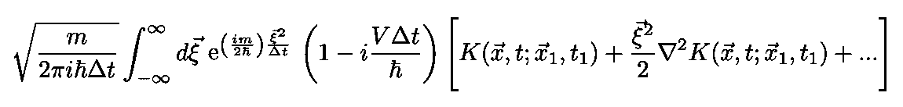*

*等式 71:等式右边的展开式。69 为δ*t*→0 和**T21【ξ≈0。***

*注意，上面的展开式在 ***中是二次的，因为包含线性项的积分在***中消失了。最后，在收集了δ*t*和*中的线性项之后，对 *ξ* 执行平凡的高斯积分，得到费曼传播子 *K* 的以下方程:********

方程 72:费曼传播子 K 服从薛定谔方程。

更多中间步骤见[樱井](https://books.google.com.br/books?id=010yDwAAQBAJ&printsec=frontcover&dq=sakurai+book&hl=en&sa=X&ved=0ahUKEwjPvM-xotfmAhVmI7kGHX_rC9cQ6AEIKTAA#v=onepage&q=sakurai%20book&f=false)。现在，我们可以将薛定谔波函数表达如下:

方程 73:薛定谔的波函数写成核为 k 的积分方程。

其中 *K* ，在这种情况下，是薛定谔波动力学中的传播子，它**不一定**与方程中的 *K* 是同一个物体。72.但如果两个*K*s*都是同一个对象，我们很快就能看出*中的*ψ*Eq*。* 73 的确满足薛定谔方程，因为它应该:**

方程 74:方程中的波函数。73 满足薛定谔方程，前提是费曼传播子与薛定谔传播子相同。

图 25:费曼图的一个例子，来自费曼自己的一篇论文([来源](https://history.fnal.gov/Feynman2014.html))。

## 测不准原理与交换子

量子力学的另一个基本方程(除了薛定谔方程)是[位置-动量转换器](https://en.wikipedia.org/wiki/Canonical_commutation_relation)

等式 75:众所周知的正则对易关系。

这与位置-动量[测不准原理](https://en.wikipedia.org/wiki/Uncertainty_principle)有关。后者是一种数学不等式，它限制了已知位置和动量的精度。例如，位置-动量不确定性原理是:

方程式 76:位置-动量不确定原理。

其中:

方程 77:算子 x 和 p 的色散。

是算子 *x* 和 *p* 的离差。

# 量子力学中的复数

复数在经典物理学中已经被使用(见[杨](https://www.worldscientific.com/doi/abs/10.1142/9789814449021_0014#)和[巴伯](https://journals.aps.org/prd/abstract/10.1103/PhysRevD.47.5422))，但仅仅是作为一种方便的工具。在计算结束时，总是取结果的实部或虚部。正如杨 T11 所观察到的，“物理学在概念上是以实数为基础的。”

图 26:阻抗衡量施加电压时电路对电流的阻抗。这是在经典物理学中使用复数的一个例子([来源](https://en.wikipedia.org/wiki/Electrical_impedance))。

然而，在量子力学中，复数是基础。许多量子力学定律本质上是复杂的。我现在将描述几个重要的例子。

## 动量和能量

考虑一个沿 *x* 轴移动的经典电磁平面波(见本节所基于的[堆栈](https://courses.physics.illinois.edu/phys580/fa2013/susy_v2.pdf))。

图 27:沿 **x** 方向传播的电磁波，其中电场(蓝色)与磁场(红色)同相振荡。注意两者是正交的([来源](https://commons.wikimedia.org/wiki/File:Electromagnetic_waves.png))。

振荡频率为 *ω* 的电场(分量)读数为:

等式 78:频率为ω的平面波沿 x 轴移动时的电场。

其中ω > 0。按照惯例，第一项和第二项分别被视为“正频率”和“负频率”部分。

与经典电磁学相反，在量子力学中，频率的符号必须是正的(没有“负频率”分量)。让我们明白为什么。在奇迹年的一篇论文中，[阿尔伯特·爱因斯坦](https://en.wikipedia.org/wiki/Einstein)解释了[光电效应](https://en.wikipedia.org/wiki/Photoelectric_effect)，并展示了光[光子](https://en.wikipedia.org/wiki/Photon)的能量和频率之间的关系

方程 79:量子力学中能量和频率的关系。

图 28:在这个实验装置中，灯发出的光撞击电极，产生电子发射。通过调节电压来控制电流。在某个“停止电压”时，电流停止。“停止电压”不取决于入射光的强度，而仅取决于其频率([光源](https://en.wikipedia.org/wiki/Photoelectric_effect))。

这个关系后来被证明不仅仅是光子所遵循的。例如，考虑与一个自由的大质量粒子，比如一个电子相关的行波。因为自由电子的能量总是正的，

方程式 80:爱因斯坦质能等效公式。

它的频率也是如此。下图是质能等效关系的一个例子。光子(在这种情况下，是不可见的伽马射线)的能量根据等式转换成质量。80.

图 29:配对产生事件的气泡室图像。一个不可见的伽马射线光子产生一个电子-正电子对，由螺旋轨迹显示(由磁场引起)。光子的部分能量最终取代了一个移动到图片左下方的原子电子。第二个电子-正电子对，在图像的底部，使用伽马射线的所有能量([源](https://ase.tufts.edu/cosmos/view_picture.asp?id=1357))。

此外， [Louis De Broglie](https://en.wikipedia.org/wiki/Louis_de_Broglie) 在他的 [1924 年论文](https://tel.archives-ouvertes.fr/tel-00006807/document)中提出大质量粒子也表现为波，并展示了[波矢](https://en.wikipedia.org/wiki/Wave_vector)和粒子动量之间的以下关系:

方程 90:波矢和大质量粒子动量之间的德布罗意关系。

用德布罗意自己的[话说](https://en.wikipedia.org/wiki/Louis_de_Broglie):

> “[我 1924 年的论文]的基本思想是这样的:在[爱因斯坦](https://en.wikipedia.org/wiki/Einstein)在光波中引入[光子](https://en.wikipedia.org/wiki/Photons)之后，人们知道光包含粒子，这些粒子是并入波中的能量集中，这表明所有粒子，像电子一样，必须通过它被并入的波来传输……我的基本思想是将爱因斯坦 1905 年在光和光子的情况下发现的波和粒子的共存扩展到所有粒子。"
> 
> —路易·德布罗意

这种现象被称为[波粒二象性](https://en.wikipedia.org/wiki/Wave%E2%80%93particle_duality)。正如引言中简要提到的，这种二元性通常对于宏观物体来说是不可探测的，因为它们的德布罗意波长极短。

图 30:这个动画展示了使用电子的[双缝实验](https://en.wikipedia.org/wiki/Double-slit_experiment)中波粒二象性的表现。久而久之，穿过狭缝的电子撞击探测器并积聚，使得波干涉图案可见([来源](https://en.wikipedia.org/wiki/Wave%E2%80%93particle_duality))。

[Davis son–Germer 实验](https://en.wikipedia.org/wiki/Davisson%E2%80%93Germer_experiment)，在该实验中，当电子被晶体表面散射时观察到衍射图案，证实了 Broglie 的波粒二象性假说。

图 31:戴维森-格默实验的实验装置([来源](https://en.wikipedia.org/wiki/Davisson%E2%80%93Germer_experiment))。

因此，描述单个自由粒子的量子波将具有以下形式:

方程 78:单个物质粒子的波函数。因为只有正频率部分，所以函数必须是复数。

图 32:单个自由粒子波函数的实部和虚部([来源](https://en.wikipedia.org/wiki/Wave%E2%80%93particle_duality#de_Broglie's_hypothesis))。

虽然指数的频率部分的符号不变，但是动量部分的 *x* 依赖性不变。它决定运动的方向。第二指数因子中的加号对应于正 *x* 轴上传播的波。

方程 79:向右传播的平面波的动量指数因子。

相应地，负号与沿负 *x* 轴传播的波相关联。

方程 80:向左传播的平面波的动量指数因子。

这些关于运动方向的观察和 *ω* 为正的事实暗示着自由粒子的波函数ψ在本质上**是**复数。

注意波函数方程。78 在物理上不可实现，因为它不是[平方可积的](https://en.wikipedia.org/wiki/Square-integrable_function)。波函数必须是平方可积的，因为在宇宙中任何地方找到粒子的总概率必须是 1:

等式 81:在宇宙中任何地方找到粒子的总概率一定是 1。

波包，是方程形式的波函数的叠加。78，是平方可积的。

图 33:该图显示了不同定位水平的波包([源](https://en.wikipedia.org/wiki/Schr%C3%B6dinger_equation#Wave_and_particle_motion))。

## 薛定谔方程和概率守恒

薛定谔方程以更简洁的形式写道:

方程 81:薛定谔方程，没有明确写下哈密顿量。

正如在 [Barbour](https://journals.aps.org/prd/abstract/10.1103/PhysRevD.47.5422) 、[量子力学的先驱之一 Wolfgang Pauli](https://en.wikipedia.org/wiki/Wolfgang_Pauli) 、[注意到](https://books.google.com.br/books?id=ueTd4g7pc5MC&pg=PA25&lpg=PA25&dq=pauli+80+573+1933+physics&source=bl&ots=lJaulgGQTH&sig=ACfU3U24bSI8C8MyMZzi5HYaoetahrArwA&hl=en&sa=X&ved=2ahUKEwjV3KKBvsPlAhUUErkGHQKBAiAQ6AEwAHoECAQQAQ#v=onepage&q=pauli%2080%20573%201933%20physics&f=false)薛定谔方程复杂本质的两个方面。首先是组件数量翻倍。第二个是存在时间导数乘以虚数单位 *i.* 这些性质允许人们仅从ψ(不使用它的时间导数)建立正量ψψ*，它测量发现粒子的概率(在给定的时间和位置)并且在时间上守恒。

图 34:奥地利出生的瑞士和美国理论物理学家沃尔夫冈·泡利，量子力学之父之一([来源](https://en.wikipedia.org/wiki/Wolfgang_Pauli))。

为了证明虚数单位 *i* 的出现对于概率守恒的必要性，出于教学原因，我们可以用某个原则上未知的复数*z*来代替 *i* ，然后 SE 将读出:

方程 82:一个有意修改的薛定谔方程，用一个未指定的复数 z 代替左边的 I。

现在，对时间求导并使用表达式

方程 83:重新排列薛定谔方程(左)和它的复共轭(右)中的项。

我们获得:

等式 84:在宇宙中任何地方找到粒子*的总概率的时间导数。*

因为这必须为零，所以必须遵守以下条件:

方程 84:概率守恒意味着薛定谔方程中的前因子一定是虚数单位 I。

换句话说，如果前因子是除了 *i* 之外的任何东西，概率守恒就会被违反。

*图 35:复杂*平面内的单位圆。横轴(Re)包含实数，纵轴(Im)包含纯虚数。还显示了假想单元 I(基于此[源](https://en.wikipedia.org/wiki/Imaginary_unit)的图)。

## 交换子是反埃尔米特的

如前所述，在量子力学中，位置和动量由[厄米算子或自伴算子](https://en.wikipedia.org/wiki/Self-adjoint_operator)表示

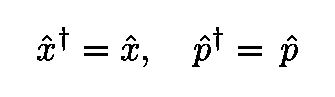

等式 85:位置和动量算符是厄米的。

算子的性质之一是它们乘积的厄米共轭交换它们的次序

方程 86:取两个算子乘积的厄米共轭，交换它们的顺序。

这意味着:

方程式 87:位置-动量换位子是反厄米的。

因此，换位子方程的左边是反埃尔米特的。这意味着虚单元 *i* 必须出现在右侧。

对于[自旋](https://en.wikipedia.org/wiki/Spin_(physics))也发生了类似的争论。自旋可以被[定义为](https://en.wikipedia.org/wiki/Spin_(physics))一种“内禀角动量”,它有三个分量:

方程式 88:自旋算符的三个组成部分。

自旋算符有两个特征值

方程 89:自旋算符的两个特征值。

图 36:自旋粒子的示意图([来源](https://www.reddit.com/r/chemistrymemes/comments/dxa2jz/electron_spin/))。

参见我以前的一篇文章(下面的链接)了解更多关于旋转的细节。

 [## 深度学习的可解释性:来自物理学的提示

### 从物理学角度看深层神经网络

towardsdatascience.com](/deep-learning-explainability-hints-from-physics-2f316dc07727) 

自旋算符服从下面的[换向关系](https://en.wikipedia.org/wiki/Commutation_relations)

等式 90:自旋[换向关系](https://en.wikipedia.org/wiki/Commutation_relations)。索引可以是 x、y 或 z。

其中对象 **ε** 为 [Levi-Civita 符号](https://en.wikipedia.org/wiki/Levi-Civita_symbol)，由下图所示数组表示。

图 37:代表 [Levi-Civita 符号](https://en.wikipedia.org/wiki/Levi-Civita_symbol) ( [来源](https://en.wikipedia.org/wiki/Levi-Civita_symbol))的 3 x 3 x 3 数组。

出于与上面讨论的位置和动量情况相同的原因，虚部必须出现在右手侧，以确保换向器的气密性。

## 斯图克伯格的真实量子力学

在 20 世纪 60 年代发表的三篇论文中(见 [Mehra](https://books.google.com.br/books?id=B5fqCAAAQBAJ&printsec=frontcover&dq=The+Physicist%27s+Conception+of+Nature&hl=en&sa=X&ved=0ahUKEwjo2_SZ-c7mAhVaLbkGHc81AXQQ6AEIKTAA#v=onepage&q=The%20Physicist's%20Conception%20of%20Nature&f=false) ),瑞士数学家和物理学家 [E. Stueckelberg](https://en.wikipedia.org/wiki/Ernst_Stueckelberg) 和几个同事成功地用真实的**希尔伯特空间建立了量子力学的数学框架。然而，为了获得正确的量子力学测不准关系，额外的超选择规则是必要的。根据这个超选择规则，所有的可观测量都应该用一个符合以下条件的算子 *J* 来交换:**

方程 91:与 Stueckelberg 的实希尔伯特空间量子力学框架中的超选择规则相关的算符 J 的性质。

正如 [Jauch](https://books.google.com.br/books?id=B5fqCAAAQBAJ&pg=PA318&lpg=PA318&dq=Stueckelberg+josef+jauch+%22as+far+as+I+could+make+out%22&source=bl&ots=ZMoi3DGUYE&sig=ACfU3U25uhWejoSPJvgPSGqPfvaxaYEMFA&hl=en&sa=X&ved=2ahUKEwiNubPn-M7mAhXwE7kGHdsWBq8Q6AEwAHoECAIQAQ#v=onepage&q=Stueckelberg%20josef%20jauch%20%22as%20far%20as%20I%20could%20make%20out%22&f=false) 所指出的，这有两层含义:

*   运算符 *J* 总是可以表示为

*   这个补充了超选择规则的实希尔伯特空间和复希尔伯特空间之间是完全等价的。

图 38:1934 年的物理学家 e .斯特克尔伯格。他和他的合作者一起展示了在真实的希尔伯特空间上建立量子力学框架是可能的，只要包含一个额外的(超级选择)算符规则([来源](https://en.wikipedia.org/wiki/Ernst_Stueckelberg))。

现在让我们讨论“[量子引力](https://en.wikipedia.org/wiki/Quantum_gravity)谜题”的第二块，即[经典引力](https://en.wikipedia.org/wiki/Gravity)。

# 爱因斯坦引力理论的鸟瞰图

我将首先定义经典重力理论中的几个概念，这些概念对于理解量子化重力的问题是必要的。

## 逆变和协变向量

一个[流形](https://en.wikipedia.org/wiki/Manifold)是一个([拓扑](https://en.wikipedia.org/wiki/Topological_space))空间，类似于[欧几里德(或平坦)空间](https://en.wikipedia.org/wiki/Euclidean_space)在其每个点附近(你可以在这里找到更多细节[)。下图(左侧)说明了流形的局部平坦特性。](https://en.wikipedia.org/wiki/Manifold)

图 39:在左边，显示了一个二维球体，这是一个简单的[流形](https://en.wikipedia.org/wiki/Manifold)的例子([源](https://www.facebook.com/locoflat/))。流形是[拓扑空间](https://en.wikipedia.org/wiki/Topological_space)，类似于欧几里德或平坦空间(显示在图的右手边)，靠近它的每个点([源](https://en.wikipedia.org/wiki/Cartesian_coordinate_system))。

在讨论广义相对论之前，我们先来快速看一下爱因斯坦的[狭义相对论](https://en.wikipedia.org/wiki/Special_relativity) (SR)的数学结构。在随机共振中，[事件](https://en.wikipedia.org/wiki/Event_(relativity))，可以定义为“[与时空](https://en.wikipedia.org/wiki/Event_(relativity))中的点相关的瞬时物理情况或事件”。如果两个事件 A 和 B 发生在非常接近的时空点

方程式 92:时空中两个无限接近的点。

它们之间的时空间隔

方程式 93:平坦时空中不变区间的定义。

是一个[不变量](https://en.wikipedia.org/wiki/Special_relativity#Invariant_interval)当从不同的参考系测量时(常数 *c* 是光速)。为了便于说明，请考虑下面的[动画](https://en.wikipedia.org/wiki/Special_relativity#Invariant_interval)。

图 40:显示事件顺序对参考帧的依赖性的动画。详细解释见正文([来源](https://en.wikipedia.org/wiki/Special_relativity#Invariant_interval))。

动画显示了三个事件，即从不同参考帧测量的 A、B 和 C。对于一个静止的参考系 *S* 中的观察者(对应动画中的 *v* =0)，可以任意选择，事件是同时发生的(三个都发生在 *t* =0)。

图 41:在这个参考系中，事件是同时发生的。

对于不同的移动帧，事件的顺序会发生变化:

*   在相对于 *S* 移动且 *v* = 0.3 *c* 的参考系中的观察者以 C → B → A 的顺序看到事件

图 42:在第二个参考系中，在 *v* = 0.3 *c，*相对于 *S* 移动，事件以 C → B → A 的顺序发生

*   相对于 *S* 以 *v* = -0.5 *c* 移动的参考系中的另一个观察者以 A → B → C 的顺序观察事件

图 43:在第三个参考坐标系中，相对于 *S* 在 *v* = -0.5 *c 处移动，*事件以 A → B → C 的顺序发生

考虑一个 4 维时空流形和其上的一条曲线 *γ* 。由于坐标“只是手段，并不存在先验的性质”(见[彭罗斯](https://en.wikipedia.org/wiki/The_Road_to_Reality))，我们可以选择任何坐标系来描述曲线。

图 44:圆柱体是 2D 流形的另一个简单例子。曲线γ中的点 **x** 由λ ( [源](https://en.wikipedia.org/wiki/Manifold))参数化。

然后，我们可以使用任意实参数 *λ* 写出 *γ* 的方程:

方程 92:定义曲线 *γ的四个方程。*

为了具体起见，考虑一个 3D 平面空间中的例子(为了简单起见，而不是时空)。沿着圆柱表面的螺旋曲线由以下参数方程给出:

方程 93:沿圆柱表面盘旋的曲线的参数方程。圆柱体的轴沿着 x 轴。

图 45:等式给出的曲线。93.

在流形的每个点 *P* 处，都有一个包含与曲线 *γ相切的向量的切平面。*

图 46:与一个流形相切的平面和 P 处的切向量(基于这个[源](https://www.science20.com/theory_just_about_anything/what_geometry_spacetime_%E2%80%94_what_space_%E2%80%94_innerproduct_spaces-89726))。

一种方法是将这些切向量表示为:

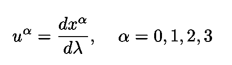

方程 94:与曲线γ相切的向量，由λ参数化。

为了具体起见，让我们考虑 2D 平面中圆形路径的简单例子。(参数)方程是:

方程 95:描述 2D 平面中的圆的参数方程。

因此，切线向量的分量为:

等式 96:在 2D 平面中与圆相切的向量分量。

在任意坐标变换之后

方程式 97:任意坐标变换。

例如，举例来说，

方程式 98:从笛卡尔坐标到球坐标的转换。

切线向量的新分量可以通过直接应用[链规则](https://en.wikipedia.org/wiki/Chain_rule)获得:

方程 99:矢量分量在任意坐标变换后如何变化。

像*这样变换的物体称为[逆变矢量](https://en.wikipedia.org/wiki/Introduction_to_the_mathematics_of_general_relativity#Vectors)。请注意，我们使用所谓的[求和约定](https://en.wikipedia.org/wiki/Einstein_notation)(或爱因斯坦符号)，根据该约定，每当重复一个索引时，对该索引的所有可能值的求和是隐式的。例如:*

**

*等式 100:求和约定(或爱因斯坦符号)的一个例子。*

*广义相对论中另一个重要的数学对象是[协变矢量](https://en.wikipedia.org/wiki/Dual_space)，它转化为(参见[泊松](https://books.google.com.br/books/about/A_Relativist_s_Toolkit.html?id=bk2XEgz_ML4C&redir_esc=y)):*

**

*方程 101:任意坐标变换后，对偶矢量分量如何变化。*

*由于对偶向量不如向量那样广为人知，所以让我们考虑一个例子，并计算一个协变向量**在球坐标中的分量，给定其在笛卡尔坐标中的分量:***

******

***方程式 102:笛卡尔坐标中共变向量的分量。***

***为了找到球坐标中的分量，我们使用等式。101，具有以下变换方程:***

******

***方程式 103:球坐标和笛卡尔坐标之间的坐标转换。***

***其中使用了以下名称:***

******

****A* 在新坐标系中的第一个分量是:***

****

**等式 104:协变向量 a 的等式 75。**

**快速计算得出:**

****

**等式 105:协变向量的第一个分量 **A** 。**

**类似地得到 ***A*** 的另外两个分量。**

****

**图 47:动画显示了非正交基下对偶矢量和矢量的分量是如何变化的([源](https://en.wikipedia.org/wiki/Covariance_and_contravariance_of_vectors))。**

**注意，我们用上标来表示反变向量的分量，而用下标来表示协变向量的分量。**

## **张量**

**我现在将介绍[张量](https://en.wikipedia.org/wiki/Introduction_to_the_mathematics_of_general_relativity#Tensors)的概念(参见[狄拉克](https://books.google.com.br/books/about/General_Theory_of_Relativity.html?id=Jtu-n8AzJhMC&redir_esc=y))。向量是一阶张量。让我们考虑更高阶的张量。我们首先建立数量**

****

**方程 106:二阶逆变张量的简单例子。**

**这是一种特殊的张量。因为它有两个[上指标](https://en.wikipedia.org/wiki/Covariance_and_contravariance_of_vectors)，它被称为第二[秩](https://en.wikipedia.org/wiki/Tensor_(intrinsic_definition)#Tensor_rank) [逆变](http://mathworld.wolfram.com/ContravariantTensor.html)张量。**

****

**图 48:[柯西应力张量](https://en.wikipedia.org/wiki/Cauchy_stress_tensor)是二阶张量的一个例子。它描述了材料对力的反应，有两个方向与力的法向和剪切分量相关联([源](https://en.wikipedia.org/wiki/Cauchy_stress_tensor))。**

**将几个以与 ***T*** 相同方式构造的张量相加，可以得到一个一般张量:**

****

**方程 107:一般二阶逆变张量的一个例子。**

**在坐标变化下， ***T*** 变换为:**

****

**方程 108:坐标变换后二阶逆变张量如何变化。**

**如果我们有 2 个较低(而不是较高)的指数，张量被称为是一个二阶协变张量。张量也可以有混合指数。一个例子是:**

****

**方程 109:坐标变换后混合张量的分量如何变化。**

**一个一般的( *n* ，*m*)-张量有 *n* 个上索引和 *m* 个下索引和变换，就像逆变向量和协变向量的乘积。方程中混合张量的变换。109 就是一个例子。另一个例子如下**

****

**方程式 110:坐标变换后(2，2)-张量如何变化。**

**其中( *n* ， *m* )=(2，2)。**

****张量场** 如果与流形上的每个点相关联的都有一个张量，则定义一个 [**张量场**](https://en.wikipedia.org/wiki/Tensor_field) 。下图显示了一个简单的例子，欧几里得空间中球体上的向量场。**

****

**图 49:一个球上的张量场(更确切地说是一个向量场)。**

## **协变导数**

**流形点 *P* 处的张量未在流形上定义**。相反，它被限定在与歧管**在 *P* 处相切的平面**中。因此，在弯曲时空中，不同点的张量不能被张量相减，因为它们“生活”在不同的切面中(更多细节见[泊松](https://books.google.com.br/books/about/A_Relativist_s_Toolkit.html?id=bk2XEgz_ML4C&redir_esc=y))。****

****

**图 50:该图显示了歧管不同点的不同切面([来源](http://www.science4all.org/article/spacetime-of-general-relativity/))。**

**换句话说，减去不同点上的张量不会产生张量。因此，分化的概念必须重新定义。新型导数称为[协变导数](https://en.wikipedia.org/wiki/Covariant_derivative)，它涉及到[平行传送](https://en.wikipedia.org/wiki/Parallel_transport)的操作。**

****

**图 51:左边是一个向量在球面上绕一个闭环(A → N → B → A)的平行输运([来源](https://en.wikipedia.org/wiki/Parallel_transport))。在右边，一个切线向量沿着球面上的一条曲线平行移动([来源](https://en.wikipedia.org/wiki/Affine_connection))。**

**现在让我们把这些陈述用数学形式表达出来。首先，假设我们有一个定义在流形上一条曲线周围的向量场 ***V*** ，它由 *λ* 参数化。设 ***u*** 为与曲线相切的向量(如图 41)。现在，考虑曲线上坐标为 *x* 和 *x + dx* 的两点。如上所述，以下目的**

****

**等式 111:一个矢量在 ***x*** 的分量与另一个矢量在***x***+***dx****的分量之差。***

****

**图 55:流形上两个不同点上的张量场 V。分量的简单减法不是张量对象(基于[来源](https://en.wikipedia.org/wiki/Affine_connection))。**

**不是张量，因为经过坐标变换后，它变成:**

****

**方程 112:因为第二项的存在，偏导数不是张量。**

**为了获得适当的张量导数，首先需要将在点 *x* 定义的向量 ***V*** 并行传输到点 *x* + *dx* ，然后将其从在 *x* + *dx* 定义的向量 ***V*** 中减去。这个减法的结果必须在 ***V*** 和 *dx* 上是线性的，这导致了被称为[连接](https://en.wikipedia.org/wiki/Metric_connection)**γ**的(非张量)对象的定义**

****

**等式 113:向量 **V** 的分量在并行传输后的变化以及连接**γ的隐式定义。****

**现在将成为张量对象的协变导数包括沿曲线相对于参数 *λ* 的两个导数之和:**

****

**等式 114:协变导数包括等式 114 给出的变量之和。112 和 Eq。113.**

**其中协变导数定义为:**

****

**方程 115:协变导数的定义，一个张量对象。**

**撇开
不谈，这个讨论可以用更抽象的表述来完成(例如，参见[【史高斯】](https://books.google.com.br/books?id=GgRRt7AbdwQC&printsec=frontcover&dq=schutz+general+relativity&hl=en&sa=X&ved=0ahUKEwi6i-C9tOjmAhV2HrkGHah-DmoQ6AEIKTAA#v=onepage&q=schutz%20general%20relativity&f=false))。相反，我选择使用一种更简单的方法(例如在[狄拉克](https://books.google.com.br/books?id=GVwzb1rZW9kC&redir_esc=y)、[泊松](https://books.google.com.br/books/about/A_Relativist_s_Toolkit.html?id=bk2XEgz_ML4C&redir_esc=y)或[朗道和利夫希兹](https://books.google.com.br/books?id=HudbAwAAQBAJ&printsec=frontcover&dq=Landau+and+Lifshitz+classical+fields&hl=en&sa=X&ved=0ahUKEwjE17bktOjmAhVFD7kGHSeJCiAQ6AEIMDAB#v=onepage&q=Landau%20and%20Lifshitz%20classical%20fields&f=false)中)，其中张量以“[老式方式](https://books.google.com.br/books/about/A_Relativist_s_Toolkit.html?id=bk2XEgz_ML4C&redir_esc=y)定义。**

## **爱因斯坦场方程**

**在[广义相对论](https://en.wikipedia.org/wiki/General_relativity) (GR)中，时空的几何**就是**引力。具有平坦闵可夫斯基度规线元素的狭义相对论的刚性时空变成了动态的。这是因为物质和能量扭曲了时空的几何。广义度量元素可以写成如下形式:**

****

**方程 116:线元素的一般表达式。**

**其中 ***g*** 为[度规张量](https://en.wikipedia.org/wiki/Metric_tensor)。在平坦闵可夫斯基空间的情况下，度量张量 ***g*** 表示:**

****

**方程 117:对应于平坦闵可夫斯基线元素的度量张量。**

**为了看得更清楚，我们写出等式。116 显式使用等式中给出的 ***g*** 。117:**

****

**等式 118:对于等式给出的 **g** 。117，情商。116 成为闵可夫斯基线元素。**

**[爱因斯坦场方程](https://en.wikipedia.org/wiki/Einstein_field_equations) (EFE)建立了时空几何与其中物质和能量分布之间的联系，用张量来表示。张量在广义相对论中很重要，有几个原因，例如在[彭罗斯](https://en.wikipedia.org/wiki/The_Road_to_Reality)中讨论过。主要的一个事实是，EFE 方程服从一般协方差的[原理](https://en.wikipedia.org/wiki/General_covariance)。根据这个原理，物理定律的形式(在目前的情况下，广义相对论的方程)在任意坐标变换下应该是不变的。这是有意义的，因为如上所述，坐标只是人工标注。因此它们不是基本的，在这样的重新标记下，物理定律应该是不变的。**

****

**图 56:爱因斯坦广义相对论手稿中的一页([来源](http://tusb.stanford.edu/2010/03/einsteins_relativity_manuscrip.html))。**

**张量是编写广义相对论方程的关键，因为张量方程具有这样的性质，如果它在一个坐标系中成立，它在所有坐标系中都成立。引用爱因斯坦在他的一篇[广义相对论论文](https://en.wikisource.org/wiki/The_Foundation_of_the_Generalised_Theory_of_Relativity)中的话:**

> **“一般协变理论的基本思想是这样的:—关于任何坐标系，让某些东西(“张量”)由若干被称为张量分量的坐标函数来定义。现在有了某些规则，根据这些规则，当原来的坐标系已知时，以及当连接两个坐标系的变换已知时，可以在新的坐标系中计算出这些分量。此后称为张量的事物还具有这样的性质，即它们的分量的变换方程是线性的和齐次的；因此，如果新系统中的所有元件在原系统中都为零，那么它们就会消失。因此，自然法则可以通过将张量的所有分量都等于零来表述，因此它是一个一般的协变方程；因此，当我们寻求张量的形成定律时，我们也达到了建立一般协变定律的方法。”**
> 
> **爱因斯坦(1916 年)**

**[爱因斯坦场方程](https://en.wikipedia.org/wiki/General_relativity#Einstein's_equations)，包括[宇宙常数](https://en.wikipedia.org/wiki/Cosmological_constant)，读作:**

****

**方程 119:爱因斯坦场方程。**

**张量 ***G*** 被称为[爱因斯坦张量](https://en.wikipedia.org/wiki/Einstein_tensor)，它与[瑞西曲率张量](https://en.wikipedia.org/wiki/Ricci_curvature) ***R*** 有关。后者测量一个公制球(由一个[球](https://en.wikipedia.org/wiki/Sphere)包围的空间)的体积在一个流形中增长的速率(见[此链接](http://mathworld.wolfram.com/RicciCurvatureTensor.html)和下面的讨论)。换句话说， ***G*** 代表了时空的几何性质(比如它的曲率)。左手边的*λ*就是所谓的[宇宙常数](https://en.wikipedia.org/wiki/Cosmological_constant)、[真空能量](https://en.wikipedia.org/wiki/Vacuum_energy)或者空间的能量密度。右手边是[能量动量张量](https://en.wikipedia.org/wiki/Stress%E2%80%93energy_tensor#The_Einstein_field_equations)与物质(或能量)的分布有关，它使时空变形。**

*****G*** 和 ***R*** 的关系为:**

****

**方程 120:用[里奇曲率张量](https://en.wikipedia.org/wiki/Ricci_curvature)T42 曲率张量和[标量曲率](https://en.wikipedia.org/wiki/Scalar_curvature) R 表示的爱因斯坦张量**

**其中 *R* 是[标量曲率](https://en.wikipedia.org/wiki/Scalar_curvature)，它是[黎曼流形](https://en.wikipedia.org/wiki/Riemannian_manifold)中一个小(测地线)球的体积与欧几里德空间中一个球的体积相差多少的度量(参见这个[链接](https://en.wikipedia.org/wiki/Scalar_curvature))。**

****

**图 57:地球和太阳质量引起的时空变形的二维类比(图片由 [vchal](https://www.shutterstock.com/g/vchal) 提供)。**

**右手边是[能量动量张量](https://en.wikipedia.org/wiki/Stress%E2%80%93energy_tensor#The_Einstein_field_equations)与物质(或能量)的分布有关，它使时空变形。**

****

**图 58:应力能量张量 **T** 的分量。**

**下面是张量在广义相对论中重要性的一个简单例子。考虑能量动量 ***T*** =0 的空间区域，为简单起见，设*λ*= 0。很容易看出 EFE 简化为:**

**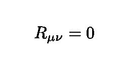**

**情商。121:真空中的爱因斯坦场方程。**

**在任何新的参考系中，Ricci 张量保持等于零，因为:**

****

**情商。122:真空中爱因斯坦场方程的协方差性质。**

**为了更好地理解 ***R*** 的几何意义，理解局部平坦的概念是有用的，根据这一概念，对于时空中的任意点 *P* ，总是可以建立一个坐标系，使得:**

*   **公制 ***g*** 在 *P* 变为闵可夫斯基**

****

**等式 123:时空时间点 *P* 处局部平坦的第一个条件是度量变成局部闵可夫斯基。**

*   **在 *P* 处连接也为零**

****

**等式 124:点 P 处局部平坦的第二个条件，连接消失。**

**现在，使用[费米正常坐标](https://en.wikipedia.org/wiki/Fermi_coordinates)，度规张量 ***g*** 的空间分量可以写成如下:**

****

**等式 125:费米正常坐标的度量张量 **g** 的空间分量的泰勒展开。**

**对于 ***g*** 的其他组件也存在类似的表达式。从这个表达式中，很明显**T5【R测量了某种偏离时空平直度的情况。****

****

**图 59:其他天体的引力导致行星的椭圆轨道旋转或进动。爱因斯坦引力理论最初的主要成功之一是解释了水星的异常进动([来源](https://en.wikipedia.org/wiki/Two-body_problem_in_general_relativity))。**

****引力波** 广义相对论的非线性意味着两个解的线性组合不一定是解:**

****

**方程 125:EFE 的非线性意味着两个解的线性组合可能不是一个解。**

****

**图 60:动画展示了两颗中子星相互绕转时产生的引力波的 2D 表示([来源](https://en.wikipedia.org/wiki/Gravitational_wave))。**

**这意味着时空也与自身相互作用，并可能成为重力波的来源。这是爱因斯坦在 1916 年预测的(见下图)。为了得到引力波方程，我们假设引力场是弱的，这意味着 ***g*** 近似为常数。根据在[狄拉克](https://books.google.com.br/books/about/General_Theory_of_Relativity.html?id=Jtu-n8AzJhMC&redir_esc=y)中的推导，我们得到下面的方程，它的解将包括行波(以光速):**

****

**方程 126:引力场较弱时引力波的运动方程，这意味着 **g** 近似为常数。**

****

**图 61:左边是 1916 年爱因斯坦预言引力波存在的论文([来源](https://web.archive.org/web/20160502130907/http://echo.mpiwg-berlin.mpg.de/ECHOdocuView?url=/permanent/echo/einstein/sitzungsberichte/BGG54UCY/index.meta))。在右边，来自 LIGO 的文章描述了他们对来自一个双星黑洞合并的引力波的观察。**

**2016 年， [LIGO](https://en.wikipedia.org/wiki/LIGO) 和[处女座](https://en.wikipedia.org/wiki/Virgo_interferometer)国际科学合作组织宣布他们已经[直接观测到引力波](https://en.wikipedia.org/wiki/Gravitational_wave)。**

****

**图 62:LIGO 天文台测量引力波的结果。LIGO 在利文斯顿和汉福德都有探测器。这些图表将结果与广义相对论的预测进行了比较。**

****爱因斯坦-希尔伯特作用** 广义相对论的爱因斯坦-希尔伯特作用(包括吉本斯-霍金-约克边界项)由下式给出:**

****

**方程 127:广义相对论的爱因斯坦-希尔伯特效应。**

**EFE 通过要求动作相对于度量 ***g*** 的变化是稳定的来获得。第二项是流形(对于紧致流形)的边界∂ *M* 上的积分，其被包括以允许在∂ *M* 上为零但其法向导数不为零的**gg**的变化。这个积分中的符号 *K* 和 *h* 代表[外曲率](http://mathworld.wolfram.com/ExtrinsicCurvature.html)和[诱导度量](https://en.wikipedia.org/wiki/Induced_metric)的迹，这两个都将很快解释。**

## **经典宇宙学**

**现代宇宙学的诞生发生在爱因斯坦发表了他的论文“[广义相对论的宇宙学考虑](http://echo.mpiwg-berlin.mpg.de/ECHOdocuView?url=/permanent/echo/einstein/sitzungsberichte/S250UZ0K/index.meta)”，该论文考虑了整个宇宙的物理学。在这篇文章中，爱因斯坦假设宇宙有一个封闭的空间几何，更具体地说是一个三维球体，在空间中是有限的，但却是无界的。然而，为了找到他的场方程的解，他不得不引入一个新项，EFE 中的*λ*项。**

****

**图 63:爱因斯坦的论文《关于广义相对论的宇宙学思考》催生了现代宇宙学([来源](http://echo.mpiwg-berlin.mpg.de/ECHOdocuView?url=/permanent/echo/einstein/sitzungsberichte/S250UZ0K/index.meta))。**

****膨胀的宇宙** 如今，人们普遍认为我们的宇宙正在膨胀。下图显示了扩展的各个阶段(左边的)。下图显示了膨胀宇宙的[膨胀气球类比](http://www.hk-phy.org/articles/univexpand/univexpand_e.html)，我们可以将星系的运动与其表面的点的运动进行比较。必须指出的是，“气球宇宙”是一个二维的模型，它并不存在于一个“宇宙之外”的三维空间中换句话说，气球不是从一个中心点扩展到它以外的区域。**

****

**图 64:左边显示了宇宙膨胀的阶段([来源](https://en.wikipedia.org/wiki/Expansion_of_the_universe))。右边是“气球类比”，根据这一类比，星系的行为类似于正在膨胀的气球表面上的点。**

****Friedmann-lematre-Robertson-Walker 度量** 如果考虑足够大的区域(在星系团的水平上)，宇宙的几何形状(度量的空间部分)基本上是均匀的(在所有位置都是相同的)和各向同性的(在所有方向上都是相同的)。这些假设构成了所谓的[宇宙学原理](https://en.wikipedia.org/wiki/Cosmological_principle)。**

****

**图 65:各向同性和同质性的概念([来源](http://abyss.uoregon.edu/~js/cosmo/lectures/lec05.html))。**

**基于这些性质，人们可以选择常曲率空间。相应的度量是所谓的[Friedmann-lema tre-Robertson-Walker](https://en.wikipedia.org/wiki/Friedmann%E2%80%93Lema%C3%AEtre%E2%80%93Robertson%E2%80%93Walker_metric)或 FLRW 度量，它是 EFE 的精确解。它的空间部分可以用不同的方式书写，其中之一是**

**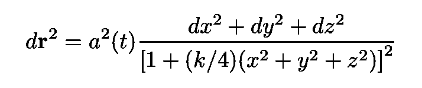**

**等式 128:写出 FRW 度量空间部分的一种可能方式。**

**其中 *a* ( *t* )是[宇宙标度因子](https://en.wikipedia.org/wiki/Scale_factor_(cosmology))，是一种衡量宇宙大小的方式。在这个表达式中，参数 *k* 定义了 FLRW 宇宙的形状，并取决于宇宙的曲率类型，如下图所示。 *k* 的三个可能值是+1、0 或 1，分别对应正、零和负曲率。**

****

**图 66:FRW 宇宙可以是封闭的(正弯曲)，像马鞍一样开放的(负弯曲)或者平坦的(零曲率)([来源](https://en.wikipedia.org/wiki/Shape_of_the_universe))。**

**人们可以引入球坐标**

****

**方程式 127:球坐标。**

**并定义无量纲径向坐标:**

****

**方程 128:用通常的 r 表示的量纲参数 r，r 的上面有~。**

**其中~表示通常的径向变量。现在包括时间部分的 FLRW 度量变为:**

****

**等式 129:另一种写 FLRW 线元素的方法。**

****

**图 67:类空的均匀和各向同性超曲面的选择，它们是具有恒定空间曲率的三个空间，形成 FLRW 时空([来源](https://books.google.com.br/books?id=SbZpFMOwhzMC&printsec=frontcover&dq=Griffiths+Podolsky&hl=en&sa=X&ved=0ahUKEwi-wvOl5KnmAhU9I7kGHde6C4AQ6AEIKTAA#v=onepage&q=Griffiths%20Podolsky&f=false))。**

**为了简单起见，让我们选择一个球形的、封闭的宇宙，其中 *k* =1。然后可以重写线元素的空间部分，定义:**

****

**该指标变为:**

****

**等式 130:正弯曲宇宙的 FLRW 度量的空间部分。**

**上述等式中的变量具有以下范围:**

****

**等式 131:等式中变量的范围。130.**

**完整的行元素，包括时间部分，如下所示:**

****

**等式 132:包括时间部分的完整 FLRW 线元素。**

**正如我们之前已经提到的，时空中的点和时空坐标不是一回事。时空坐标是一个**将**分配给**实际点**的**标签**，因此他们的选择不会改变物理学。方程给出的线元中的空间坐标 *r* 、 *θ* 和 *ϕ* 。132 据说是**共动**。见下图。随着宇宙比例因子的增加，点之间的(适当的)距离增加，但是网格坐标保持不变(为了简单起见，角坐标被省略)。**

****

**图 68:一片膨胀宇宙的示意图。宇宙尺度 facto，在图中用 R(t)表示，对应于文中的函数 a(t)，l(t)是适当的距离，R 是移动距离([源](http://people.virginia.edu/~dmw8f/astr5630/Topic16/t16_scale_factor.html))。**

**基于各向同性和均匀性的假设，爱因斯坦场方程右边的能量动量张量 ***T*** 变得简单多了(变成了“[完美流体](https://en.wikipedia.org/wiki/Perfect_fluid)”)。更具体地说，物质可以仅用其密度和压力来描述，密度和压力分别由下式给出:**

****

**换句话说，两者都只取决于宇宙比例因子 *a* ( *t* )，它只是时间的函数。EFE 于是变成了[弗里德曼方程](https://en.wikipedia.org/wiki/Friedmann_equations):**

****

**方程 133:当能量-动量张量是各向同性和均匀的时，[弗里德曼方程](https://en.wikipedia.org/wiki/Friedmann_equations)是 EFE。**

****

**图 69:俄罗斯物理学家亚历山大·弗里德曼([来源](https://en.wikipedia.org/wiki/Alexander_Friedmann))。在右边，弗里德曼陨石坑，以他的名字命名，位于月球的远端([来源](https://en.wikipedia.org/wiki/Fridman_(crater)))。**

**进行以下替换:**

****

**等式 134:通过这些替换，λ可以被解释为来源于[暗能量](https://en.wikipedia.org/wiki/Dark_energy)，一种具有负压的能量形式。**

**人们可以将λ解释为来自一种叫做[暗能量](https://en.wikipedia.org/wiki/Dark_energy)的能量密度形式，它具有负压:**

****

**方程式 135:负压下的真空能量。**

# **正则量子引力**

**[规范量子引力](https://en.wikipedia.org/wiki/Canonical_quantum_gravity) (CQG)是发展广义相对论的哈密顿公式的量子版本的一个总体努力。在这个过程中，可以使用不同的规范变量。在这里，我将讨论最直接的策略，即所谓的[几何动力学](https://en.wikipedia.org/wiki/Geometrodynamics)或广义相对论的[初始值公式](https://en.wikipedia.org/wiki/Initial_value_formulation_(general_relativity))([环圈量子引力](https://en.wikipedia.org/wiki/Loop_quantum_gravity)是一个流行的选择)。它可以被定义为“试图仅仅用几何学的术语来描述时空和相关的现象[……]并将广义相对论重新表述为一个三度规的构型空间”。**

**但是在全面考虑地质动力学之前，我将考虑一个非常简单的例子。**

## **量子宇宙起源的简单模型**

**考虑一个封闭的宇宙( *k* =1)，“从无到有”，只有**恒定的真空能量密度**。通过选择这些参数，弗里德曼方程描述了所谓的[膨胀阶段](https://en.wikipedia.org/wiki/Inflationary_epoch)。在这个阶段，宇宙以指数速度膨胀。**

**第一个弗里德曼方程变成(设置 *c* =1):**

****

**方程 136:仅含真空能(设 c=1)的封闭宇宙(k=1)的第一个弗里德曼方程。**

**其中“vac”代表真空。注意等式。136 具有与能量为 *E* =0 的哈密顿量相同的形式结构。因此，我们可以把方程的第一项联系起来。136 与“种”动能相对应的“速度”(这是宇宙尺度因子的膨胀率):**

****

**第二项是“势能”(在括号内)。遵循规范的量化协议，我们定义:**

****

**方程 137:与动量共轭 a 相关的量子算符。**

**(其中[简化普朗克常数](https://en.wikipedia.org/wiki/Planck_constant#Value) t 被设置为 1)。要写 Eq。根据动量算符，我们必须用膨胀率来表示共轭动量。这可以用最小作用原理来完成。在这种情况下，该动作可以表示为等于:**

****

**方程式 138:封闭的空 FLRW 宇宙的作用。**

**其中:**

**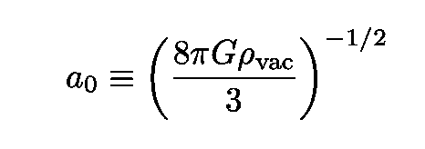**

**等式 139:常数因子 a₀.的定义**

**从 *S* 我们得到:**

****

**方程 140:与 a 共轭的动量。**

**情商。136 然后变成:**

****

**方程式 141:方程式。136 用对 a 的共轭动量表示。**

**我们现在准备好利用方程来量子化这个简单情况下的爱因斯坦方程。137.我们得到了著名的[惠勒-德威特方程](https://en.wikipedia.org/wiki/Wheeler%E2%80%93DeWitt_equation) (WdW)的一个简单版本:**

****

**方程 142:封闭的空 FRW 宇宙的惠勒-德威特方程。**

**其解是“宇宙波函数”。在下一节中，我们将看到这个过程如何从线元素仅依赖于比例因子 *a* ( *t* )的简单情况扩展到广义时空。这种简化的情况被称为[微超空间](https://en.wikipedia.org/wiki/Minisuperspace)近似。**

**但在此之前，我先说几句重要的话(它们大多是基于[穆哈诺夫和 Winitzki](https://books.google.com.br/books?id=vmwHoxf2958C&printsec=frontcover&dq=curved+spacetime+mukhanov+winitzki&hl=en&sa=X&ved=0ahUKEwj9gvi_kt_kAhXEH7kGHVTPAG4Q6AEIKDAA#v=onepage&q=curved%20spacetime%20mukhanov%20winitzki&f=false) 和[阿特卡兹](https://aapt.scitation.org/doi/10.1119/1.17479))。**

****

**图 70:WdW 方程的一个可能的初始条件。参见下面的讨论([来源](https://www.quantamagazine.org/physicists-debate-hawkings-idea-that-the-universe-had-no-beginning-20190606/))。**

****时空的概念消失** 在目前的语境中，量子化意味着时空本身的概念变得模糊不清。为了更好地理解这一点，考虑以下类比:**

****

**方程 143:宇宙尺度因子及其共轭动量的正则对易关系和不确定关系。**

**连同情商。140 它们意味着比例因子及其变化率**

****

**方程式 144:宇宙比例因子及其随时间的变化率。**

**不能同时知道。但是为了完全确定在任何时间 *t* 的 FLRW 度量，并因此刻画时空的结构，我们**需要**这两个量。因此，时空的经典概念在量子力学中消失了。**

****

**图 71:模糊的量子时空有时被称为量子泡沫。参见下面的讨论([来源](https://physics.aps.org/articles/v12/105))。**

****初始条件** 为了找到 WdW 方程的解，我们需要初始或[边界条件](https://en.wikipedia.org/wiki/Boundary_value_problem)。正如我以前的一篇文章中的[所讨论的，两个最著名的例子是](/the-mysterious-connection-between-cyclic-imaginary-time-and-temperature-c8fb241628d9)[量子隧道](https://arxiv.org/abs/1808.02032)和 [Hartle-Hawking(或无边界提议)](https://en.wikipedia.org/wiki/Hartle%E2%80%93Hawking_state)边界条件。这些条件的详细讨论超出了本文的范围，但可以在[章节](https://books.google.com.br/books?id=TkFNPIOruZAC&printsec=frontcover&source=gbs_ge_summary_r&cad=0#v=onepage&q&f=false)中找到。下图说明了这两种情况。**

****

**图 72:对应于 Hartle-Hawking (HH)和 tunneling (T)边界条件的解(来源[来源](https://books.google.com.br/books?id=FwpQDwAAQBAJ&pg=PT211&lpg=PT211&dq=%22toward+the+planck+epoch%22+book&source=bl&ots=--teQy5t3Z&sig=ACfU3U2HCoGkqEOSrHVxg66Yr7nk1INrgw&hl=en&sa=X&ved=2ahUKEwiG-Kj0yuvkAhUWEbkGHfgBCwAQ6AEwBXoECAkQAQ#v=onepage&q=%22toward%20the%20planck%20epoch%22%20book&f=false)中的图的修改版本)。**

**数学上，情商。142、描述了一个“粒子”用“位置”*一个* ( *t* )隧穿一个势垒。下图是亚原子粒子的[量子隧穿。](https://en.wikipedia.org/wiki/Quantum_tunnelling)**

****

**图 73:部分隧穿势垒的电子波包([来源](https://en.wikipedia.org/wiki/Quantum_tunnelling))。**

**最初在“原点” *a* =0 处的“粒子”的隧穿对应于从零尺寸宇宙(“无”)的演化，该宇宙自发地非奇异地出现(尺寸为 *a* = *a* ₀ > 0)。这个事件发生的概率可以用基本的量子力学来计算。结果是:**

****

**方程 145:通过隧道量子宇宙发生的概率。**

**这个表达式可以使用[退相干历史](https://en.wikipedia.org/wiki/Consistent_histories)的概念来解释，其中概率被分配给宇宙的可能历史(更多细节见 [Atkatz](https://aapt.scitation.org/doi/10.1119/1.17479) 和其中的参考文献)。这种方法将量子力学规则应用于单一系统，与[标准解释](https://en.wikipedia.org/wiki/Copenhagen_interpretation)形成对比，根据标准解释，宇宙被分为一个系统集合，即“经典观测系统”和“量子观测系统”，当进行测量时，这两个子系统相互作用，导致量子波函数的所谓[坍缩。](https://en.wikipedia.org/wiki/Wave_function_collapse)**

**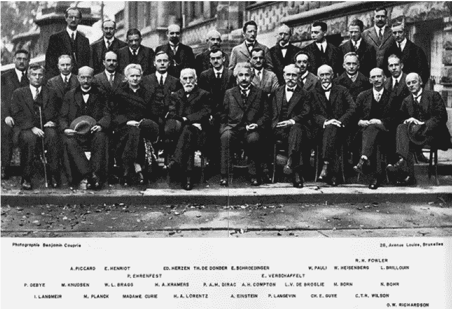**

**图 74:布鲁塞尔索尔维会议(1927)因其关于量子力学正确解释的讨论而闻名([来源](https://www.ias.edu/ideas/2011/bernstein-quantum-story))。**

**在一般情况下，度规的空间部分，或三维几何，并不具有 FLRW 型宇宙的所有对称性。因此，宇宙波函数ψ的论点不是一个单一的函数——在 FRW 的例子中是一个*一个* ( *t* )，而是一组描述三维几何的函数。更具体地说，ψ变成了一个[泛函](https://en.wikipedia.org/wiki/Functional_(mathematics))，而不是定义在[超空间](https://en.wikipedia.org/wiki/Superspace#In_general_relativity)上的一个函数(一个泛函取一个整函数并返回一个数)，超空间是广义相对论的构型空间，所有三维几何的空间。在最小超空间近似的最大对称情况下，我们只需要考虑超空间的一个子空间。**

****

**图 75:经典超空间，其中三个几何图形 **h** ⁽ ⁾和 **h** ⁽ ⁾(两个超曲面)之间的轨迹是两个时空。**

**Eq 的一个结果。143 是在量子宇宙学中，超空间轨迹(如上图所示)变得“泡沫化”，通常被称为“[时空或量子泡沫](https://www.sciencedirect.com/science/article/abs/pii/0003491657900507)”。**

## **参数化粒子动力学:热身**

**我们可以通过首先检查一个非相对论性粒子的动力学的参数化来使(规范地)量子化引力的问题变得更容易理解(这一节紧跟在 [D'Eath](https://books.google.com.br/books?id=TkFNPIOruZAC&printsec=frontcover&source=gbs_ge_summary_r&cad=0#v=onepage&q&f=false) 中的分析之后)。由于重新参数化不变性，约束的存在(类似于规范量子引力，将在后面讨论)也将被触及。**

**人们可以通过使用任意参数 *τ* 而不是时间 *t.* 时间 *t* ( *τ* ) 来标记理论的方程，从而将变成动态变量。**

**让我们再次考虑最小作用的[原理，或者更具体地说，](https://en.wikipedia.org/wiki/Principle_of_least_action)[它的修改版本](https://aapt.scitation.org/doi/10.1119/1.1987512)，其中将作用表示为在相空间而不是配置空间中对系统轨迹的积分。**

**在哈密顿形式中(在文章的第一部分中讨论)，坐标和它们的共轭动量是独立的坐标，人们可以独立地改变它们(详情见 [Goldstein](https://books.google.com.br/books/about/Classical_Mechanics.html?id=Spy6xHWFJIEC&redir_esc=y) )。非相对论粒子的作用如下:**

****

**方程式 146:最小作用原理的修改版本，用相空间变量而不是构型空间变量来表示。**

**使用标签 *τ* 对相空间中的路径进行参数化，并将时间变量 *t* 提升到动态变量的等级，定义了以下四分量向量**

****

**其中 *p* 是与*x*正则共轭的动量，那么一个可以重写动作如下**

****

**方程 147:作用表示为对参数τ的积分。**

**从等式中注意到。对应于 *t* 的共轭动量由下式给出:**

****

**方程 148:动量与时间变量 t 共轭。**

**并且改变动作 *p* ₒ，可以获得以下约束:**

****

**方程 149:动态变量服从的约束。**

**对于动态变量，**

****

**方程 150:包括时间 t(τ)的动态变量。**

**等式中的数量。149 被称为“超哈密顿量”([基弗](https://books.google.com.br/books?id=TJ3mRIdG7RQC&printsec=frontcover&dq=kiefer+quantum+gravity&hl=en&sa=X&ved=0ahUKEwifwfrr7oDmAhUZF7kGHU_3B8AQ6AEIKDAA#v=onepage&q=kiefer%20quantum%20gravity&f=false))。一般来说，在重新参数化下不变的理论中，约束方程。149 是服从的。**

****

**图 76:诺贝尔奖获得者 P. M .狄拉克([来源](https://en.wikipedia.org/wiki/Paul_Dirac))和他的[系列讲座](https://books.google.com.br/books?id=GVwzb1rZW9kC&printsec=frontcover&source=gbs_ge_summary_r&cad=0#v=onepage&q&f=false)，其中他扩展了泊松括号以包括具有[第二类约束](https://en.wikipedia.org/wiki/Second_class_constraints)的系统，允许它们经历[规范量子化](https://en.wikipedia.org/wiki/Canonical_quantization) ( [来源](https://books.google.com.br/books?id=GVwzb1rZW9kC&printsec=frontcover&source=gbs_ge_summary_r&cad=0#v=onepage&q&f=false))。**

**遵循[受约束系统的狄拉克哈密顿形式体系](https://en.wikipedia.org/wiki/Dirac_bracket#Generalized_Hamiltonian_procedure)，取约束等式。149 考虑在内，一个拉格朗日乘数项被添加到动作中:**

****

**方程 151:这个动作，现在包括拉格朗日乘数 n。**

**通过相对于 *p* ₒ改变动作 s，可以容易地显示拉格朗日乘数 *N* ，给出:**

****

**等式 152:给定拉格朗日乘数 n 的含义，相对于 *p* ₒ改变动作**

**然后可以用通常的方法将理论量子化:**

****

**方程 153:用于量化约束粒子动力学的定义。**

**(除了动量的时间分量中的负号)。然后(沿着另一条路线——见文章的第二部分)得到薛定谔方程:**

****

**方程 154:通过狄拉克公式获得的薛定谔方程。**

## **ADM 形式主义**

**广义相对论的哈密尔顿公式涉及所谓的时空 3+1 分裂(或叶理)，遵循 [ADM 形式主义](https://en.wikipedia.org/wiki/ADM_formalism)。在广义相对论的这个公式中，度量的空间分量变成了动态自由度或“变化的东西”(见[巴伯尔](https://books.google.com.br/books?id=TpzEqWEGYoMC&printsec=frontcover&dq=end+of+time+barbour&hl=en&sa=X&ved=0ahUKEwjx_YOUn9_kAhUkDrkGHaQADXUQ6AEIKDAA#v=onepage&q=end%20of%20time%20barbour&f=false))。本节内容大多基于[泊松](https://books.google.com.br/books/about/A_Relativist_s_Toolkit.html?id=bk2XEgz_ML4C&redir_esc=y)和[基弗](https://books.google.com.br/books?id=FwpQDwAAQBAJ&pg=PT211&lpg=PT211&dq=%22toward+the+planck+epoch%22+book&source=bl&ots=--teQy5t3Z&sig=ACfU3U2HCoGkqEOSrHVxg66Yr7nk1INrgw&hl=en&sa=X&ved=2ahUKEwiG-Kj0yuvkAhUWEbkGHfgBCwAQ6AEwBXoECAkQAQ#v=onepage&q=%22toward%20the%20planck%20epoch%22%20book&f=false)和[这两本专著的本套讲座](https://www.youtube.com/watch?v=P_EghRc6udg&list=PL7aXC0jU4Qk519AR6zqWYr2VuzLzYUZex)。**

****

**图 77: [理查德·阿诺维特](https://en.wikipedia.org/wiki/Richard_Arnowitt)、[斯坦利·德塞尔](https://en.wikipedia.org/wiki/Stanley_Deser)和[查尔斯·米斯纳](https://en.wikipedia.org/wiki/Charles_Misner)和[他们的著名论文之一](https://journals.aps.org/pr/abstract/10.1103/PhysRev.116.1322)([来源](https://en.wikipedia.org/wiki/ADM_formalism))。**

**在继续之前，让我提供一个什么是嵌入超曲面的快速非严格定义。在一个 *d* 维流形中(在当前情况下 *d* =4)，超曲面是一个( *d* - *1* )维子流形，它可以由一个标量场方程定义如下:**

****

**方程 155:一般超曲面的定义。**

**超曲面的一个简单例子是嵌入在三维欧几里得空间中的二维球体。在这种情况下，Eq。第 155 条写道:**

****

**方程 156:超曲面的例子，三维欧几里得空间中的 2-球面。**

**为了我们目前的目的，也就是将时空叶形化，我们首先引入一个任意标量场，它被方便地表示为(在[泊松](https://books.google.com.br/books/about/A_Relativist_s_Toolkit.html?id=bk2XEgz_ML4C&redir_esc=y)之后)**

****

**方程式 157:遵循 ADM 形式的 3+1 时空 ADM 切片中使用的类时标量场。**

**并构建了一堆[类空](http://mathworld.wolfram.com/Spacelike.html)超曲面，将[时空](https://en.wikipedia.org/wiki/Spacetime)叶形化:**

****

**方程 158:必须不相交的类空超曲面的定义。**

**ADM 结构如下图所示(参见[泊松](https://books.google.com.br/books/about/A_Relativist_s_Toolkit.html?id=bk2XEgz_ML4C&redir_esc=y)、[科尔布和特纳](https://books.google.com.br/books?id=PbA5DgAAQBAJ&printsec=frontcover&dq=the+early+universe+kolb+and+turner&hl=en&sa=X&ved=0ahUKEwjy7Iy06LfmAhUfHbkGHaGQA9EQ6AEIKTAA)或[米斯纳、索恩和惠勒](https://www.google.com.br/search?tbo=p&tbm=bks&q=inauthor:%22Charles+W.+Misner%22))**

****

**图 78:ADM 结构由两个超曲面或三维几何组成，嵌入一个四维几何(时空)，即时空。显示了延时函数和位移矢量(基于 [Kolb 和 Turner](https://books.google.com.br/books?id=PbA5DgAAQBAJ&printsec=frontcover&dq=the+early+universe+kolb+and+turner&hl=en&sa=X&ved=0ahUKEwjy7Iy06LfmAhUfHbkGHaGQA9EQ6AEIKTAA) 和 [Poisson](https://books.google.com.br/books/about/A_Relativist_s_Toolkit.html?id=bk2XEgz_ML4C&redir_esc=y) )。**

**两个相邻的超曲面可以表示为**

****

**方程 159:由类时变量 t 参数化的超曲面。**

**并且被选择为类空的和不相交的。这些超曲面的类时单位法线 ***n*** 为**

****

**方程 160:垂直于超曲面的单位所服从的要求。**

**然后在每个超曲面上建立一个坐标系，并用来表示它们:**

****

**方程 161:超曲面上坐标的选择。**

**然后使用一组曲线或曲线的同余关系(图中未示出)来关联不同超曲面上的坐标。**

****

**图 79:曲线的一致性。沿着每条曲线的点在不同的超曲面中具有相同的 **y** 值。**

**然后我们强加(再次遵循[泊松](https://books.google.com.br/books/about/A_Relativist_s_Toolkit.html?id=bk2XEgz_ML4C&redir_esc=y))属于同一曲线的不同超曲面中的点具有相等的 ***y*** 坐标。因此，时空的坐标系是由方程建立的。161.**

**我们现在分解与同余曲线相切的向量 ***t*** ，其分量为:**

****

**等式 162:同余曲线的正切向量。**

**转化为以下向量**

****

**方程 163:分别是超曲面上的单位法向量和切向量。**

**它们分别是超曲面的法线和切线(包含[失效函数](https://mathoverflow.net/questions/226643/intuition-behind-the-lapse-function) *N* 以归一化 ***n*** )。分解如下:**

****

**方程 164:将与同余曲线相切的矢量 **t** 、**、分解成垂直于超曲面的矢量和与超曲面相切的矢量 **e** 。****

**在矢量 ***N*** 处，引入了*移位*矢量(见下图，基于第 4 章由[泊松](https://books.google.com.br/books/about/A_Relativist_s_Toolkit.html?id=bk2XEgz_ML4C&redir_esc=y))。**

****

**图 80:等式中的基本向量。164(基于[来源](https://books.google.com.br/books/about/A_Relativist_s_Toolkit.html?id=bk2XEgz_ML4C&redir_esc=y))。**

**用新坐标系中的超曲面坐标表示的微分线元素 ***dx*** 然后表示为:**

****

**方程式 165:新坐标的微分 **dx** 。**

**然后，直接表明用 ADM 形式语言编写的 *ds* 由下式给出:**

****

**方程 166:超曲面坐标中的线元素(t， **y** )。**

**三维超曲面相对于其所嵌入的四维时空的曲率由以下表达式给出的[非本征曲率](http://mathworld.wolfram.com/ExtrinsicCurvature.html)来测量:**

****

**方程 167:超曲面的外曲率。**

**“|”符号表示我们之前见过的[协变微分](https://en.wikipedia.org/wiki/Covariant_derivative)，但现在它仅限于空间度量**hT7。****

****

**图 81:外部曲率的几何表示(基于[源](https://books.google.com.br/books/about/Gravitation.html?id=w4Gigq3tY1kC&redir_esc=y))。**

**Ricci 标量 ***R*** (我们之前也讨论过)可以用外曲率 ***K* ，**其迹 *K，*和*3 曲率***R***(Ricci 标量的三维版本):***

****

**等式 168:用外在曲率**、**、其**、**迹和**、*、*、**这三个曲率来表示的 Ricci 标量。**

**下一步是用同样的三个量写出拉格朗日密度。这是一个精心的计算，详细给出，例如在[泊松](https://books.google.com.br/books/about/A_Relativist_s_Toolkit.html?id=bk2XEgz_ML4C&redir_esc=y)中。人们获得:**

****

**方程 168:用三曲率、外曲率及其迹线表示的引力拉格朗日密度。**

**具有相应的动作:**

****

**方程 169:上面拉格朗日对应的作用。**

**从拉格朗日密度，我们发现对应于推移函数和位移矢量的共轭动量为零:**

****

**方程 170:与推移和位移相关的共轭动量消失。**

**换句话说， *π* 和 ***π*** ⁱ不是动力学的(它们不会由哈密顿演化方程决定)。它们只是超曲面σ变形的度量。导数的消失是因为这个动作不包含任何一个量**

****

**等式 170:这两个量都不存在于 ADM 动作中，这解释了为什么时间推移和偏移向量不是动态量。**

**这些条件被称为[初级约束](https://en.wikipedia.org/wiki/Primary_constraint)(更多细节见[泊松](https://books.google.com.br/books/about/A_Relativist_s_Toolkit.html?id=bk2XEgz_ML4C&redir_esc=y)、[狄拉克](https://books.google.com.br/books?id=GVwzb1rZW9kC&redir_esc=y)或[基弗](https://books.google.com.br/books?id=TJ3mRIdG7RQC&printsec=frontcover&dq=kiefer+quantum+gravity&hl=en&sa=X&ved=0ahUKEwifwfrr7oDmAhUZF7kGHU_3B8AQ6AEIKDAA#v=onepage&q=kiefer%20quantum%20gravity&f=false))。唯一的动态量(如前所述)是 3-公制的 ***h*** 。它有一个关联动量，由下式给出:**

****

**方程 171:三度规 **h** 对应的共轭动量。**

**哈密顿量以通常的方式建立:**

****

**方程 172:使用 ADM 形式变量的引力哈密顿量。**

**这个哈密顿量可以重新表示如下**

****

**等式 173:用 ADM 量表示的相同的标准引力哈密顿量。**

**被积函数中的两个物体**

****

**并且:**

****

**方程 174:超空间中的德威特度规**

**对于时间 *t* 的所有值，两个共轭动量都为零，这意味着:**

****

**等式 175:由于主要约束始终为零，因此它们的时间导数也为零。**

**从具有哈密顿量的共轭动量的[泊松括号](https://en.wikipedia.org/wiki/Poisson_bracket)中，可以得到:**

****

**等式 176:*π*t20*t22 和**T25***t27】t28】πⁱ和 h 的泊松括号都消失，给出了[次级约束](https://en.wikipedia.org/wiki/First_class_constraint#Second_class_constraints)的原点。**

**第二约束[是:](https://en.wikipedia.org/wiki/First_class_constraint#Second_class_constraints)**

****

**方程式 177:理论量子化所需的次级约束。**

## **惠勒-德威特(WdW)方程**

**我们现在(终于)可以完整地写下 WdW 方程了。类似于在微超空间情况下所做的，我们将两个次级约束中的第一个的量化版本确定为[惠勒-德威特方程](https://en.wikipedia.org/wiki/Wheeler%E2%80%93DeWitt_equation)**

****

**方程 178:[惠勒-德威特方程](https://en.wikipedia.org/wiki/Wheeler%E2%80%93DeWitt_equation)这是一个零能量的类似薛定谔的宇宙波函数方程。**

**对于宇宙的波函数ψ。为了明确地写下来，我们应用规范的量化过程，在本例中为:**

****

**等式 179:在正则量子化之后，用关于 **h** 的导数代替 **π** 。**

**将上述等式放在一起，我们得到:**

****

**方程 180:一般惠勒-德威特方程。**

**操作符的排序有一些微妙之处，但为了简洁起见，我将在这里省略它们(参见 [Kolb 和 Turner](https://books.google.com.br/books?id=PbA5DgAAQBAJ&printsec=frontcover&dq=the+early+universe+kolb+and+turner&hl=en&sa=X&ved=0ahUKEwjy7Iy06LfmAhUfHbkGHaGQA9EQ6AEIKTAA) )。**

## **正则量子引力中的时间**

**惠勒-德威特方程有一些显著的特征，使它不同于薛定谔方程。**

****永恒性** 第一个是时间坐标的缺失:宇宙的波函数ψ仅**依赖于**类空**三维几何(这就给引言中提到的“时间问题”以起源)。这是由于广义相对论的微分同胚不变性(或等价地，它的广义协方差)，这意味着一个特定的(外部)时间坐标不应该出现在方程中(见 [Hamber](https://www.springer.com/gp/book/9783540852926) **)。******

**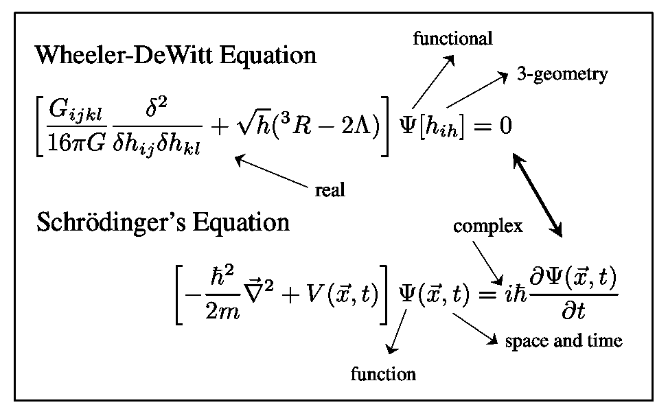**

**人们还可以如下理解ψ依赖性(参见[基弗](https://philpapers.org/rec/KIEDTE))。在量子力学中，粒子具有明确定义的轨迹 *q* ( *t* )的概念毫无意义，取而代之的是在特定位置 *q* 在时间*t*发现粒子的概率。因此，在薛定谔方程中，波函数不应该取决于 *q* ( *t* )，而只取决于 *q* 和 *t* 类比***h***⇔*q**和**g**⇔*q*(*t*)并回忆 GR 中不存在绝对时间，用 *q* 和 *t* 替换 *q* ( *t* 这就证明了为什么ψ的论证中只剩下 3 维空间(而不是 4 维时空)。***

****

****WdW 方程是实数而不是复数，因为 SE** 第二个显著的区别是惠勒-德威特方程是实数**而薛定谔方程(SE)是复数**。问题是，根据我们在本文第二部分的讨论，时间和虚数单位 *i* 本质上是不可分的。这让 *i* 的失踪相当令人费解。******

****在描述微型超空间的情况时，我已经提到了一些关于这种永恒性的本质和解释的要点。这里我再补充几个:****

*   ****人们可以将 WdW 推广到包括物质场。这激发了对ψ的如下解释:它测量*和物质场之间的**相关性**。当然，理论的量子本质只允许我们知道物质和能量的统计分布。在数学上，当我们包括物质场时，WdW 方程发生的唯一变化是左手边的表达式获得了一个额外的项，即:*****

**********

*****情商。181:物质场的包含导致了这个新术语的出现，其中 *T* 是物质场应力-动量张量。*****

*   *****作为第一点的推论，如果ψ的当前形式已知，那么 WdW 方程就给了我们宇宙具有某些大尺度性质的概率。如果理论是正确的，像我们观察到的配置(如宇宙加速膨胀)应该有很高的概率。*****
*   *****正如我们所见，由于空间和时间是由时空的物质和能量属性决定的，我们可以(见 [Barrow](https://books.google.com.br/books?id=KHPhAgAAQBAJ&printsec=frontcover&dq=the+origin+of+the+universe+barrow&hl=en&sa=X&ved=0ahUKEwiL2an_4rfmAhWxIbkGHbcrBrMQ6AEIKTAA) )根据每个“时间片”的几何属性来定义“时间”。它是“宇宙的物质内容及其结构的构造”。*****
*   *****WdW 告诉我们在第二和第三点中描述的“内在”时间变量的不同值下波函数ψ之间的关系。*****
*   *****为了求解ψ，我们需要初始条件，在这种情况下，宇宙的初始波函数。*****
*   *****有可能基本的量子引力方程(不是 WdW 方程)实际上是复杂的。参见[巴布](https://journals.aps.org/prd/abstract/10.1103/PhysRevD.47.5422)及其参考文献。*****

*****WdW 的完全精确解自然是无法得到的。然而，如上所述，可以找到简化版方程的解(见[迪思](https://books.google.com.br/books?id=TkFNPIOruZAC&printsec=frontcover&source=gbs_ge_summary_r&cad=0#v=onepage&q&f=false)或[阿特卡兹](https://aapt.scitation.org/doi/10.1119/1.17479))。*****

## *****时间的再现:半经典体制*****

*****通过将系统分成两个子部分，并用一个子部分的参数作为时间来表示其中一个子部分的时间演化，可以恢复时间。*****

**********

*****图 167:英国物理学家内维尔·弗朗西斯·莫特爵士，1977 年诺贝尔物理学奖获得者。*****

*******时间和 *α-* 粒子** 这是[由英国物理学家【Neville Francis Mott 爵士](https://books.google.com.br/books?id=XoXy2VhsDTEC&pg=PA332&lpg=PA332&dq=mott+massey+the+theory+of+atomic+collisions+of+27+553&source=bl&ots=gP8Y7fmzGn&sig=ACfU3U2N0cboZuBxTXKoCcyDVnllVLDhZg&hl=en&sa=X&ved=2ahUKEwiFgIz0isHlAhWkILkGHQUJApcQ6AEwAnoECAQQAQ#v=onepage&q=mott%20massey%20the%20theory%20of%20atomic%20collisions%20of%2027%20553&f=false)在 1931 年一篇关于原子物理学的论文中首次注意到的，在这篇论文中研究了α粒子和原子之间的碰撞。在他的论文中，莫特使用了下面的程序。他首先把整个系统(原子和碰撞的α粒子)分成两个子部分。然后*用其中一个子部分，即 *α* 粒子的状态来定义*时间。利用这个时间参数，他推导出了另一个子部分原子的完整的含时薛定谔方程。在数学术语中，完整的量子态表示为:*****

******

***方程 182:原子+ α粒子量子系统的态。子索引代表原子，α代表α粒子。***

***为了获得原子的薛定谔方程，莫特把时间定义为***

******

***方程 183:用方向导数定义时间。***

***然后得到薛定谔方程。(上述半经典分析部分基于这篇[文章](https://philpapers.org/rec/KIEDTE))。***

*****半经典近似和 WdW 方程** 同样的半经典分析可以类似地讨论完整的 WdW 方程([基弗](https://arxiv.org/abs/gr-qc/0508120))。为此，人们围绕经典引力理论展开，将ψ写成一种玻恩-奥本海默近似***

******

***方程 184:WdW 方程解的波恩-奥本海默型近似。***

***其中 S₀是经典理论的哈密尔顿-雅可比方程的解，即***

***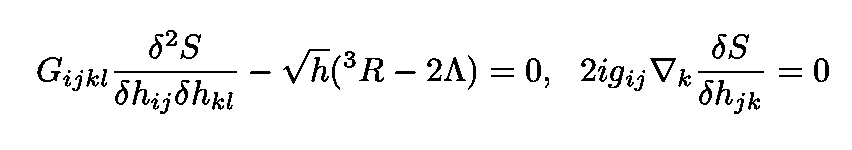***

***方程 185:经典引力的 Thes-汉密尔顿-雅可比方程。***

***像在标准量子力学中一样进行，通过几个简单的步骤(见 [Hamber](https://www.springer.com/gp/book/9783540852926) )，可以得到:***

******

***方程 186:从 WdW 方程经过一系列近似后得到的阿瑟型方程。***

***其中 *ϕ* 上标表示物质场被包括在内，并使用了以下时间定义:***

******

***等式 187:使用关于 **h** 的函数导数的时间定义。***

***因此，只有在半经典状态下，时间和复数才能被恢复。***

***我希望你觉得这篇文章很有趣。我解释了许多不同的概念，其中一些很简单，一些很有挑战性。但是我希望主要的想法足够清楚。***

***一如既往，感谢您的阅读，再见！一如既往，我们随时欢迎建设性的批评和反馈！***

***我的 [Github](https://github.com/marcotav) 和个人网站 [www.marcotavora.me](https://marcotavora.me/) ，都有一些其他关于理论物理的很酷的东西。看看他们！***