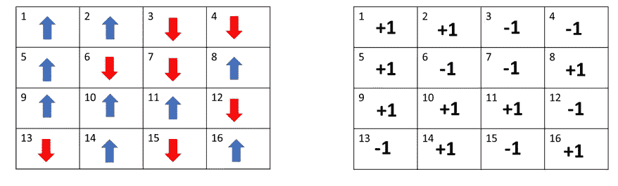
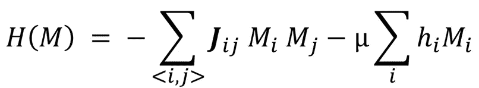
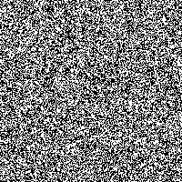
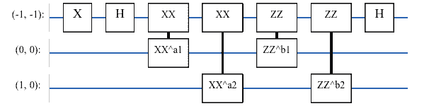
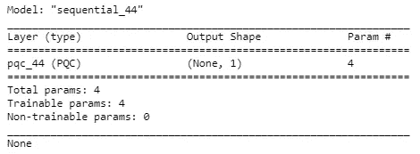
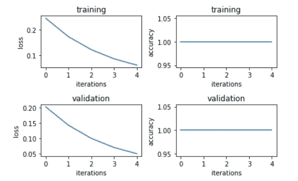
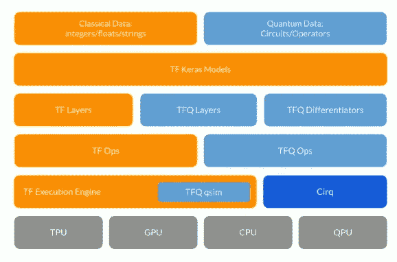

# 量子机器学习 101

> 原文：<https://towardsdatascience.com/quantum-machine-learning-101-1058f24c3487?source=collection_archive---------43----------------------->

## 如果你认为 ML 很有趣，那么 ***Q*** ML 来了！


照片由[马库斯·斯皮斯克](https://unsplash.com/@markusspiske?utm_source=medium&utm_medium=referral)在 [Unsplash](https://unsplash.com?utm_source=medium&utm_medium=referral) 拍摄

在量子机器学习(QML)领域已经做了很多工作，这个博客只是给你一个简短的 10 分钟介绍 QML 的世界。因此，这本书对你来说应该只是一个有趣的读物，而我计划写一个关于 QML 的更系统更深入的系列教程。

经典计算机是通用的，因为它们可以实现任何逻辑运算，而量子计算机是通用的，因为一组量子位上的任何量子态都可以转换成任何其他量子态。量子(电路)计算可行性的许多良好的早期希望来自[索洛维-基塔耶夫定理](https://en.wikipedia.org/wiki/Solovay%E2%80%93Kitaev_theorem)，在非常广泛的条件下(神经元/门&普适函数/状态近似的有限性)可以等同于深度学习的[普适近似定理](https://en.wikipedia.org/wiki/Universal_approximation_theorem)。

# 伊辛模型和哈密顿量

简单来说，伊辛模型是一种表示体系内相变和相互作用的数学模型[【1】](https://en.wikipedia.org/wiki/Ising_model)[【2】](http://stanford.edu/~jeffjar/statmech2/intro4.html)。这种系统在任一点的能量由该点的各自的[哈密顿量](https://en.wikipedia.org/wiki/Hamiltonian_(quantum_mechanics))(方程式)给出。

比如说在图 1 中。下面，我们有一个 4X4(点阵)矩阵系统。每个单元处于两种可能状态之一(比如+1，-1)。假设每个单元只有四个相邻(上、左、右、下)单元，如果存在的话。

所以 6 的相邻单元格是 3，5，7 和 10。



**图 1** 。随机系统(同一系统的两种不同表示)

现在每个细胞都拥有一些能量，这是由于它与邻居的相互作用，还有一些是由于它自己的状态。每个系统都想达到(过渡到)最低能量状态。



Eq1 。哈密顿函数

所以 Eq1。以上是这种系统在任一点的能量方程

*   **M** :表示上述任一点的系统/矩阵
*   **< i，j >** :所有对代表相邻单元格 I，j
*   **J i，j** :表示相邻细胞间的相互作用能量系数
*   **Mi** :表示每个单元格的值{+1，-1}
*   **嗨:**代表每个的能量系数
*   **μ** :表示每个电池的总(外)能量系数

现在，虽然上面的等式甚至对于简单的物理磁体(它最初是为其提出的)来说不够准确，但是它很好地模拟了由于每个粒子的状态、它与其他粒子的相互作用以及每个粒子上的任何外部因素而产生的系统能量。



**图 2** 开始状态(左)过渡状态(中)结束状态(右)

图二。上面显示了这样一个系统(200X200)从初始状态(左)到最终状态(右)的转变。

# 量子 ML 的方法

虽然总结量子最大似然的所有可能的方法对我来说是不可能的，主要是因为我对我读过的一些算法的理解有限，但是因为一般来说任何量子优化/最小化算法都可以有一个等价的 QML 用例。

在下面提供的 3 种方法中，我们将只关注第一种模型，在本博客后面的讨论中，其他两种方法放在这里只是为了给出 QML 算法的更大的图像

## 量子电路/门模型

*   将经典问题映射到量子算法。
*   相应的量子算法然后被转换成量子电路
*   量子电路然后在量子处理器上运行

## 绝热量子计算[暂时忽略]

*   **H1** 代表一个系统的能量纯粹由于单个细胞&而不是相互作用(即 Jij = 0)。
    (注意:这里的基态/最小能态是所有比特的叠加)*如果你不知道什么是量子比特的叠加，现在忽略这一点*
*   **H2** 代表我们系统的一般能量状态，如上面等式 1 给出的
*   现在随着时间的推移(每一步)，我们想要从 H1 的基态转移到 H2 的基态
*   在任何时候，系统的状态将是 H1 对 H2 的凸组合，t ∈ [0，1]
    H (t) = (1-t) * H1 + t * H2
*   注意，这个问题不容易解决，也很难解决，因为我们不知道在所有状态之间移动的正确转换速度(类似于在梯度下降中选择学习速率)

## 量子退火**【简化绝热量子计算】**

*   这是绝热量子计算的更可行/实用的版本，其中我们不是找到我们的目标系统的基态，而是开始在每次跃迁中找到许多不同的低能态(基于不同的跃迁速度)。我们希望能量最低的状态是目标系统的基态

如果您想了解更多相关信息，请查看以下链接:

*   [量子退火](https://arxiv.org/abs/cond-mat/0205280)[更](https://ai.googleblog.com/2015/12/when-can-quantum-annealing-win.html)
*   [量子绝热计算](https://arxiv.org/abs/1511.03316)
*   [量子近似优化算法](https://arxiv.org/abs/1812.01041)

> **基本上，以上所有方法不知何故都会变成，我们得到一个等价的量子电路&通过一个量子处理单元(QPU)结合我们的标准 CPU 来解决它。**

在这篇博客中，我们将假设我们被神奇地给予了一个量子电路来解决我们的问题&我们想在一个有编程接口的 QPU 上解决它。

# 让我们编码

现在，我们将尝试构建一个简单的回归暨分类问题，在下面的笔记本中提供，但在这里我们将一点一点地打破它。

[](https://github.com/AbhishekAshokDubey/quantum-computing-101/blob/master/qml-101/tfq_ml_101.ipynb) [## AbhishekAshokDubey/量子计算-101

### permalink dissolve GitHub 是超过 5000 万开发人员的家园，他们一起工作来托管和审查代码，管理…

github.com](https://github.com/AbhishekAshokDubey/quantum-computing-101/blob/master/qml-101/tfq_ml_101.ipynb) 

同样，我们已经假设了问题的电路，主要由最后的 MNIST 问题电路驱动，如[法尔希等人](https://arxiv.org/abs/1802.06002) &所建议的，也被[谷歌 TFQ MNIST 的例子](https://www.tensorflow.org/quantum/tutorials/mnist)所使用。

在开始之前，我们需要在 tensorflow (TF)上安装 tensorflow-quantum (TFQ)和 Cirq。

*   **tensorflow-quantum** :作为任何底层 QPU 的编程语言(接口)。(很像 GPU 的 CUDA)
*   **Cirq** :作为定义量子电路的编程语言

```
tensorflow & pip install -q **tensorflow**==2.1.0
pip install -q **tensorflow-quantum**
pip install -q **cirq**
```

让我们导入所有我们需要的包

```
**import** **numpy** **as** **np**
**import** **sympy**

*# For Quantum ML*
**import** **cirq**
**import** **tensorflow** **as** **tf**
**import** **tensorflow_quantum** **as** **tfq**

*# For Visualization*
%matplotlib inline
**import** **matplotlib.pyplot** **as** **plt**
**from** **cirq.contrib.svg** **import** SVGCircuit
```

让我们为我们的问题制作一个虚拟玩具数据

```
**def** get_data(l):
    data = np.random.randint(0,1,(l,2))
    label = np.ones(l)
    data[0::2,0]=1
    data[1::2,1]=1
    label[0::2] = -1
    p = np.random.permutation(l)
    **return** data[p], label[p]

x_train, y_train = get_data(5000)
x_test, y_test = get_data(200)print(pd.DataFrame(np.concatenate((x_train, np.reshape(y_train, (-1,1))), axis=1) , columns=["x1", "x2", "y"]))
```

生成的数据如下所示，上面打印语句的输出。基本上 x1 =1 → y = -1，x2 =1 → y = +1。不要问我为什么，但这看起来像是解决简单问题的方法:)

```
 x1   x2    y
0     1.0  0.0 -1.0
1     1.0  0.0 -1.0
2     1.0  0.0 -1.0
3     *0.0  1.0  1.0*
4     1.0  0.0 -1.0
...   ...  ...  ...
4995  1.0  0.0 -1.0
4996  *0.0  1.0  1.0*
4997  1.0  0.0 -1.0
4998  1.0  0.0 -1.0
4999  1.0  0.0 -1.0
```

关于量子数据的一个有趣的事实是，它不能被存储&它只能作为量子电路本身产生/提供。[多检查几个](https://hackernoon.com/quantum-facts-funny-and-weird-at-the-same-time-1g3g3wjr)

因此，我们上面生成每个数据点都应该被转换成等效的量子电路。所以基本上对于 **0** 位我们什么都不做，但是我们通过一个 **1** 位虽然不是门。下面是一个简单的函数来做同样的事情，将 0/1 上的数据转换成等效电路

```
**def** convert_to_circuit(x):
    qubits = cirq.GridQubit.rect(1, 2)
    circuit = cirq.Circuit()
    **for** i, val **in** enumerate(x):
        **if** val:
            circuit.append(cirq.X(qubits[i]))
    **return** circuit
```

所以，让我们得到经典数据集中每个数据点的等效量子数据(电路)。

```
x_train_circ = [convert_to_circuit(x) **for** x **in** x_train]
x_test_circ = [convert_to_circuit(x) **for** x **in** x_test]
```

为了将上面用 CIRQ 生成的电路/数据点传递到 TFQ，我们需要将每个电路/数据点转换成 TFQ 张量。

```
x_train_tfcirc = tfq.convert_to_tensor(x_train_circ)
x_test_tfcirc = tfq.convert_to_tensor(x_test_circ)
```

现在我们已经准备好了我们的量子数据，我们现在需要的是解决我们问题的量子电路&一个解决它的方法:)

如上所述，让我们假设一个电路，即使它对于手头的问题不是最好的，但是我们相信如果一个类似的电路可以解决简化的 MNIST 二进制(3 对 6)数字分类，它应该很容易解决我们的问题



**图三**问题电路模型

这里(-1，-1)行/量子位是我们的最终输出类预测，而(0，0)和(1，0)量子位是我们的输入数据。

那么，让我们在 CIRQ 中构建上述电路。

```
input_qubits = cirq.GridQubit.rect(2, 1)  *# 2x1 grid.*
readout = cirq.GridQubit(-1, -1)   *# a qubit at [-1,-1]*
model_circuit = cirq.Circuit()

model_circuit.append(cirq.X(readout))
model_circuit.append(cirq.H(readout))

alpha1 = sympy.Symbol('a1')
model_circuit.append(cirq.XX(input_qubits[0], readout)**alpha1)

alpha2 = sympy.Symbol('a2')
model_circuit.append(cirq.XX(input_qubits[1], readout)**alpha2)

beta1 = sympy.Symbol('b1')
model_circuit.append(cirq.ZZ(input_qubits[0], readout)**beta1)

beta2 = sympy.Symbol('b2')
model_circuit.append(cirq.ZZ(input_qubits[1], readout)**beta2)

model_circuit.append(cirq.H(readout))
model_readout = cirq.Z(readout)SVGCircuit(model_circuit)
```

`SVGCircuit(model_circuit)`代码/命令应该能够在嵌入式控制台上绘制电路图像。

> **从这里开始，事情会变得和经典的机器学习一样有意义**

现在更像 Keras 序列神经网络模型，我们将建立一个模型来解决我们的问题电路。

```
*# Build the model.*
model = tf.keras.Sequential([
    *# The input is the data-circuit, encoded as a tf.string*
    tf.keras.layers.Input(shape=(), dtype=tf.string),
    *# PQC layer returns the expected val of the readout gate @[-1,1]*
    tfq.layers.PQC(model_circuit, model_readout),
])
```

最后，我们需要定义损失函数、优化器和指标来跟踪。

```
model.compile(
    loss=tf.keras.losses.MeanSquaredError(),
    optimizer=tf.keras.optimizers.Adam(),
    metrics=[accuracy])
```

下面是我们目前构建的模型包含的内容(来自模型摘要)



**图 4** 。模型摘要

让我们用量子数据来训练我们的量子电路模型。

```
model_history = model.fit(
      x_train_tfcirc, y_train,
      batch_size=200,
      epochs=5,
      verbose=1,
      validation_data=(x_test_tfcirc, y_test))

results = model.evaluate(x_test_tfcirc, y_test)
```

以下是您的训练和验证数据丢失(&准确性)将如何随着每个历元而变化。



**图 5** 。量子训练历史

希望一切顺利，试着从测试数据中预测值。

```
print(list(zip(model.predict(x_test_tfcirc).ravel()[:10], y_test[:10]))) [(-0.7765335, -1.0),
(0.77620333, 1.0),
(0.77620333, 1.0),
(0.77620333, 1.0),
(-0.7765335, -1.0),
(0.77620333, 1.0),
(-0.7765335, -1.0),
(0.77620333, 1.0),
(0.77620333, 1.0),
(0.77620333, 1.0)]
```

基于以上，你会认为我们已经解决了一个经典的分类问题，即回归问题，所以请继续改进它
[提示:铰链丢失？](https://github.com/AbhishekAshokDubey/quantum-computing-101/blob/master/qml-101/tfq_classifier_101.ipynb)

最后，一旦你理解了这一点，对你来说，编写你自己的简单的 MNIST 两类分类器就容易多了，而不需要参考谷歌的教程:)

如果您想知道量子处理单元如何与当前的处理单元结合使用，以及我们上面使用的所有东西在更大的画面中适合什么位置(？).
谷歌 TFQ 团队的以下架构将为你提供一些快速的提示。



张量流量子栈:[https://youtu.be/-o9AhIz1uvo?t=1247](https://youtu.be/-o9AhIz1uvo?t=1247)

现在是时候从一个更小的玩具例子转移到一个更好的玩具例子了，试试下面。

 [## 用量子神经网络在近期处理器上进行分类

### 我们介绍了一个量子神经网络，QNN，它可以代表标记数据，经典或量子，并训练…

arxiv.org](https://arxiv.org/abs/1802.06002) [](https://www.tensorflow.org/quantum/tutorials/mnist) [## MNIST 分类|张量流量子

### 更高分辨率的输入和更强大的模型使 CNN 很容易解决这个问题。而一个经典的模型…

www.tensorflow.org](https://www.tensorflow.org/quantum/tutorials/mnist) 

# 干杯&快乐学习！！！

[giphy.com](https://giphy.com/):[https://gph.is/g/ap0YjGy](https://gph.is/g/ap0YjGy)

参考资料:

1.  【https://www.youtube.com/watch?v=16ZfkPRVf2w 
2.  [https://github . com/AbhishekAshokDubey/quantum-computing-101/tree/master/qml-101](https://github.com/AbhishekAshokDubey/quantum-computing-101/tree/master/qml-101)
3.  [https://www.tensorflow.org/quantum/tutorials/mnist](https://www.tensorflow.org/quantum/tutorials/mnist)
4.  [https://www.youtube.com/watch?v=-o9AhIz1uvo](https://www.youtube.com/watch?v=-o9AhIz1uvo)
5.  [https://medium . com/@ adubey 40/quantum-computing-101-1ed 742540 ba 2](https://medium.com/@adubey40/quantum-computing-101-1ed742540ba2)