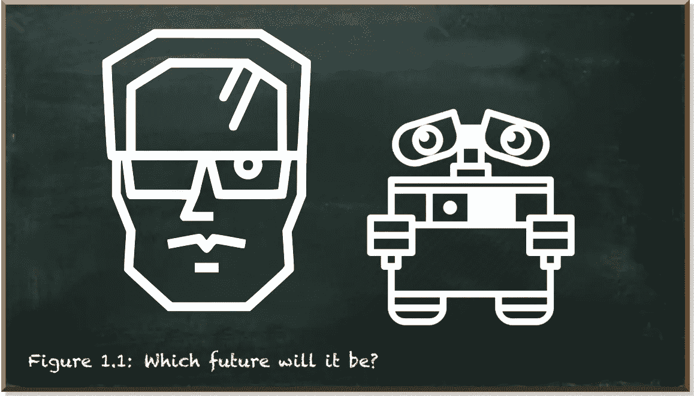
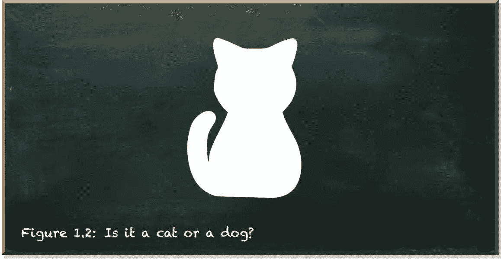
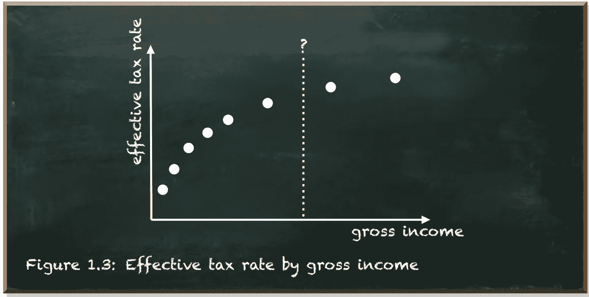
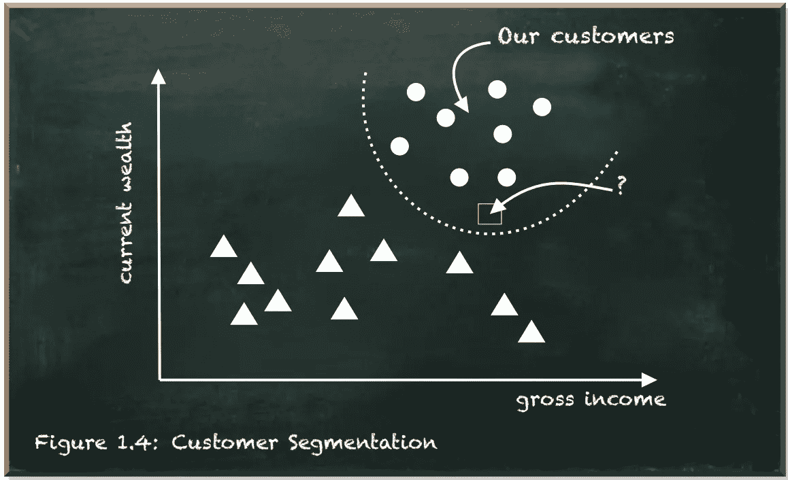
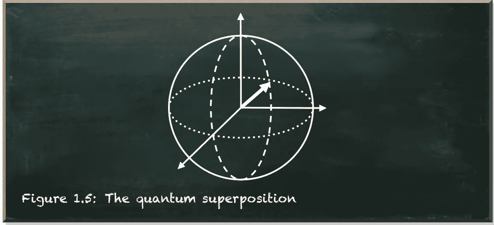
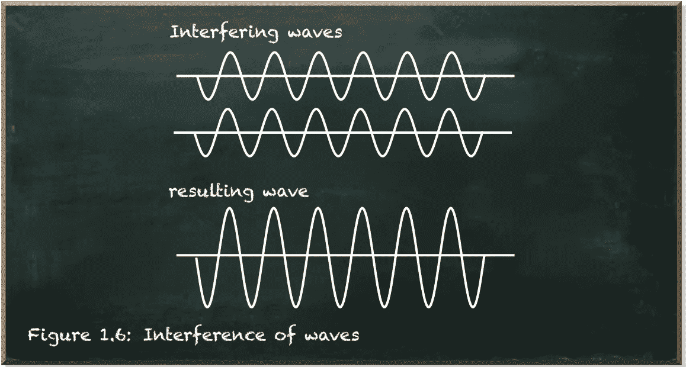
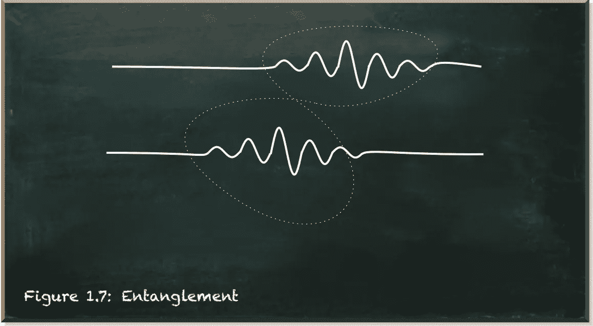
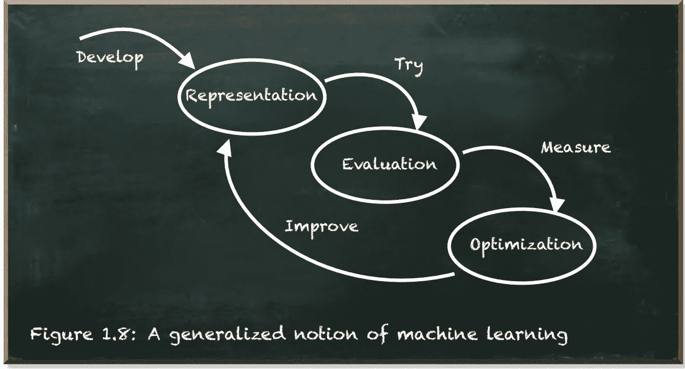
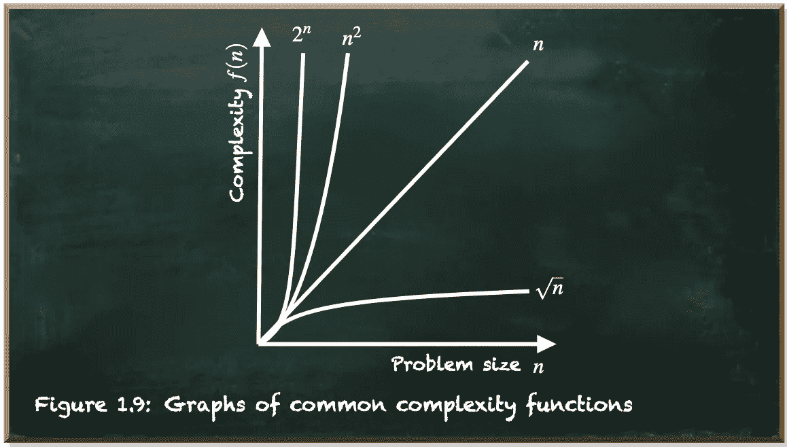
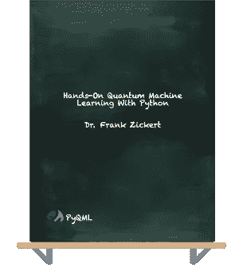

# 量子机器学习——超越宣传

> 原文：<https://towardsdatascience.com/quantum-machine-learning-e1955476a6ad?source=collection_archive---------12----------------------->

本帖是本书的一部分: [**用 Python 动手做量子机器学习。**](https://www.pyqml.com/page?ref=medium_hype&dest=/)

如果计算机科学中有两个术语被我描述为过度宣传和缺乏理解，我会说*机器学习*和*量子计算*。

也就是说，**量子机器学习**就是利用*量子计算*进行*机器学习*算法的计算。还能更糟吗？

关于这两种技术有很多奇闻轶事。它们始于理解我们人类自然语言的机器。它们终结于人工智能的出现，要么表现为终结者式的天启，要么表现为瓦力式的乌托邦。

作者弗兰克·齐克特的图片

**不要上当炒作！**

不带偏见地详细观察一项技术有助于不被天花乱坠的宣传和民间传说所迷惑。先说机器学习。

# **什么是机器学习？**

> **“机器学习本质上是一个事物标签器”**

*——谷歌首席决策科学家凯西·科济尔科夫* [*来源*](https://www.linkedin.com/pulse/simplest-explanation-machine-learning-youll-ever-read-cassie-kozyrkov)*——*

通过机器学习，我们的目标是给尚未标记的东西贴上标签。主要有三种方法:分类、回归和分段。

在**分类**中，我们尝试预测一个实例的离散标签。给定输入和一组可能的标签，它是哪一个？这里有一张图片。它是一只猫还是一只狗？

作者弗兰克·齐克特的图片

**回归**是关于寻找一个函数来预测某个输入和依赖的连续输出值之间的关系。假设你知道你朋友的收入和有效税率，即使你不知道实际的计算，你能估计你的收入的税率吗？

作者弗兰克·齐克特的图片

**分割**是将群体划分为具有相似特征的群体的过程，这些群体因此可能表现出相似的行为。假设你生产一种昂贵的产品，比如游艇，以及一群潜在客户，你想把产品卖给谁？

作者弗兰克·齐克特的图片

# **什么是量子计算？**

量子计算是一种不同形式的计算。它利用了量子物理的三个基本性质:叠加、干涉和纠缠。

**叠加**是指一个量子系统可以同时存在多个态的量子现象。

作者弗兰克·齐克特的图片

*实际上，量子系统并不同时存在于多个状态中。它存在于一个状态* `*0*` *和一个状态* `*1*` *的复杂线性组合中。它是一种不同的组合，既不是“或”，也不是“和”。*

量子干涉让我们可以将量子系统偏向想要的状态。这个想法是创造一种干涉模式，其中导致错误答案的路径破坏性地干涉并抵消，但是导致正确答案的路径相互加强。

作者弗兰克·齐克特的图片

**纠缠**是量子粒子之间极强的关联。即使相隔很远，纠缠的粒子仍然保持完美的关联。

作者弗兰克·齐克特的图片

你已经看过《终结者》了吗？ *没有？*

**也许是瓦力？** *又没有？*

也许看看这些东西是如何工作的会有帮助。

# **机器学习是如何工作的？**

有无数的机器学习算法。但是每一种算法都有三个组成部分:

*   **表示**描述了算法用来表示知识的内部架构。它可能由一组规则、实例、决策树、支持向量机、神经网络等组成。
*   **评估**是评估候选算法参数化的函数。例子包括准确性、预测和召回、平方误差、后验概率、成本、边际、熵等等。
*   **优化**描述了生成候选算法参数化的方式。这就是所谓的搜索过程。例如，组合优化、凸优化和约束优化。

机器学习的第一步是架构的开发，即表示。该架构指定了参数，这些参数的值保存了知识的表示。这一步确定解决方案对于解决某个问题的适合程度。参数越多并不总是越好。如果我们的问题可以用一个线性函数来解决，那么试图用一个包含数百万个参数的解来解决它很可能会失败。另一方面，参数很少的架构可能不足以解决自然语言理解等复杂问题。

作者弗兰克·齐克特的图片

一旦我们满足于用架构来表示知识，我们就用例子来训练我们的机器学习算法。根据参数的数量，我们需要大量的例子。该算法尝试预测每个示例的标签。我们使用评估函数来衡量算法的执行情况。

最后，优化器调整表示参数，以保证测量的评估有更好的性能。它甚至可能涉及到改变表示的体系结构。

学习不会一蹴而就。而是小步前进。为了获得良好的性能，根据问题的复杂程度，这个一般过程需要重复几次，直到机器能够在一个物体上贴上正确的标签。

# **量子计算机擅长哪些任务？**

量子力学的世界不同于我们在日常生活中经历的物理学。那么量子计算的世界与经典(数字)计算有什么不同呢？

让量子计算如此强大的不是它的处理速度。其实挺慢的。让量子计算如此强大的也不是它的内存。事实上，它小得荒谬。我们谈论的是几个量子比特。

让量子计算如此强大的是它所实现的算法。这些算法表现出不同于经典算法的复杂性特征。

为了理解这意味着什么，让我们简单看一下复杂性理论。复杂性理论是对运行算法所需的计算工作的研究。

例如，加法的计算量是`O(n)`。这意味着两个数相加的工作量随着数的大小(位数)线性增加。乘法的计算量是`O(n^2)`。努力随着数量大小的平方而增加。

据说这些算法在多项式时间内是可解的。但是这些问题相对简单。解决因式分解问题(即寻找一个 n 位数的质因数)的最佳算法是`O(e^n^(1/3))`。这意味着努力随着位数的增加而呈指数增长。

作者弗兰克·齐克特的图片

不要低估`O(n^2)`和`O(e^n^(1/3))`复杂性之间的差异。虽然你的智能手机能够在几秒钟内将 800 位数字相乘，但在超级计算机上，这种数字的因式分解需要大约 2000 年。

一个精明的量子算法(比如 Shor 的算法)可以用叠加法同时求出一个数所有可能的因子。它不是计算结果，而是使用干涉来组合所有可能的答案，从而得出正确的答案。该算法解决了一个复杂度为`O((log n)^2 (log log n)(log log log n))`的因式分解问题。这是多项式复杂度！乘法也是。

量子计算是强大的，因为它承诺以降低的复杂性解决某些类型的数学计算。

**你现在看的是终结者还是瓦力？** *还没有？*

# **量子机器学习的案例**

量子机器学习是利用量子计算进行机器学习算法的计算。

我们已经知道，机器学习算法包含三个组成部分:表示、评估和优化。

当我们看到这种表示时，当前的机器学习算法，如 2020 年发表的*生成式预训练变压器 3* (GPT-3)网络，浮现在脑海中。GPT 3 号产生了类似人类的文本。它有 1750 亿个参数。

*IBM Q* 量子计算机有 27 个量子位。尽管量子比特存储的信息比经典比特多得多(因为它既不是`0`也不是`1`)，但量子计算机的表示能力还远远不能推进机器学习。

在评估过程中，机器学习算法试图预测一个事物的标签。传统上，这包括测量和转换数据点。例如，神经网络依赖于矩阵乘法。这些都是经典计算机擅长的任务。然而，如果您有 1750 亿个参数，那么计算结果预测需要相当多的矩阵乘法。

最后，算法需要以有意义的方式改进参数。问题是找到一组能产生更好性能的参数值。175 亿个参数，组合的数量是无穷的。

经典的机器学习采用启发式方法，利用问题的结构在合理的时间内收敛到足够的解决方案。尽管使用了甚至更先进的启发式方法，训练 GPT-3 将需要 355 年才能在单个 GPU(图形处理单元)上训练，并花费 460 万美元。只是为了感受一下在这种情况下合理是什么意思。

量子计算的主要特点是能够同时计算多个状态。量子优化算法可以结合所有可能的候选者，并产生那些有希望得到好结果的候选者。因此，量子计算在算法优化方面有望比经典计算机快出指数级。

但这并不意味着我们只关注优化。因为优化建立在运行评估的基础上。并且评估建立在表示的基础上。因此，挖掘量子计算的全部潜力来解决机器学习优化问题需要评估和表示来与量子优化器集成。

考虑到经典机器学习算法今天可以做什么，如果我们希望量子计算能够大幅降低训练这种算法的复杂性，那么炒作就变得可以理解了。因为我们离人工通用智能“只有”几个数量级的距离。

当然，构建人工智能需要的不仅仅是计算。它需要数据。它需要算法。这种算法的开发是量子机器学习中当前的挑战之一。

本帖是本书的一部分: [**用 Python 动手做量子机器学习。**](https://www.pyqml.com/page?ref=medium_hype&dest=/)

免费获取前三章[点击这里](https://www.pyqml.com/page?ref=medium_hype&dest=/)。