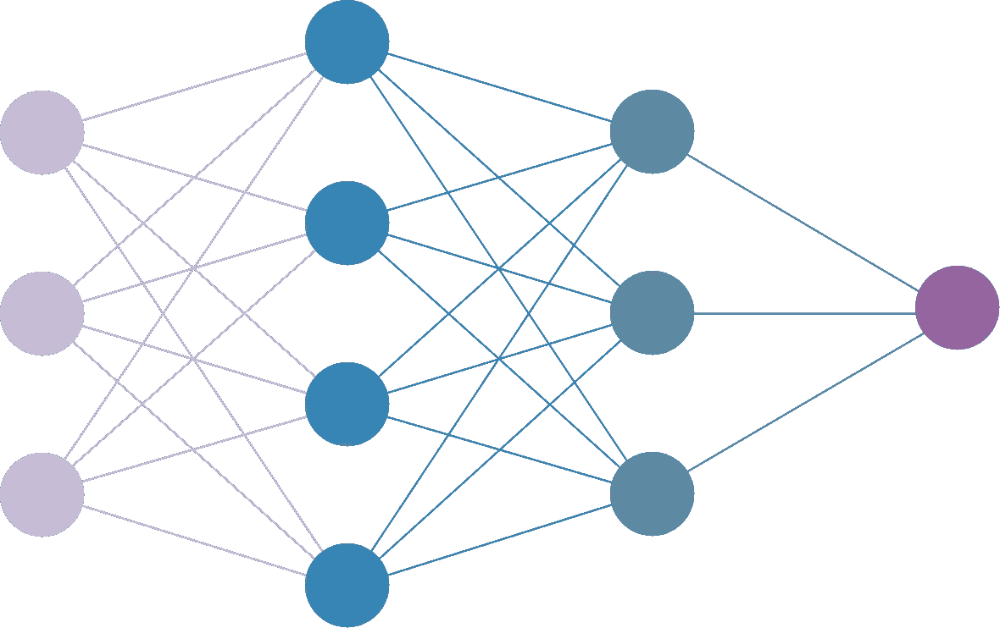
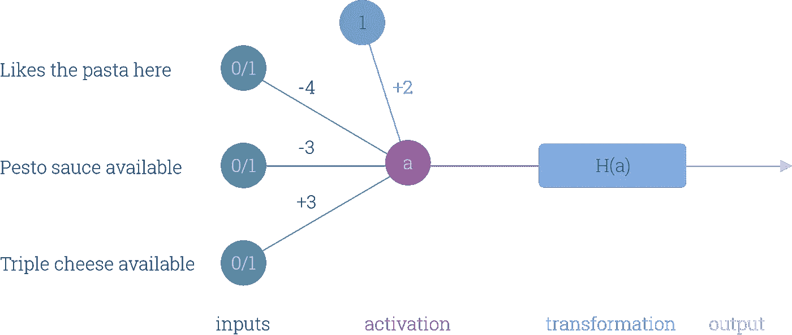

# 量子机器学习:神经网络学习

> 原文：<https://towardsdatascience.com/quantum-machine-learning-learning-on-neural-networks-fdc03681aed3?source=collection_archive---------30----------------------->

## 分析梯度计算、Hadamard 测试等等

我的上一篇文章讨论了量子计算机上的贝叶斯网络(在这里阅读！)，以及 k-means 聚类，我们进入量子机器学习这个怪异而奇妙的世界的第一步。

这一次，我们将深入兔子洞，看看如何在量子计算机上构建神经网络。

作者图片

如果你不了解神经网络，不要担心——我们从神经网络 101 开始。

## 什么是(经典)神经网络？

几乎每个人都听说过神经网络——它们被用来运行我们今天拥有的一些最酷的技术——自动驾驶汽车、语音助手，甚至是生成名人做可疑事情的超现实照片的软件。

它们与常规算法的不同之处在于，我们不需要写下一套规则，而是需要向网络提供我们希望它解决的问题的例子。

我们可以用 IRIS 数据集中的一些数据输入一个网络，这个数据集中包含了三种花的信息，它可能会猜出这是哪一种花:

作者图片

所以现在我们知道了神经网络是做什么的——但是它们是如何做到的呢？

## 重量、偏见和积木

神经网络由许多称为神经元的小单元组成，看起来像这样:

作者图片

大多数神经元接受多个数字输入(蓝色圆圈)，并将每个数字输入乘以一个权重(wᵢs)，该权重表示每个输入的重要性。权重的大小越大，相关的输入就越重要。

偏差被视为另一个权重，只是它所乘以的输入值始终为 1。当我们将所有加权输入相加，我们得到神经元的激活值，用上图中的紫色圆圈表示:

然后，激活值通过一个函数(蓝色矩形)传递，结果是神经元的输出:

我们可以通过改变神经元用来转换其激活值的函数来改变神经元的行为，例如，我们可以使用一个超级简单的转换，就像这样:

然而，在实践中，我们使用更复杂的函数，如 sigmoid 函数:

神经元有什么用？

他们可以根据他们收到的输入做出决定——例如，我们可以使用神经元来预测我们下次在意大利餐馆吃饭时是吃披萨还是意大利面，方法是向它提供三个问题的答案:

*   我喜欢这家餐馆的意大利面吗？
*   餐馆有香蒜沙司吗？
*   这家餐馆有三层奶酪比萨饼吗？

抛开可能的健康问题，让我们看看神经元可能是什么样的——我们可以用 0 代表 no，1 代表 yes 来编码输入，并通过将 0 和 1 分别映射到 pasta 和 pizza 来对输出进行同样的处理:

作者图片

让我们使用阶跃函数来转换神经元的激活值:

仅仅使用一个神经元，我们就可以捕捉多种决策行为:

*   如果我们喜欢餐馆里的意大利面，我们会选择点意大利面，除非香蒜沙司卖完了，他们会提供三层奶酪披萨。
*   如果我们不喜欢餐馆里的意大利面，我们会点一份比萨饼，除非有香蒜沙司，而三层奶酪比萨饼没有。

我们也可以用另一种方式来做事情——我们可以对神经元进行编程，使其对应于一组特定的偏好。

如果我们想做的只是预测我们下次外出时会吃什么，那么为一个神经元计算出一组权重和偏好可能会很容易，但如果我们不得不对一个完整规模的网络做同样的事情呢？

这可能需要一段时间。

幸运的是，我们可以创建算法来改变网络的参数——权重、偏差甚至结构，而不是猜测我们需要的权重值，这样它就可以学习我们想要解决的问题的解决方案。

## 向下到达顶端

理想情况下，网络的预测应该与我们提供给它的输入相关联的标签相同——因此，预测和实际输出之间的差异越小，网络学习的权重集就越好。

我们使用损失函数来量化这种差异，损失函数可以是我们想要的任何形式，就像这个，它被称为二次损失函数:

*y(x)* 是期望的输出，而 *o(x，θ)* 是当输入带有参数θ *—* 的数据 *x* 时网络的输出。由于损耗总是非负的，一旦它呈现接近于 0 的值，我们就知道网络已经学习了好的参数集。当然，还有其他可能出现的问题，比如过度拟合，但我们现在忽略这些。

使用损耗函数，我们可以计算出网络的最佳参数集:

因此，我们需要做的不是猜测权重，而是根据参数θ最小化 *C* ,这可以使用一种称为梯度下降的技术来实现:

我们在这里所做的是，如果我们增加θᵢ的值，看看损失是如何变化的，然后更新θᵢ，使损失减少一点点。η是一个很小的数字，它控制着我们每次更新θᵢ时要改变多少。

为什么我们需要η变小？我们可以调整它，使电流 *x* 的损耗在一次更新后接近于零——大多数情况下这不是一个好主意，因为虽然它会减少电流 *x* 的损耗，但它通常会导致我们提供给网络的所有其他数据样本的性能更差。

厉害！

现在我们已经有了基本的东西，让我们弄清楚如何建立一个量子神经网络。

## 进入量子宇宙

我们将建立的量子神经网络与我们迄今为止研究的经典网络的工作方式并不完全相同——我们没有使用具有权重和偏见的神经元，而是将输入数据编码成一串量子位，应用一系列量子门，并改变门参数以最小化损失函数:

作者图片

虽然这听起来很新鲜，但想法是一样的-更改参数集以最小化网络预测和输入标注之间的差异。

为了简单起见，我们将构建一个二元分类器——这意味着输入到网络的每个数据点都必须有一个 0 或 1 的关联标签。

它是如何工作的？

我们首先将一些数据 *x* 输入到网络，这些数据通过特征图传递，特征图是一种将输入数据转换成我们可以用来创建输入量子态的形式的功能:

我们使用的特征地图看起来几乎可以是任何东西——这里有一个二维向量 *x* ，并给出一个角度:

一旦 *x* 被编码成量子态，我们就应用一系列量子门:

网络输出，我们称之为π( *x* ，θ)，是在|1〉状态下被测量的最后一个量子位的概率，加上一个经典添加的偏置项:

***Zₙ ₋ ₁*** 代表应用于最后一个量子位的 ***Z*** 门。

最后，我们获取与 *x* 相关联的输出和标签，并使用它们来计算样本上的损耗——我们将使用上面相同的二次损耗。我们为网络提供的整个数据集的成本就变成了:

网络 *p* 的预测可以从输出中获得:

现在我们需要做的就是弄清楚如何计算损失函数 *l* ( *x* ，θ)的梯度。虽然我们可以经典地做到这一点，但那会很无聊——我们需要的是一种在量子计算机上计算它们的方法。

## 计算梯度的新方法

让我们从关于参数θᵢ:的损失函数的微分开始

让我们扩展最后一项:

我们可以很快去掉常数项——在θᵢ = *b* 的情况下，我们知道梯度就是 1:

现在，使用乘积法则，我们可以进一步展开:

读起来可能有点痛苦，但多亏了厄米共轭(+),它有一个简洁的表示:

由于 ***U*** (θ)由多个门组成，每个门由不同的参数(或参数集)控制，因此求*u***【uᵢ***【θᵢ】*的偏导数只涉及对依赖于θᵢ:的门进行微分**

****

**这就是我们为每个*uᵢ选择的形式变得重要的地方。我们将对每个*使用相同的形式，我们称之为 ***G*** 门——形式的选择是任意的，因此您可以使用您能想到的任何其他形式来代替:****

****

**既然我们知道了每一个**的样子，我们就可以找到它的派生物:****

******

***幸运的是，我们可以用 ***G*** 门来表达这一点:***

****

**所以剩下的就是找出如何创建一个电路，给我们提供我们需要的内在产品形式:**

****

**获得与之成比例的可测量值的最简单方法是使用[哈达玛测试](https://en.wikipedia.org/wiki/Hadamard_test_(quantum_computation))——首先，我们准备输入量子态，并将一个辅助态推入叠加态:**

****

**现在将 ***Zₙ ₋ ₁B*** 应用到ψ上，条件是辅助处于 1 状态:**

****

**然后翻转安西拉，对 ***和*** 做同样的操作:**

****

**最后，将另一个哈达玛门应用到辅助设备上:**

****

**现在将辅助设备测量为 0 的概率是**

****

**所以如果我们用*(θ)代替*，并用****(θ)替换掉****的一个副本，那么安西拉量子位的概率就会给我们梯度************

**太好了！**

**我们找到了一种在量子计算机上分析计算梯度的方法——现在剩下的就是构建我们的量子神经网络了。**

## **构建量子神经网络**

**让我们导入开始工作所需的所有模块:**

**现在让我们来看看我们的一些数据(你可以在这里[得到正确的数据](https://github.com/SashwatAnagolum/DoNew/blob/master/QNN/processedIRISData.csv)！)—这是 IRIS 数据集的处理版本，删除了一个类:**

**我们需要将特征(前四列)与标签分开:**

**现在让我们构建一个函数，它将为我们进行特征映射。**

**由于输入向量是归一化的和 4 维的，因此有一个超级简单的映射选项——使用 2 个量子位来保存编码数据，并使用一个将输入向量重新创建为量子态的映射。**

**为此，我们需要两个函数，一个用于从向量中提取角度:**

**另一个是把我们得到的角度转换成量子态:**

**这可能看起来有点令人困惑，但是理解它是如何工作的对于建造 QNN 来说并不重要——如果你喜欢，你可以在这里阅读它。**

**现在我们可以编写实现*(θ)所需的函数了，这些函数将采取 ***RY*** 和 ***CX*** 门交替层叠的形式。***

**为什么我们需要 ***CX*** 层？**

**如果我们不包括它们，我们将无法执行任何纠缠操作，这将限制我们的网络可以到达的希尔伯特空间内的区域——使用*门，网络可以捕获量子位之间的相互作用，没有它们它将无法实现。***

***我们先从 ***G*** 门开始:***

**接下来，我们就做 ***CX*** 盖茨:**

**现在我们把它们放在一起得到 ***U*** (θ):**

**接下来，我们创建一个函数，它允许我们获得网络的输出，另一个函数将这些输出转换为类预测:**

**现在，我们可以构建一个在网络上执行正向传递的函数——向其提供一些数据，对其进行处理，并向我们提供网络输出:**

**之后，我们可以编写测量梯度所需的所有函数—首先，我们需要能够应用*(θ)的受控版本:***

***使用它，我们可以创建一个计算期望值的函数:***

***现在我们可以算出损失函数的梯度——我们最后做的乘法是考虑梯度中的 **π** ( *x 【T43，θ】)-y(*x*)项:****

*一旦我们有了梯度，我们就可以使用梯度下降来更新网络参数，以及一种称为动量的技巧，这有助于加快训练时间:*

*现在，我们可以构建成本和准确度函数，这样我们就可以看到我们的网络如何响应训练:*

*最后，我们创建训练网络的函数，并将其命名为:*

*我们传递给 np.random.sample()方法的数字决定了参数集的大小——第一个数字(5)是我们想要的 ***G*** 层的数量。*

*这是我对一个五层网络进行十五次迭代训练后得到的输出:*

*看起来非常好——我们在验证集上达到了 100%的准确率，这意味着网络成功地推广到了看不见的例子！*

## *包扎*

*所以我们建立了一个量子神经网络——太棒了！*

*有几种方法可以进一步降低损失——训练网络进行多次迭代，或者调整超参数，如批量大小和学习速率。*

*向前推进的一个很酷的方法是为*(θ)尝试不同的门选择——你可能会找到一个更好的！**

**你可以在这里抓取整个项目[。如果您有任何问题，请在此留言或联系我们——我很乐意帮助您！](https://github.com/SashwatAnagolum/DoNew/tree/master/QNN)**