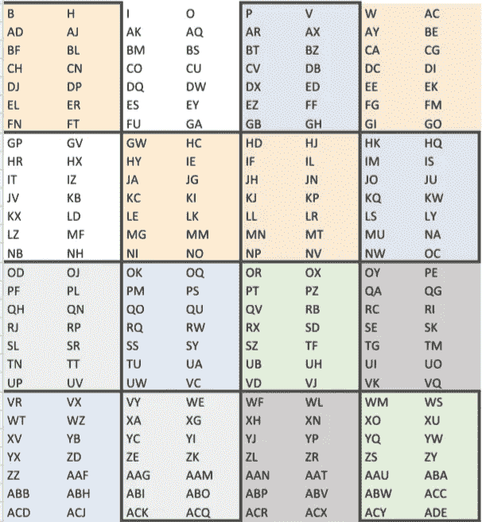

# 量子 MNIST

> 原文：<https://towardsdatascience.com/quantum-mnist-f2c765bdd478?source=collection_archive---------30----------------------->

作者在 [IBM Q 体验](https://quantum-computing.ibm.com/)中生成的图像。

# 用量子计算模拟器对手写数字进行分类

我最近发表了一篇名为“ [130，780 点量子分类](https://link.medium.com/6NlSXhLFI9)的文章，讨论了一个基本上使用 20 个数据量子位来表示整个数据集的电路。它实际上只重置和重新使用了 5 个模拟数据量子位，但它这样做了 4 次，因此需要 20 个数据量子位才能在真实的量子处理器上运行特定的电路。令我惊讶的是，两个 Twitter 用户对我如何编码数据集完全不感兴趣。

所以，我继续研究数据集，然后写了一篇名为[“经典数据的超密集编码](https://link.medium.com/qhSSSX2iA9)”的文章那一次，我讨论了一个不可用的两量子位版本的电路，但也讨论了一个可用的四量子位版本的电路。令我惊讶的是，同样的 Twitter 用户仍然不为所动。

当有人评论说数据集的大小与高度使用的 MNIST 数据集相比微不足道时，后者仍然相对较小，我决定 MNIST 数据集将是增加复杂性的下一个逻辑婴儿步骤。

## 介绍

MNIST 数据集是图像的集合。每张图片显示一个从 0 到 9 的一位数手写数字。一个经过训练的机器学习模型有望获得一组测试图像，并根据图像显示的数量正确地对每张图像进行分类。

MNIST 数据集是众所周知的，并且经过了良好的测试，所以如果你开始学习经典的机器学习，几乎可以保证你会使用它。

## CSV 数据

我承认跳过了与 MNIST 合作的一个重要步骤，部分原因是代码已经可以在互联网上找到，部分原因是我致力于将 OpenQASM 专门用于这个项目。我没有先将图像转换成数值，而是下载了一个已经确定了数值的 CSV 文件。请注意我在本文末尾的致谢。

虽然 CSV 文件不包含所有的 MNIST 训练和测试数据，但它包含了足够的数据来执行这个分类实验。无论所用数据集的大小如何，算法都将保持不变。我们可以推测一个更大的数据集如何影响结果的准确性，但是任何这样的差异都可能被运行这个实验所需的维度减少量所抵消。

## 算法

大部分工作实际上是经典的预处理。我给自己设定了一个挑战——完全不使用 Python 外加在智能手机上准备和运行这个实验的额外挑战。如果您尝试使用 Python 来复制这个实验，我承认这应该容易得多。

1.  对于 10 个类别(0 到 9)中的每一个，通过将每列的平均值除以 255 来计算每个像素的归一化平均值；通常这个计算稍微复杂一点，但是最小值是 0，所以我们可以删除 2 个减去 0 的实例
2.  对于 10 个类别中的每一个，以卷积神经网络(CNN)启发的模式对归一化均值求和；我选择了一个 49 像素的 4x4 网格
3.  将 160 个总和(16 个正方形 x 10 个类)除以 49，使其标准化
4.  重新排列对角线模式中的值；仅出于编码目的，这将把我想要映射到每个量子位的向量彼此相邻，这样我就不必做太多的剪切和粘贴

最后一步是在量子位上混合数字的不同区域。这个想法是为了避免，例如，水平地映射量子位，用八个量子位中的四个来代表 0、3 和 8 的类似弯曲的顶部和底部。

## CNN 启发

卷积神经网络(CNN)扫描图像的特征，如眼睛、鼻子和嘴巴的形状，以识别可能的人脸。我没有按行、列甚至对角线来浏览 MNIST 数据集，而是选择了一种受 CNN 启发的方块模式，希望这有助于辨别每个数字的不同特征。

作者创建的图像。

字母表示数据集中数值数据的列。

顺便说一下，这在 Python 中会容易得多。虽然我能够自动化其中的一部分，但我自己造成的 Python 限制导致这个实验的这一部分需要相当多的手动干预。

作者创建的图像。

基于之前给出的原因，新添加的颜色表明了这些块是如何映射到量子位的。例如，两个黄色块被映射到数据量子位 0，在电路上显示为 data[0]。

## 测试零点

在创建完整的电路之前，由于在智能手机上编写 OpenQASM 已经具有挑战性，我测试了一个零的图像和零的数据量子位。零测试电路在本文的最顶端。

作者在 [IBM Q 体验](https://quantum-computing.ibm.com/)中生成的图像。

结果表明，零有合理的概率被归类为零。然而，考虑到前面提到的 3 和 8 的相似性，我不能假设 92.261%会是与其他数字相比的最高结果，特别是。就此而言，由于所需的降维量，我无法假设所有的数字不会模糊在一起并测量相同的值。

## 完整的电路

使用 OpenQASM 子例程编写代码会容易得多，但他们过去收到过负面反馈，因为他们的电路只是显示出难以描述的块。相反，在下面，你可以看到许多 U3 门，弗雷德金门，复位门，加上一点点的哈达玛门和 x 测量。

作者在 [IBM Q Experienc](https://quantum-computing.ibm.com/) e 中生成的图像。

要放大，只需查看本文最上方的零测试电路。这里唯一增加的是屏障，使电路看起来更好，重置门，所以我可以重复使用 17 个量子位。IBM Q 量子计算模拟器只允许使用最多 32 个量子位，随着更多量子位的添加，运行时明显变慢，因此您可以通过重置和重用更少的量子位来提高性能。

## 结果

下面的直方图是将之前使用的相同图像 0 与所有 10 个数字 0 到 9 进行比较的结果。

作者在 [IBM Q 体验](https://quantum-computing.ibm.com/)中生成的图像。

直方图中只显示了顶部的结果，因此需要进行一些经典的后处理。

*   0–92.517%
*   1–91.15%
*   2–84.619%
*   3–84.741%
*   4–90.625%
*   5–90.491%
*   6–81.128%
*   7–86.633%
*   8–89.783%
*   9–90.027%

即使进行这个实验需要所有的维数减少，零的测试图像与零的数据最接近。顺便说一下，这条完整线路的运行时间是 4 分 45 秒。

## 结论

这个实验表明，使用量子计算模拟器对手写数字的图像进行准确分类实际上是可能的。虽然这种电路不能在 NISQ 处理器上运行——由于量子位连接和电路深度问题，即使你有足够的量子位来一次一位地进行比较——但这一结果有望在未来的量子处理器上得到实际应用。

## 未来的工作

如果我有 15，690 个容错量子位，我会喜欢运行这种算法的逐像素版本。在那之前，我只能等待这个实验的反馈，以确定接下来会有什么样的挑战。

这种算法在发表前面临的一个挑战是，在量子处理器上运行这种算法相对于传统的运行算法是否有任何实际优势。由于它甚至不能在量子处理器上运行，我们将看到这个论点走向何方。

## 承认

一如既往，感谢 [IBM Q Experience](https://quantum-computing.ibm.com/) 免费使用其量子计算模拟器，该模拟器生成了本文中的电路和直方图图像。感谢[量子直觉](https://www.youtube.com/channel/UC-2knDbf4kzT3uzWo7iTJyw) ( [@explore_quantum](https://twitter.com/explore_quantum?s=09) )启发我尝试用 MNIST 数据集做量子分类。感谢[http://yann.lecun.com/exdb/mnist/](http://yann.lecun.com/exdb/mnist/)为机器学习社区提供了 MNIST 数据集这样的资源。还要特别感谢[https://www.kaggle.com/oddrationale/mnist-in-csv#](https://www.kaggle.com/oddrationale/mnist-in-csv#)分享 CSV 格式的 MNIST 测试数据集。