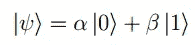
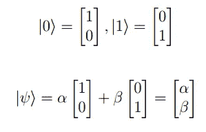
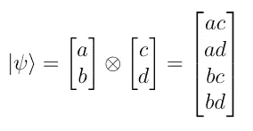
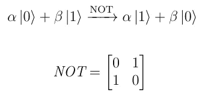
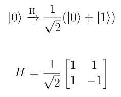
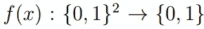
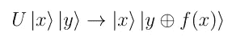
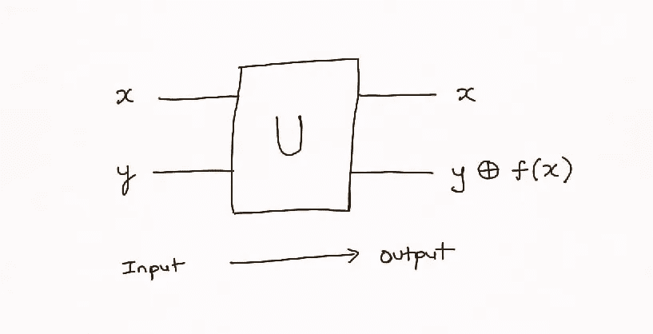
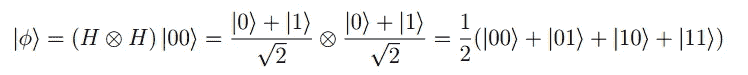
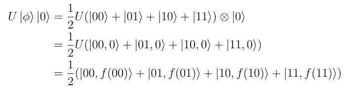

# 量子并行性——量子计算机的魔力从何而来

> 原文：<https://towardsdatascience.com/quantum-parallelism-where-quantum-computers-get-their-mojo-from-66c93bd09855?source=collection_archive---------20----------------------->

## 量子计算机如何利用量子叠加来同时执行许多计算路径。

图片来自 [Pixabay](https://pixabay.com/?utm_source=link-attribution&utm_medium=referral&utm_campaign=image&utm_content=3415515) 的 [MonikaP](https://pixabay.com/users/MonikaP-2515080/?utm_source=link-attribution&utm_medium=referral&utm_campaign=image&utm_content=3415515)

量子计算机是在 20 世纪 80 年代提出的。从那以后，物理学家一直在努力利用自然的力量来满足计算需求。物理上实现量子计算机没有单一的最佳方法；该领域被分割成几个相互竞争的方法，如离子阱，光学晶格，光子量子位，核磁共振等。但是这些不同的方法都致力于在硬件中实现相同的量子计算模型。只要我们正确地使用这个模型，我们就不需要关心它是如何在硬件中实现的。公平地说，量子计算也有不止一种模型，但是在本文中我们将只考虑标准的量子电路模型。

我们把这篇文章分成四个部分。在第一部分，我们将了解什么是单个量子位。然后，我们将会看到多重量子位元是如何被表现的。在第三部分，我们介绍作用于量子位的变换。最后，我们将所有这些放在一起，解释量子计算机如何能够并行执行多条计算路径。

# 单量子位

经典的计算机按位操作，每一位可以处于 0 或 1 的状态。量子计算机运行在量子位或*量子位上。*一个量子位不是以 0 或 1 的形式存在，而是以两者的叠加形式存在(还记得薛定谔的猫同时是死的和活的吗？).

让我们用数学来表示。量子位ψ的状态可以写成:

上面的符号被称为 braket 符号，但我们不会在这里讨论它。这个量子位以 0 和 1 两种形式存在，但是如果测量它，我们会得到*或者* 0 或者 1 而不是两者。我们得到 0 的概率由|α|给出，我们得到 1 的概率由|β|给出。一旦测量完成，量子位就失去了叠加态，继续以 0 或 1 的状态存在。由于许多原因，braket 符号非常有用，但是同样的方程也可以使用矩阵和向量方便地写成:

***免责声明:*** *文章使用了技术上不完全正确的松散批注。例如，上述状态 0 和 1 应该写成基向量|0 >和|1 >。采用松散符号的原因是不幸的事实，即 medium 不允许在文本中使用数学符号，并且将每个实例转换成图像会使文章难以阅读。*

# 多量子位

两个*未纠缠的*量子位的状态可以表示为它们各自状态的张量积。如果第一量子位具有振幅 *a* 和 *b* ，而第二量子位具有振幅 *c* 和 *d，*它们的组合状态可以写成:

一些两个量子位的状态不能分解成两个单个量子位的张量积。这样的量子比特被称为*纠缠*量子比特。纠缠在许多量子算法中扮演着重要的角色，尤其是在量子密码领域。经典物理学中没有量子纠缠的对应物。我们不会在这篇文章中回顾纠缠。

# 量子变换

如果我们不能用量子比特做任何事情，那就没有乐趣了。但是我们可以——在转变的帮助下。经典计算机借助于逻辑门如“非”、“与”、“或”、“与非”、“或非”、“异或”等对比特进行运算。同样，量子计算机使用量子门对量子位进行操作。由于量子力学的假设，所有在量子位元上执行的操作必须是线性且可逆的。因此，所有的量子门都必须是线性且可逆的。

“非”门是其中最简单的一种。它只是反转 0 和 1。

遍及量子计算的一个门是哈达玛门。它将一个仅作为 0 存在的量子位转换成 0 和 1 ie 的相等叠加。如果我们测量量子位，50%的概率会得到 0，50%的概率会得到 1。正如我们将看到的，这是许多量子算法的一个很好的起点。

# 量子并行性

现在，有了上述知识，让我们来揭开量子计算机是如何施展魔法的。我们将使用一个处理两位的简单示例来实现这一点。假设给你一个经典函数 *f* ，它取两位作为输入，返回一位作为输出。

为了在两位的所有四种排列上评估 *f* ，我们将需要调用 *f* 四次: *f* (0，0)、 *f* (0，1)、 *f* (1，0)、 *f* (1，1)。利用量子并行性，我们可以在对*f*的一次调用中评估所有四个输入。然而，请注意，我们的函数 *f* 是不可逆的，所有对量子位的操作都必须是可逆的。所以我们首先定义一个可逆版本的 *f* 如下:

带圆圈的加号表示 XOR 运算。量子预言机 *U* 接受两个输入 *x* 和 *y* 并输出两个值。首先是 *x* 本身。第二个是值: *y XOR f(x)* 。很容易看出，当 *y=0，*第二个输出等于 *f(x)* 。

我们将输入ϕ设置为四个两位输入 00、01、10、11 的相等叠加。为此，我们将两个量子位初始化为 0，并对它们应用哈达玛门。这表现为:

接下来，我们通过设置 *y=0* 将量子函数 *U* 应用于该状态。这给了我们:

如果我们分离出两个量子位，我们看到第二个输出量子位包含了我们感兴趣的所有四个结果的叠加。因此，我们使用目标函数*的单一应用评估了四个输入。*

> 或者更详细但仍然温和的量子计算介绍，请参见 https://arxiv.org/abs/2006.12025[的评论论文](https://arxiv.org/abs/2006.12025)

# 讨论

量子并行形成了许多量子算法的核心。然而，我们需要考虑一些重要的警告。虽然输出包含我们感兴趣的结果的叠加，但是我们不能直接读取它们。任何直接形式的测量都会给我们一个结果，其他三个结果都会丢失。因此，需要使用巧妙的技巧来读出我们感兴趣的最终答案，并且这些技巧在计算上可能不是微不足道的。第二，对于我们的例子，准备输入状态很简单，但是对于其他问题可能不是这样。使用量子并行性最终是否会比传统的替代方案更快取决于这些警告。

量子计算机已经在这里了，是我们开始认真对待量子的时候了。越多来自不同领域的人接受它，它就会越快成为现实。

*如果你喜欢这篇文章，可以在* [*中*](https://medium.com/@diningphilosopher) *上查看我的其他作品，在*[*LinkedIn*](https://www.linkedin.com/in/kulkarniviraj/)*或*[*Twitter*](https://twitter.com/VirajZero)*，查看我的* [*个人网页*](https://virajkulkarni.org/) *，或发邮件给我*[*【viraj@berkeley.edu】*](mailto:%20viraj@berkeley.edu)