# 量子数学——你准备好吃红色药丸了吗？

> 原文：<https://towardsdatascience.com/quantumic-math-are-you-ready-for-the-red-pill-4860f0ad79bf?source=collection_archive---------25----------------------->

## 探索哈达玛门的美丽

**在这篇文章之后，矩阵不再是从顶部落下的神秘符号，而是你会看到一个穿红色裙子的女人……**

…至少关于*哈达玛*门。

本帖是本书的一部分: [**用 Python 动手做量子机器学习**](https://www.pyqml.com/page?ref=medium_quantumicmath&dest=/) **。**

> “你吃了蓝色药丸——故事结束了，你在床上醒来，相信你想相信的一切。你吃红色药丸——你呆在仙境，我让你看看兔子洞有多深。”
> 莫菲斯矩阵

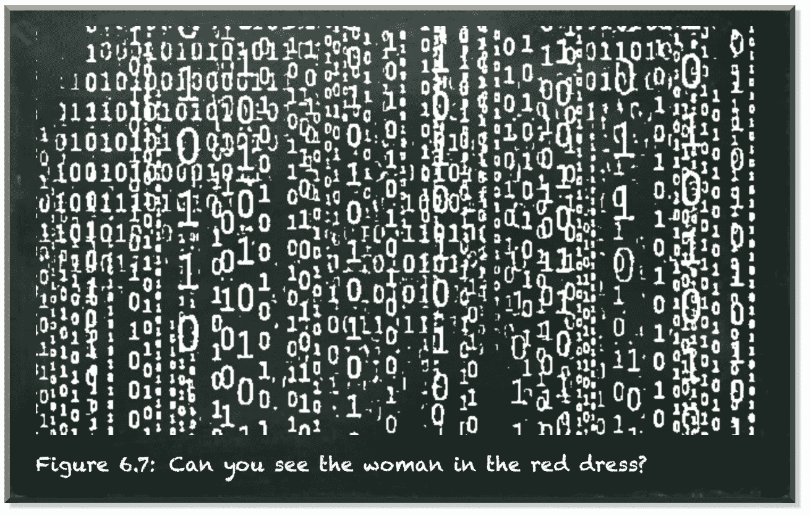

作者弗兰克·齐克特的图片

量子位类似于电子自旋的概念。它处于叠加状态。电子的叠加态由上下态组成，而量子位的叠加态由|0⟩态和|1⟩.态组成

一个流行的叠加概念是系统同时处于不同的状态，除非你测量它。但是，当你看电子的时候，你会发现它不是向上就是向下。你看量子位，不是`0`就是`1`。另一个概念是，系统是真正随机的，对初始条件没有敏感的依赖性。但是叠加并不意味着**和**。也不是指**或**。它是不映射到经典概念的状态的组合。

> 这是你最后的机会。这之后，就没有回头路了。”
> 莫菲斯矩阵

叠加的基本模型由向量空间给出。向量空间是所有有效量子位状态向量以及你可以对它们执行的操作的集合。我们通过下面的等式知道了量子位状态向量:


在 Python 中，数组`[alpha, beta]`表示这个向量。

```
alpha and beta are the probability amplitudes. They are not probabilities. They can be positive or negative. But their squares alpha**2 and beta**2 denote the probabilities.
```

当我们测量一个量子比特时，它会坍缩到可能的测量值中的任何一个。可能测量的数量决定了这个潜在向量空间的维度。一个量子位有两种可能的测量方式，`0`或`1`。因此，向量空间是二维的。这个向量空间中的所有向量都由两个数字组成。这些是概率振幅α和β。

当我们测量一个量子位时，我们观察它是`0`还是`1`。我们知道|0⟩说我们的量子比特在被观察时会产生值`0`。|1⟩说我们的量子位在被观察时会产生值`1`。总的来说，|ψ⟩=α|0⟩+β|1⟩说我们的量子位会以α**2 的概率产生值`0`，以β**2 的概率产生值`1`

概率是一个单一的数字，称为标量。我们如何从一个量子位态获得这个标量呢？矢量乘法有一种方法可以产生标量。这叫内积。它是由一个列向量乘以一个行向量得到的。

在之前的[帖子](/hands-on-exploration-of-the-qubit-815bee3f30dd)中，我们介绍了 **Dirac** 符号及其“ket”——表示列向量的构造。举个例子，

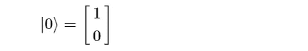

现在，我们介绍“胸罩”结构(⟨0|).胸罩是一个行向量，例如

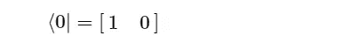

内积定义为:

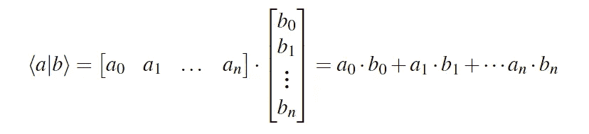

我们可以用内积来获得从一个量子比特态测量某个值的概率幅度。它的平方表示概率。

那么，从|0⟩测量出`1`的概率有多大呢？让我们构建内积来找出答案:

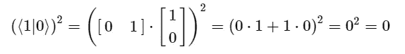

而且测到`0`的概率有多大？

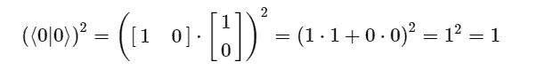

这也适用于任意状态向量|ψ⟩=α|0⟩+β|1⟩.衡量`1`的概率是:

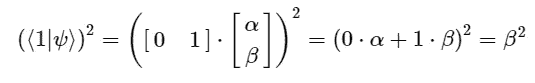

而测得|ψ⟩为`0`的概率是多少？

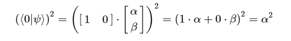

太好了！尽管这是非常数学化的，但它说明了我们如何从量子态中获得一个值。用状态向量乘以行向量。通俗地说，“bra-ket”⟨e|ψ⟩表示测量|ψ⟩为 e 的概率幅度，它的平方表示概率。

在上一篇[帖子](/you-dont-need-to-be-a-mathematician-to-master-quantum-computing-161026af8878)中，我们了解了矩阵乘法。我们知道，当我们将一个矩阵乘以一个向量时，结果是另一个向量:

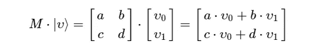

我们看到 X 门量子算符改变了量子态的振幅。

X-gate 应用于|1⟩:的|0⟩结果

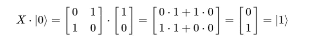

X-gate 应用于|0⟩:的|1⟩结果

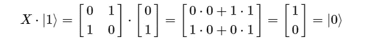

在狄拉克符号中，像|a⟩⟨b|那样排列的胸衣和胸罩表示外部产品。外积可以理解为矩阵乘法:

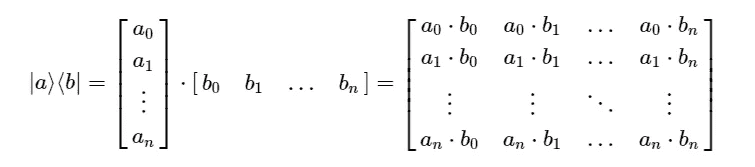

因此，术语|a⟩⟨b|表示矩阵。我们可以用向量来表示矩阵:

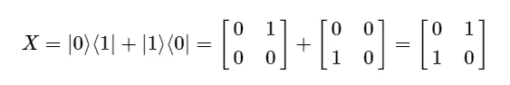

通俗地说(仅针对特定的基本情况)，“ket-bra”|a⟩⟨b|将你的|b⟩变成了|a⟩.

因此，X-gate 把|1⟩变成了|0⟩(因为|0⟩⟨1| ),把|0⟩变成了|1⟩(因为|1⟩⟨0|).

量子叠加态我们讲了很多。但是每当我们在这种状态下处理量子位时，我们用相应的概率振幅α和β来初始化量子位。但是，如果我们想把一个曾经测量过的量子位放回叠加态呢？

现在，我们有办法做到这一点。对此你怎么看？


根据我们的想法，这意味着我们把|0⟩变成|+⟩，把|1⟩变成|−⟩.

你记得|+⟩和|−⟩吗？我们在这里介绍他们。它们被定义为:

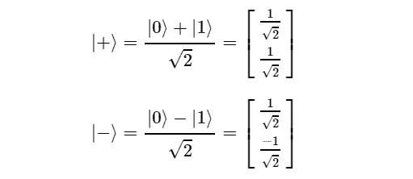

这些状态产生测量`0`或`1`的相同概率。它们位于水平轴。尽管这些状态有相同的概率，但它们是不同的。它们的概率幅度是不同的。如上所述，这个幅度可以是负的。

让我们来看看这个运算符。

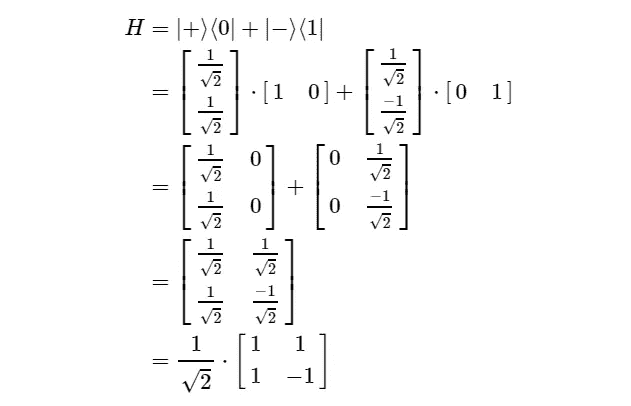

这种操作器被称为哈达玛门或 H 门。它让我们远离基本状态向量|0⟩和|1⟩.它将量子位置于平衡的叠加状态。

简而言之，它有矩阵:

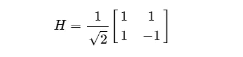

# `Why do we need to distinguish these two states?`

量子计算机必须以高精度工作，因为量子算法建立在连续变化参数的精确操作之上。即使是由热量引起的噪音也会破坏计算。

这是有问题的，因为到目前为止我们能够制造的计算机本质上是昂贵的电加热器，其副作用是碰巧执行少量的计算。

我们的计算机以一种依赖于故意丢失某些信息的方式运行。当我们查看`and`操作符时，如果两个输入值都是`1`，我们会得到`1`的输出。在所有其他情况下，我们得到一个`0`。给定`0`的输出，我们无法知道输入是什么。


作者弗兰克·齐克特的图片

在执行这种操作的过程中，计算机破坏性地覆盖它的输入。它通过将旧信息推到计算机的热环境中，以物理方式破坏旧信息。它变成熵，表现为热。

量子计算机在极低的温度下运行——低于 1 开尔文或-273°c，量子计算机必须非常节能。不是因为能源是一种宝贵的资源。而是因为任何能量损失都不可避免地使计算机过热。

事实上，进行计算而不丢失信息，因而不产生热量是可能的。这就是所谓的可逆计算。

通过使我们的 h-算符能够区分输入态|0⟩和|1⟩，它变得可逆，因此适合量子计算机。

# 活动中的哈达玛门

让我们看看 *Hadamard* 门的运行情况。

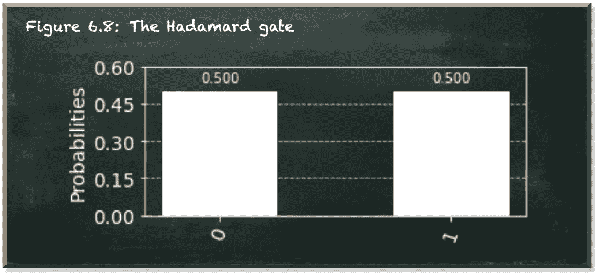

作者弗兰克·齐克特的图片

你应该注意到，在 Python `[1, 0]`中，我们用状态|0⟩初始化我们的量子位。唯一的新东西是我们在位置`0`(第 13 行)应用于量子位的*哈达玛*门。

我们可以看到，即使我们用状态|0⟩初始化了量子位，我们对`0`和`1`的测量概率都是 50%。

我们提到了哈达玛门的可逆性。事实上， *Hadamard* 门会自行反转。

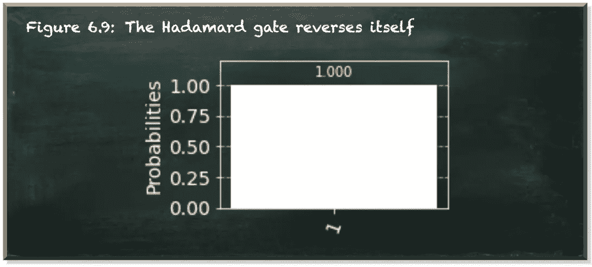

作者弗兰克·齐克特的图片

在这段代码中，我们用|1⟩状态初始化量子位(第 9 行)。我们应用*哈达玛*门两次。结果是有 100%的机会测量到`1`。这正是|1⟩州的含义。

Hadamard 门是一种基本的量子门。它在量子计算中无处不在。它将|0⟩的一个量子位转换成|+⟩，将|1⟩的一个量子位转换成|−⟩.它逆转了这些转变。

# 结论

这篇文章带你深入量子数学的兔子洞。我们探索了两种结构。首先，您可以使用“bra-ket”来获得某个度量的概率幅度。第二，你可以使用“ket-bra”来形成矩阵，并指定如何转换现有的量子位状态。

我们已经学了相当多的数学。令人惊讶的是，不需要混淆视听。事实上，我们在量子计算中使用的数学主要由线性代数组成。这一点也不难。不幸的是，许多关于这个话题的资源都假设你有数学学位。例如，他们没有解释什么是内积，以及你如何计算它。

我的经验告诉我，当我们使用它们时，解释基本的东西并不可耻。对于那些已经很熟悉的人来说，这是一个巩固知识的机会。但是对于不熟悉的人来说，根本就是理解学科的基础。

本帖是本书的一部分: [**用 Python 动手做量子机器学习**](https://www.pyqml.com/page?ref=medium_quantumicmath&dest=/) **。**


在这里免费获得前三章。