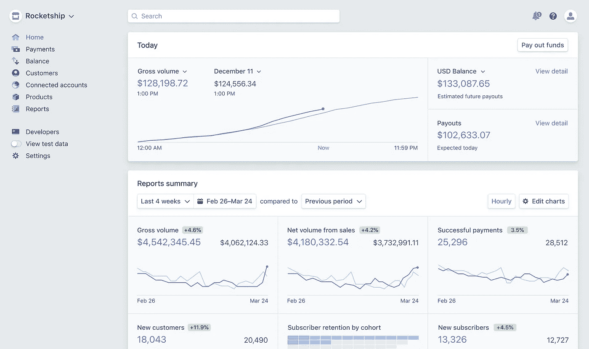

# 在 Python 中查询和分析条带数据

> 原文：<https://towardsdatascience.com/query-and-analyze-stripe-data-in-python-e6b4c3dd349?source=collection_archive---------12----------------------->

## MRR 和流失计算


来源:[https://unsplash.com/photos/ZVprbBmT8QA](https://unsplash.com/photos/ZVprbBmT8QA)

Stripe 是一家在线支付公司，提供用于处理支付和业务管理的软件和 API。我喜欢 Stripe 为不同的语言提供不同的 API，这让人们的生活变得轻松了许多。

我主要使用 Stripe Python API。要安装:

```
pip install --upgrade stripe
```

也可以做`conda install stripe`。但是该库的最新版本似乎还没有在 Conda 上提供。我使用的版本是 Stripe 2.55.0。

接下来，您将需要一个 API 密钥来访问条带 API。转到 stripe.com—开发者— API 密钥，然后点击“+创建密钥”获取 API 密钥。


资料来源:stripe.com

```
stripe.api_key = YOUR_API_KEY
stripe.api_version = "2020-08-27"
```

然后，您可以定义条带 api_key，并且不要忘记定义 api_version。我使用的是最新版本。如果您使用不同版本的 API，某些功能/数据格式会有所不同。

# 获取条带数据

很好，现在一切都设置好了，我们可以开始查询条带数据了。这里我写了一个函数来获取数据。

*   条带 API 包含许多资源(数据集)。在这个函数中，我们可以传入资源的名称来获取相应的数据。例如，获取订阅数据的基本格式是`stripe.Subscription.list()`。我们在函数中使用了`getattr`,以便将资源作为参数包含在函数中。
*   我们使用`list` API 批量获取资源。
*   每个 API 调用最多返回 100 个对象。这就是为什么我们使用`auto_page_iter()`来自动给列表结果分页。

有了这个函数，我们可以简单地调用函数来获取所有时间或定义的时间段的不同资源。例如:

*   客户数据:`stripe_get_data('Customer')`
*   事件数据:`stripe_get_data('Event')`(仅返回过去 30 天的事件)
*   发票数据:`stripe_get_data('Invoice')`
*   余额交易数据:`stripe_get_data('BalanceTransaction')`
*   订阅数据:`stripe_get_data('Subscription', start_date=datetime(2020,9,1), end_date=datetime(2020,10,1))`(如果没有指定，只返回“活动”和“过期”状态的订阅)。

其他资源可以在 [Stripe API 文档](https://stripe.com/docs/api/)中找到。您也可以使用这个函数查询其他资源。

# 条带计费分析仪表板

stripe Billing Analytics Dashboard 提供了您的帐户的汇总视图，其中提供了许多有用的信息，如 MRR、客户流失等。不幸的是，没有用于条带计费分析仪表板的 API(我实际上联系了支持人员并询问了这个问题)。所以，我不能把仪表板直接放到 Python 上。但是 Stripe 确实就他们如何计算这些指标提供了一些指导。我按照说明，计算了 MRR 和流失率。



资料来源:stripe.com/docs/dashboard

# 维护、修理和更换

> 每月经常性收入(MRR)可以被认为是您可以可靠地预期在经常性基础上收到的每月收入总额。这是 SAAS 企业要跟踪的最重要的指标之一，因为它提供了对增长和预测收入的前瞻性衡量…您可以通过对当时收取费用的所有订阅的每月标准化金额求和来计算大致的 MRR。

计算 MRR 的语法如下所示。

*   首先，我们需要获得所有的订阅数据。这里我设置`status="all"`来获取所有订阅数据，包括取消的订阅。我们也不能包含此参数来仅获得“活动”和“过期”状态，因为我们在此计算中不使用“已取消”状态。
*   然后我们得到关于订阅计划的信息，即金额和间隔(年度或月度计划)。
*   如果有人的计划有折扣，我们会得到有关折扣的信息。
*   接下来，我们通过标准化年度金额并应用折扣来计算标准化的**月度**计划金额。
*   最后，MRR 被计算为那些具有“活动”或“过期”状态的人的标准化**每月**计划金额的总和。

这个计算是基于[条纹文章](https://support.stripe.com/questions/understanding-monthly-recurring-revenue-(mrr))和一篇[博客文章](https://hellowebbooks.com/news/calculating-mrr-with-stripe/)。结果值看起来与仪表板上显示的值略有不同。但是已经很近了。

# 流失率

> 流失率的计算方法是，将过去 30 天内流失的用户总数除以 30 天前的活跃用户数，再加上这 30 天内新增的用户数。

下面是计算流失率的代码。

*   首先，我们计算过去 30 天内的用户数量。我们可以使用事件数据，也可以使用订阅数据，查看在过去 30 天内谁取消了订阅。
*   其次，我们计算活动订阅或过期订阅的数量。
*   然后我们可以根据这两个数字计算出流失率。

该计算基于这篇[文章](https://support.stripe.com/questions/calculating-churn-rate-in-billing)中的描述。

现在您知道了如何查询条带数据并计算 MRR 和流失率。希望你喜欢这篇文章。谢谢！

# 参考

 [## 条带 API 参考

### Stripe API 的完整参考文档。包括我们的 Python 的代表性代码片段和示例…

stripe.com](https://stripe.com/docs/api) 

[https://support . stripe . com/questions/billing-analytics-dashboard](https://support.stripe.com/questions/billing-analytics-dashboard)