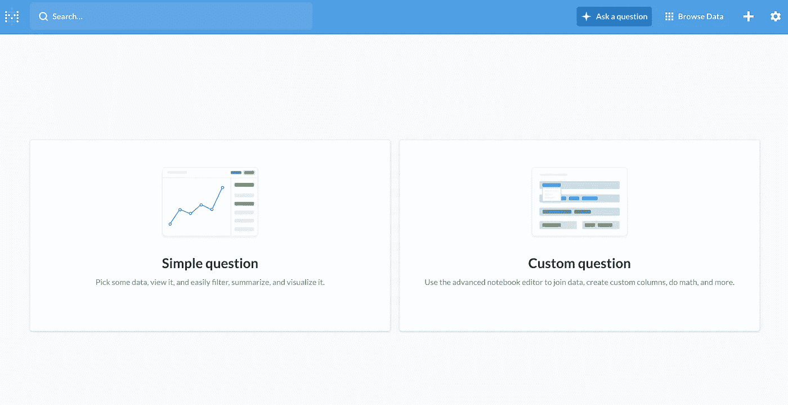

# 在 Python 中查询元数据库数据

> 原文：<https://towardsdatascience.com/query-metabase-data-in-python-ea7f866e6782?source=collection_archive---------13----------------------->

## 元数据库 rest API 和 Python API

Metabase 是一个开源 BI 工具，您可以在其中存储数据、连接到外部数据源、查询和可视化数据。本文讨论当我们将数据存储在元数据库中时，我们如何在 Python 中查询数据并获得结果。本文的第一部分讨论了如何使用 Metabase rest API 来查询数据。第二部分尝试 Python API。让我们开始吧。

# 元数据库 rest API

## 获取会话令牌

要使用元数据库 rest API，我们首先需要获得一个会话令牌。在命令行中键入以下内容:

输出将是您的令牌。然后将这个令牌保存在 Python 脚本或 Jupyter 笔记本中。

```
token = "YOUR_TOKEN"
```

或者，您可以在 Python 脚本中运行以下内容来获取令牌:

**查询卡片**

有两种方法可以查询元数据库数据。第一个选项是从卡中查询数据，或者在 UI 上询问问题。在 UI 中，我们可以直接通过 UI 提出问题并查询数据:



来源:元数据库

一旦我们创建了问题，我们可以检查这个问题是否出现在`api/card`中:

输出显示了一个字典列表，每个字典对应于用户通过 UI 提出的一个问题。然后我们可以用下面的代码找到卡的 ID 号并得到卡的结果。这基本上是用你在卡中定义的查询(问题)来查询数据库。

**直接查询数据库**

第二种选择是直接查询数据库，而不是首先定义卡并查询卡。

假设我们想从数据库`1`中查询表`users`，并输出 2020-10-15 之后创建的所有行。这里我们需要在 SQL 本地查询中定义这个查询。然后将查询添加到`requests.post`函数中。由此产生的`res.json()`是一本字典。读入数据和列。我们可以从`res.json()['data']['row']`获取所有数据，然后从`res.json()['data']['results_metadata']['columns']`获取列名。

现在您应该能够在`df`中看到您的查询结果。

# Python API

我还尝试了一个 Python API [元库](https://github.com/mertsalik/metabasepy/blob/master/docs/guide.md)。类似于我们上面提到的**查询卡片**部分，这里我们可以用下面的代码查询卡片 1:

```
from metabasepy import Client, MetabaseTableParsercli = Client(username=username, password=password, base_url=endpoint)cli.authenticate()query_response = cli.cards.query(card_id="1")data_table = MetabaseTableParser.get_table(metabase_response=query_response)df = pd.DataFrame(data_table.__dict__['rows'])
df
```

我感觉 Python API 不太灵活。但是当然欢迎你去尝试。

# 结论

在这里，我向您展示了三种从元数据库查询数据的方法:使用元数据库 rest API 从卡中查询，使用元数据库 rest API 通过用户定义的查询直接从数据库中查询，以及使用 Python API [元数据库](https://github.com/mertsalik/metabasepy/blob/master/docs/guide.md)从卡中查询。

我更喜欢使用 Metabase rest API 通过用户定义的查询直接从数据库中查询。使用这种方法，我们可以在 Python 脚本中包含所有的查询，并且我们确切地知道我们在查询什么。

在元数据库中还有许多其他可用的 API 调用，我们没有介绍。本文中的代码应该是您学习和探索其他 API 函数的良好起点。希望你喜欢它！谢谢！

参考

[](https://github.com/metabase/metabase/wiki/Using-the-REST-API) [## 元数据库/元数据库

### 本指南应该有助于回答一些关于使用元数据库 REST API 的常见问题。如果您有任何问题，请随时提出…

github.com](https://github.com/metabase/metabase/wiki/Using-the-REST-API) [](https://stackoverflow.com/questions/50620095/is-it-possible-to-get-raw-data-from-a-metabase-mbql-sql-query-via-the-rest-api) [## 有可能通过 REST API 从元数据库 MBQL / SQL 查询中获取原始数据吗？

### 有没有一个元数据库 REST API 接受一个 MBQL/SQL 查询并返回原始数据？我可以通过…执行 MBQL 查询

stackoverflow.com](https://stackoverflow.com/questions/50620095/is-it-possible-to-get-raw-data-from-a-metabase-mbql-sql-query-via-the-rest-api)