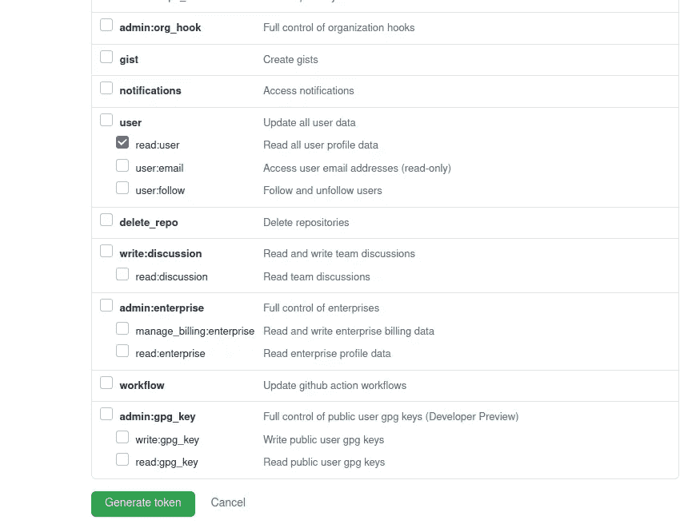

# 查询您的 GitHub 帐户的统计数据

> 原文：<https://towardsdatascience.com/query-stats-for-your-github-account-48ad0269aee5?source=collection_archive---------32----------------------->

## 快速找出您提交和/或审核的拉动式请求的数量！


照片由[马库斯·温克勒](https://unsplash.com/@markuswinkler?utm_source=medium&utm_medium=referral)在 [Unsplash](https://unsplash.com?utm_source=medium&utm_medium=referral) 上拍摄

比方说，你想展示一下你今年提交了多少拉取请求，或者你审查了多少。在 GitHub 上手动计数会很困难…但是有一种更容易、更简单、更有效的方法。

# 先决条件

在 Python3 虚拟环境中，用`pip`安装`requests`:

# 生成访问令牌

在你的 GitHub 账户上，进入“设置”


作者图片

然后，“开发者设置”


作者图片

然后点击“个人访问令牌”，并点击“生成新令牌”


作者图片

向“用户:读取用户”提供访问权限，并生成:



作者图片

# 将您的令牌导出为环境变量

有许多关于如何做到这一点的博客帖子——为了与我下面提供的脚本一起工作，你应该将其命名为`GITSTATS_TOKEN`。

# 查询 GitHub 统计数据

要获得您已经提交和审查的 pr 的数量，您可以运行下面的脚本(添加您自己的用户名和您感兴趣的存储库—在本例中，我查询我在`pandas-dev/pandas`中提交和审查了多少 pr):

您的输出将如下所示:

```
Merged PRs: 45
Number of reviews: 100
```

您可以在这里尝试查询:[https://developer.github.com/v4/explorer/](https://developer.github.com/v4/explorer/)

参见[这里的](https://github.com/MarcoGorelli/git-stats)获得一个带有源代码的存储库。