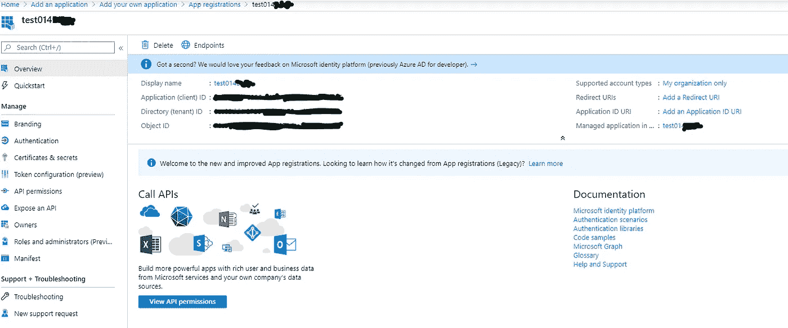
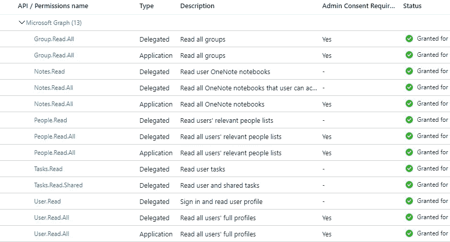
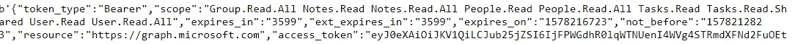

# 用 Python 查询 Microsoft Graph API

> 原文：<https://towardsdatascience.com/querying-microsoft-graph-api-with-python-269118e8180c?source=collection_archive---------1----------------------->

## 使用微软的 REST API 和 Python 请求库获取 Azure 上的 O365 数据


图片来源:[周杰伦 K](https://www.pexels.com/@jay-kunwar-55532) 上[像素](https://www.pexels.com/photo/computer-monitor-on-table-204611/)

# 介绍

为了向用户提供丰富的数据驱动体验，您可能需要将定制的应用程序与您组织的数据集成在一起。Microsoft Graph 是一个 REST API，它提供了与 Office 365 中的数据进行交互的能力。在这篇文章中，我将展示如何使用 python 连接到你的 Azure Active Directory (Azure AD)。主要步骤是在 Azure 上设置一个企业应用程序，并编写代码来处理数据。

> 点击此处获取此服务

## 创建企业应用程序

使用全局管理员帐户登录到 [Azure](http://72658a08-b17f-4deb-b69d-b87214776484) 。

在左侧窗格中，导航至>> Azure Active Directory > >企业应用> >+新应用> >添加您自己的应用(您正在开发的应用)> >+新注册

成功注册应用程序后，您将看到以下内容；



快照

在右边，用下面的模板添加一个重定向 URL

```
[https://login.microsoftonline.com/<DIRECTORY (tenant) ID>/oauth2/token](https://login.microsoftonline.com/0ce08dd4-2728-49fa-8e71-acb4a3c3d145/oauth2/token')
```

**证书&秘密**

创建一个客户端密码并记录下来。

**API —权限**

默认情况下，Microsoft Graph *用户。添加了读取*权限。为了进行演示，我将查询 O365 Planner(相当于 Trello)数据。以下是[许可](https://developer.microsoft.com/en-us/graph/graph/docs/concepts/permissions_reference)授予**2 号 MFA** 的账户。更多信息见[文档](https://docs.microsoft.com/en-us/graph/overview)



# 获取数据

让我们深入研究 python 脚本；

```
*#import libraries*
import requests
import json
import pandas as pd
import pyodbc
```

创建在请求中使用的令牌数据字典

```
app_id = 'xxxxxx' #Application Id - on the azure app overview page
client_secret = 'xxxxx' #Use the redirect URL to create a token url
token_url = '[https://login.microsoftonline.com/<DIRECTORY (tenant) ID>/oauth2/token](https://login.microsoftonline.com/0ce08dd4-2728-49fa-8e71-acb4a3c3d145/oauth2/token')'token_data = {
 ‘grant_type’: ‘password’,
 ‘client_id’: app_id,
 ‘client_secret’: client_secret,
 ‘resource’: ‘[https://graph.microsoft.com'](https://graph.microsoft.com'),
 ‘scope’:’[https://graph.microsoft.com'](https://graph.microsoft.com'),
 ‘username’:’[john.doe@companyxxx.com](mailto:helpdesk@centum.co.ke)’, #Account with no 2MFA
 ‘password’:’Happy2020’,
}token_r = requests.post(token_url, data=token_data)
token = token_r.json().get(‘access_token’)
```

测试令牌

```
token_r.content
```



在 Office 365 Planner 上创建一个计划，并创建一个组字典，如下所示:

```
#groups list
group_ids = {‘plannergroup01’:’xxxx-xxx–xxx-xxxx–xx',’test’:’xxxx-xxx–xxx-xxxx–xx’}#define required lists
userId,displayName,mailAddress,plans_data,planId,PlanGrpOwnerId,PlanTitle,PlanCreatedBy,bucketId,bucketName,bucketPlanId,taskId,taskPlanId,taskBucketId,taskName,taskPercentComplete,taskStartDateTime,taskDueDateTime,taskCompleteDateTime,taskIdAssignment,taskUserIdAssignment = [],[],[],[],[],[],[],[],[],[],[],[],[],[],[],[],[],[],[],[],[]
```

**用户查询:**

```
# Use the token using microsoft graph endpoints
users_url = ‘[https://graph.microsoft.com/v1.0/users?$top=500'](https://graph.microsoft.com/v1.0/users?$top=500')

headers = {
 ‘Authorization’: ‘Bearer {}’.format(token)
}user_response_data = json.loads(requests.get(users_url, headers=headers).text)
# user_response_data[‘[@odata](http://twitter.com/odata).nextLink’]#initial user data
#get all users
for user in user_response_data[‘value’]:
 userId.append(user[‘id’])
 displayName.append(user[‘displayName’])
 mailAddress.append(user[‘userPrincipalName’])

users_dict = {‘userId’:userId,’displayName’:displayName,’mailAddress’:mailAddress}
users_df = pd.DataFrame(data=users_dict)#additional user query for paging
while ‘[@odata](http://twitter.com/odata).nextLink’ in user_response_data:
 user_response_data = json.loads(requests.get(users_url, headers=headers).text)
 if ‘[@odata](http://twitter.com/odata).nextLink’ in user_response_data: 
 users_url = user_response_data[‘[@odata](http://twitter.com/odata).nextLink’]

 for user in user_response_data[‘value’]:
 userId.append(user[‘id’])
 displayName.append(user[‘displayName’])
 mailAddress.append(user[‘userPrincipalName’])users_dict = {‘userId’:userId,’displayName’:displayName,’mailAddress’:mailAddress}
users_df = pd.DataFrame(data=users_dict)
users_df.head()
```

**计划员计划查询:**

```
#get all plansfor key, value in group_ids.items():

 plans_url = ‘[https://graph.microsoft.com/v1.0/groups/'+](https://graph.microsoft.com/v1.0/groups/'+) value +’/planner/plans?$top=500' 
 plans_response_data = json.loads(requests.get(plans_url, headers=headers).text)for plan in plans_response_data[‘value’]:
 planId.append(plan[‘id’])
 PlanGrpOwnerId.append(plan[‘owner’])
 PlanTitle.append(plan[‘title’])
 PlanCreatedBy.append(plan[‘createdBy’][‘user’][‘id’])

plans_dict = {‘planId’:planId,’PlanGrpOwnerId’:PlanGrpOwnerId,’PlanTitle’:PlanTitle,’PlanCreatedBy’:PlanCreatedBy}
plans_df = pd.DataFrame(data=plans_dict)
```

**计划员时段查询:**

```
#get all buckets
for plan_id in planId:
 buckets_url = ‘[https://graph.microsoft.com/v1.0/planner/plans/'+](https://graph.microsoft.com/v1.0/planner/plans/'+) plan_id +’/buckets’
 buckets_response_data = json.loads(requests.get(buckets_url, headers=headers).text)

 for bucket in buckets_response_data[‘value’]:
 bucketId.append(bucket[‘id’])
 bucketName.append(bucket[‘name’])
 bucketPlanId.append(bucket[‘planId’]) 

bucket_dict = {‘bucketId’:bucketId,’bucketName’:bucketName,’bucketPlanId’:bucketPlanId} 
bucket_df = pd.DataFrame(data=bucket_dict)
```

**计划员任务查询:**

```
#get all tasksfor plan_id in planId:
 tasks_url = ‘[https://graph.microsoft.com/v1.0/planner/plans/'+](https://graph.microsoft.com/v1.0/planner/plans/'+) plan_id +’/tasks’
 tasks_response_data = json.loads(requests.get(tasks_url, headers=headers).text)

 for task in tasks_response_data[‘value’]:
 taskId.append(task[‘id’])
 taskPlanId.append(task[‘planId’])
 taskBucketId.append(task[‘bucketId’])
 taskName.append(task[‘title’])
 taskPercentComplete.append(str(task[‘percentComplete’]))
 if task[‘startDateTime’] is not None:
 taskStartDateTime.append(datetime.strptime(task[‘startDateTime’], ‘%Y-%m-%dT%H:%M:%SZ’))
 else:
 taskStartDateTime.append(0)
 if task[‘dueDateTime’] is not None:
 taskDueDateTime.append(datetime.strptime(task[‘dueDateTime’], ‘%Y-%m-%dT%H:%M:%SZ’))
 else:
 taskDueDateTime.append(0)
# if task[‘completedDateTime’] is not None:
# complete_time = task[‘completedDateTime’].replace(task[‘completedDateTime’].split(‘:’)[-1],’00Z’)
# taskCompleteDateTime.append(datetime.strptime(complete_time, ‘%Y-%m-%dT%H:%M:%S%z’))
# else:
# taskCompleteDateTime.append(str(0))

 for assignment in task[‘assignments’]:
 taskIdAssignment.append(task[‘id’]) 
 taskUserIdAssignment.append(assignment)tasks_dict = {‘taskId’:taskId,’taskPlanId’:taskPlanId,’taskBucketId’:taskBucketId,’taskName’:taskName,’taskPercentComplete’:taskPercentComplete,’taskStartDateTime’:taskStartDateTime,’taskDueDateTime’:taskDueDateTime,’taskCompleteDateTime’:0} 
task_df = pd.DataFrame(data=tasks_dict)
```

**将用户数据插入数据库:**

下面的函数可以对上面创建的所有数据框进行复制。就我而言，我使用的是 SQL Server 2017。

```
server = 'SERVERNAME\INSTANCEID,64346'
database = 'GRAPHAPI' 
username = 'uname' 
password = 'Happy2020'def insert_user_db(users_df,server,database,username,password):#Create a connection string
cnxn = pyodbc.connect('DRIVER={ODBC Driver 17 for SQL Server};SERVER='+server+';DATABASE='+database+';UID='+username+';PWD='+ password)
    cursor = cnxn.cursor()

 for index in range(users_df.shape[0]): 
 #insert into table 
 try:
 insert_query = “INSERT INTO GRAPHAPI.dbo.[DIM_User] ([userId],[displayName],[mailAddress]) VALUES (?,?,?)”
 cursor.execute(insert_query,users_df[‘userId’][index],users_df[‘displayName’][index],users_df[‘mailAddress’][index])except:cnxn.rollback()finally:cnxn.commit()
 cnxn.close()#Call the function
insert_user_db(users_df,server,database,username,password)
```

# 结论

随着微软套件服务的广泛使用，对于[图形 API](https://docs.microsoft.com/en-us/graph/overview) 请求，还有许多其他应用[场景](https://docs.microsoft.com/en-us/graph/overview)。如此巨大的数据量为组织提供了商业智能，并使开发人员能够构建数据驱动的应用程序。

**喜欢你读的书吗？**关注我上**[**LinkedIn**](https://www.linkedin.com/in/ephraimwaithaka/)或 [**Medium**](https://medium.com/@ephraim.mwai)**