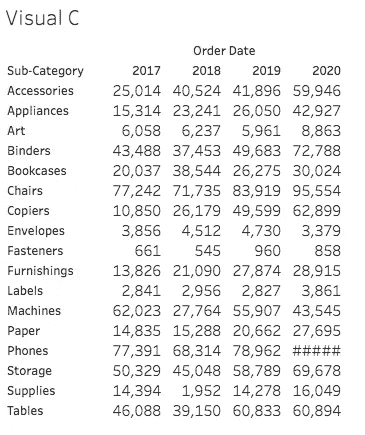
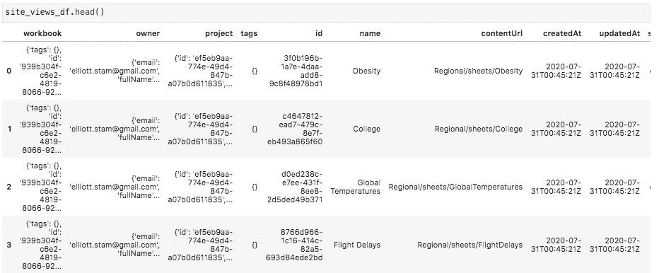
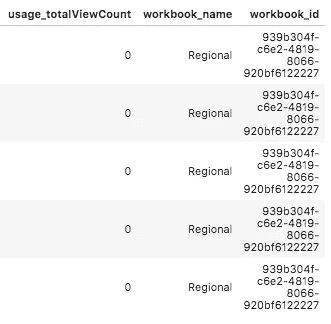
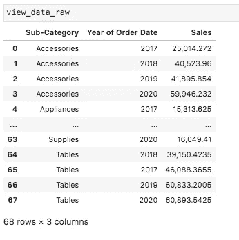
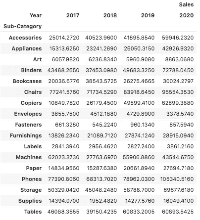

# 使用 Python 和熊猫下载像老板一样的 Tableau 交叉表

> 原文：<https://towardsdatascience.com/querying-tableau-view-data-as-a-crosstab-using-python-and-pandas-ca71a4be5be0?source=collection_archive---------11----------------------->

## TABLEAU REST API: TABLEAU-API-LIB 教程

## 如何下载 Tableau 视图数据而不丢失原始的表结构


有时你只需要行和列。(照片由[尼克·希利尔](https://unsplash.com/@nhillier?utm_source=medium&utm_medium=referral)在 [Unsplash](https://unsplash.com?utm_source=medium&utm_medium=referral) 拍摄)

在[的另一篇文章](https://medium.com/snake-charmer-python-and-analytics/query-your-tableau-view-data-like-a-boss-using-python-and-pandas-68483abac86)中，我们介绍了如何像老板一样查询 Tableau 视图数据，我收到了一个人的反馈，他们想往兔子洞的更深处滚。

这就引出了本文，在本文中，我们将演示如何在 Tableau 中下载表(交叉表)的视图数据，并重建该数据在 Tableau 中的形状。

本教程介绍了如何使用 Python [tableau-api-lib](https://github.com/divinorum-webb/tableau-api-lib) 包，并且是如何像使用小桶一样使用 tableau 服务器的系列教程的一部分，让您能够控制 Tableau 服务器的 REST API。

这些教程假设您已经安装了 Python 3。如果您还没有 Python 3，这将帮助您入门:[安装 Python 的指南](https://wiki.python.org/moin/BeginnersGuide/Download)。

## 搭建舞台

假设您在 Tableau 中有一个交叉表，出于某种原因您需要下载它。如果你用 Tableau REST API 做这件事，你会得到你想要的数据…只是不一定是你需要的格式。

主要问题是，当您下载视图数据时，您不会以“数据透视表”或交叉表的形式获得数据。您将拥有一个数据库格式的原始表，其中所有维度都显示为列。

让我们看看如何下载数据，并把它重新做成您想要的表格或交叉表。

下面快速浏览一下 Tableau 视图，我们将下载它的数据:



我们希望下载它并保留它的行/列结构。

## 步骤 1:确保你已经安装了 tableau-api-lib

即使你是这些教程的专家，帮自己一个忙，下载最新版本的库。

`pip install --upgrade tableau-api-lib`

不熟悉 Python 这个东西？别担心，你会很快明白的。遵循[本入门教程](https://medium.com/snake-charmer-python-and-analytics/tableau-server-on-tap-getting-started-89bc5f0095fa)。该教程将引导您使用 tableau-api-lib 连接到 Tableau 服务器。

## 步骤 2:进入 Tableau 服务器环境

使用下面的代码作为连接到您的服务器的模板。在接下来的步骤中，我们将使用一次性代码行来构建这个样板文件。在本文的最后，您会发现一个合并的代码块，为了方便起见，您可以复制/粘贴它。

```
from tableau_api_lib import TableauServerConnection
from tableau_api_lib.utils import queryingtableau_server_config = {
        'my_env': {
                'server': '[https://YourTableauServer.com'](https://tableaupoc.interworks.com%27/),
                'api_version': '<YOUR_API_VERSION>',
                'username': '<YOUR_USERNAME>',
                'password': '<YOUR_PASSWORD>',
                'site_name': '<YOUR_SITE_NAME>',
                'site_url': '<YOUR_SITE_CONTENT_URL>'
        }
}conn = TableauServerConnection(tableau_server_config, env='my_env')
conn.sign_in()
```

有趣的事实:你也可以使用个人访问令牌，假设你在 Tableau Server 2019.4 或更新版本上。如果你对访问令牌很感兴趣，可以看看我的文章，了解如何使用它们的细节。

## 第三步:找到你要找的机器人

我们想要查询一个视图，所以首先我们需要获取所需视图的 ID 值。

```
site_views_df = querying.get_views_dataframe(conn)
```

下面是我生成的数据帧的样子:



这是一个熊猫的数据框架，包含了我们所有观点的细节。

如果我们愿意，我们可以手动搜索并复制/粘贴相关的“id”值。但是，如果您在一个大的 Tableau 环境中工作，那么您可能会有许多同名的视图。

出于这个原因，让我们以正确的方式来做这件事，并在我们的“工作簿”列中打开细节，这样我们就可以根据工作簿名称进行过滤，以确保我们确实得到了我们正在寻找的 droid。

## 步骤 4:提取工作簿的详细信息，这样我们可以缩小范围

使用一个方便的 tableau-api-lib 函数，我们可以很容易地解开工作簿的细节。通过参考文章末尾提供的完整代码，可以看到这个函数是如何导入的。

```
site_views_detailed_df = flatten_dict_column(
site_views_df, keys=['name', 'id'], col_name='workbook')
```

现在，我们可以快速验证生成的数据帧是否包含工作簿的详细信息:



存在两个新列:“工作簿名称”和“工作簿标识”

现在，我们可以轻松地过滤我们关心的工作簿名称。在我的例子中，工作簿被命名为“query_view_as_crosstab ”,我想下载的视图被命名为“Visual C”。为了重申之前的观点，我们希望对工作簿进行过滤，因为视图名称在整个 Tableau 站点中很可能不是唯一的，但是在工作簿中它们总是唯一的。

```
relevant_views_df = site_views_detailed_df[site_views_detailed_df['workbook_name'] == 'query_view_as_crosstab']
```

## 第 5 步:查询视图数据

既然我们已经将我们的视图隔离到我们感兴趣的工作簿，让我们获得目标视图的视图 ID。

```
visual_c_id = relevant_views_df[relevant_views_df['name'] == 'Visual C']['id'].to_list()[0]
```

有了视图 ID，我们现在可以查询视图数据:

```
view_data_raw = querying.get_view_data_dataframe(conn, view_id=visual_c_id)
```

tableau-api-lib 查询函数' get_view_data_dataframe()'返回一个 Pandas DataFrame，我的是这样的:



这是一个好的开始，但是我们需要透视这些数据，以便“子类别”定义我们的行，“订单日期年”定义我们的列，并且“销售”填充透视表的值。

## 步骤 6:旋转数据框以生成所需的表格

在我们执行旋转表的最后一步之前，让我们快速地对数据应用一个可选的改进:将奇怪命名的“订单日期年份”列重命名为“年份”。

```
view_data_raw.rename(columns={'Year of Order Date': 'Year'}, inplace=True)
```

啊，这样好多了。现在让我们结束这一切吧！

```
view_data_raw.pivot_table(values=['Sales'], index=['Sub-Category'], columns=['Year'])
```

在我们结束今天的工作之前，让我们快速剖析一下这最后一点代码。Pandas DataFrame 'pivot_table()'函数为我们提供了一种重新定义数据结构的简单方法。

“值”参数定义了什么将填充表格的值，而“索引”值定义了行，“列”定义了…列！

这是我们现在的样子:



现在我们有了一张和最初在 Tableau 中看到的一样的桌子。

这是一个总结！

# 合并代码

使用 GitHub gist 作为修改我们在本教程中介绍的步骤的起点，供您自己使用。